# el-CICD

**A complete CICD System for use on OKD or Red Hat® OpenShift® Platform**

**Design and Implementation Document**

## Preamble

This document is part of the el-CICD project, a complete CICD system for the OKD Container Platform.

Copyright (C) 2020 Evan "Hippy" Slatis
email: hippyod -at- yahoo -dot- com

===================================

**NOTE: Red Hat® OpenShift® Platform is a trademark of Red Hat, Inc., and supported and owned by Red Hat, Inc.**

**el-CICD IS NEITHER SUPPORTED OR AFFILIATED IN ANY WAY WITH RED HAT, INC., OR ANY OF ITS PROJECTS.**

===================================

## License

el-CICD is free software; you can redistribute it and/or modify it under the terms of the GNU Lesser General Public License as published by the Free Software Foundation; either version 2.1 of the License, or (at your option) any later version.

This library is distributed in the hope that it will be useful, but **WITHOUT ANY WARRANTY; without even the implied warranty of MERCHANTABILITY or FITNESS FOR A PARTICULAR PURPOSE**.  See the GNU Lesser General Public License for more details.

You should have received a copy of the GNU Lesser General Public License along with this library; if not, write to

```
    The Free Software Foundation, Inc.
    51 Franklin Street
    Fifth Floor
    Boston, MA
        02110-1301
```

This document is licensed under the [Creative Commons Attribution 4.0 International License](https://creativecommons.org/licenses/by/4.0/legalcode). To view a copy of this license, visit

http://creativecommons.org/licenses/by/4.0/

or send a letter to

```
  Creative Commons
  PO Box 1866
  Mountain View, CA
      94042, USA.
```

## PREFACE

This document describes the motivation, design, and implementation of a fully featured CICD system for use on either the upstream OKD or on Red Hat® OpenShift®, either 3.11 or 4.x.  For the remainder of the document wherever OKD is referenced, OpenShift may be safely inferred.  There should be no difference in how the the system works on either platform.

el-CICD supports the following features:

* Configurable set of deployment environments per installation and, to a lesser degree, per project
* Configurable Build-to-Dev framework
* Simplified deployment descriptor framework for developers that can span  multiple environments or adapt to a specific environment
* Automated promotion across environments
* Automated branching  and synchronization of deployment configurations in SCMs and their images in image repositories
* Redeployment into each environments, including roll-forward and roll-back strategies
* Treating applications comprised of a collection of microservices as a single whole when deploying to production
* Incremental deployment patching into production
* Support for hotfix builds, promotions, and deployments into production
* Support for staggered application release development development patterns

Features not supported, but on the immediate investigate/TODO list:

* GitLab and Bitbucket support
* Helm support
* Separating Non-prod into Dev and Test servers for more fine-grained RBAC control of environments
* Enabling Sandbox deployments to mimic other environments besides the Dev environment
* Support multiple Production deployment environments (e.g. different regions may require different configurations)

# TABLE OF CONTENTS

* [el-CICD](#el-cicd)
  * [Preamble](#preamble)
  * [License](#license)
  * [PREFACE](#preface)
* [TABLE OF CONTENTS](#table-of-contents)
* [Overview](#overview)
  * [Assumptions](#assumptions)
  * [CICD Patterns and Concepts](#cicd-patterns-and-concepts)
    * [Concepts](#concepts)
    * [Environments](#environments)
      * [Dev](#dev)
      * [Test](#test)
      * [Prod](#prod)
    * [Build Once, Deploy Many](#build-once-deploy-many)
    * [Continuous Integration](#continuous-integration)
      * [Code Base](#code-base)
      * [The Build](#the-build)
        * [Build](#build)
        * [Test](#test-1)
        * [Scan](#scan)
      * [Standardization](#standardization)
    * [Continuous Delivery](#continuous-delivery)
    * [Continuous Deployment](#continuous-deployment)
  * [Tools](#tools)
    * [Project Definition Repository](#project-definition-repository)
    * [](#)
    * [Source Control Management (SCM)](#source-control-management-scm)
    * [Scanner](#scanner)
    * [Artifact Repository](#artifact-repository)
    * [Automation Server](#automation-server)
    * [Pipeline](#pipeline)
    * [Container Orchestration Platform](#container-orchestration-platform)
      * [Namespaces](#namespaces)
    * [Secret Encryption](#secret-encryption)
      * [Vaults](#vaults)
  * [CICD Development Workflow Patterns](#cicd-development-workflow-patterns)
    * [Build-to-Dev](#build-to-dev)
    * [Promotion](#promotion)
    * [Deployment Patching](#deployment-patching)
    * [Component Rollback and Roll-Forward](#component-rollback-and-roll-forward)
    * [Deploy To Production](#deploy-to-production)
      * [Application, or Project, Releases](#application-or-project-releases)
      * [Release Candidate Creation](#release-candidate-creation)
      * [Deploy-to-Prod](#deploy-to-prod)
        * [Release Version](#release-version)
        * [Rollback/Forward/Deployment Patching](#rollbackforwarddeployment-patching)
  * [CICD Project Workflow Patterns](#cicd-project-workflow-patterns)
    * [Multi-cluster Deployment](#multi-cluster-deployment)
    * [Parallel Release Development](#parallel-release-development)
      * [Hotfix](#hotfix)
* [Architecture and Design](#architecture-and-design)
  * [Products](#products)
    * [Git](#git)
    * [GitHub](#github)
    * [Jenkins](#jenkins)
    * [SonarQube](#sonarqube)
    * [skopeo](#skopeo)
    * [DockerHub, [Quay](https://quay.io)](#dockerhub-quay)
    * [OKD](#okd)
    * [kustomize](#kustomize)
    * [SealedSecrets](#sealedsecrets)
  * [el-CICD Components](#el-cicd-components)
    * [Bootstrap Script](#bootstrap-script)
      * [*.config](#config)
    * [Project Definition Repository](#project-definition-repository-1)
    * [Onboarding Automation Server](#onboarding-automation-server)
    * [Non-prod Automation Server](#non-prod-automation-server)
    * [Prod Automation Server](#prod-automation-server)
  * [Repository and Runtime Integration Strategy](#repository-and-runtime-integration-strategy)
    * [Development Branch](#development-branch)
    * [Synchronizing the Image and SCM Repositories](#synchronizing-the-image-and-scm-repositories)
      * [Deployment Branch](#deployment-branch)
        * [**WARNING: DO NOT MODIFY UPSTREAM ENVIRONMENT CONFIGURATIONS OR THE IMAGE SOURCE CODE**](#warning-do-not-modify-upstream-environment-configurations-or-the-image-source-code)
      * [Release Candidate Tags](#release-candidate-tags)
      * [Release Deployment Branches](#release-deployment-branches)
    * [Images](#images)
      * [Image Naming Conventions](#image-naming-conventions)
      * [Image Tagging Conventions](#image-tagging-conventions)
        * [Dev Image Tag](#dev-image-tag)
        * [Non-prod Environments](#non-prod-environments)
        * [Release Candidates](#release-candidates)
        * [Prod Image Tag](#prod-image-tag)
    * [Deployment Metadata Resources](#deployment-metadata-resources)
      * [Deployment Resource Labeling](#deployment-resource-labeling)
      * [Microservice Runtime Meta-Info](#microservice-runtime-meta-info)
      * [Project Meta-Info](#project-meta-info)
* [Deployment and Configuration](#deployment-and-configuration)
  * [el-CICD Project Structure](#el-cicd-project-structure)
  * [el-CICD Repository](#el-cicd-repository)
  * [el-CICD-utils Repository](#el-cicd-utils-repository)
    * [Standardization and the Speed of Change](#standardization-and-the-speed-of-change)
  * [el-CICD-project-repository](#el-cicd-project-repository)
    * [Project Definition File](#project-definition-file)
      * [OKD RBAC Groups](#okd-rbac-groups)
      * [Git Project information](#git-project-information)
      * [Microservices](#microservices)
      * [Enabled Test Environments](#enabled-test-environments)
      * [Sandbox Environments](#sandbox-environments)
  * [Builder Framework](#builder-framework)
    * [Jenkins Agents](#jenkins-agents)
    * [elCicdNode.groovy](#elcicdnodegroovy)
    * [_builder-steps_ Directory](#builder-steps-directory)
      * [Code Base Folders](#code-base-folders)
      * [Build Scripts](#build-scripts)
  * [Configuration](#configuration)
    * [el-cicd-system.config](#el-cicd-systemconfig)
      * [el-CICD Basic info](#el-cicd-basic-info)
      * [Git Repository Information](#git-repository-information)
        * [el-CICD Read Only Deploy Key Title](#el-cicd-read-only-deploy-key-title)
      * [Non-Prod and Prod Automation Server Namespace Postfix](#non-prod-and-prod-automation-server-namespace-postfix)
      * [General Environment Information](#general-environment-information)
      * [Environment Definitions](#environment-definitions)
      * [Jenkins Sizing and Configuration](#jenkins-sizing-and-configuration)
      * [Other](#other)
    * [el-cicd-bootstrap.config](#el-cicd-bootstrapconfig)
    * [Permissions](#permissions)
  * [Deployment](#deployment)
    * [el-cicd-non-prod-bootstrap.sh](#el-cicd-non-prod-bootstrapsh)
    * [el-cicd-prod-bootstrap.sh](#el-cicd-prod-bootstrapsh)
    * [el-cicd-post-github-read-only-deploy-keys.sh](#el-cicd-post-github-read-only-deploy-keyssh)
* [Developer Integration](#developer-integration)
  * [The ._openshift_ Directory](#the-openshift-directory)
    * [Structure](#structure)
    * [OKD Templates and Default Examples](#okd-templates-and-default-examples)
      * [Injected Parameters](#injected-parameters)
      * [Template Patching](#template-patching)
        * [kustomize Patch Files](#kustomize-patch-files)
          * [Patch File Naming Conventions](#patch-file-naming-conventions)
          * [Example Patch File](#example-patch-file)
    * [Template Definition File](#template-definition-file)
      * [SealedSecrets](#sealedsecrets-1)
* [Automation Server Pipelines](#automation-server-pipelines)
  * [Project Onboarding Pipelines](#project-onboarding-pipelines)
  * [Non-prod Automation Server Pipelines](#non-prod-automation-server-pipelines)
    * [Build-to-Dev](#build-to-dev-1)
    * [Build and Deploy Microservices](#build-and-deploy-microservices)
    * [Promotion/Removal](#promotionremoval)
    * [Redeploy/Removal](#redeployremoval)
    * [Create Release Candidate](#create-release-candidate)
    * [Redeploy Release Candidate](#redeploy-release-candidate)
  * [Prod Automation Server Pipelines](#prod-automation-server-pipelines)
    * [Deploy to Production](#deploy-to-production-1)
* [Advanced SDLC Patterns](#advanced-sdlc-patterns)
  * [Staggered Release Teams](#staggered-release-teams)
  * [Hotfixing](#hotfixing)

# Overview

el-CICD, pronounced like [El Cid](https://en.wikipedia.org/wiki/El_Cid), is a modular and configurable Continuous Integration/Continuous Delivery (CICD) supporting multiple projects of one or more microservices or components per group or team for building and deploying software onto OKD.  The system is expected to support all delivery and deployment aspects of the software development life cycle (SDLC) for all software development teams, from building the source and deploying into a development environment through deployment into production. Key characteristics the system was designed and implemented with include the support and enforcement of standards recognized as software development best practices, ease of use for users, ease of integration for software development teams, transparency to all users, the ability to collect and collate metrics from all software development projects, and a high level of automation that hides much of the details required to deploy a collection of microservices and/or monolithic applications onto OKD.

The high level goal of the CICD system is to create an automated, repeatable, and easy to use system for teams to deliver source code and encourage standards and best practices.  This in turn allows development teams to focus less on the technical details of software delivery and the platform it runs on and more on the business requirements of their projects.  Ultimately it should make teams more productive, save time, and increase quality with minimal effort required for the CICD system.

## Assumptions

It is assumed the reader has a basic understanding of the SDLC, source control management (SCM) solutions and Git in particular, the concepts of branching and tagging in an SCM, Docker images and containers, microservice architectures, and OKD and Kubernetes concepts.

## CICD Patterns and Concepts

### Concepts

CICD has been around for many years, and comprises a number of concepts and processes.  At its most fundamental level CICD is the process of building software as soon as source code is delivered to a software project, and and then deploying the software after a successful build.  Ideally it encompasses the execution of builds, test scripts, and scans of source code as soon as it is delivered, and the deployment into any and all environments supported by the SDLC of a team and/or organization.

el-CICD was designed and built to easily and transparently support and the following concepts.  These concepts are presented in the context of el-CICD, and is not meant to be a complete discussion of all things CICD.

### Environments

A SDLC typically includes a number of deployment phases before ultimately being released to production.  Each stage is ideally hosted in its own environment, although sometimes environments are created to support more than one SDLC stage; e.g. a quality assurance (QA) environment being used for user acceptance testing (UAT), and a staging environment (stg) doubling as a load testing and Pre-prod(uction) environment.

Environments are a key concept that needs to be supported by any CICD system.  While deployments to each environment should ideally be exactly the same from Dev to Prod, there are many reasons why this is rarely true based on need and other practical matters; however, best practices are to design deployments to each environment as close to production as possible, and the closer to a production environment a deployment gets the closer the environment should resemble production.  While not always the case, environments are usually organized as a linear sequence; e.g. from Dev to QA  to Stage to Prod.  el-CICD supports a configurable, linear sequence of environments, with a few exceptions to be described below.

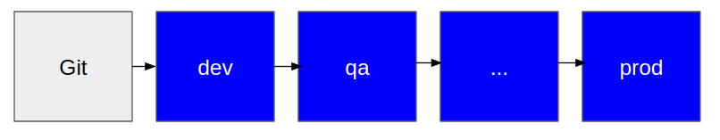

**Figure 1**  
 _Environment flow from SCM Git to Prod_

#### Dev

The Dev, or development, environment represents the initial build and deployment of a software project as it currently exists in its SCM repository.  It should be a direct reflection of that code at all times.  If at any time the current build in Dev does not reflect the current state of the SCM, then the build is considered to be broken.  This is at the very heart of what continuous integration means.

#### Test

Test can actually represent a number of environments.  Examples include:

* **Quality Assurance (QA)**: for the testing of whether the software meets its functional and business requirements
* **User Acceptance Testing (UAT)**: for the testing by end users as to whether it meets their requirements for being usable
* **Stage (Stg):** A catch-all environment for performance or load testing
* **Pre-production (Pre-prod):** an exact duplicate of the production environment, used for testing that the production deployment configuration works, and that the software in production will work as expected

Which environments a project actually uses depends on such factors as the size of the project and the organization.

#### Prod

The final environment, production, in which the software is considered to released into the world and available to end users.  The software is considered to be functionally complete and has passed all necessary testing before being deployed into this environment.

### Build Once, Deploy Many

Modern software development with images and containers works under the principle that software should be built once, and then deployed to every environment through to production.  While it does not and cannot ensure uniformity in deployment, following this principle can guarantee to the highest degree possible functional uniformity across environments, and eliminate the possibility to the highest degree possible that an error found in one environment will not be reproducible in another; i.e. the “works on my machine” development issue in which a bug found in a downstream environment is unable to to predictably and reliably be reproduced in an earlier environment given the same image is greatly mitigated.

### Continuous Integration

Continuous Integration (CI) is the principle of building, testing, and/or scanning of source code as soon as it is delivered.  Ideally source code is delivered often and in small amounts.  This usually means the delivery granularity is per feature or change worked on by a developer.  Source code is considered delivered if it is pushed to the branch of the source code repository which represents what is to be built into Dev; i.e. the *Development Branch*.

There are many issues to take into account when implementing CI, but they can mostly fall under the following concerns of approved code bases, standardization of process practices, and the build itself.

#### Code Base

Each project will be developed using one or more programming languages, such as Java, JavaScript, or Python, and optionally a particular framework or frameworks supported by that language such Spring Boot, NodeJS, or Django, respectively.  There are also different testing frameworks within each language or platform; e.g. JUnit, Mocha, or Pytest.  Organizations should work with their development teams to identify a set number of these to support.  Each code base an organization approves for their development teams to work with increases the complexity of the CICD system, and makes it harder for resources to be portable across projects either in support or development roles.

#### The Build

The build is an overloaded term, and in CI is colloquially referred to as “*the build*".  It is actually comprised of three steps, building, testing, and scanning.  If any of these steps fail, the project should be considered to be in a bad state, and all efforts should be directed at fixing it immediately.  If a team is following modern software development best practices, it is reasonable for a team to expect that the source is never, or at least extremely rarely, in a bad state; i.e. every delivery of new code results in a good build, tests are written and successfully run and pass, and the scan passes with no issues.

##### Build

If a project has a code base that needs to be compiled and/or packaged then the CICD system should execute this step.  Not all code bases will require this step; e.g. Python or PHP.  As a counter-example, Java is packaged into *.jar or *.war files after compilation.  A failure to compile or the packaging of the software artifacts (e.g. because of a missing dependency) will result in a build failure.

##### Test

Best practices dictates all projects should implement unit and integration tests, and the CICD system will execute them all for each build.  If any test fails, the build is considered to have failed.

##### Scan

Code should be scanned to ensure coding standards are being followed, for coverage metrics of the tests, and for possible security vulnerabilities and exposures.  Ideally the build should fail if any of these metrics fail to meet organizational standards, but in practice it takes a disciplined and mature organization to implement this.  Many organizations instead take the issues discovered here, prioritize them, and feed them back into the project plan to be dealt with later.  Problems handled in the latter fashion is sometimes referred to as _technical debt_.

#### Standardization

In order that the build can be easily supported and executed by a CI system, an organization should work with the development teams using each code base to standardize as much as possible all aspects of how their software will be built.  This includes the tools used, the directory structure of projects, coding standards, etc.

A real world example of this might be requiring all Java development teams to use Apache Maven to define their builds.  The build step would then call

`mvn -DskipTests clean package`

The result enables the team supporting the CICD system to confidently know they can complete a build for any Java project using Maven without having to understand the individual details of any individual project.  Developers in turn never have to worry about their projects being compatible with the CICD system, and don't have to think about reinventing the wheel for each new project.

Another example would be standardizing on the unit test tools used.  While Apache Maven would obviate the need for the CI system to know which test tools were used by the developers for their unit tests, there are many platforms which don’t have a standard build tool for the CI tool to leverage.  There is also the issue of resource portability between teams to consider.

### Continuous Delivery

Continuous Delivery (CD) is where the source code is always in a state where the artifacts produced by CI are deployable.  CICD systems almost without exception use automated deployment to a Dev environment after the CI process has completed to verify the software as built is indeed deployable, thus demonstrating the minimum requirements of CICD have been met.

In a CD system, initiating subsequent deployments to downstream environments are strictly manual; i.e. after the automated deployment to Dev, all downstream environments through Prod are initiated and approved through direct human intervention.  The idea behind this is that while the software **can** be delivered, it might not be **ready** to be delivered.  Perhaps the software hasn’t cleared QA to be passed to UAT, or perhaps the operations team only wants to perform performance testing after the UAT team has signed off on the final implementation.

After a  responsible resource has given their final approval for promotion to the next environment, deployment is fully automated.  The deployment configuration should be defined by artifacts versioned and pulled from an SCM, and then applied during deployment.

In summary, Continuous Delivery recognizes that automated testing can and should be used to increase productivity and reduce the time to promotion to downstream environments, but it also recognizes that no amount of automated testing can capture all functional and business requirements to make automated promotion to downstream environments desirable.

### Continuous Deployment

Continuous Deployment, also confusingly known as CD, is the practice of automating promotions through some or all environments including through production.  In order to implement this type of system, it first requires a very mature team with excellent automated testing coverage and writing capabilities.  Very few teams are able to meet that standard.  It also requires a project in which it is possible for automated testing to fully cover all the requirements of the project.  Projects requiring user acceptance testing do not meet this requirement, for example.

el-CICD does not address this issue, and is not designed with this functionality in mind now or for the future considering the very high bar and unique circumstances that must be met for a project to support it.  This topic is only presented for completeness and acknowledging the confusion that sometimes arises between Continuous Delivery and Continuous Deployment.   

Note that the automated building and deployment to Dev is not to be considered an example of Continuous Deployment.  Code must be manually merged into the Development Branch to trigger the build, and best practices requires that developers work on features in separate feature branches before manually merging, and thus triggering The Build.

## Tools

There are a number of tools that are needed for an automated CICD system.  They are summarized below.

### Project Definition Repository

The Project Definition Repository should contain enough information about each project in the organization to automate the creation of its supporting pipelines, drive the pipelines, and define the environments required for each project in the organization.

### 

### Source Control Management (SCM)

A SCM hosts Source Code Repositories, and serves the purpose of tracking the source code files and documents of a project.  It is used to perform versioning, branching, and tagging.

### Scanner

The scanner consists of one or more tools, and is responsible for scanning source code and any of its dependencies for adherence to standards, code coverage metrics, and/or security vulnerabilities and exposures.

### Artifact Repository

The purpose of the Artifact Repository is to store artifacts produced by a CI process.  Modern builds generally result in two different types of artifacts, either libraries for reuse or in images meant to be deployed into an environment.

How these artifacts are hosted depends on how they are meant to be consumed.  For example, a Java jar file meant to only be used as a dependency for another project might be stored within a Maven repository, RPM’s used intended to be installed into a Docker image in an RPM repository, and a Docker image to be deployed or used as a base image in a Docker repository.  Modern artifact repositories generally support many types of standards depending on the need.

For the purposes of the this document, _Image Repository_ can be read as a synonym to the Artifact Repository.  [**NOTE**: el-CICD is a system tightly integrated with OKD, and it's focus is on building images and deploying them into pods on OKD.  It does not directly support managing library builds.]

### Automation Server

The Automation Server is the heart of a CICD system, and its job is to run any and all CICD scripts, or [_pipelines_](#pipeline), which should fully implement the CICD process from the time source code is delivered until the final deployment to production.

### Pipeline

A script run on an Automation Server to build and/or deploy project artifacts.  In OKD, pipelines are defined using OKD's [BuildConfigs](https://docs.okd.io/latest/builds/understanding-buildconfigs.html).

### Container Orchestration Platform

The Container Orchestration Platform is the newest type of tool available for use by organizations.  While software can run directly on bare metal or in virtual machines, many if not most applications designed today are built as images.  This means they are built as OCI or Docker images, and a container is a deployed and running image.

Modern application architectures favor a microservice architecture approach, in which many images are designed and implemented to be small, limited function components running next to and with each other to form a larger application as a whole, rather than as a more monolithic application made up of a smaller number of larger, multipurpose components.  This level of complexity requires a platform to support the deployment, organization, orchestration, and running of groups of images, which may represent one or more applications.  This is the responsibility of a Container Orchestration Platform.

#### Namespaces

Namespaces act as a virtual Container Orchestration Platform, allowing the running containers acting as an application to appear to operate in virtual isolation.  This concept will be leveraged to represent environments. [**NOTE**: Kubernetes initiated the concept of namespaces in the container orchestration space, and OKD extended that concept and refers to them as _projects_.  This can be confusing at times when referring to a project in el-CICD or in OKD.]

### Secret Encryption

Runtime software often contains secrets such as passwords or tokens to enable secure access to other systems.  None of the aforementioned systems currently offer a manner of safely storing these secrets for purposes of versioning in the SCM for fully automated deployments.

Without a way to encrypt secrets for storage in the SCM for later decryption in the Container Orchestration Platform, secrets would need to be maintained by hand.  The Secret Encryption tool adds extra functionality to the Container Orchestration Platform so that secrets can be safely encrypted and stored with the rest of the source code for later, fully automated deployments.

#### Vaults

A _vault_ is an alternative to the Secret Encryption tool, and would be responsible for storing encrypted secrets.  Incorporating  a vault into one or more projects is outside the scope of el-CICD, but el-CICD does not put up any roadblocks to doing so.

## CICD Development Workflow Patterns

CICD systems encompass a number of workflow patterns to support development.  Ultimately these will be expressed as pipelines.  The patterns expressed below are described with regards to the concepts and tools defined above.

### Build-to-Dev

The initial CICD process.  This workflow will pull source from the SCM, build it if necessary, run all unit and integration tests, scan the code, create an image, push the image to the Image Repository, and then attempt to deploy the image from the Image Repository to the Container Orchestration Platform.

### Promotion

This workflow implements the process of image promotion and deployment from one non-production environment to the next, always starting from Dev; e.g. from Dev to QA, or QA to UAT.  Promotion will always follow a predefined, linear path.

### Deployment Patching

Occasionally deployed images running in containers need to have their deployment configuration patched, perhaps for testing, tuning, or maintenance reasons. Images by definition are an immutable binary and stored in the Image Repository, but the deployment configuration is mutable source code and stored in the SCM.  This workflow encompasses the process of applying updates to the deployment configuration in the SCM,  and then redeploying the same image to a container in the environment with the new configuration.

This workflow does not apply to the Dev environment, since that environment is meant to represent the latest state of the code in the SCM, and thus the term _patching_ makes no sense in that context.

### Component Rollback and Roll-Forward

Component, or microservice, rollback and roll-forward is the ability to deploy different versions of the same image within the same environment.  Whether rolling back to an earlier version, or forward again to a later version that has already been deployed in the environment, the process must not only pull the correct version of the image, but also find the version’s latest deployment configuration in the SCM.  This requires coordination between the Image Repository and SCM for successful and repeatable deployments when rolling back and/or forward.

This workflow does not apply to Dev, since that environment will always represent the latest state of the SCM.  This workflow also does not apply to Prod, since that environment only deploys versions of complete applications comprised of one or more components or microservices, and not individual images.

### Deploy To Production

Deployment to Production is a more complex workflow that actually encompasses a number of distinct workflows.

#### Application, or Project, Releases

Up to this point, each environment considered the deployment of an SCM repository as an independent event.  There was no consideration by the CICD system as to the interdependence within the environment that might exist between components or microservices that are built and/or deployed separately from one another, other than they were all defined as belonging to the same Project.

When releasing into production, on the other hand, final approval for release to production assumes that the release was tested with a particular version of each component.  If there's ever to be a concept of rolling back or rolling forward to a known state of the application, this can only be done if the total set of components or microservices is treated as a single unit.

#### Release Candidate Creation

The first step in deploying to production is executing the Release Candidate workflow.  Release Candidates define an Application, and will consist of every image in the Image Repository and its matching deployment configuration in the SCM as deployed in the penultimate environment before Prod, colloquially known as _Pre-prod_.  The Release Candidate workflow will tag all the latest deployed images and their associated deployment configuration source commits with a version number or label; e.g. 1.0.0 or 1.1.0a.

The images that are tagged as a Release Candidate must be currently deployed in Pre-prod.  In other words, if the environments for a CICD process are Dev -> QA -> Stg -> Prod, then only images deployed in Stg will be considered for use.  The complete collection of images and deployment configurations _at the time the Release Candidate is created_ is known as a _Release Candidate_, which means that while the intention is to promote this collection of objects into production, it is not considered an official release until it is approved and deployed to production.

#### Deploy-to-Prod

When the final decision has been made that a Release Candidate should be deployed into production, the actual Deploy-to-Prod workflow can be triggered.  Along with the actual deployment of images into the production environment, this process will re-tag all the Release Candidates's images  in the Image Repository and branch associated deployment configuration source commits in the SCM at the point of the Release Candidate tag. The actual implementation of this process is described in more detail [below](#repository-and-runtime-integration-strategy).

##### Release Version

The collection of images and deployment configurations tagged as a result of being deployed to production are collectively known as a _Release Version_.

##### Rollback/Forward/Deployment Patching

Because production deployments of applications are treated as a whole rather than any one of its parts, this workflow is also handled by the Deploy-to-Prod workflow.  When rolling an application back or forward, a user is really just deploying a particular Release Version of the application with its latest matching deployment configuration(s).  Similarly, [Deployment Patching](#deployment-patching) of a Release Version is treated as a redeployment of the same version of the application with the updated deployment configuration information pulled from the SCM.

## CICD Project Workflow Patterns

el-CICD has a modular design between engineering and production automation servers to support some common workflow patterns.  CICD is itself a pattern, of course, but so far the discussion has focused on a group of microservices running linearly from source code commit to deployment to end users.  There are a few other patterns of development and deployment of not that el-CICD can easily support thanks to it's modular architecture between engineering and production automation servers.

### Multi-cluster Deployment

This pattern deploys the same application an across multiple OKD clusters.  There are a few reasons for doing this, with failover, high availability, and regional support being the most common.

### Parallel Release Development

Different Release Versions of an application are characterized by a collection of bug fixes and/or new features.  Some development teams chose to split into smaller teams to work on different Release Versions in parallel, each team releasing their version of the same application on different schedules.  Each subsequent Release Version will usually and optionally contain any changes made by the other team's previous Release Version(s).

#### Hotfix

For purposes of this discussion, a Hotfix will be defined as small, functional patch (versus a Deployment Patch) to quickly fix a bug found in a currently deployed Release Version.  Because images are immutable and a Hotfix requires a new image built from source, this will require a new build, promotion, Release Candidate, and ultimately a Release Version to be created; i.e. Hotfixes can be treated as a specialization of the Parallel Release Development pattern.

# Architecture and Design

## Products

A number of other OSS products are used to support the system, and it should go without saying we are extremely grateful for the work each of their development teams do.

### [Git](https://git-scm.com/)

The SCM used by el-CICD.  No others are currently supported, and no plans are currently in place to support any others.

### [GitHub](https://github.com)

GitHub is a third party application for hosting Git repositories, and [github.org](github.org) is where el-CICD is currently hosted.   This project was developed using GitHub, and it is currently the only Git repository hosting application supported by el-CICD.

**NOTE**: el-CICD considers it a priority to support other Git repository hosting sites, and will do so in the neat future.

### [Jenkins](https://www.jenkins.io/)

Jenkins is an open source software (OSS) Automation Server, and used for defining and running the pipelines to build and deploy microservices onto OKD.

### [SonarQube](https://www.sonarqube.org/downloads/)

SonarQube is an OSS tool that fills the role of the scanner.  It can collect metrics on test coverage and adherence to coding standards, and scan for security vulnerabilities and exposures.  SonarQube is not implemented by default in el-CICD, but some examples are code commented and provided in the default scanner, as well as placeholders for necessary information in the default el-CICD configuration files for easy incorporation.

### [skopeo](https://github.com/containers/skopeo)

A Docker-like tool for the copying, tagging, deleting, and inspection of images on Image Repositories.

### [DockerHub](https://hub.docker.com), [Quay](https://quay.io)

Any online or or on premise Image Repository that is compatible with podman/buildah/skopeo or Docker is compatible for use with el-CICD.  Our examples in this tutorial use DockerHub.

### [OKD](https://okd.io)

OKD is OSS from Red Hat that acts as the Container Orchestration Platform, and in whole is a Platform as a Service (PaaS).  While Jenkins runs and defines the pipelines and is the heart of el-CICD, it is OKD that is the body that will ultimately host and coordinate with Jenkins to run them.

### [kustomize](https://github.com/kubernetes-sigs/kustomize)

OKD has a [Template](https://docs.okd.io/latest/openshift_images/using-templates.html) resource, which provides some use towards defining classes of resources that are configurable via scripts.  `kustomize` is a tool (also built into the `oc` CLI) that makes it easy to patch these Templates for even greater reuse across and within each environment.

### [SealedSecrets](https://github.com/bitnami-labs/sealed-secrets)

SealedSecrets is an OSS tool providing a mechanism for encrypting secrets for external versioning and automation purposes.  Please see [sealedsecrets support](#sealedsecrets-support) below for related details.

## el-CICD Components

With the tools and products defined, the components that make up the el-CICD system can now be defined.

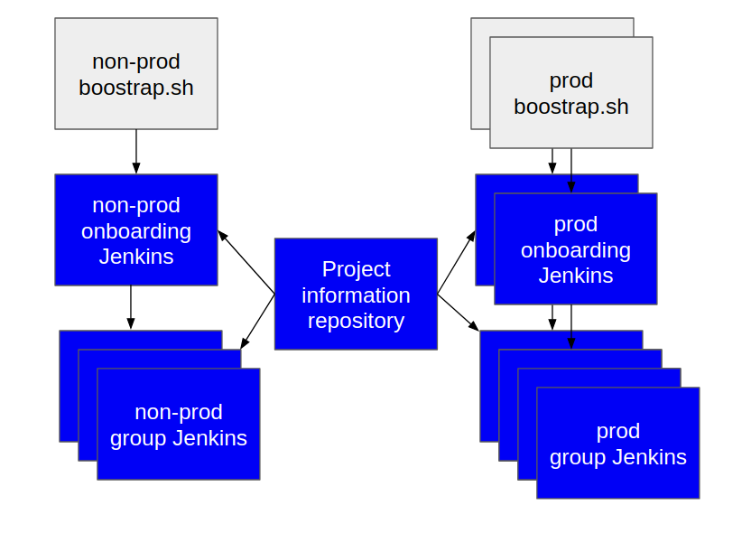

**Figure 2**  
_The relationship between the basic components that comprise el-CICD_

### Bootstrap Script

The first step in automating an organization is creating the Project Onboarding Automation Servers.  In general, each cluster will have one or two of these servers, one for onboarding projects onto non-production (or engineering) clusters, and one for onboarding projects onto production clusters.

####  *.config

The configuration files that accompany these scripts define the configuration of the whole system, and drive the execution of the scripts.  These configuration files will need to be filled out and defined in order to install el-CICD.  The config files describe where the secrets for the system are located, the Git URLs for the system's el-CICD and Project Information repositories, the environments that are supported for the SDLC, and how each Jenkins is to be configured.

### Project Definition Repository

The Project Definition Repository contains the configuration fear each project.  Each project is defined in a single YAML or JSON file, and defines such things as which microservices are part of the project, how their built, and the test environments the project's SDLC will use.

### Onboarding Automation Server

The Onboarding Automation Server, or el-CICD Master, is responsible for onboarding a project onto the OKD cluster.  Once the server is created by its bootstrap script, the onboarding pipeline can be launched either via a REST call into Jenkins or manually through the Jenkins UI.   The pipeline takes the name of the project to be onboarded, downloads the project's definition for from Project Definition Repository, and then creates either the Non-prod or Prod Jenkins for the group the project belongs to if it doesn't already exist, and the build pipelines for each microservice in the project.

### Non-prod Automation Server

The Non-prod Automation Server, or Non-prod Jenkins, is created up by the Non-prod Onboarding Automation Server.  There will be one per group for each cluster where the group develops applications, and each group will be responsible for one or more projects.  Which project belongs to which group is defined in each project's definition file stored in the Project Definition Repository. The Non-prod Automation Server will host every pipeline for each project in the group except the Deploy-to-Prod pipelines.

### Prod Automation Server

The Prod Automation Server, or Prod Jenkins, is created by the Prod Onboarding Automation Server, of which there will be one per group.  This server will host a single pipeline, [Deploy-to-Prod](#deploy-to-prod).

## Repository and Runtime Integration Strategy

A microservice is comprised of two repositories, Source Code and Image, and each has artifacts that depend on the other.  The Source Code Repository is the source of truth holding both the source code that created the image from the Build and the deployment configuration defining how it will be deployed and run in the Container Orchestration Platform for each environment.  The Image Repository contains the images that were built from the source code, and it is where the Container Orchestration Platform pulls images from to run in containers in [pods](https://docs.okd.io/latest/nodes/pods/nodes-pods-using.html#nodes-pods-using-about_nodes-pods-using-ssy).  The following explains how all this is ultimately tied together by the system seamlessly so changes can be made easily, deliberately, transparently, and automatically without requiring developers to do anything they normally wouldn’t do; i.e. writing code to implement business requirements and committing the changes back to the Source Code Repository.

### Development Branch

A design decision was made early on that all SCM repositories comprising a single project would have a Development Branch of the same name; e.g. _development_ or _hotfix_.  Regardless of team or the component worked on, all developers are expected to eventually merge their latest changes to this branch, and the CICD system to be automatically triggered to run the [Build-to-Dev](#build-to-dev) pipeline whenever code is delivered.  All [Deployment Branches](#deployment-branches) will ultimately stem from the Development Branch, of which each commit hash will represent an image that was built along with the initial deployment configuration for that image for each environment of the project.

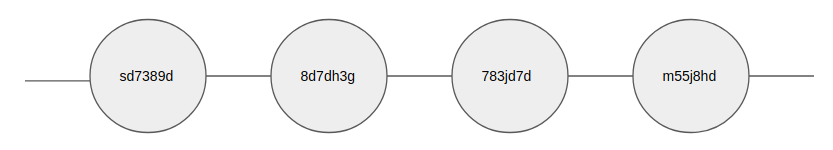

**Figure 3**  
_The Development Branch with four separate commits and their hash.  In general, each commit represents a distinct build and a distinct image._

### Synchronizing the Image and SCM Repositories

The images built from source reside in an Image Repository, and they are immutable.  The deployment configuration, describing how the image should be deployed across multiple environments lives in the SCM, and it needs to remain mutable.  One of the most difficult design problems for the modern, cloud supporting CICD system was settling on a methodology which explicitly acknowledges this reality while providing an easy to understand, standardized, and automated system for supporting [deployment patching](#deployment-patching).

For the Dev environment and Development Branch, this isn't a problem, since any image built for Dev only needs to match what’s in the Development Branch; i.e. it was reasonable to expect to build a new image every time the deployment configuration changed, because part of the Build-to-Dev pipeline is testing the deployment by deploying directly to Dev.

The harder problem is when an image is promoted to a downstream environment; e.g. QA, Stg, or Prod.  Where are changes to the deployment for those images kept and tracked?  Changes in the Development Branch happen faster than any downstream environment, and the further downstream the environment, the slower the changes will happen, so expecting the Development Branch to also hold the deployment for the current image deployed to QA when the Development Branch might be many commits ahead is unreasonable; i.e. expecting the source code to match the image being deployed into a downstream environment would grind development to a halt.

The solution was to create the Deployment Branch.

#### Deployment Branch

The purpose of the Deployment Branch is to support the [deployment patching](#deployment-patching) process directly by creating a branch for each environment the image is deployed to.  Each Deployment Branch is where developers can push deployment configuration changes for the image built from the source included in the branch.  The changes will be applied whenever the image is redeployed to the environment.  The branches will be named in the following manner:

**deployment-\<environment>-\<src-commit hash>**

* **\<environment>:** the environment the image is to be deployed to
* **\<src-commit-hash>:** the commit hash **_on the Development Branch_** the image was originally built from

For example, when an image is promoted from Dev to QA with a commit hash of 8d7dh3g on the Development Branch, its Deployment Branch will be created and named:

**deployment-qa-8d7dh3g**

Only changes that affect the deployment of the image to QA or its downstream environments will be acknowledged and used by the CICD system.

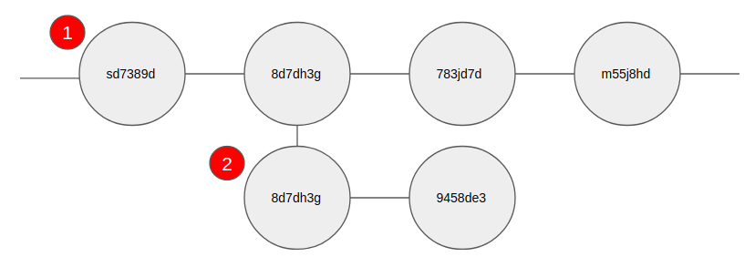

**Figure 4**

1. _Development Branch of project_
1. _**deployment-qa-8d7dh3g**_ Deployment Branch with one Deployment Patch committed to it

Deployment Branches are only created when an image is promoted into a particular environment.  Subsequent Deployment Branches are created from the HEAD of the previous Deployment Branch; e.g. referring to Figure 4, for the Stg environment, you'd get a Deployment Branch at source commit hash 9458de3 (bottom right commit in the above figure).

**deployment-stg-8d7dh3g**

Note that source commit hash remains constant.  This naming convention insures Deployment Branches should be easy to identify, and easy to trace any image back to it's original source commit hash on the Development Branch.

##### **WARNING: DO NOT MODIFY UPSTREAM ENVIRONMENT CONFIGURATIONS OR THE IMAGE SOURCE CODE**

Changes made to the deployment configurations for an upstream environment or the source code of the microservice on a Deployment Branch will be ignored by the current Deployment Branch.  The purpose of a Deployment Branch is to track and version the changes of the deployment configurations for an image built from the Development Branch.  The code that's included, and any upstream deployment configurations should only be looked at as a historical record of the project from the time the branch was created.  Changing any of this in a downstream Deployment Branch makes it harder to see what is in the actual image, and how it was previously deployed before being promoted.

Changing the source or upstream deployment configurations will at a minimum cause confusion, and at worst make it harder to work on hotfixes if necessary.  Because of Git's distributed nature and design, locking certain files from being modified is not possible.  Deployment Branches are a work-around to the modern development problem of keeping the proverbial source of truth in two places at once, the SCM and the Image Repository.

Note that merging changes back into the Development Branch to pick up changes, or from an upstream into a downstream Deployment Branch are permissible and encouraged whenever it makes sense.

#### Release Candidate Tags

As noted [earlier](#deploy-to-production), deploying a complete application to production is different and more complex than deploying the individual components or microservices of an application to a non-production environment.  Tagging for a Release Candidate or branching for the Release Version must happen for all images and source repositories of all microservices defined to be in the Release Version.  el-CICD does not define what a valid tag is, only that it must conform to a naming conventions acceptable to both the Source and Image Repository, in this case Git and an Image Repository which complies with the Docker’s naming conventions for images.  A Release Candidate Tag has the following format:

**<version tag>-<src-commit-hash>**

* **<version tag>:** the Release Version Version tag
* **<src-commit-hash>:** the commit hash on the **Development Branch** where the image was built

Each project will have a Pre-prod environment, and that environment will define what can be promoted to Prod.  Once chosen, **_each image and the latest source commit hash on its associated Pre-prod Deployment Branch_** will be tagged.  A check will be performed to ensure the Release Candidate Tag is unique within every repository of the project and hasn’t been used before.  The tagging operation will fail if it has.

For example, assume that a  few changes have been made on the Pre-prod Deployment Branch

**deployment-stg-8d7dh3g**

mentioned earlier as part of the testing and tuning process, and that the project team is now satisfied this might be good enough to promote to production with any other microservices in the application as version 1.0.0.  When the Release Candidate Tag is applied by the system, _it will be applied on the latest commit hash on the **deployment-stg-8d7dh3g** branch_ as:

**1.0.0-8d7dh3g**

The image deployed in Stg will similarly be tagged as 1.0.0-8d7dh3g in its Image Repository.  The application is now available for promotion to production.

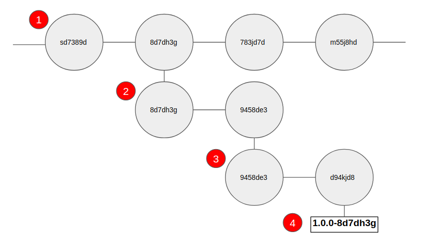

**Figure 5**

1. _Development Branch of project_
1. _**deployment-qa-8d7dh3g** Deployment Branch with one Deployment Patch_
1. _**deployment-stg-8d7dh3g** Deployment Branch with one Deployment Patch_
1. _Release Candidate Tag **1.0.0-8d7dh3g** at the HEAD of the Stg Deployment Branch_

#### Release Deployment Branches

[Deployment patching](#deployment-patching) must be supported in production, too.  As production is possibly tuned over time due to unforeseen circumstances, a Deployment Branch is created for each microservice that was tagged in the Release Candidate process to accommodate those changes.  Each branch is made **at the same commit hash** where the Release Candidate was tagged, and conforms to the following naming convention:

**v<version tag>-<src-commit-hash>**
* **v:** every release to production is prepended with a ‘v’ to delineate it from a Release Candidate
* **\<version tag>:** the Release Candidate Tag
* **\<src-commit-hash>:** the commit hash on the **Development Branch** where the image was built; e.g.

**1.0.0-8d7dh3g** becomes **v1.0.0-8d7dh3g**

Any changes to the deployment configuration of any release deployed in production should go here.  As a reminder:

**DO NOT CHANGE UPSTREAM DEPLOYMENT CONFIGURATION OR SOURCE CODE.**

Any other changes on the Release Deployment Branches, as with all Deployment Branches, are ignored, and will make creating a proper hotfix branch more difficult.  When applying changes to one or more Release Deployment Branches, simply redeploy the release into production, and the system is smart enough to figure out which microservices have changed and only redeploy those unless otherwise requested.

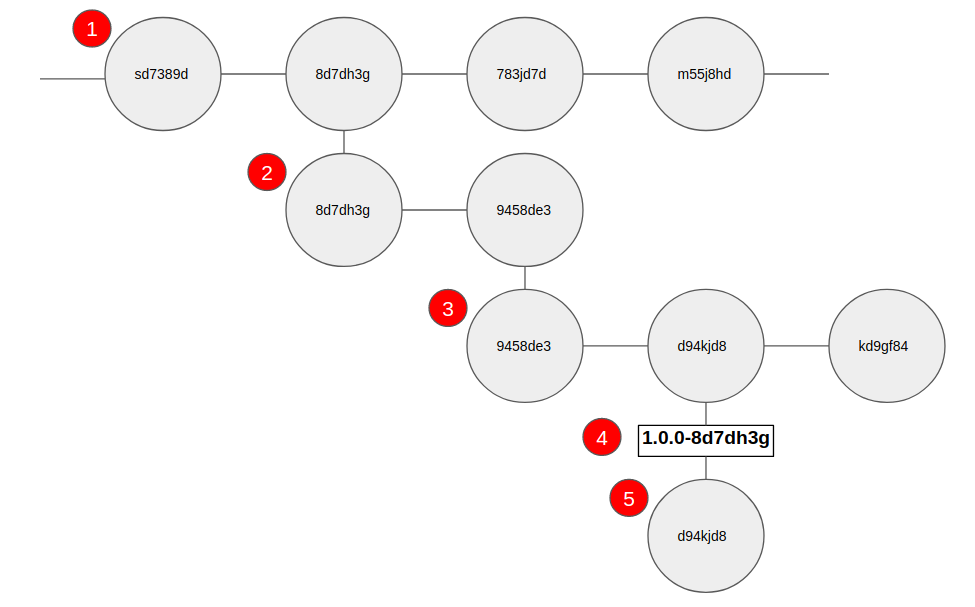

**Figure 6**

1. _Development Branch of project_
1. _**deployment-qa-8d7dh3g** Deployment Branch with one Deployment Patch_
1. _**deployment-stg-8d7dh3g** Deployment Branch with one Deployment Patch_
1. _Release Candidate Tag **1.0.0-8d7dh3g** at the HEAD of the Stg Deployment Branch_
1. _Release Version Deployment Branch **v1.0.0-8d7dh3g** created when a Release Candidate is deployed to Prod._

Note that even though subsequent changes have been committed to the **deployment-stg-8d7dh3g** Deployment Branch after being tagged as a Release Candidate, the Release Deployment Branch is created at the commit where the tag was created.

### Images

#### Image Naming Conventions

Images are named with the following convention:

**\<Project ID>-\<microservice name>**
* **\<Project ID>:** the Project ID of the application
* **\<microservice name>:** name of the microservice as derived from the Git repository name to conform to OKD resource naming conventions

The Project ID comes from the name of the [Project Definition File](#project-definition-file) defined in the Project Info Repository, and serves as an ID for the group of microservices that make up a project.  The _microservice name_ comes from the Git repository name of the source code the microservice came from, modified to conform to OKD resource naming conventions.  In particular, underscores are converted to dashes, and all letters are lowercased; e.g.

* **_Git Repository Name:  Test_CICD1_**
* **_Microservice Name:  test-cicd1_**

#### Image Tagging Conventions

##### Dev Image Tag

Images built to Dev are always tagged as **_dev_**, and there will be only a single version of an image built from source to Dev.  This is because versioning is expected to take place in the Source Code Repository, and Dev images are expected to reflect the latest delivered code in the Development Branch at all times.  For rollback/forward considerations of Dev images, you can either reset HEAD to an earlier or later commit and rebuild, or build manually from a commit hash in the [Build-to-Dev](#build-to-dev-pipeline) pipeline.

##### Non-prod Environments

Subsequent Non-prod environments are given two tags.  The version currently deployed in the environment is simply tagged as the environment name; e.g. QA is tagged as **_qa_**, and Stg is tagged as **_stg_**.  The image is also given a separate tag in the following format:

**\<environment>-\<src-commit-hash>**
* **\<environment>:** the lowercase environment name, such as qa for QA, or prod for Prod
* **\<src-commit-hash>:** the commit hash on the Development Branch where the image was built

##### Release Candidates

Release Candidates are tagged in their Image Repository by their Release Candidate Tag; e.g. 1.0.0.

##### Prod Image Tag

Production images are tagged by prefixing their Release Candidate Tag with a **v**:

**v<version tag>**
* **v:** every release to production is prepended with a ‘v’ to delineate it from a Release Version
* **<version tag>:** the Release Candidate Tag

So, *1.0.0* becomes **_v1.0.0_**.

### Deployment Metadata Resources

Since many deployment resources are created and destroyed in OKD per each deployment of a microservice, el-CICD maintains a lightweight set of metadata for microservice and application to facilitate deployment resource management.

#### Deployment Resource Labeling

Each deployment resource defined by the microservice in it’s Source Code Repository will have the following labels automatically attached to it on each deployment regardless of environment:

* **project**: The Project ID from the Project Definition Repository
* **microservice**: The microservice name, derived from the Git repository name to conform to OKD resource naming standards
* **git-repo**: The name of the Git repository where the source code resides; the hostname is not included for security purposes
* **src-commit-hash**: The source commit hash the deployed image was built from on the Development Branch
* **deployment-branch**: The Deployment Branch from which the deployment resource for the currently deployed image was defined
* **deployment-commit-hash**: The deployment commit hash on the Deployment Branch that was holds the source to the current deployment resource definitions
* **release-version**: The Release Version Tag, if in production; the value will be _undefined_ in any other environment outside of Prod

#### Microservice Runtime Meta-Info

Each deployment of a microservice will automatically have created and deployed an OKD ConfigMap that contains data and labels that mirror the microservice meta-information defined in the previous section, and it will be named using the following format:

**\<Project ID>-\<microservice name>-meta-info**

* **<Project ID>:** the Project ID of the application, per OKD resource naming rules
* **<microservice name>:** name of the microservice as derived from the Git repository name to conform to OKD resource naming conventions

#### Project Meta-Info

Each deployment into production will have an additional OKD ConfigMap automatically created and deployed that contains data and labels reflecting the Project ID and the Release Version currently deployed.  It will be named using the following format:

**\<Project ID>-meta-info**
* **\<Project ID>:** the Project ID of the application

This resource will only exist in Prod.

# Deployment and Configuration

While OKD is el-CICD's home, it's functional heart is Jenkins.  This document will not address anything regarding OKD administration outside of few details needed for configuring el-CICD.  This document will also not cover Jenkins administration, which can be found on the Jenkins site linked to above, but nothing should need to be done with regards Jenkins administration directly.   The system should be fully automated in this regard from bootstrapping to installing pipelines and necessary credentials based on an organization's needs.  Other concerns such as maintenance patching of images are outside the scope of el-CICD.

## el-CICD Project Structure

The el-CICD system is made up of two functional repositories, a project data repository, and a documentation repository, and each is described below.  el-CICD is meant to be configured per install, and have it's functionality extended or configured as needed by it's users.  **Each repository should be forked into the organizations own Git repository**, or created from scratch in the case of the [el-CICD-project-repository](#el-cicd-project-repository)

## el-CICD Repository

The main el-CICD repository holds the bootstrapping scripts for the el-CICD Masters, overall system configuration scripts, the OKD BuildConfig pipeline templates, microservice and project ConfigMap templates, basic agent docker files that can be used with Jenkins, the build framework and utilities, and other miscellaneous resources.

This repository holds the following content:

* **root Directory**
Bootstrap scripts and configuration files.
* **agent Directory**
Holds some Dockerfiles for base Jenkins agents that can be optionally used.  Also contains a script for building all of the default agents.
* **buildconfigs Directory**
OKD BuildConfig Templates for all Jenkins pipelines in the system.
* **builder-steps Directory**
Holds the files that define each codebase's builder(s), tester(s), and scanner(s) utilities.
* **resources Directory**
A number of script style templates used throughout the system for deploying el-CICD and deploying applications.
* **templates Directory**
OKD ConfigMap templates for microservice and project metadata in the form of ConfigMap OKD templates.

The el-CICD repository is pulled on almost every pipeline run for used of the resources and templates.  It is also the directory in which bootstrapping Onboarding Automation Servers takes place.

## el-CICD-utils Repository

This repository constitutes a [Jenkins Shared Library]([https://www.jenkins.io/doc/book/pipeline/shared-libraries/](https://www.jenkins.io/doc/book/pipeline/shared-libraries/)), and defines the heart of the functionality for the pipelines of el-CICD.  It is checked out and  loaded dynamically by el-CICD on each pipeline execution.

This repository holds the following content:

* **vars Directory**  
  Standards global variable directory for a Jenkins Shared Library.
  
This design allowed all utilities and Jenkins step extensions to be loaded as globally accessible variables, and easily used among each other.

### Standardization and the Speed of Change

el-CICD is very opinionated on standardizing builds across projects.  This makes it easier for organizations to manage a large number of projects without increasing the level of complexity or maintenance costs of managing a CICD system.  Besides the usual versioning benefits, keeping most the runtime functional aspects of the CICD system on Git makes pushing updates and changes in the build system immediate.  Any functional changes committed to the branch el-CICD is pulling from when running a pipeline will be immediately executed upon the next run of the effected pipeline(s).

This strategy keeps changes to the system mostly transparent to those in developer and tester.  Developers and testers should be focused on meeting business requirements, and not have to worry about lower level tools such as the CICD system or how to configure it.  That is more the responsibility of someone in a DevOps role.

## el-CICD-project-repository

The _el-CICD-project-repository's_ purpose is to version every [Project Definition File](#project-definition-file) the CICD system will manage.  This allows for the versioning of project definitions over time, and provides an easy and flexible point for external project databases to integrate with the CICD system and introduce new applications for the system to manage.  For simplicity, the structure of the repository is flat, so all projects will be defined in the root of the el-CICD-project-repository.

### Project Definition File

The Project Definition File is a file that defines each project, and **the name of the file must match the project's name.**.  It can be written in either YAML or JSON, must be names the same as the project, and has the following content:

```yaml
  rbacGroup: devops                    # The OKD RBAC group the project belongs to
  scmHost: github.com                  # The SCM hostname of the project
  scmRestApiHost: api.github.com       # RESTful API hostname for the Git provider (used for managing webhooks and deploy keys)
  scmOrganization: elcicd              # The SCM organization of the project
  gitBranch: development               # The dev branch name of all microservices
  microServices:                       # List of microservices in project
  - gitRepoName: Test-CICD1            # The Git repository name of the microservce
    codeBase: python                   # The codebase to build the microservice
    tester: pytest                     # Overridden tester to use during builds
    active: true                       # If the microservice is active or not
  - gitRepoName: test-cicd-stationdemo
    codeBase: java-maven
    active: true
  enabledTestEnvs:
  - qa                                 # Unordered list of test environments
  - stg
  sandboxEnvs: 5                       # Number of sandboxes needed
```

This file will be processed every time the project is referenced or built in a pipeline.

#### OKD RBAC Groups

Regardless of how you configure OKD for user authentication with an identity provider, el-CICD projects leverage groups as owners of projects.  Each project must have a group defined to be an owner, and the group will be registered as an admin for all OKD namespaces in the project, one per environment.

#### Git Project information

The project must define the SCM (Git) host and organization of the project.  All microservices are assumed to be on the same host and collected in the same organization.

In order to encourage good practices and standardization within a project, the project may only define one [Development Branch](#development-branch) name, and all microservices are expected to use it.  Committing to this branch will trigger builds, and the [Deployment Branch](#deployment-branch) for each microservice when first promoted out of Dev will be created from this branch.

#### Microservices

All microservices (aka Components for more traditional, monolithic applications) belonging to the project will be listed here.  Specific information will be

* the Git repo, from which the microservice name in the system is derived)
* the codebase of the microservice, which drives how the system will build the microservice
* By default the build framework will look for build utility files with the following names
  * builder.groovy
  * tester.groovy
  * scanner.groovy
  * To override any of these [see below](#builder-framework)
* Whether the microservice is still active or not  
  Projects replace components regularly, but different supported versions may still use developmentally inactive components; flagging them rather than outright removing them is good practice

#### Enabled Test Environments

el-CICD expects all environments to be defined before bootstrapping the system, but not all projects will need every test environment available.  This feature allows projects to whitelist the test environments it needs.   Only Dev, Prod, and at least one test environment are required for all projects.  Not whitelisting a test environment will default in selecting the first one in the list of [available test environments](#general-environment-information).

#### Sandbox Environments

The number sandbox environments needed by the project.

## Builder Framework

el-CICD can support any combination of build, test, and scanning per codebase.  The following will describe the el-CICD's Builder Framework, and how to extend it as needed.

### Jenkins Agents

Each [codebase](#code-base) will be mapped to specific Jenkins Agent where code will be built.  There will also be a generic, base agent defined that should hold shared tools like [Git](#git), [kustomize](#kustomize), and [skopeo](#skopeo).

### elCicdNode.groovy

This utility file defines how Jenkins kubernetes-plugin should us all Jenkins Agents, and the map between the codebase and the Jenkins Agent.  By default, el-CICD defines four agents, shown below.  To add a new agent for a particular codebase, add to this map, codebase to image.

```groovy
@groovy.transform.Field
agentDefs = [base: 'image-registry.openshift-image-registry.svc:5000/openshift/jenkins-agent-el-cicd-base:latest',
             'java-maven': 'image-registry.openshift-image-registry.svc:5000/openshift/jenkins-agent-java-maven:latest',
             'r-lang': 'image-registry.openshift-image-registry.svc:5000/openshift/jenkins-agent-r-lang:latest',
             python: 'image-registry.openshift-image-registry.svc:5000/openshift/jenkins-agent-python:latest']
```

### _builder-steps_ Directory

The **_builder-steps_** directory holds the functional files that are loaded and executed for each build.


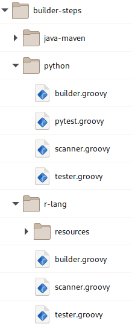

**Figure 7**  
 _The builder-steps directory_

#### Code Base Folders

Each codebase must have a folder of the same name.created in the _builder-steps_ directory, and it must contain at least one builder, tester, and scanner script for the codebase to execute when building.  Even if the codebase doesn't execute the step, an empty script must be defined for the component.  The folders many also contain other folders or files to support builds; e.g. in Figure 7 above, the `r-lang` codebase has a `resources` folder for holding files defining linting instructions.

#### Build Scripts

The builder framework is made up of three basic steps for each Build: building, testing, and scanning.  By default, the framework will look inside the codebase folder and look for the following files for each step:

* **Building**: `builder.groovy`
* **Testing**: `tester.groovy`
* **Scanning**: `scanner.groovy`

For microservices defined in a [Project Definition File](#project-definition-file), there is no need to specifically name any of the defaults.  If a step is to be overridden by a file that does not follow the above naming conventions, then it does have to be named:

```yaml
- gitRepoName: Test-CICD1            # The Git repository name of the microservce
  codeBase: python                   # The codebase to build the microservice
  tester: pytest                     # Overridden tester to use during builds
  active: true                       # If the microservice is active or not
```

The above snippet from the [Project Definition File](#project-definition-file) example above specifies that the `pytest.groovy` script (found in the `python` codebase folder) should be executed during the testing step of the build.

## Configuration

After forking the el-CICD repositories, el-CICD needs to be configured.  This requires defining which such information as test environments your engineering cluster will support, specifying the cluster's wildcard domain, creating and/or deciding which image repositories will back each environment, gathering the Git and Image Repository tokens as secrets for access, credentials, and sizing information for your Jenkins instances.  There are two files, [el-cicd-system.config](#el-cicd-bootstrapconfig) and [el-cicd-bootstrap.config](#el-cicd-secretsconfig), and both are sourced during bootstrapping.

### el-cicd-system.config

This configuration file defines most of the values needed to configure an el-CICD installation, as well as defining the SDLC environments and promotion flow, among other things.  The file are sourced when running either bootstrap shell script for the Onboarding Automation Servers, and then used to create a ConfigMap holding this information in every CICD Jenkins namespace subsequently created by the system.

#### el-CICD Basic info

```properties
  EL_CICD_MASTER_NAMESPACE=el-cicd-non-prod-master
  EL_CICD_MASTER_NODE_SELECTORS=

  EL_CICD_PROD_MASTER_NAMEPACE=el-cicd-prod-master
  EL_CICD_PROD_MASTER_NODE_SELECTORS=

  CLUSTER_WILDCARD_DOMAIN=my.cluster.com

  EL_CICD_META_INFO_NAME=el-cicd-meta-info
```

This section describes the namespaces and node selectors of the engineering (Non-prod) and production (Prod) el-CICD [Onboarding Automation Servers](#onboarding-automation-server).  The cluster's wildcard domain and the name of the ConfigMap that this configuration information will be stored on OKD are also here.

Note that except for the node selectors, for the most part this information can be left as is, unless you intend to install multiple instances on the same cluster, in which case each will need it's own, unique namespace.  The wildcard domain is the exception, as each cluster will most likely have its own.

#### Git Repository Information

```properties
  GIT_CREDS_POSTFIX=git-repo-private-key

  EL_CICD_GIT_REPO=git@github.com:elcicd/el-CICD.git
  EL_CICD_BRANCH_NAME=master
  EL_CICD_READ_ONLY_GITHUB_PRIVATE_KEY_ID=el-cicd-read-only-git-repo-private-key

  EL_CICD_UTILS_GIT_REPO=git@github.com:elcicd/el-CICD-utils.git
  EL_CICD_UTILS_BRANCH_NAME=master
  EL_CICD_UTILS_READ_ONLY_GITHUB_PRIVATE_KEY_ID=el-cicd-utils-read-only-git-repo-private-key

  EL_CICD_PROJECT_INFO_REPOSITORY=git@github.com:elcicd/el-CICD-project-repository.git
  EL_CICD_PROJECT_INFO_REPOSITORY_BRANCH_NAME=master
  EL_CICD_PROJECT_INFO_REPOSITORY_READ_ONLY_GITHUB_PRIVATE_KEY_ID=el-cicd-project-info-repository-git-repo-private-key

  GIT_SITE_WIDE_ACCESS_TOKEN_ID=git-site-wide-access-token
```

This section of the configuration file covers the location of the Git repositories [el-CICD](#el-cicd-repository) [el-CICD-utils](#el-cicd-utils-repository) and [el-CICD-project-repository](#el-cicd-project-repository)  All will need to be updated to match where you have decided to fork these repositories, as each is cloned for every pipeline run.

* **GIT_CREDS_POSTFIX**  
This is appended to all el-CICD credential IDs stored in Jenkins for GitHub.
* ***_GIT_REPO**  
The url of the el-CICD Git repositories.
* ***_REPOSITORY_BRANCH_NAME**  
These variables define the branch to check out for each el-CICD repository.
* ***_READ_ONLY_GITHUB_PRIVATE_KEY**  
These Jenkins credential IDs are passed onto project specific Jenkins for read only access to the el-CICD repositories for each Non-prod and Prod Automation Server.
* **GIT_SITE_WIDE_ACCESS_TOKEN_ID**  
This ID references the token stored in Jenkins for an administrative service account for access to all project Git repositories.  This is needed in order to add a writable deploy key and a webhook for automated builds for each microservice Git repository.  More on this will be described below in the [el-cicd-bootstrap.config](#el-cicd-secretsconfig)

##### el-CICD Read Only Deploy Key Title

```properties
  EL_CICD_DEPLOY_NON_PROD_KEY_TITLE=el-cicd-non-prod-deploy-key
  EL_CICD_DEPLOY_PROD_KEY_TITLE=el-cicd-prod-deploy-key
```

These deploy keys are the titles used to read only store access keys up on the Git provider for el-CICD access.  These need to be unique per installed Onboarding Automation server.  Every time the bootstrap script is run, it will look for a deploy key with the given title, remove it if it's there, and place a a deploy key with this title for use.  For example, if el-CICD is installed on multiple production clusters for purposes of deploying the applications with failover capability per region, a unique _EL_CICD_DEPLOY_PROD_KEY_TITLE_ will need to be provided to each.

#### Non-Prod and Prod Automation Server Namespace Postfix

```properties
  EL_CICD_GROUP_NAMESPACE_POSTFIX=cicd-non-prod
  EL_CICD_GROUP_NAMESPACE_POSTFIX=cicd-prod
```

Namespaces for the each RBAC Group's namespace will have these values appended to the RBAC group name; e.g. if a project's group is _devops_, the resulting Non-prod and Prod Automation Servers will reside in _devops-cicd-non-prod_ and  _devops-cicd-prod_, respectively.

#### General Environment Information

```properties
  DEV_ENV=DEV

  TEST_ENVS=<TEST_ENV_1>:...:<TEST_ENV_N>

  PROD_ENV=PROD
```

The values represent the general names and SDLC flow of the installed el-CICD environments.

* **DEV_ENV**
Name of the Dev environment.  This must be defined.
* **TEST_ENVS**
Colon separated list of test environment.  As many can be defined as the needs of the organization dictate.  Each project needs at least one test environment, but may disable as many or none of the others.
* **PROD_ENV**
The name of the Prod environment.  This must be defined.

The SDLC workflow will be defined by the system as

`<DEV_ENV> -> <TEST_ENVS> -> PROD_ENV`

Thus, for

`TEST_ENVS=QA:UAT:STG`

This will define a set of environments with the following SDLC flow:

`DEV -> QA -> UAT -> STG -> PROD`

#### Environment Definitions

```properties
  DEV_IMAGE_REPO_DOMAIN=docker.io
  DEV_IMAGE_REPO_USERNAME=elcicddev
  DEV_IMAGE_REPO=docker.io/elcicddev
  DEV_IMAGE_REPO_PULL_SECRET=el-cicd-image-repo-dev-pull-secret
  DEV_IMAGE_REPO_ACCESS_TOKEN_ID=image-repo-dev-access-token
  DEV_NODE_SELECTORS=

  <TEST_ENV>_IMAGE_REPO_DOMAIN=docker.io
  <TEST_ENV>${el.cicd.IMAGE_REPO_USERNAME_POSTFIX}=elcicdnonprod
  <TEST_ENV>${el.cicd.IMAGE_REPO_POSTFIX}=docker.io/elcicdnonprod
  <TEST_ENV>${el.cicd.IMAGE_REPO_PULL_SECRET_POSTFIX}=el-cicd-image-repo-non-prod-pull-secret
  <TEST_ENV>${el.cicd.IMAGE_REPO_ACCESS_TOKEN_POSTFIX}=image-repo-non-prod-access-token
  <TEST_ENV>_NODE_SELECTORS=

  PROD_IMAGE_REPO_DOMAIN=docker.io
  PROD_IMAGE_REPO_USERNAME=elcicdprod
  PROD_IMAGE_REPO=docker.io/elcicdprod
  PROD_IMAGE_REPO_PULL_SECRET=el-cicd-image-repo-prod-pull-secret
  PROD_IMAGE_REPO_ACCESS_TOKEN_ID=image-repo-prod-access-token
  PROD_NODE_SELECTORS=
```

After the environment name and SDLC flow is defined, each environment's configuration must be completed.

* **\<ENV>_IMAGE_REPO_DOMAIN**  
Image repository domain.
* **\<ENV>${el.cicd.IMAGE_REPO_USERNAME_POSTFIX}**  
Image repository username or organization ID
* **\<ENV>${el.cicd.IMAGE_REPO_POSTFIX}**  
Image repository url; i.e *_IMAGE_REPO_DOMAIN/*${el.cicd.IMAGE_REPO_USERNAME_POSTFIX}
* **\<ENV>${el.cicd.IMAGE_REPO_PULL_SECRET_POSTFIX}**  
Image pull secret name; secret is generated at startup with this name.
* **\<ENV>${el.cicd.IMAGE_REPO_ACCESS_TOKEN_POSTFIX}**  
Jenkins credentials ID referring to the pull secret

The above values are each prepended with the name of each environment defined in the previous section.  For a test environment called QA, you're final config entry would look like the following:

```
  QA_IMAGE_REPO_DOMAIN=docker.io
  QA_IMAGE_REPO_USERNAME=elcicdnonprod
  QA_IMAGE_REPO=docker.io/elcicdnonprod
  QA_IMAGE_REPO_PULL_SECRET=el-cicd-image-repo-non-prod-pull-secret
  QA_IMAGE_REPO_ACCESS_TOKEN_ID=image-repo-non-prod-access-token
  QA_NODE_SELECTORS=
```

Typical installations might have a Dev, QA (covering all test environments), and Prod Image Repository, but it is also possible have a single Image Repository shared among all environments, or an Image Repository per environment.  Regardless, an entry for each named environment must be defined separately.

#### Jenkins Sizing and Configuration

```properties
  JENKINS_MEMORY_LIMIT=4Gi
  JENKINS_VOLUME_CAPACITY=4Gi
  JENKINS_DISABLE_ADMINISTRATIVE_MONITORS=true
```

Sizing information in memory and persistent storage capacity for each Jenkins created by el-CICD.

#### Other

```properties
  SONARQUBE_HOST_URL=
  SONARQUBE_ACCESS_TOKEN_ID=sonarqube-access-token
```

SonarQube url and Jenkins credentials ID if in use.

### el-cicd-bootstrap.config

A secondary configuration file is used by el-CICD on bootstrap, and it holds a few minor configuration values that don't need to be referenced from the running el-CICD system or project environments, as well as a number variables that provide paths to files that hold the actual secret SSH keys and access tokens that will be onloaded into Jenkins.

Depending on how you choose to manage your different Onboarding Automation Servers, you can either reuse the keys among them or keep individual keys for each server.  If you keep individual keys per server, then you will need to change the titles used to push them into the SCM so they do not overwrite each other.

```properties
  GIT_PROVIDER=github

  # Domain to call Git host provider RESTful API
  EL_CICD_GIT_API_DOMAIN=api.github.com

  # Organization/account where el-CICD repos are hosted
  EL_CICD_ORGANIZATION=elcicd

  SECRET_FILE_DIR=../cicd-secrets

  EL_CICD_SSH_READ_ONLY_PUBLIC_DEPLOY_KEY_TITLE=el-cicd-read-only-public-key
  EL_CICD_SSH_READ_ONLY_DEPLOY_KEY_FILE=${SECRET_FILE_DIR}/el-CICD-deploy-key

  EL_CICD_UTILS_SSH_READ_ONLY_PUBLIC_DEPLOY_KEY_TITLE=el-cicd-utils-read-only-public-key
  EL_CICD_UTILS_SSH_READ_ONLY_DEPLOY_KEY_FILE=${SECRET_FILE_DIR}/el-CICD-utils-deploy-key

  EL_CICD_PROJECT_INFO_REPOSITORY_READ_ONLY_DEPLOY_KEY_TITLE=el-cicd-project-info-repository-read-only-public-key
  EL_CICD_PROJECT_INFO_REPOSITORY_READ_ONLY_DEPLOY_KEY_FILE=${SECRET_FILE_DIR}/el-cicd-project-info-repository-github-deploy-key

  EL_CICD_GIT_REPO_ACCESS_TOKEN_FILE=${SECRET_FILE_DIR}/el-cicd-git-repo-access-token

  DEV_PULL_TOKEN_FILE=${SECRET_FILE_DIR}/el-cicd-dev-pull-token

  QA_PULL_TOKEN_FILE=${SECRET_FILE_DIR}/el-cicd-non-prod-pull-token

  UAT_PULL_TOKEN_FILE=${SECRET_FILE_DIR}/el-cicd-non-prod-pull-token

  STG_PULL_TOKEN_FILE=${SECRET_FILE_DIR}/el-cicd-non-prod-pull-token

  PROD_PULL_TOKEN_FILE=${SECRET_FILE_DIR}/el-cicd-prod-pull-token
```

* **EL_CICD_GIT_API_DOMAIN  
  EL_CICD_ORGANIZATION**  
The el-CICD SCM host and organization.  Note that the system is built assuming the el-CICD repositories are stored in the same SCM as the project repositories it will be managing.
* **EL_CICD_SSH_READ_ONLY_PUBLIC_DEPLOY_KEY_TITLE EL_CICD_UTILS_SSH_READ_ONLY_PUBLIC_DEPLOY_KEY_TITLE
EL_CICD_PROJECT_INFO_REPOSITORY_READ_ONLY_DEPLOY_KEY_TITLE**  
The title to use when pushing the read only key to el-CICD.  If you don't wish to use the same read-only per Onboarding Automation Server installation, then you'll need a separate name per installation.
* **EL_CICD_SSH_READ_ONLY_DEPLOY_KEY_FILE  
  EL_CICD_UTILS_SSH_READ_ONLY_DEPLOY_KEY_FILE  EL_CICD_PROJECT_INFO_REPOSITORY_READ_ONLY_DEPLOY_KEY_FILE**  
The path to the read-only private deploy key for the el-CICD repositories.  The system assumes the *.pub key is located in the same directory for pushing to the SCM.
* **EL_CICD_GIT_REPO_ACCESS_TOKEN_FILE**  
An access token (**not** an ssh key) to an administrative account for the SCM.  This token will live in the Onboarding Automation Server.  For this reason, only administrators of the DevOps should have access to this server.  Write tokens for each project microservice's repository will be confined to the group that owns the project.
* **<ENV_NAME>_PULL_TOKEN_FILE**  
Path to the file holding the access token(s) to the Image Repository for each environment.  These will be used for the Build and for all image Deployments, and these tokens need push and pull access to each repository.  As the example above shows, each test environment must be defined separately, even if all the test environments use the same repository.

### Permissions

It is strongly suggested that only responsible DevOps resources have access to the el-CICD repositories (`el-CICD` and `el-CICD-utils` and `el-CICD-project-information-repository`) as well the Onboarding Automation Servers.  This ensures only DevOps resources can define system level changes, or have access across the Git repositories.  For the `el-CICD-project-information-repository`, it also ensures projects can't edit each other's project definition files.

## Deployment

Once each _*.config_ file has all the values properly entered, and all Image Repository pull and Git repository deploy tokens are saved in their proper locations, the bootstrap scripts can be run.

There are two bootstrap scripts, one each for the Non-Prod and Prod Onboarding Automation Servers.  This allows for the greatest flexibility on installation of the servers, perhaps more than once, on different clusters.

A typical, minimal installation of OKD has three clusters, a lab cluster to test cluster configuration changes and upgrades, a production quality cluster to support software development and/or application deployments, and a production quality cluster for running applications in production.  Many times more than one production cluster is deployed to support multiple regions and/or failover, or perhaps engineering groups don't share the same cluster during software development or testing.  The modularity of the bootstrap scripts allows for easy installation of el-CICD in as many clusters for as many purposes as needed.

### el-cicd-non-prod-bootstrap.sh

The el-CICD Non-prod Automation Onboarding Server bootstrap script is for setting up a production CICD server for onboarding projects into a engineering OKD cluster.  Executing the script results in the following actions:

1. Source the *.config files
1. Have the user confirm the OKD cluster's wildcard domain
1. Run the script for pushing el-CICD repository read only public keys to the Git provider
1. Have the user confirm deletion of the el-CICD Non-prod master namespace, if it exists
    * **NOTE**: failure to delete the old namespace will cause the script to exit
1. Stand up a new persistent Jenkins instance to act as the Onboarding Automation Server
1. Install Sealed Secrets locally and on the cluster
    1. If Sealed Secrets is not already installed, installation proceeds immediately
    1. User will confirm installation of Sealed Secrets locally and on the cluster if Sealed Secrets has been installed before
    * **NOTE**: Users should check version numbers and release notes before upgrading
1. Wait until Jenkins is ready
1. Create all necessary Sealed Secrets for image pull secrets for each environment
1. Push all necessary credentials to Jenkins

### el-cicd-prod-bootstrap.sh

The el-CICD Prod Automation Onboarding Server bootstrap script is for setting up a production CICD server for onboarding projects into a production OKD cluster.  Executing the script result in the following actions:

1. Source the *.config files
1. Have the user confirm the OKD cluster's wildcard domain
1. Have the user confirm deletion of the el-CICD Prod master namespace, if it exists
    * **NOTE**: failure to delete the old namespace will cause the script to exit
1. Stand up a new persistent Jenkins instance to act as the Onboarding Automation Server
1. Install Sealed Secrets locally and on the cluster
    1. If Sealed Secrets is not already installed, installation proceeds immediately
    1. User will confirm installation of Sealed Secrets locally and on the cluster if Sealed Secrets has been installed before
    * **NOTE**: Users should check version numbers and release notes before upgrading
1. Wait until Jenkins is ready
1. Create all necessary Sealed Secrets for image pull secrets for the Prod environment
1. Push all necessary credentials to Jenkins for Prod deployments

**NOTE**: el-CICD read-only public keys are **NOT** pushed to Git with this script.  Read only deploy keys are the only access necessary for deployments into production, so current configuration assumes the same private key used in the Non-prod Onboarding Automation Server will be used here.

### el-cicd-post-github-read-only-deploy-keys.sh

This script is shared between the two bootstrap scripts for pushing deployment keys to the three el-CICD repositories.  It first deletes the old keys, if any, on the Git SCM host, and the pushes the new, public keys to the host.  This allows all pipelines on every el-CICD server to access the el-CICD repositories in a read-only mode.

# Developer Integration

Developers need to follow certain conventions for their microservice projects to integrate into el-CICD.  In particular:

* **A standard of one image produced per Git repository**  
  It will be assumed that only one microservice will be defined per Git repository per project.  This is not the same as one image deployed per Git repository; i.e. deployment configurations for supporting images, such as databases, or multiple configurations of the same image built, are perfectly reasonable deployment strategies.
* **A Dockerfile must exist in the root directory of the microservice or component to be built**  
  Every OKD BuildConfig will use the binary docker strategy to create and push an image to the Dev environment Image Repository.  el-CICD does not currently manage builds strictly for building artifacts consumed for builds by other microservices.
* **All OKD deployment resources will be placed in a**_.openshift_**directory under the root directory of the microservice.**

OKD Template reuse and patching via `kustomize` is relied on heavily for ease of use, but not necessary.

## The ._openshift_ Directory

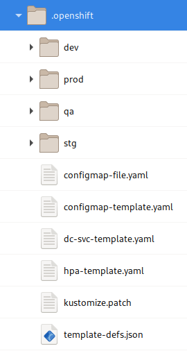

**Figure 8**  
 _The **.openshift** directory_

### Structure

The structure of the **_.openshift_** directory follows a few simple rules:

* All OKD Templates will be placed in the root **_.openshift_** directory for processing
* Optional subfolders will consist of the following:
  * **default**  
    YAML or JSON OKD resource definitions to be applied across all environments
  * **_Environment specific folders_**
    * Should match the name of the environment exactly
    * Holds additional OKD resources in either YAML or JSON
    * If the file names match any in the `default` folder, the ones found here will take precedence
    * Every environment that needs a SealedSecret will need an environmental folder defined; unless otherwise specified, SealedSecrets are namespace specific

### OKD Templates and Default Examples

[**NOTE**: Future releases of el-CICD will also support Helm]

Developers are encouraged to utilize [OKD Templates](https://docs.okd.io/latest/openshift_images/using-templates.html) to generate OKD resources such as DeploymentConfigs, Services, and Routes.  To that end, a number of basic templates are provided for ease of use for Developers to leverage, and they can be found in **_el-CICD-docs_** repository on GitHub under the **_.openshift-examples_** folder.  In particular, the following will be of particular interest to speed the development process for developers:

* dc-svc-template.yaml
* dc-svc-route-template.yaml
* cronjob-template.yaml

Each of these files defines a template for an OKD DeploymentConfig (dc), a Service (svc), and an optional Route (route) as needed.  A third template defines a CronJob.  Each of these files are fully parameterized, and except in very rare cases developers shouldn’t need to edit them directly.   Instead, Developers will leverages [patching](#template-patching) via `kustomize`.

Developers can also find a number of other examples with which to bootstrap defining their configuration resources, including sample templates for ConfigMaps, HorizontalPodAutoscalers, kustomization patch files, etc.

#### Injected Parameters

Every template generated by the system will automatically have the following parameters passed to it:

* **PROJECT_ID**: the Project ID of the application the microservice belongs to
* **MICROSERVICE_NAME**: Name derived from the microservice’s Git repository
* **APP_NAME**: Application name; defaults to microservice name
* **ENV**: The environment the microservice is to be deployed to
* **IMAGE_TAG**: The tag of the microservice image to be deployed

All the above template parameters are automatically derived and applied to each template that is processed, and only the **APP_NAME** can be overridden in the [template-defs.json](#template-definition-file-template-defs-json) file.  Developers can leverage these parameters in their own templates as they see fit.

#### Template Patching

OKD Templates are well suited to injecting values into predefined OKD resources, but they do not support injecting additional structure; e.g. dynamically defining and injecting environment variables, PersistentVolumes (pv), or PersistentVolumeClaims (pvc).  To that end, el-CICD has leveraged `kustomize` with OKD Templates to create a much more flexible system for creating OKD resources on the fly with far less labor than previously needed.  This allows for greater flexibility and reuse by Templates, as well as easier development of common OKD resources.

##### kustomize Patch Files

Unlike with standalone `kustomize`, `kustomize` Patch files are specified per template in the [template-defs.json](#template-definition-file) file, and can be overridden per environment.  They are specifically made in order to patch the **_env_** and **_volumeMounts_** section of a particular container, **_volumes_** section of a DeploymentConfig or CronJob template, or even the **_parameters_** section of a Template, although they can be applied in any way that `kustomize` allows against any template.

###### Patch File Naming Conventions

All `kustomize` Patch files should use the extension *.patch.  This is non-standard considering they are YAML files, but helps avoid the system mistaking the file as an OKD resouce, and makes for easier identification within the project for Developers.

###### Example Patch File

The following demonstrates how a patch file can be used to patch a DeploymentConfig, showing each of the four most common places a Developer might wish to enhance their Templates, environment variables, PersistentVolumes, PersistentVolumeClaims, and OKD Template Parameters:

```yaml
- op: add
  path: /objects/0/spec/template/spec/containers/0/env
  value:
    - name: MY_PASSWORD
      valueFrom:
        secretKeyRef:
          key: password
          name: my-sealed-secret
    - name: DB_URL
      valueFrom:
        configMapKeyRef:
          key: my-db-url
          name: ${APP_NAME}-configmap
    - name: MY_INJECTED_TEST_VALUE
      value: ${TEST_VAR}

- op: add
  path: /objects/0/spec/jobTemplate/spec/template/spec/containers/0/volumeMounts
  value:
    - mountPath: /mnt
      name: cm-mount

- op: add
  path: /objects/0/spec/jobTemplate/spec/template/spec/volumes
  value:
    - configMap:
        name: ${APP_NAME}-config-map
      name: cm-mount

- op: add
  path: /parameters/0
  value:
    description: test param
    displayName: Test var
    name: TEST_VAR
    required: true
```

The **_op_**, or operation, in `kustomize`.  In this example, as will happen with most uses of Template patching, will be an **_add_** operation; i.e. the specified data will be injected into the Template.

The second item of note for each entry is the **_path_**.  This refers to the YAML or JSON path in directory format to where the file should be operated on.  Of special interest are the numbers in the path: these refer to specific index in a YAML or JSON list.  There is currently no way to search for a particular item in an OKD resource list, so the structure of the file being operating upon must be known beforehand and the index hard-coded.  Overall, the path simply reflects the hierarchy of the Template.

The **_value_** entry, which details the structure to be injected into the Template.

The first and last **_value_** examples demonstrates how to inject and use a new parameter into your Templates, which in combination with [template-defs.json](#template-definition-file) aids in adding even more flexibility.

The **_APP_NAME_** parameter used above demonstrates how to dynamically refer to an ConfigMap defined in another file.  As mentioned [above](#injected-parameters), **APP_NAME** defaults to the microservice name, but can be adapted to whatever the developer needs, and per environment.

While the **add** operation is going to be the most commonly used operation in your `kustomize` patches, please refer to the [kustomize](https://github.com/kubernetes-sigs/kustomize) documentation for more advanced and complete information of how to use use the tool.

### Template Definition File

The processing of the OKD Templates in the**_.openshift_**folder is driven by a _template-defs.json_.  It will have the following format:

```json
{
    "templates":[
        {
            "file": "<template-file-name>.yaml",
            "appName": "<optional-app-name>",
            "patchFile": "<patch-file-name>.patch",
            "params": {
                "<some-key-1>": "<some-value-1>",
                "<some-key-2>": "<some-value-2>",
                ...
            },
            "<env-name>": {
                "patchFile": "<env-name-override-patchFile>.patch",
                "params": {
                    "<some-override-key-1>;": "<some-value>",
                    "<some-env-specific-key>": "<some-value>",
                    ...
                }
            }
        },
        {...},
        ...
    ]
}
```

* **file: \<template-file-name>**  
File name of a OKD Template.  Can only be specified here.
* **appName: \<optional-app-name>**  
Optional app name.  Defaults to microservice name if not specified.  Can only be specified here.
* **patchFile: \<patch-file-name>**  
File name of the patch file.  Patch files should have the extension _*.patch_.  Can be overridden per environment.
* **params**  
Specific parameter keys and values to be applied to the OKD Template listed in key values pairs below here.  May be specified as default values in the root Template listing, or with specific overrides under an environment.
* **\<environment-name>**  
Name of a deployment environment.  Environment specific patch files and/or params may be defined here, and they will override all other parameters or values for that environment.

The _template-def.json_ structure is a JSON array, with each OKD Template file and optional patch file and parameters with which to process the array at the root of each array entry.  Environmental specific overrides and additional key/value pairs can be added in environment sections as described above.

The **_appName_** key above overrides the **APP_NAME** OKD Template parameter value injected parameter, and is for defining a custom application name for the template to use that differs from the microservice name.  It's most practical to use this when there are multiple, unique deployed applications from a image built from a microserve, because each DeploymentConfig or CronJob requires a unique name and so is unable to rely on just the microservice name.

#### SealedSecrets

In order to facilitate complete automation of deployments within OKD using el-CICD, and enable the versioning of Secrets, the SealedSecrets plugin has been incorporated into el-CICD.  The SealedSecrets plugin uses asymmetric cryptography similar to SSH with a public/private key, and unlike OKD Secrets are safe to store in SCM repositories.  All Secrets need to be encrypted using the `kubeseal` CLI tool provided by SealedSecrets and installed on the OKD cluster bastion machine during installation of el-CICD via the bootstrap scripts.  One SealedSecret per environment per OKD Secret must be created for full automation to be supported from a microservice’s Git Repository through deployment to production; otherwise, Secrets will have to be manually created by hand in each environment.  So that the system can automatically deploy the SealedSecret properly, each one should be put into its environment specific deployment folder in the **_.openshift_** directory in the microservice’s Git repository.  More information on SealedSecrets and how to use it can be found [here](https://github.com/bitnami-labs/sealed-secrets#overview).

Sealed Secrets are not a necessity, and other strategies such as a vault may be used, but el-CICD must be manually configured to not install it by default.

# Automation Server Pipelines

The following will describe each pipeline, and how to use them.

## Project Onboarding Pipelines

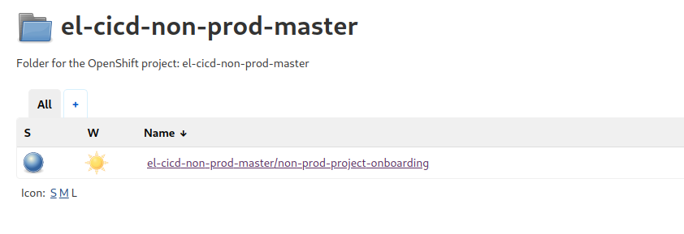

**Figure 9**
_el-CICD Non-prod Automation Server pipelines_

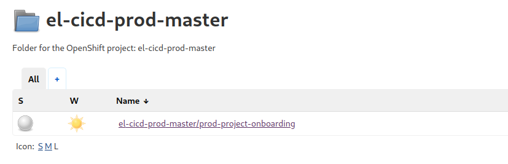

**Figure 10**
_el-CICD Prod Automation Server pipelines_

The project onboarding pipelines exist on the el-CICD master servers. All onboarding pipelines will do the following:

* Create the RBAC group namespace for the Automation Server if it doesn't exist
  * `<RBAC-group>-cicd-Non-prod` or `<RBAC-group>-cicd-prod`
* Create the Automation Server
* Create all pipelines
  * Non-prod
    * [Build-to-Dev](#build-and-deploy-microservices), one for each microservice
    * [Build and Deploy Microservices](#build-and-deploy-microservices)
    * [Promotion/Removal](#promotionremoval)
    * [Redeploy/Removal](#redeployremoval)
    * [Create Release Candidate](#create-release-candidate)
    * [Redeploy Release Candidate](#redeploy-release-candidate)
  * Prod
    * [Deploy To Production](#deploy-to-production)
* Add all necessary credentials to the Jenkins instance for Image Repositories and Git

 Both onboarding pipelines are designed to be remotely triggered and complete automatically if necessary.  This allows oganizations that have external project management software to more easily integrate with el-CICD.  See the Jenkins documentation for how to trigger piplines via its RESTful API.

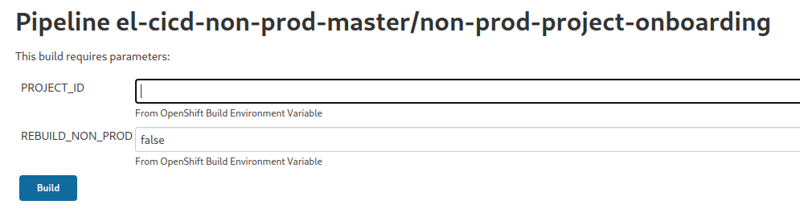

**Figure 11**
_el-CICD Non-prod Project Onboarding Pipeline

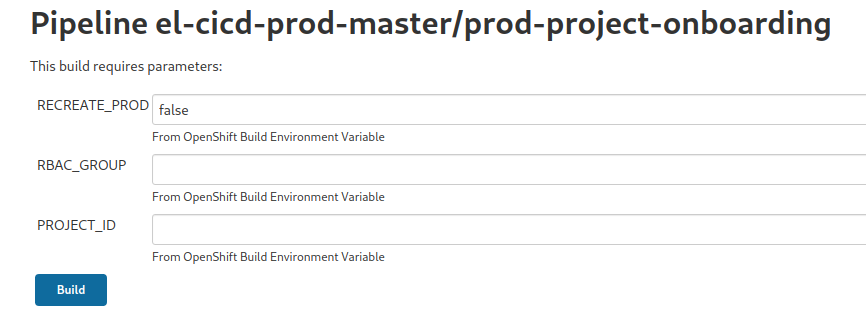

**Figure 12**
_el-CICD Prod Project Onboarding Pipeline

## Non-prod Automation Server Pipelines

The following pipelines exist on the Non-prod Automation Server.  All except the [Build-to-Dev](#build-and-deploy-microservices) pipeline(s) are shared among all projects owned by the RBAC group controlling the server.  Only the Build-to-Dev pipelines are designed to be remotely triggered.  All other pipelines are designed such that human intervention is necessary for them to complete.

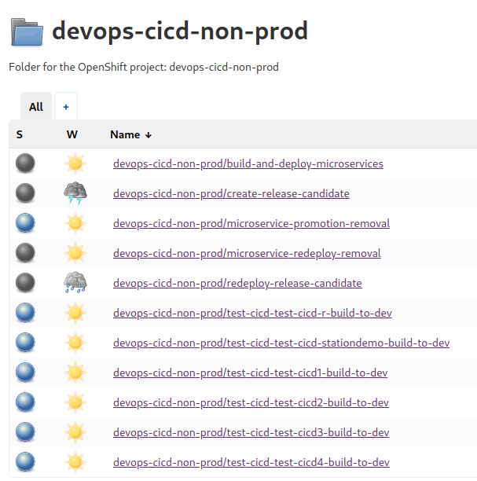

**Figure 13**
_Non-prod Automation Server pipelines for RBC Group `devops` and project `test-cicd`_

### Build-to-Dev

There is one Build-to-Dev pipeline per each microservice defined in the [Project Definition File](#project-definition-file).  The pipeline will do the following:

* Download the latest microservice code from the project's Development Branch
  * Users may optionally enter another branch to build
* Build, test, and scan microservice in the Jenkins agent
* Build and push an image of the microservice to the Dev Image Repository
  * Tag the image with the Dev environment name, all lower case
  * e.g. `sample-microservice-name:dev`, assuming the Dev environment is named `DEV`
* Build and process the Dev environment OKD templates
* Deploy the microservice to Dev, or to one of the Sandbox environments as chosen by the user
  
Build-to-Dev is usually triggered via a webhook from Git whenever the Development Branch for a particular microservice's has a new commit, and the pipeline attempts to build and deploy the microservice to the Dev environment.  If the user chooses to execute the pipeline manually, they may choose:

* The Git branch to build from
* Whether to remove the currently deployed microservice first before redeploying
* Whether to build to the Dev environment, or enter the namespace of a Sandox environment

Start the pipeline manually by going the _Build with Parameters_ screen of the pipeline.

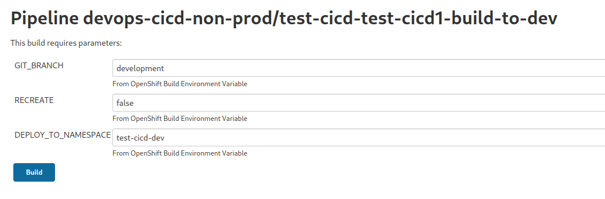

**Figure 14**
_Build with Parameters screen for the Build-to-Dev pipeline_

### Build and Deploy Microservices

The Build and Deploy Microservices pipleline is meant for the building and deploying of multiple microservices at once.  After entering the project name, the user may choose to: 

* Choose to deploy to the Dev environment or a Sandbox
* Choose the branch to build from the chosen microservices of the project
* Build all microservices
* Recreate all microservices; i.e. remove all currently deployed microservices before deploying new builds
* Build selected microservices of the project

The pipeline builds a number of microservices in parallel using Jenkins' parallel build capability.  The builds and deployments for each microservice are triggered by calling each individual Build-to-Dev pipleline of each microservice.

Start the pipeline by going the _Build with Parameters_ screen of the pipeline.

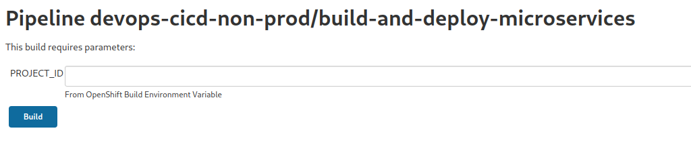

**Figure 15**
_Build with Parameters screen for the Build and Deploy Microservices pipeline_

From the console of the running build, enter the input screen and select how you want the project built and deployed.


**Figure 16**
_Choose what microservices build and where to deploy to_

`buildAll` will build all the microservices in the project.  `recreateAll` will remove all previously deployed microservices from the enviroment before deploying anything, and this functionality can be used without building any microservices as a means of cleaning the Dev or Sandox environments.

### Promotion/Removal

The Promotion/Removal pipeline's purpose is to promote one or more microservices of a project from one environment to the next as defined both in the general el-CICD settings and using only the specific test environments as listed in the [Project Definition File](#project-definition-file),  For each microservice the user has selected for promotion the pipeline will:

* Verify each image to be promoted has been deployed in the previous environment
* If the previous environment is a test environment, confirm a Deployment Branch for the previous environment exists
* Create a new Deployment Branch from the previous Deployment Branch for the current environment if one does not exist
* Copy the image from the previous environment's Image Repository to the current environment's Image Repository
  * Tag the image with the current environment name, all lower case, marking it as the image currently or most recently (if later removed) deployed to that environment; e.g. `qa`
  * Tag the image with current environment name and source commit hash; e.g. `qa-skd76dg`
* Deploy the microservice using the environment's deployment configuration from the Deployment Branch and the image from the environment's Image Repository that was just copied

Before deploying the newly copied images, any microservices selected for removal will be removed.

Start the pipeline by going the _Build with Parameters_ screen of the pipeline.

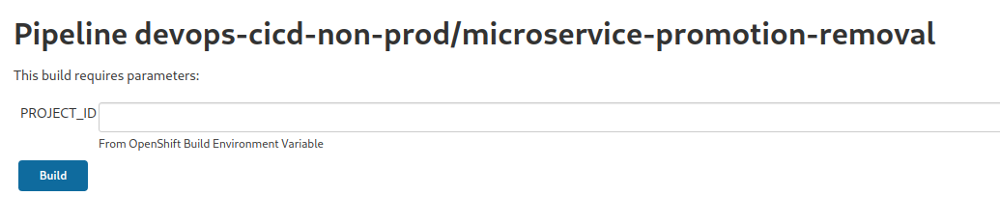

**Figure 17**
_Build with Parameters screen for the Promotion/Removal pipeline_

After entering the project name, the user may choose: 

* Choose the environment to promote from/to
* Choose a default action (do nothing, promote, or remove) for all microservices
* Choose an action for a specific microservice

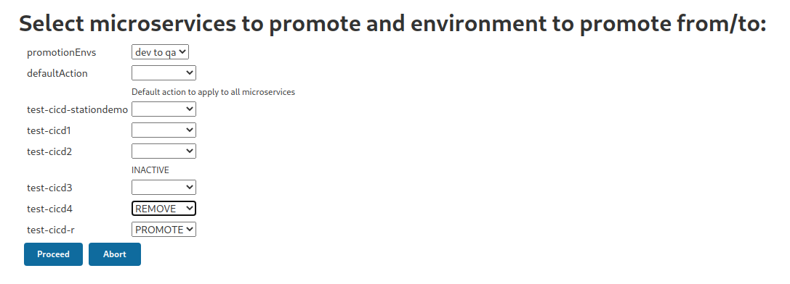

**Figure 18**
_Select microservices to promote or remove_

### Redeploy/Removal

The Redeploy/Removal pipeline's purpose is to redeploy one or more microservices of a project back into its environment, usually because the configuration of those microservices have changed and been pushed to the microservice's Git repository, or the user wishes to peform a rollback or roll-forward operation to a particular microservice image in the environment.  For each microservice the user has selected for redeployment the pipeline will:

* Verify the image still exists in the environment's Image Repository
* Confirm a Deployment Branch exists for the image
* Tag the image with the current environment name, all lower case, marking it as the current image deployed in the environment
* Deploy the microservice using the environment's deployment configuration from it's Deployment Branch and the image from the environment's Image Repository that was just tagged

Before redeploying any images, any microservices selected for removal will be removed.

Start the pipeline by going the _Build with Parameters_ screen of the pipeline.

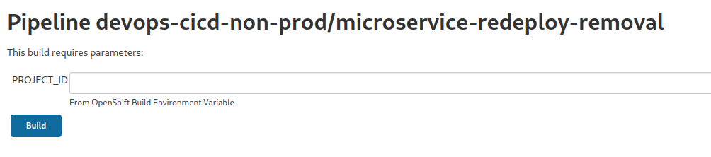

**Figure 19**
_Build with Parameters screen for the Redeploy/Removal pipeline_

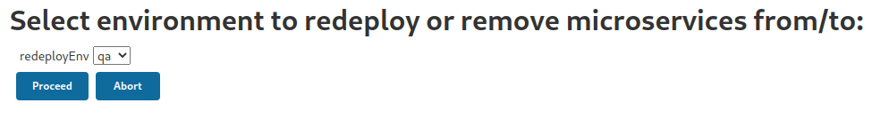

**Figure 20**
_Select environment to redeploy to_

After entering the project name and choosing an environment, the user may choose the version of any microservice they wish to deploy, or removal of some or all of the images: 

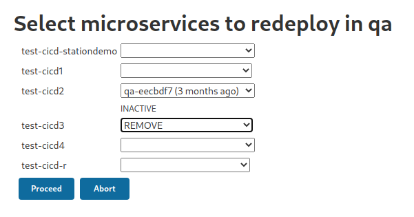

**Figure 21**
_Select microservices to redeploy or remove_

### Create Release Candidate

The Create Release Candidate pipeline's purpose is to define a collection of images from those currently deployed in the Pre-prod environment (the penultimate test environment before being deployed to Prod) that the user selects and tag them each as a candidate for a release to production.  For each microservice the user has selected for tagging  the pipeline will:

* Verify images in the Pre-prod Image Repository with the Release Candidate Tag do not already exist
* Tag the Pre-Prod Deployment Branch's latest commit with the Release Candidate Tag

Start the pipeline by going the _Build with Parameters_ screen of the pipeline.

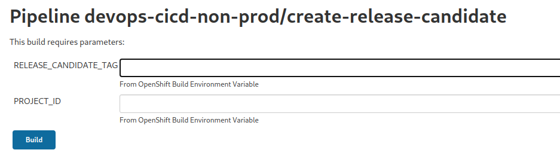

**Figure 22**
_Build with Parameters screen for the Redeploy/Removal pipeline_

After entering the project name and entering a Release Candidate Tag, the user should select the microservices that will be part of the release.


**Figure 23**
_Select environment to redeploy to_

### Redeploy Release Candidate

The Redeploy Release Candidate pipeline's purpose is to redeploy the images in the Pre-prod Image Repository tagged as a particular Release Candidate back into the Pre-prod environment.  Users will want to do this for testing purposes, or to set the environment up quickly to create a hotfix.  After entering the Project ID and the Release Candidate Tag the pipeline will:

* Verify both images and a Git tag exist that match the Release Candidate Tag
* Ask the user to confirm the deployment of the Release Candidate, and removal of all microservices not part of the Release Candidate

If the user approves the deployment, the pipeline will continue and:

* Tag all images of the Release Candidate with the Pre-prod environment name, all lower case, marking it as the current image deployed in the environment
* Remove all currently deployed microservices in Pre-prod
* Deploy all microservices of the Release Candidate into Pre-prod, using the latest commit from the Deployment Branch for the Pre-prod environment [**IMPORTANT**: if further deployments of the Release Candidate took place after promoting to Prod, it's possible the Release Candidate may not completely resemble the original Release Candidate.] 

**WARNING**: when redeploying a Release Candidate, the latest commit of the Deployment Branch is what is used, meaning the deployment may **NOT** have the same deployment configuration as when the Release Candidate was created.

Start the pipeline by going the _Build with Parameters_ screen of the pipeline.

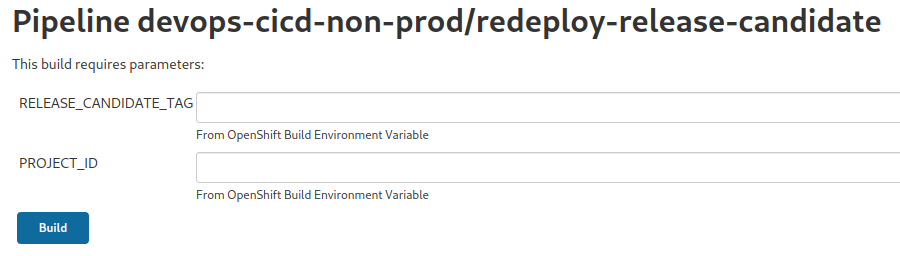

**Figure 24**
_Build with Parameters screen for the Redeploy Release Candidate pipeline_

After entering the project name and entering a Release Candidate Tag, the user should select the microservices that will be part of the release.

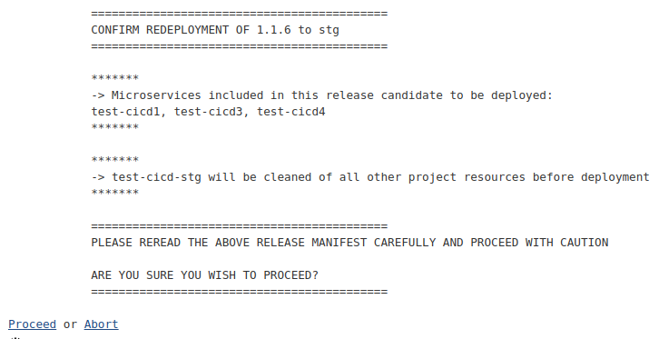

**Figure 25**
_Confirm redeploying the Release Candidate into Pre-prod_

## Prod Automation Server Pipelines

### Deploy to Production

The Deploy to Production pipeline's purpose is to create a Release Version by promoting an existing Release Candidate into production if it hasn't already been promoted, and then deploy it.  After entering the Project ID and the Release Candidate Tag  (**NOT** the Release Version Tag) the pipeline will:

* Verify the Release Candidate Tag exists

If the Release Candidate exists, then

* Ask for confirmation from the user whether to deploy the Release Version
* If the Release Version does not already exist
  * Copy the Release Candidate images into the Prod Image Repository
  * Tag each image as a Release Version
    * `v<Release-Candidate-Tag>`; e.g. `v2.0` for Release Candidate `2.0`
  * Create each Release Version Deployment Branch
    * Branch created from the commit of the Pre-prod Deployment Branch that also has the Release Version Tag in Git
* Deploy the microservices to the Prod environment that are part of Release Version
* Remove all resources and microservices that are not part of the Release Version

Start the pipeline by going the _Build with Parameters_ screen of the pipeline.

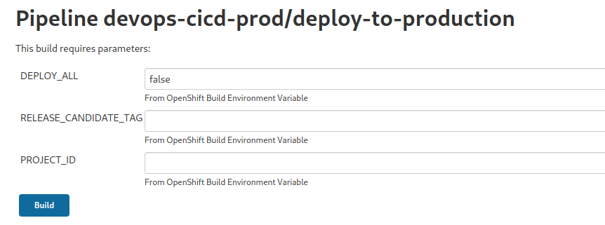

**Figure 26**
_Build with Parameters screen for the Deploy to Production pipeline_

After entering the project name and entering a Release Candidate Tag, the user should select the microservices that will be part of the release.

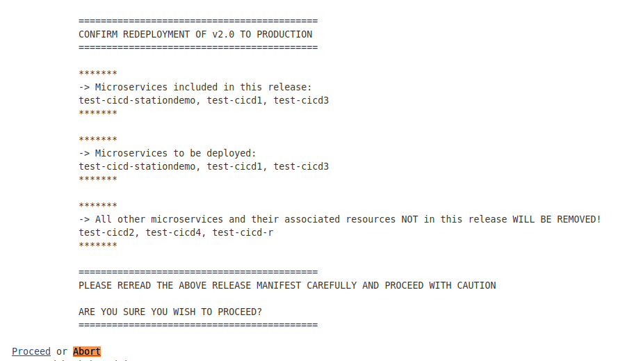

**Figure 27**
_Confirm promoting or redeploying the Release Version into Prod_

The pipeline is smart enough to realize on redeployments whether the Deployment Branch has changed since the last deployment for each microservice, and will only deploy those microservices that have changed.  If you wish all microservices to be redeployed, set the DEPLOY_ALL parameter to `true`.  Compare the `Microservices in this release` to the `Microservices to be deployed` section to see what the pipeline will do for each redeployment.

# Advanced SDLC Patterns

There are a couple of advanced CICD patterns that can be supported by el-CICD by leveraging the Project Definition Files.  Creating copies of these files with different names allows groups to work in parallel with the collection of microservices that make up an application.

It is important to remember that while el-CICD manages branching and tagging for _deployments_, el-CICD does not, cannot, and should not handle branching and tagging strategies for software development.  These strategies will still require managing merging between the different development branches these strategies will require.

## Staggered Release Teams

Staggered releases are a strategy whereby two different teams within the same project work on different releases in parallel, and release at different times one after the other.  In order to support this type of development strategy, teams should create two different Project Definition Files.  Each Project Definition File needs only refer to a different Development Branch, one for each team.

The result of this strategy is that two separate sets of environments for deployments will be created in the Non-prod cluster, one for each team, and two different Build-to-Dev pipelines for the same microservice referring to different Development Branches.  This is all that is needed.  In Prod, only one of the two teams Automation Servers need be created, because the Release Candidate and Release Version Tags in the Image Repositories do not directly belong to any particular project.

## Hotfixing

Hotfixing a Release Version while development continues on the Development Branch of a project can be tricky, but el-CICD can support this scenario.  Create a copy of the Project Definition File, and only whitelist the Pre-prod environment in the copy.  Create a `hotfix` branch in Git for each microservice from the latest commit of the Release Version's Deployment Branch, and make this the Development Branch of the Hotfix Project.  Assuming you didn't change the source code as instructed, this will contain the source each image of the Release Version was created from, as well as the each image's deployment configuration.  Redeploy the Release Candidate into the hotfix projects Pre-prod environment, develop against the `hotfix` branch as usual, except now you only have a single test environment before production for faster deployments into Prod, which is what you want with a hotfix.  Each hotfix is considered a new Release Version by el-CICD, but it is advisable to come up with a separate version tagging strategy in order to tell them apart from normal Release Candidates and Release Versions.

