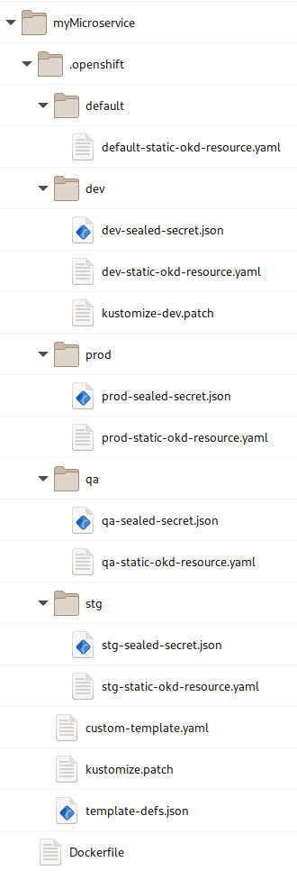
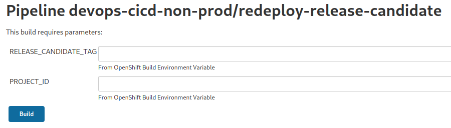

# el-CICD Developer Guide

**The purpose of this document is to aid developers new to el-CICD in how to adapt their Git repositories to build and deploy with el-CICD.**  

## Preamble

This document is part of the el-CICD Project, a CICD system for the OKD Container Platform

Copyright (C) 2021 Evan "Hippy" Slatis  
email: el.cicd.Project -at* gmail -dot* com

===================================

**NOTE: Red Hat® OpenShift® Platform is a trademark of Red Hat, Inc., and supported and owned by Red Hat, Inc.**

**el-CICD IS NEITHER SUPPORTED OR AFFILIATED IN ANY WAY WITH RED HAT, INC., OR ANY OF ITS PROJECTS.**

===================================

## License

el-CICD is free software; you can redistribute it and/or modify it under the terms of the GNU Lesser General Public License as published by the Free Software Foundation; either version 2.1 of the License, or (at your option) any later version.

This library is distributed in the hope that it will be useful, but **WITHOUT ANY WARRANTY; without even the implied warranty of MERCHANTABILITY or FITNESS FOR A PARTICULAR PURPOSE**.  See the GNU Lesser General Public License for more details.

You should have received a copy of the GNU Lesser General Public License along with this library; if not, write to

```text
    The Free Software Foundation, Inc.
    51 Franklin Street
    Fifth Floor
    Boston, MA
        02110-1301
```

This document is licensed under the Creative Commons Attribution 4.0 International License. To view a copy of this license, visit

http://creativecommons.org/licenses/by/4.0/

or send a letter to

```text
  Creative Commons
  PO Box 1866
  Mountain View, CA
      94042, USA
```

# Table of Contents

* [el-CICD Developer Guide](#el-cicd-developer-guide)
  * [Preamble](#preamble)
  * [License](#license)
* [Table of Contents](#table-of-contents)
* [Overview](#overview)
  * [Assumptions](#assumptions)
  * [Overview of Steps](#overview-of-steps)
* [Projects](#projects)
  * [One Git Repository Per Microservice or Component](#one-git-repository-per-microservice-or-component)
    * [Uniform Development Branch Name](#uniform-development-branch-name)
  * [Project Environments](#project-environments)
    * [Sandbox Environments](#sandbox-environments)
    * [Hotfix Environment](#hotfix-environment)
  * [Builds](#builds)
    * [Library Builds](#library-builds)
    * [Build Secrets](#build-secrets)
* [Dockerfile](#dockerfile)
* [.openshift Directory](#openshift-directory)
  * [template-defs](#template-defs)
    * [appName](#appname)
    * [templateName](#templatename)
    * [file](#file)
    * [patchFile](#patchfile)
    * [params](#params)
    * [Environmental Overrides](#environmental-overrides)
  * [managed OKD Templates](#managed-okd-templates)
    * [Default Template Parameters](#default-template-parameters)
    * [How to Know What the Template Parameters Are](#how-to-know-what-the-template-parameters-are)
      * [3Scale and Prometheus Integration](#3scale-and-prometheus-integration)
    * [Custom OKD Templates](#custom-okd-templates)
  * [Patching OKD Templates](#patching-okd-templates)
    * [kustomize.patch](#kustomizepatch)
    * [kustomize](#kustomize)
      * [Adding content](#adding-content)
      * [Notes On kustomize Paths](#notes-on-kustomize-paths)
    * [EXAMPLE: Adding Environment Variables to a DeploymentConfig (or Deployment) OKD Template](#example-adding-environment-variables-to-a-deploymentconfig-or-deployment-okd-template)
    * [EXAMPLE: Adding a Custom Parameter an OKD Template](#example-adding-a-custom-parameter-an-okd-template)
    * [EXAMPLE: Adding a volume and volumeMount to a CronJob OKD Template](#example-adding-a-volume-and-volumemount-to-a-cronjob-okd-template)
  * [Environment Directories](#environment-directories)
    * [Sandbox and Hotfix Environments](#sandbox-and-hotfix-environments)
    * [Release Regions](#release-regions)
    * [WARNING: OKD Templates in Environment Directories](#warning-okd-templates-in-environment-directories)
    * [Sealed Secrets](#sealed-secrets)
      * [kubeseal](#kubeseal)
  * [Further Examples](#further-examples)
* [Repository and Runtime Integration Strategy](#repository-and-runtime-integration-strategy)
  * [Development Branch](#development-branch)
  * [Deployment Branches](#deployment-branches)
    * [Problem: Code is Mutable, Images are Immutable](#problem-code-is-mutable-images-are-immutable)
    * [Solution: Deployment Branches](#solution-deployment-branches)
      * [WARNING: DO NOT MODIFY BUILDABLE SOURCE OR UPSTREAM ENVIRONMENT CONFIGURATIONS](#warning-do-not-modify-buildable-source-or-upstream-environment-configurations)
    * [Deployment Branch Naming Conventions](#deployment-branch-naming-conventions)
    * [Release Candidate Tags](#release-candidate-tags)
    * [Release Version Deployment Branches](#release-version-deployment-branches)
  * [Images](#images)
    * [Image Naming Conventions](#image-naming-conventions)
    * [Image Labels](#image-labels)
    * [Non-prod Image Tags](#non-prod-image-tags)
    * [Release Candidate Image Tags](#release-candidate-image-tags)
      * [Prod Image Tags](#prod-image-tags)
  * [Deployment Metadata Resources](#deployment-metadata-resources)
    * [Deployment Resource Labeling](#deployment-resource-labeling)
    * [Microservice Runtime Meta-Info](#microservice-runtime-meta-info)
    * [Project Meta-Info](#project-meta-info)
* [Non-prod Automation Server Pipelines](#non-prod-automation-server-pipelines)
  * [build-to-dev Pipelines](#build-to-dev-pipelines)
  * [build-library Pipelines](#build-library-pipelines)
  * [build-and-deploy-microservices Pipeline](#build-and-deploy-microservices-pipeline)
  * [microservice-promotion-removal Pipeline](#microservice-promotion-removal-pipeline)
  * [microservice-redeploy-removal Pipeline](#microservice-redeploy-removal-pipeline)
  * [create-release-candidate Pipeline](#create-release-candidate-pipeline)
  * [redeploy-release-candidate Pipeline](#redeploy-release-candidate-pipeline)

# Overview

This developer guide will help explain what is needed to adopt a software project to build and deploy to OKD or Openshift with el-CICD.  For the remainder of the document wherever OKD is referenced, OpenShift may be safely inferred.

This document is not meant to be a comprehensive tutorial, but rather a basic reference for software developers whose projects are to be built and deployed by el-CICD.  This repository contains a [tutorial](tutorial.md) on the basic operational and functional use of el-CICD, with a simple example of [Deployment Patching](foundations.md#deployment-patching).  There are also a number of test projects on the [el-CICD site](https://github.com/elcicd) that provide numerous examples of for defining microservice deployments for el-CICD.

## Assumptions

This document assumes that the reader has working knowledge of JSON, YAML, Kubernetes, OKD, OKD Templates, Git, and hands on experience developing software.

## Overview of Steps

A short overview of the steps developers need to undertake is as follows for microservices to be deployed:

* Decompose each application's microservices/components into individual Git repositories
  * One Git repository per Docker image built  
    [**NOTE**: This does **not** mean one repository per image deployed; the same image may be deployed multiple times with different configurations]
* Add a [Dockerfile](#dockerfile) to the root of each repository
* Add a [`.openshift`](#openshift-directory) directory to the root of each Git repository
* Create and define a `template-defs.yml` or `template-defs.json` file in the root of the `.openshift` directory
  * This will reference all [OKD Templates](https://docs.okd.io/latest/openshift_images/using-templates.html) and their patches and parameters per SDLC [Environment](foundations.md#environments)
* Create one or more `kustomize` `*.patch` files to further configure the OKD Template(s) for each microservice's deployment
* Convert all secrets into Sealed Secrets to commit into each environment Directory in the `.openshift` directory
  * Static OKD resources are also added to the [Environment Directories](#environment-directories)

# Projects

A _Project_ in el-CICD is a collection of one or more Git repositories to be built into Docker images and deployed into OKD.  Projects are released as a whole; thus, if even one image is different when the Project is deployed to production, each unique collection of images and their [Deployment Branches](#deployment-branch) is considered a separate, new release.

## One Git Repository Per Microservice or Component

el-CICD only builds one Dockerfile per Git repository.  In general, this means each microservice or component of a software project meant to run in its own pod must be broken out into its own Git repository.  The terms microservice and component are considered interchangeable in this context.

The name of your microservice in el-CICD will be generated from its Git repository name, replacing special characters with dashes and converting all alphabetic characters to lowercase; .e.g. `Foo_Bar_1` becomes `foo-bar-1`.

### Uniform Development Branch Name

Each Project in el-CICD must have a uniform [Development Branch](#development-branch) name defined, representing the code for each microservice that will be used to build the next release of the Project.  Each Git repository belonging to the Project must have a working branch defined matching this name, or the Webhooks el-CICD creates will not work.

## Project Environments

When your Project is onboarded the engineering cluster, a number of namespace will be created representing the SDLC environments.  You can find them with the following command:

```bash
oc projects | grep <project-id>
```

Each namespace will follow the naming convention

```text
<project-id>-<environment>
```

For example, for the Project `test-cicd`, the following list is displayed:

```text
    test-cicd-dev
    test-cicd-hotfix
    test-cicd-qa
    test-cicd-sandbox-1
    test-cicd-sandbox-2
    test-cicd-stg
```

and the environment names for `test-cicd` are

* `dev`
* `qa`
* `stg`
* `sandbox-1`
* `sandbox-2`
* `hotfix`

Typically, and because of best practices, there is no Prod environment, because they are deployed on a separate cluster.  A Prod environment would be the only environment listed on a production cluster for the Project.

Although reasonably clear, your organization will explain the promotion order, but you can also run the [microservice-promotion-removal-pipeline](#microservice-promotion-removal-pipeline) which will list all the options available.

### Sandbox Environments

Sandbox environments are numbered, temporary build environments in which developers can test builds and deployments of their feature branch, for example.  Any number of microservices may be deployed to these namespaces, but no promotion of images out of them is allowed.  The number of Sandbox environments available will be set per Project by the organization and defined in the [Project Definition File](operating-manual.md#project-definition-file).

### Hotfix Environment

If `hotfixesAllowed` is true in your [Project Definition File](operating-manual.md#project-definition-file), then you will have a Hotfix environment created for your Project.  This environment is similar to the Sandbox environments, but it is meant for small build patches that will immediately be promoted to the Pre-prod environment for testing and quick promotion to Prod.

## Builds

Each microservice is defined by its Git repository and a [Code Base](foundations.md#code-base).  The Code Base will define how the Git repository is built.  To find what Code Base your Git repository is assigned, look in the `el-CICD-config/project-defs` directory for your project's [Project Defintion File](operating-manual.md#project-definition-file), find your Git repository listing, and check the value of `codeBase` there.

Under the [`el-CICD-config/builder-steps`](operating-manual.md#builder-steps) directory, you'll find a directory with name matching your Code Base, and the `*.groovy` files in there will define how your microservice is [built, tested, scanned, and assembled](operating-manual.md#build-scripts) (or deployed, if it's a library).  After these steps complete, el-CICD will attempt to build an image for your microservice and deploy it to the Project's [Dev Environment](foundations.md#dev-environment).  See the [Dockerfile](#dockerfile) section for more information.


**Figure 1**  
_The_ `builder-steps` _directory showing the specific Groovy files implementing each step for the_ `python` _Code Base._

### Library Builds

el-CICD supports [Library builds](foundations.md##build-library) for artifacts like Java _jars_ or Python pip wheels that are meant to be shared among multiple microservices.  el-CICD assumes a Git Repository will create the artifacts that are subsequently pushed (during the `deployer` Builder Step) to an [Artifact Repository](foundations.md#artifact-repository), and that the builds of the dependents of library will know how and where to retrieve it.  Since defining these steps are heavily end-user dependent on integrating third party applications (the Artifact Repository) and on their own Code Bases and standards, this document will not discuss them further.  Your organization will have further guidance as to how to organize your library source code per Code Base, and, since libraries are not deployed on OKD directly, how build and release versions of libraries are defined and distributed.

### Build Secrets

Build secrets, such as those contained in a `settings.xml` for Maven or `pip.conf` for Python, will be defined by the organization and injected into Jenkins Agents during the build steps automatically.  The organization will communicate further information on how to reference them during Docker builds if this is necessary.  For most developers the use of build secrets should be completely transparent.

# Dockerfile

Since all microservice builds in el-CICD are expected to result in an image that will be deployed to a [Dev Environment](foundations.md#dev-environment), each microservice Git repository of a Project must have a single Dockerfile in its root directory.  If a Dockerfile is not found in the root directory of the microservice, the build will fail.

# .openshift Directory

Every microservice in a Project must have a `.openshift` directory in it's root directory.  This directory holds all files defining how the microservice's image and associated OKD Resources will be deployed in OKD for each Software Development Lifecycle (SDLC) environment.



**Figure 2**  
_Example of the_ `.openshift` _directory illustrating the structure and its contents._

## template-defs

The `template-defs.yml` (or `template-defs.json`) file defines all OKD Templates used by the microservice to define its deployment into an el-CICD SDLC [Environment](foundations.md#environments), represented by an OKD namespace.  The file can define default parameter values, environment specific parameter values, or both to pass to each template during deployment.  The same holds true for a `kustomize` patch to further configure the OKD Template.

```yml
templates:
  - appName: my-microservice-instance
    templateName: dc-svc-template
    patchFile: `kustomize.patch`
    params:
      SVC_PORT: 8080
      MY_ENV_VAR: someValue
    dev:
      patchFile: dev/kustomize-dev.patch
      params:
        SVC_PORT: 8081
        MY_ENV_VAR: someDevValue
    qa:
      params:
        MY_ENV_VAR: someQaValue
  - appName: my-microservice-instance
    templateName: route-template
    params:
      SVC_PORT: 8080
    dev:
      params:
        SVC_PORT: 8081

```

**Figure 3**  
_Sample template-defs.yml file._

Every microservice will need to define a DeploymentConfig, Deployment, or CronJob in order to deploy their image; thus, unless a static OKD resource is used, at least one `dc-svc-template` or `cronjob-template` will be referenced in this file.  `template-defs` may also be written in JSON.

**NOTES:**

1. In the example above, a Route template is paired with a template for a DeploymentConfig and Service.  In order to match them, the Route must have the same name (`appName`) as the Service (which automatically shares the same name as the DeployConfig), as shown above.

2. All paths referenced in the `template-defs` are relative to the `.openshift` directory; e.g. the `dev/kustomize-dev.patch`

### appName

The `appName` for the DeploymentConfig, Deployment, Service, Route, Ingress, and CronJob templates is injected as the `.metadata.name` value.  It is an optional entry in the `template-defs`, as it will default to the name of the microservice if not explicitly set.  The two main purposes of the this key is to match OKD Resources (such at the DeploymentConfig and Service), and allow for multiple, simultaneous deployments of the same image to be defined within a microservice.

### templateName

The `templateName` refers to the actual name of the OKD Template; i.e. `.metadata.name` field in the Template file.

### file

Although not shown above, list the key `file` next to the `templateName` when using a custom OKD Template.  See [custom template](#custom-okd-templates) for more information; for example:

```yml
templates:
  - appName: my-app-name
    templateName: my-dc-svc-template
    file: my-dc-svc-template.yaml
    patchFile: `kustomize.patch`
    params:
      SVC_PORT: 8080
      TOPIC_NAME: test-cicd2-topic
# rest of template-defs redacted
```

for a Template defined in `my-microservice/.openshift/my-dc-svc-template.yaml`:

```yml
apiVersion: template.openshift.io/v1
kind: Template
labels:
  template: my-dc-svc-template
message: An example
metadata:
  name:  my-dc-svc-template
# rest of Template redacted
```

### patchFile

The `patchFile` references a `kustomize` patch file to be applied to the OKD Template.  Patch files are used to add environment variables, volumes, volumeMounts, readiness and liveliness probes, etc. to a DeploymentConfig, Deployment, or Cronjob.  Even extra Template parameters can be added through patching; e.g. `MY_ENV_VAR` is not part of the `dc-svc-template`, so it would have to added as part of a patch in order to make use of the value when the microservice is deployed.

To reference the `kustomize` file, use a path relative to the `.openshift` directory if it's not in the root `'.openshift` directory, as the `dev/kustomize-dev.patch` value [example above](#template-defs)

### params

The `params` section will define the default and/or environment specific Template parameters and their values.   OKD Templates oftentimes have default values defined for their parameters, or the parameters are not required, so specifically defining parameters is only necessary here or in the [Environmental Overrides](#environmental-overrides) section if your microservice or the template specifically need a value.

### Environmental Overrides

Sometimes different SDLC environments require Template parameter values; e.g. a microservice's log level might be set to `INFO` in the Dev and Test environments, but `WARNING` in Pre-prod and Prod.  If these are configured through Template parameters.  The sections named after the specific SDLC environment allow you to override some the necessary parameters and/or the `patchFile`.  In the [example above](#template-defs), only two environments override the default parameters, `dev` and `qa`, and the `dev` environment also uses its own `patchFile`.  All of these sections and values within them are optional, and are only required if a specific value for that environment needs to be expressed during deployment.  Only `params` and `patchFile` may be overridden.

## managed OKD Templates

All of the el-CICD managed OKD Templates are located in the `el-CICD-config/managed-okd-templates` directory.


**Figure 4**  
_managed-okd-templates directory in el-CICD-config repository._

To use a managed OKD Template, reference it in the `template-defs` file with the `templateName` property, found in the `.metadata.name` field of the OKD Template file.  el-CICD will automatically load the managed OKD Template during deployments, process the patchFile and parameters (in that order), and then deploy the resources in the proper SDLC environment.

```yml
templateName: dc-svc-template
```

**Figure 5**  
_Snippet of the_ `template-defs.yml` _referencing the_ `dc-svc-template`

```yml
apiVersion: template.openshift.io/v1
kind: Template
labels:
  template: dc-svc-template
message: Deploying using templated resources
metadata:
  name:  dc-svc-template
```

**Figure 6**  
_Snippet of the_ `dc-svc-template` el-CICD OKD managed template


### Default Template Parameters

By default, el-CICD will pass the following parameters to every OKD Template it processes:

|  NAME              | DESCRIPTION                                                       |
|  ----------------- | ----------------------------------------------------------------- |
|  PROJECT_ID        | The Project name                                                  |
|  MICROSERVICE_NAME | The microservice name                                             |
|  APP_NAME          | The appName (defaults to microservice name if not explicitly set) |
|  IMAGE_REPOSITORY  | The image repository backing the SDLC environment                 |
|  PULL_SECRET       | The pull secret for the image repository                          |
|  ENV               | The environment being deployed to                                 |
|  IMAGE_TAG         | The image tag of the microservice image                           |

Any of these parameters can be safely ignored if they are not needed or used in unmanaged, custom templates. el-CICD managed OKD Templates will use one of more of these by default.  Only the `APP_NAME` parameter can be set by the user, via the `appName` attribute in the `template-defs` file.

### How to Know What the Template Parameters Are

Copy of any of the managed OKD Templates to a local directory which also has the `oc` CLI binary installed, and run the following command:

```bash
oc process -f path-to-template-file/<template-file>.yml --parameters
```

This will print out a table of all the parameters of a Template, a description, what they are generated by (if defined), and the default value (if defined).  For example:

```bash
oc process -f managed-okd-templates/dc-svc-template.yml --parameters
```

produces the following output in your terminal (default values removed for brevity):

```text
NAME                           DESCRIPTION
BUILD_NUMBER                   The build number
IMAGE_REPOSITORY               The image repository from where to fetch the image
IMAGE_PULL_POLICY              The image pull policy
PULL_SECRET                    The image repository pull secret
MICROSERVICE_NAME              The name for the microservice, derived by el-CICD from the
                               name of the Git repository
APP_NAME                       The name for the app.  Set this value manually through the template-defs
                               file for multiple deployments of the same image.
PROJECT_ID                     The Project ID
IMAGE_TAG                      Image Tag used to pull image from image repository
CPU_REQ                        CPU Resource Request; see OKD docs for more info
CPU_LIMIT                      Maximum CPU Resource Limit allowed; see OKD docs for more info
MEM_REQ                        Memory Resource Request; see OKD docs for more info
MEM_LIMIT                      Memory Resource Limit (Ceiling) in Mi or Gi; see OKD docs for more info
REPLICAS                       The number of replicas for this deployment; see OKD docs for more info
SVC_PORT                       Service port; see OKD docs for more info
PORT_PROTOCOL                  Protocol for port. Must be UDP, TCP, or SCTP. Defaults to "TCP".
STRATEGY                       Deployment strategy; see OKD docs for more info
PROMETHEUS_PATH                Prometheus scraping path
PROMETHEUS_SCHEME              Prometheus scheme (http/https)
PROMETHEUS_SCRAPE              Prometheus scrape (true/false)
THREE_SCALE_PATH               3Scale path
THREE_SCALE_SCHEME             3Scale scheme (http/https)
THREE_SCALE_DESCRIPTION_PATH   3Scale description path
THREE_SCALE_NET                3Scale net (true/false, true if active)
```

#### 3Scale and Prometheus Integration

el-CICD offers basic deployment integration with both 3Scale and Prometheus (3.11 style annotations for Prometheus).  Whenever you deploy using a managed OKD Template, the Services generated by el-CICD will include the proper annotations and/or label to integrate.  If your microservice(s) aren't using either, you can safely ignore the injected values, and the default values are to inform both systems to ignore the them.  You can set the appropriate Prometheus and/or 3Scale values to alert either system to acknowledge the microservice.  Prometheus integration does not currently work with the newer operator in OKD 4.

The default DeploymentConfig and Deployment with Service Templates assume the Prometheus port shares the Service port.  If you wish to use an alternative port for Prometheus, use the `*-prom-port-template` and set the parameter `PROMETHEUS_PORT` (not shown above in your `template-defs` file.

See the [3Scale](https://access.redhat.com/documentation/en-us/red_hat_3scale_api_management/2.10/html/admin_portal_guide/service-discovery_service-discovery#service-discovery-criteria_service-discovery) docs on OKD integration for more information.

### Custom OKD Templates

If for some reason the managed OKD Templates aren't sufficient, el-CICD supports custom OKD Templates, which are OKD Templates kept in the Git repository's `.openshift` directory of the microservice and managed by the developer rather than the user.  Name the file using `file` property in the `template-defs` next to the `templateName`; e.g. 

```yml
    templateName: my-dc-svc-template
    file: my-dc-svc-template.yml
```

**Figure 7**  
_Snippet of a_ `template-defs.yml` _file which references the Custom OKD Template,_ `my-dc-svc-template` _in the file_ `my-dc-svc-template.yml`.

One example where a Custom OKD Template might be used is for a ConfigMap that changes values from one environment to the next.  Without a template in this situation, a copy of the ConfigMap would need to be provided in each [Environment Directory](#environment-directories).

## Patching OKD Templates

To keep deployment configurations simple and following the [DRY principle](https://en.wikipedia.org/wiki/Don%27t_repeat_yourself), el-CICD makes extensive use of a unique strategy of patching [managed OKD Templates](#managed-okd-templates) using [`kustomize`](https://kustomize.io/).  When deploying a microservice, the process will be:

1. Read in the microservice's [`template-defs`](#template-defs) file describing
   1. The OKD Templates to process
   1. Each Template's optional patch file
   1. Each Template's parameter values
1. Patch all OKD Templates
1. Process all OKD Templates

### kustomize.patch

The [managed OKD Templates](#managed-okd-templates) are completely bare bones.  For many of the Templates, e.g. `route-template` or `hpa-template` this is sufficient most of the time.  For the `dc-svc-template`, `deploy-svc-template`, and `cronjob-template` -- which defines a basic DeploymentConfig and Service pair, Deployment and Service Pair, and Cronjob, respectively -- these bare bones templates are insufficient.  Depending on the microservice's needs, one or more of environment variables, volumes, volumeMounts, readiness probes, etc., might need to be defined, and that's what the `kustomize.patch` is for.

Note that the file name, `kustomize.patch`, is only an informal standard.  The file can use any name and extension, but it is strongly suggested that the `*.patch` extension continue to be used.  For one thing it makes the file and its purpose easily recognizable within a microservice's Git repository, and secondly it ensures that el-CICD's deployment mechanism won't try and accidentally process it as static OKD resource.  Since OKD attempts to apply all `*.yml`, `*.yaml`, `*.json` files in the [Environment Directories](#environment-directories) as static OKD resources in whatever environmental namespace the microservice is currently being deployed to, avoid using JSON or YAML file extensions for this file.

### kustomize

el-CICD makes use of [`kustomize`](https://kustomize.io/) to patch OKD Templates, and combined with managed OKD Templates makes a simple and powerful way to quickly and easily define deployments using minimal code.  el-CICD uses the `kustomize` binary directly in its build agents, so this strategy works equally well in older versions of OKD which don't have `kustomize` built into the `oc` CLI binary.

The following sections will give a few examples of the most common uses of `kustomize` `*.patch` files.

#### Adding content

The examples below will only address the _add_ operation of `kustomize`, which inserts content into a YAML or JSON file.  This always has the following boilerplate:

```yml
- op: add
  path: /path/of/where/to/append/or/replace/content
  value:
    <content>
```

**Figure 8**  
_Basic boilerplate code for adding content using `kustomize` for use in a patch file._

The `<content>` in Figure 8 above should be proper YAML or JSON as it is expected to appear in the document being patched.  YAML indentation should start with the indentation of the patch file, and **not** the target document.  `kustomize` will insert it properly.

#### Notes On kustomize Paths

There are a few things to keep in mind about the `path` attribute of a `kustomize` operation.

1. References to a portion of a document in a list can only be done numerically; e.g.

   ```yml
   # insert at array into the env
   path: /objects/0/spec/template/spec/containers/0/env
     - name: key-1
       value: value-1
     - name: key-2
       value: value-2
   ```

   refers to the first element in the `objects` list, and the first element of the containers list.  The example path above is used to add a list of environment variables in a DeploymentConfig.

1. Appending content to a array, rather replacing it, requires a `-`, representing the last element; e.g.

   ```yml
   # append at the end of the parameters
   path: /parameters/-
     description: My 1st parameter.
     displayName: My 1st Parameter
     name: MY_PARAM_1

   path: /parameters/-
     description: My 2nd parameter.
     displayName: My 1st Parameter
     name: MY_PARAM_2
   ```

   will append a single element to a list of parameters.  If multiple elements need to be added to a list, then multiple entries must created in the `*.patch` file, one per element that needs to be added.

1. When not explicitly appending, `kustomize` will replace any content with whatever your operation defines.  In the first `env` example above, if the original template defined any content in that section it would be replaced with whatever is in your patch file.

### EXAMPLE: Adding Environment Variables to a DeploymentConfig (or Deployment) OKD Template

```yml
- op: add
  path: /objects/0/spec/template/spec/containers/0/env
  value:
    - name: key-1
      value: value-1
    - name: username
      valueFrom:
        configMapKeyRef:
          key: username
          name: ${APP_NAME}-configmap
    - name: password
      valueFrom:
        secretKeyRef:
          key: password
          name: my-microservice-sealed-secret
```

**Figure 9**  
_Injecting a username and password through a container's env in a DeploymentConfig OKD Template._

Note the use of the default el-CICD Template parameter `APP_NAME` in the name of the environment definition.  Template parameters, default or custom, can be added anywhere in the patch, and then referenced elsewhere.  See [Default Template Parameters](#default-template-parameters) for a list of values el-CICD automatically applies to Templates.

### EXAMPLE: Adding a Custom Parameter an OKD Template

Because Templates are patched before applying their parameters, `kustomize` patches can be used to add custom Template parameters.  This is a very flexible and powerful tool for extending OKD Templates.  For example, a default `kustomize.patch` file might add the parameter `ENV_VAR` to a Template, and then each [Environmental Override](#environmental-overrides) might defined its own values for `ENV_VAR`.  This is more convenient and more closely follows the DRY principle than creating a separate `*.patch` file per environment.

```yml
- op: add
  path: /parameters/-
  value:
    description: Some var.
    displayName: Some var
    name: ENV_VAR
    required: true
    value: some-default-var-value
```

**Figure 10**  
_Adding_ `ENV_VAR` _to an OKD Template.  The value of the param could optionally be set in the microservice's_ `template-defs` _file, or rely on the default, 'some-default-var-value`._

### EXAMPLE: Adding a volume and volumeMount to a CronJob OKD Template

```yml
- op: add
  path: /objects/0/spec/jobTemplate/spec/template/spec/containers/0/volumeMounts
  value:
    * mountPath: /mnt
      name: my-configmap-mount

- op: add
  path: /objects/0/spec/jobTemplate/spec/template/spec/volumes
  value:
    - configMap:
        name: ${ENV_VAR}-config-map
      name: my-configmap-mount
```

**Figure 11**  
_Adding a volume and volumeMount referencing a ConfigMap in a container defined in a CronJob OKD Template.  Note the use of the_ `ENV_VAR` _template parameter defined above to reference the ConfigMap._

## Environment Directories

In order to include static OKD resources, such as static (vs OKD Templates) ConfigMaps or [Sealed Secrets](#sealed-secrets), they need to be placed in either a `default` directory or a directory specifically named after an [SDLC environment](#project-environments)  These directories must be located in the `.openshift` root directory, and any YAML or JSON files found in these directories el-CICD will attempt to apply in the appropriate environment.

Files in the Environment Directories will take precedence over files in the `default` directory, just as values in the [Environment Overrides](#environmental-overrides) take precedence over default `template-defs` values; e.g. if there are two `foo.yml` files, one in the `default` directory and the other in the `dev` Environment Directory, then `dev/foo.yml` in the `dev` will be processed when deploying to the `dev` SDLC environment, and all other SDLC environments will use the contents of the `default/foo.yml`.

### Sandbox and Hotfix Environments

Both [Sandbox](#sandbox-environments) and [Hotfix](#hotfix-environment) environments will use Dev environment configurations.  They have no Environment Directory of their own.

### Release Regions

If your Project will be deployed onto more than one cluster in production, then you will most likely need to make use of Release Regions to handle either different configurations or, more likely, Sealed Secrets, which are cluster and namespace dependent.

Regions are constrained for a Project by listing them in the [Project Definition Files](operating-manual.md#project-definition-file), but they are otherwise arbitrary labels either chosen by the Project or the organization, and can consist of any number of labels such as `north` and `south` and `east` or `west`, `us` or `ca`, or `green` and `blue`.

The naming convention for folders holding configuration files for `prod` deployments with Regions is

```text
prod-<region-label>
```

The order of precedence for resolving conflicts between files will be `prod-<region-label>` as the highest, `prod`, and then `default`.

### WARNING: OKD Templates in Environment Directories

Do not place OKD Templates in Environment Directories unless you intend to deploy an OKD Template in an environment.  el-CICD will attempt to apply all YML and JSON files found in Environment Directories.

### Sealed Secrets

[Secrets](https://docs.okd.io/latest/nodes/pods/nodes-pods-secrets.html) cannot be stored in Git repositories, because they are only obfuscated as base64 values and not encrypted.  This has made fully automated deployments of projects into Kubernetes and OKD problematic over the years.  In order to get around this, [Sealed Secrets](https://github.com/bitnami-labs/sealed-secrets) are used as a solution to encrypt Secrets for use in el-CICD so deployments may be fully automated.

Sealed Secrets are fully dependent on the cluster the Sealed Secrets are meant to be deployed in, and also on the namespace.  This means that for every SDLC environment your microservice is deployed to, a separate Sealed Secret must be created and placed in the appropriate Environment Directory.

#### kubeseal

[`kubeseal`](https://github.com/bitnami-labs/sealed-secrets#usage) is a command line utility provided by the Sealed Secrets project for creating Sealed Secrets, and should be installed on your OKD cluster's bastion.  Any Sealed Secrets your microservice needs will be created on the OKD bastion host and committed into your microservices Git repository in the appropriate Environment Directory.  If you are deploying to more than one cluster in Prod, then you'll need a Sealed Secret for each cluster, too.  See [Release Regions](#release-regions) for more information.

## Further Examples

In the `el-CiCD-docs` repository, which is where this document lives, you will find a `.openshift-examples` directory with a `template-defs`, `kustomize.patch`, and other examples.  You may also copy this directory down and use it as a lightweight template from which to create the deployment configuration of your microservice.

The [el-CICD site](https://github.com/elcicd) also contains a number of test repositories with numerous examples; e.g. [test-cicd-stationdemo](https://github.com/elcicd/test-cicd-stationdemo), [Test-CICD1](https://github.com/elcicd/Test-CICD1), and other projects prepended with some formulation of `test-cicd`.

# Repository and Runtime Integration Strategy

A microservice is comprised of two repositories, Source Code and Image, and each has artifacts that depend on the other.  The Source Code Repository, hosted on an [SCM](foundations.md#source-control-management-scm), contains the following pertinent code:

* The source to build the microservice's executables
* The source to build the image containing the microservice's executables
* The deployment configuration for deploying the image in each SDLC environment

The [Image Repository](foundations.md#artifact-repository) contains the images that are built, and the images as they are promoted.

The [Container Orchestration Platform](foundations.md#container-orchestration-platform) manages each SLDC environment, the deployment configuration as realized from the SCM for each particular environment, and the [pods](https://docs.okd.io/latest/nodes/pods/nodes-pods-using.html#nodes-pods-using-about_nodes-pods-using-ssy) running the containers based on the microservice images.

The following will explain how el-CICD manages to seamlessly and automatically sync each of the different sources of information as microservices are developed, built, deployed, promoted, rolled back and forward, etc.

## Development Branch

A design decision was made early on that all SCM repositories comprising a single Project would have a [Development Branch](foundations.md#development-branch) of the same name; e.g. `development`.  Regardless of team or the component worked on, all developers are expected to eventually merge their latest changes into this branch, which in turn will trigger the [Build-to-Dev](#build-to-dev) pipeline to build the microservice, build and push the microservice image to the Dev Image Repository, and then deploy the image into the [Dev environment](foundations.md#dev-environment).


**Figure 12** _The Development Branch with four separate commits and their hash.  Each commit represents a distinct build and (if successful) a distinct image deployed to the Dev environment._

## Deployment Branches

Deployment Branches are used to keep images and their deployment configurations in sync for a particular SDLC environment.  Before getting into more detail, it helps to understand why they are needed in the first place.

### Problem: Code is Mutable, Images are Immutable

The images built from source reside in an Image Repository, and they are immutable.  The deployment configuration, describing how the image should be deployed on the [Container Orchestration Platform](foundations.md#container-orchestration-platform) OKD, is kept in the Git SCM on the Development Branch, and assuming the microservice is being actively developed it is constantly evolving with new commits; i.e. it is very mutable.

Since the Dev environment by definition represents a build resulting in a new image, this isn't an issue.  As new commits are made, new builds are triggered simultaneously, so the deployment configuration for the image deployed in the Dev environment always represents what is in the commit that built the image.

The harder problem is when an image is promoted to a downstream environment; e.g. from Dev to a Test environment, a Test to Pre-Prod, or Pre-prod to Prod.  At some point a downstream environment may need to change the deployment configuration, and best practice requires that those changes be committed and versioned in the SCM.  Where and how can changes to the deployment configuration for those images kept and versioned, if the branch that contained the original source of the image has already evolved one more commits into the future?

Expecting the Development Branch to also hold the deployment for images deployed to a Test environment when the Development Branch might be many commits ahead is not a good strategy.  The deployment configuration for downstream environments would not represent the latest commit, but some commit in the past, assuming that the two could even be reconciled and tracked.  The problem becomes even more complex and difficult when you start to consider how to roll back or roll forward to different versions of the image and their associated deployment configurations in different SDLC environments.

### Solution: Deployment Branches


**Figure 13**  

1. _Development Branch of Project_
1. **`deployment-qa-8d7dh3g`** _Deployment Branch for `qa` with one [Deployment Patch](foundations.md#deployment-patching)

The Deployment Branch was created and designed to allow changes to a microservice's deployment configuration to be tracked and versioned even while allowing that its buildable source and its image remained static.  Deployment Branches are only created when an image is promoted from one SDLC environment to the next.  As noted, the Image deployed to Dev has no Deployment Branch, since it is built and not promoted, and therefore does not need one.  When an image is promoted out of Dev to a downstream environment, the first Deployment Branch is created from source commit where the image was built.  Subsequent promotions to further downstream environments are made at the HEAD of the previous Deployment Branch; e.g. referring to the figure above, for the Stg environment, you'd get a Deployment Branch at source commit hash 9458de3.

Each Deployment Branch is where developers can push deployment configuration changes for the image built from the source included in the branch  Commits to a Deployment Branch are considered [Deployment Patches](foundations.md#deployment-patching) for the environment.  These changes will be applied whenever the image is redeployed to the particular environment.

#### WARNING: DO NOT MODIFY BUILDABLE SOURCE OR UPSTREAM ENVIRONMENT CONFIGURATIONS

Changes made to the deployment configurations for an upstream environment or the buildable source code of the microservice on a Deployment Branch will be ignored by the current Deployment Branch.  The purpose of a Deployment Branch _is to track and version the changes of the deployment configurations for the environment it is currently deployed in_.  The buildable source and any upstream deployment configurations of a Deployment Branch should only be looked at as a historical reference of the microservice's source; i.e. how the image was built and previously deployed.

Changing the source or upstream deployment configurations will at a minimum cause confusion, and at worst make it harder to work on hotfixes if necessary.  Because of Git's distributed nature and design, locking certain files from being modified is not possible.  Deployment Branches are a work-around to the [modern development problem](#problem-code-is-mutable-images-are-immutable) of keeping the proverbial source of truth in more than two repositories.

Merging changes from a Deployment Branch back into the Development Branch or from an upstream deployment branch to a downstream deployment branch  to pick up lessons learned from testing are encouraged whenever it makes sense.

### Deployment Branch Naming Conventions

The Deployment Branches will be named in the following manner:

**`deployment-<environment>-<src-commit-hash>`**

* **`<environment>`:** the environment the image is to be deployed to
* **`<src-commit-hash>`:** the source commit hash on the Development Branch from which the image was built

For example, when an image is promoted from Dev to QA with a commit hash of 8d7dh3g on the Development Branch, its Deployment Branch will be created and named:

**`deployment-qa-8d7dh3g`**

Only changes that affect the deployment of the image to QA in `deployment-qa-8d7dh3g` will be acknowledged and used by el-CICD, and changes to downstream deployment configurations will only be used if the image is promoted.  Subsequent Deployment Branches are created from the HEAD of the previous Deployment Branch; e.g. referring to the figure above, for the Stg environment, you'd get a Deployment Branch at source commit hash 9458de3.

**`deployment-stg-8d7dh3g`**

Take notice of how the source commit hash remains constant as the image is promoted.  This naming convention not only makes it easy to determine the SDLC environment the image was promoted to, but also the original source commit that created the image.

### Release Candidate Tags

[Deploying a complete application to production](foundations.md#deploy-to-production) is different and more complex than deploying the individual components or microservices of an application to a non-production environment.  el-CICD defines a [Release Candidate](foundations.md#release-candidate) as a collection of all images deployed in Pre-prod intended to be deployed to Prod.  el-CICD does not define what a candidate should be, only that it must conform to a naming conventions acceptable to both the Source and Image Repository, in this case Git and Docker image naming conventions.

A Release Candidate Tag in Git has the following format:

**`<version>-<src-commit-hash>`**

* **`<version>`:** the label of the application to be released; e.g. 1.0.0 using [Semantic Versioning](https://semver.org/) notation
* **`<src-commit-hash>`:** the commit hash on the Development Branch where the image was built

Each Project will have a [Pre-prod environment](foundations.md#pre-prod-environment), and what is currently deployed in Pre-prod will constrain what can be chosen to be in the Release Candidate.  Once chosen and approved, a check will be performed to validate the Release Candidate Tag is unique within every repository of the Project, and then **_each microservice's current Pre-prod Deployment Branch will be tagged at its HEAD_**.

For example, assume that a few Deployment Patches have been applied to the Pre-prod Deployment Branch `deployment-stg-8d7dh3g`, and that the Project team is now satisfied this might be good enough to promote to production with any other microservices in the application as version 1.0.0.  When the Release Candidate Tag is applied by the system, it will be applied on the latest commit hash on the `deployment-stg-8d7dh3g` branch as:

**1.0.0-8d7dh3g**


**Figure 14**

1. _Development Branch of Project_
1. _**deployment-qa-8d7dh3g** Deployment Branch with one Deployment Patch_
1. _**deployment-stg-8d7dh3g** Deployment Branch with one Deployment Patch_
1. _Release Candidate Tag **1.0.0-8d7dh3g** at the HEAD of the Stg Deployment Branch_

### Release Version Deployment Branches

[Deployment Patching](#deployment-patching) must be supported in production, too.  As production is possibly tuned over time due to unforeseen or changing circumstances, a Deployment Branch will be created for each microservice that was tagged in the Release Candidate process if the Release Candidate is promoted to production.  **Unlike with Non-prod promotions**, a Release Version Deployment Branch **is made at the Release Candidate Tag**, and **not** at the HEAD of the Pre-prod Deployment Branch.

A Release Version Deployment Branch has the following naming convention:

**`v<version tag>-<src-commit-hash>`**

* **v:** every release to production is prepended with a ‘v’ to delineate it from a Release Candidate
* **`<version tag>`:** the Release Candidate Tag
* **`<src-commit-hash>`:** the commit hash on the Development Branch where the image was built; e.g.

**`1.0.0-8d7dh3g`** becomes **`v1.0.0-8d7dh3g`**


**Figure 15**

1. _Development Branch of Project_
1. _**deployment-qa-8d7dh3g** Deployment Branch with one Deployment Patch_
1. _**deployment-stg-8d7dh3g** Deployment Branch with one Deployment Patch_
1. _Release Candidate Tag **1.0.0-8d7dh3g** at the HEAD of the Stg Deployment Branch_
1. _Release Version Deployment Branch **v1.0.0-8d7dh3g** created when a Release Candidate is deployed to Prod._

## Images

Images follow a similar but slightly different set of naming conventions than those used for the SCM.

### Image Naming Conventions

Images are named with the following convention:

**`<Project ID>-<microservice name>`**

* **`<Project ID>`:** the Project ID of the application
* **`<microservice name>`:** name of the microservice as derived from the Git repository name to conform to OKD resource naming conventions

The Project ID comes from the name of the [Project Definition File](operating-manual.md#project-definition-file) defined in the [Project Definition Repository](foundations.md#project-definition-repository), and serves as an ID for the group of microservices that make up a Project.  The microservice name comes from the Git repository name of the source code the microservice came from, modified to conform to OKD resource naming conventions.  In particular, underscores are converted to dashes, and all letters are lowercased; e.g.

* **Git Repository Name:**  Test_CICD1_
* **Microservice Name:**  test-cicd1

### Image Labels

Each image built by el-CICD is labeled in the following manner:

```docker
LABEL SRC_COMMIT_REPO='<git-repository>'
LABEL SRC_COMMIT_BRANCH='<development-branch>'
LABEL SRC_COMMIT_HASH='<src-commit-hash>'
```

* **`SRC_COMMIT_REPO`:** the Git repository holding the source code from which the image was built
* **`SRC_COMMIT_BRANCH`:** the branch the image was built from, usually the Development Branch
* **`SRC_COMMIT_HASH`:** the commit hash on the Development Branch where the image was built; e.g.

### Non-prod Image Tags

The **last image deployed** in a Non-prod environment will use the following tagging convention:

**`<env>`**

* **`<env>`:** the lowercase environment name, such as qa for QA, or stg for Stg

For all images promoted beyond the Dev environment, they will simultaneously have a second tag:

**`<env>-<src-commit-hash>`**

* **`<env>`:** the lowercase environment name, such as qa for QA, or stg for Stg
* **`<src-commit-hash>`:** the commit hash on the **Development Branch** where the image was built

The latter tag enables images to be rolled back and forward by the user.

### Release Candidate Image Tags

Release Candidates are tagged as is; e.g. Release Candidate 1.0.0 will also be tagged in the Pre-prod Image Repository as 1.0.0.  When a [Release Candidate Tag](#release-candidate-tags) is created, the tag is checked for uniqueness in the Pre-prod Image Repository before it is applied.

#### Prod Image Tags

Production images are tagged by prefixing their Release Candidate Tag with a **v**:

**`v<version tag>`**

* **v:** every Release Candidate image promoted to production is prepended with a ‘v’ to delineate it as a Release Version
* **`<version tag>`:** the Release Candidate (now Version) Tag

## Deployment Metadata Resources

Since many deployment resources are created and destroyed in OKD for each deployment of a microservice, el-CICD maintains a lightweight set of metadata for microservices and Project deployments to facilitate deployment resource management.

### Deployment Resource Labeling

Each OKD resource found in the microservice's [.openshift Directory](#openshift-directory) and applied during a deployment will have the following labels automatically attached to it on each deployment regardless of environment:

* **`projectid`**: The Project ID
* **`microservice`**: The microservice name, derived from the Git repository name to conform to OKD resource naming standards
* **`git-repo`**: The Git repository containing the original source
* **`src-commit-hash`**: The source commit hash the deployed image was built from
* **`deployment-branch`**: The Deployment Branch defining the deployment configuration
* **`deployment-commit-hash`**: The deployment commit hash on the Deployment Branch
* **`release-version`**: The Release Version Tag, if in production; otherwise, _undefined_
* **`release-region`**: The [Release Region](#release-regions), if in production and used; otherwise, _undefined_
* **`deploy-time`**: System time the microservice was deployed; `$(date +%d.%m.%Y-%H.%M.%S%Z)`
* **`build-number`**: Jenkins build number for the latest deployment

### Microservice Runtime Meta-Info

Each deployment of a microservice will automatically have created and deployed an OKD ConfigMap that contains data and labels that mirror the microservice meta-information defined in the previous section, and it will be named using the following format:

**`<Project ID>-<microservice name>`-meta-info**

* **`<Project ID>`:** The Project ID
* **`<microservice name>`:** name of the microservice as derived from the Git repository name to conform to OKD resource naming conventions

### Project Meta-Info

Each deployment into production will have an additional OKD ConfigMap automatically created and deployed that contains data and labels reflecting the Project specific information.  It will be named using the following format and contain the following information:

**`<Project ID>`-meta-info**

* **`projectid`**: The Project ID
* **`release-version`**: The Release Version Tag
* **`release-region`**: The [Release Region](#release-regions), if used; otherwise, _undefined_
* **`build-number`**: Jenkins build number for the latest deployment

This resource will only exist in Prod.

# Non-prod Automation Server Pipelines

The following pipelines exist on the Non-prod Automation Server.  All except the [Build-to-Dev](#build-and-deploy-microservices) pipeline(s) are shared among all Projects owned by the RBAC group controlling the server.  Only the Build-to-Dev pipelines are designed to be remotely triggered.  All other pipelines are designed such that human intervention is necessary for them to complete.


**Figure 16**
_Non-prod Automation Server pipelines for RBAC Group_ `devops` _and Project_ `test-cicd`

## build-to-dev Pipelines

There is one Build-to-Dev pipeline per microservice defined in the [Project Definition File](operating-manual.md#project-definition-file).  The pipelines are responsible for the [Build](foundations.md#the-build), creating and pushing to the microservice's image to the [Image Repository](foundations.md#artifact-repository), and deploying the newly built image into the Dev environment.  This pipeline is typically triggered by a webhook whenever the Development Branch of the microservice has a new commit.

| Parameters             | Description                                                                             |
| ---------------------- | ------------------------------------------------------------------------------          |
| GIT_BRANCH             | The Git branch to check out; defaults to the Development Branch                         |
| RECREATE               | If true, clear all resources belonging to this microservice before redeploying          |
| DEPLOY_TO_NAMESPACE    | The namespace to deploy the image to; must be Dev, a Sandbox, or the Hotfix environment |

* Download the latest microservice code from the Project's Development Branch
  * Any branch or tag may be built
* Build, test, scan, and assemble microservice in the Jenkins agent
  * These are the separate [Builder Steps](operating-manual.md#builder-steps), configured per microservice
* Build and push an image of the microservice to the Dev Image Repository
  * Tag the image with the Dev environment name, all lower case
  * e.g. `sample-microservice-name:dev`, assuming the Dev environment is named `DEV`
* Patch and process the Dev environment OKD Templates
* Deploy the microservice
  * `DEPLOY_TO_NAMESPACE` is restricted to the Dev environment, a particular Sandbox environment, or the Hotfix environment (if enabled)


**Figure 17**
_build-to-dev Build with Parameters screen_

## build-library Pipelines

There is one Build-library pipeline per library defined in the [Project Definition File](operating-manual.md#project-definition-file).  The pipelines are responsible for the [Build](foundations.md#the-build), and creating and pushing the library's artifacts to the [Artifact Repository](foundations.md#artifact-repository).  This pipeline is typically triggered by a webhook whenever the Development Branch of the microservice has a new commit.

| Parameters             | Description                                                                             |
| ---------------------- | ------------------------------------------------------------------------------          |
| GIT_BRANCH             | The Git branch to check out; defaults to the Development Branch                         |
| IS_SNAPSHOT            | If the library build is a snapshot or release build                                     |

These pipelines is exactly like the the [Build-to-Dev](#build-to-dev-pipelines) above, except these pipelines stop after pushing their artifacts.  Their final [Builder Steps](operating-manual.md#builder-steps) is to deploy, rather than assemble, and the deploy step should be responsible for pushing the artifacts.

Although a build parameter for the pipeline, `IS_SNAPSHOT` is strictly a parameter for identification and use by organizations in their [Builder Steps deploy script](operating-manual.md#defining-a-code-base).  el-CICD but does not define the difference between a release and snapshot build.  It is up to organizations to and/or Project teams to define what these mean and when it's appropriate to use either relative in their dependent microservices.


**Figure 18**
_build-library Build with Parameters screen_

## build-and-deploy-microservices Pipeline

The Build and Deploy Microservices pipeline is for building and deploying multiple microservices at once.

| Build Parameters          | Description                                                             |
| ------------------------- | ----------------------------------------------------------------------- |
| PROJECT_ID                | The Project ID                                                          |

The user will:

* Select to deploy to the Dev environment, a particular Sandbox environment, or the Hotfix environment (if enabled)
* Enter which branch to build; it will be the same for each microservice selected
* Check the microservices to build
  * Or select to build all microservices
* Select whether the chosen microservices will be recreated
  * Recreation means all resources for each chosen microservice will be removed from the environment before deploying

The pipeline will:

* Build the selected microservices of the Project
  * This pipeline will trigger each [Build-to-Dev](#build-to-dev-pipelines) pipeline
  * Pipeline builds are executed in parallel using Jenkins' parallel build capability

If any single Build-to-Dev pipeline fails, this pipeline is considered to have failed.


**Figure 19**
_build-and-deploy-microservices Build with Parameters screen_


**Figure 20**
_Choose what microservices build and where to deploy to_

`buildAll` will build all the microservices in the Project.  `recreateAll` will remove all previously deployed microservices from the environment before deploying anything, and this functionality can be used without building any microservices as a means of cleaning the Dev or Sandbox environments.

## microservice-promotion-removal Pipeline

The microservice-promotion-removal pipeline will promote one or more microservices of a Project from a source environment to the next target environment and/or remove microservices from the target environment.

| Build Parameters          | Description                                                             |
| ------------------------- | ----------------------------------------------------------------------- |
| PROJECT_ID                | The Project ID                                                          |

The user will:

* Select the environment to promote from -> to
  * Which environment a microservice may be promoted from/to, see [Environment Promotion Order](operating-manual.md#environment-promotion-order)
* Select a default action to be performed for each microservice in the Project; the default is to do nothing
* Select
  * Which microservices to promote
  * Which microservices to remove

The pipeline will:

* Verify whether each image to be promoted is currently deployed in the previous environment
* If the previous environment is a Test environment, confirm a Deployment Branch for the previous environment exists
* Create a new Deployment Branch from the previous Deployment Branch for the current environment if one does not exist
  * When promoting from Dev, the Deployment Branch will be created at the source commit hash that built the image
* Copy the image from the previous environment's Image Repository to the current environment's Image Repository
  * The image is tagged according to the conventions described in [Non-prod Image Tags](#non-prod-image-tags)
* Remove all microservices selected for removal from the target environment
* Deploy all microservices selected for promotion to the target environment


**Figure 21**
_microservice-promotion-removal Build with Parameters screen_


**Figure 22**
_Select the microservices to promote or remove_

## microservice-redeploy-removal Pipeline

The microservice-redeploy-removal pipeline will redeploy an image already promoted into a test environment.  This pipeline is for rolling microservices back/forward, or to apply a [Deployment Patch](foundations.md#deployment-patching) in the selected environment.

| Build Parameters          | Description                                                             |
| ------------------------- | ----------------------------------------------------------------------- |
| PROJECT_ID                | The Project ID                                                          |

The user will:

* Select the environment to be operated on
* Select
  * Which version of each microservice to redeploy
  * Which microservices to remove

The pipeline will:

* Verify the image still exists in the environment's Image Repository
* Confirm a Deployment Branch exists for the image
* The image is tagged according to the conventions described in [Non-prod Image Tags](#non-prod-image-tags)
* Remove all microservices selected for removal from environment
* Deploy the microservices selected for promotion

The versions of each microservice listed on the Build with Parameters screen dropdown boxes are defined by the source commit hash that built the original image, per the image tagging conventions defined in [Non-prod Image Tags](#non-prod-image-tags). 


**Figure 23**
_microservice-redeploy-removal Build with Parameters screen_


**Figure 24**
_Select environment to redeploy to_


**Figure 25**
_Select microservices to redeploy or remove_

## create-release-candidate Pipeline

The create-release-candidate pipeline allows the user to define a [Release Candidate](foundations.md#release-candidate) from the images currently deployed in the [Pre-prod](foundations.md#pre-prod) environment.

| Build Parameters          | Description                                                             |
| ------------------------- | ----------------------------------------------------------------------- |
| PROJECT_ID                | The Project ID                                                          |
| RELEASE_CANDIDATE_TAG     | The Release Candidate Tag                                               |

The user will:

* Select the microservices they want to include in this release
* Verify images in the Pre-prod Image Repository with the Release Candidate Tag do not already exist
* Verify Git tags for each microservice with the Release Candidate Tag do not already exist

The pipeline will:

* Tag each microservice image currently tagged for the Pre-prod environment with the Release Candidate Tag
* Tag the Pre-Prod Deployment Branch at the HEAD of the Pre-prod Deployment Branch with the Release Candidate Tag


**Figure 26**
_create-release-candidate Build with Parameters screen_


**Figure 27**
_Select all Project microservices that are intended to be part of this release_

## redeploy-release-candidate Pipeline

The redeploy-release-candidate pipeline is for resetting the [Pre-prod](foundations.md#pre-prod) environment and redeploying a complete release candidate in it.  This is run either for to retest a particular [Release Candidate](foundations.md#release-candidate), or in preparation for creating a [hotfix release](operating-manual.md#the-hotfix-process).

* Verify both images and a Git tag exist that match the Release Candidate Tag
* Ask the user to confirm the deployment of the Release Candidate, and removal of all microservices not part of the Release Candidate

If the user approves the deployment, the pipeline will continue and:

* Tag all images of the Release Candidate with the Pre-prod environment name
* Remove all currently deployed microservices in Pre-prod
* Deploy all microservices of the Release Candidate into Pre-prod, using the latest commit from the Deployment Branch for the Pre-prod environment
  * Upon successful completion, the release is ready for promotion and deployment to Prod



**Figure 28**
_Build with Parameters screen for the Redeploy Release Candidate pipeline_


**Figure 29**
_Confirm redeploying the Release Candidate into Pre-prod_
