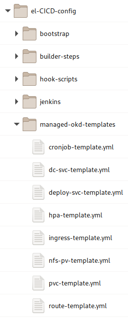
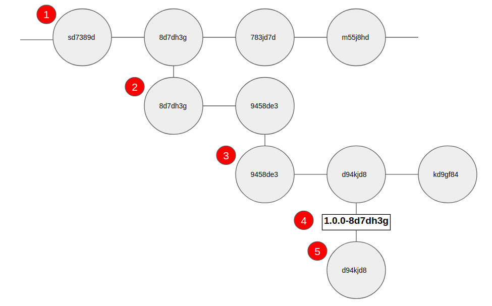
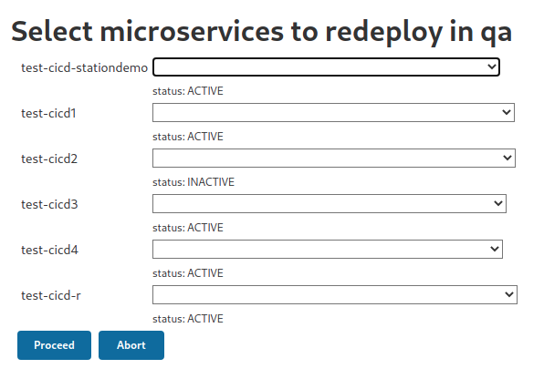

# el-CICD Developer Guide

**The purpose of this document is to aid developers new to el-CICD in how to adapt their Git repositories to build and deploy with el-CICD.**  

## Preamble

This document is part of the el-CICD Project, a CICD system for the OKD Container Platform

Copyright (C) 2021 Evan "Hippy" Slatis  
email: el.cicd.Project -at* gmail -dot* com

===================================

**NOTE: Red Hat® OpenShift® Platform is a trademark of Red Hat, Inc., and supported and owned by Red Hat, Inc.**

**el-CICD IS NEITHER SUPPORTED OR AFFILIATED IN ANY WAY WITH RED HAT, INC., OR ANY OF ITS PROJECTS.**

===================================

## License

el-CICD is free software; you can redistribute it and/or modify it under the terms of the GNU Lesser General Public License as published by the Free Software Foundation; either version 2.1 of the License, or (at your option) any later version.

This library is distributed in the hope that it will be useful, but **WITHOUT ANY WARRANTY; without even the implied warranty of MERCHANTABILITY or FITNESS FOR A PARTICULAR PURPOSE**.  See the GNU Lesser General Public License for more details.

You should have received a copy of the GNU Lesser General Public License along with this library; if not, write to

```text
    The Free Software Foundation, Inc.
    51 Franklin Street
    Fifth Floor
    Boston, MA
        02110-1301
```

This document is licensed under the Creative Commons Attribution 4.0 International License. To view a copy of this license, visit

http://creativecommons.org/licenses/by/4.0/

or send a letter to

```text
  Creative Commons
  PO Box 1866
  Mountain View, CA
      94042, USA
```

# Table of Contents
* [el-CICD Developer Guide](#el-cicd-developer-guide)
  * [Preamble](#preamble)
  * [License](#license)
* [Table of Contents](#table-of-contents)
* [Overview](#overview)
  * [Basic Steps](#basic-steps)
  * [Assumptions](#assumptions)
* [Project](#project)
  * [One Git Repository Per Microservice or Component](#one-git-repository-per-microservice-or-component)
    * [A Quick Note About Builds](#a-quick-note-about-builds)
  * [Uniform Development Branch Name](#uniform-development-branch-name)
* [Dockerfile](#dockerfile)
* [.openshift Directory](#openshift-directory)
  * [A Note on Build Secrets](#a-note-on-build-secrets)
  * [template-defs](#template-defs)
    * [appName](#appname)
    * [templateName](#templatename)
    * [file](#file)
    * [patchFile](#patchfile)
    * [params](#params)
    * [Environmental Overrides](#environmental-overrides)
  * [Patching OKD Templates](#patching-okd-templates)
    * [Managed OKD Templates](#managed-okd-templates)
    * [Default Template Parameters](#default-template-parameters)
    * [How to Know What the Template Parameters Are](#how-to-know-what-the-template-parameters-are)
    * [Custom OKD Templates](#custom-okd-templates)
  * [kustomize.patch](#kustomizepatch)
    * [Patches Are Applied **BEFORE** OKD Templates are Processed](#patches-are-applied-before-okd-templates-are-processed)
    * [Kustomize](#kustomize)
      * [Adding content](#adding-content)
      * [Notes On kustomize Paths](#notes-on-kustomize-paths)
    * [EXAMPLE: Adding Environment Variables to a DeploymentConfig OKD Template](#example-adding-environment-variables-to-a-deploymentconfig-okd-template)
    * [EXAMPLE: Adding a Custom Parameter to a DeploymentConfig OKD Template](#example-adding-a-custom-parameter-to-a-deploymentconfig-okd-template)
    * [EXAMPLE: Adding a volume and volumeMount to a CronJob OKD Template](#example-adding-a-volume-and-volumemount-to-a-cronjob-okd-template)
  * [Environment Directories](#environment-directories)
    * [OKD Templates in Environment Directories](#okd-templates-in-environment-directories)
    * [Sealed Secrets](#sealed-secrets)
  * [Further Examples](#further-examples)
* [Repository and Runtime Integration Strategy](#repository-and-runtime-integration-strategy)
  * [Development Branch](#development-branch)
  * [Synchronizing the Image and SCM Repositories](#synchronizing-the-image-and-scm-repositories)
    * [Deployment Branch](#deployment-branch)
      * [**WARNING: DO NOT MODIFY UPSTREAM ENVIRONMENT CONFIGURATIONS OR THE IMAGE SOURCE CODE**](#warning-do-not-modify-upstream-environment-configurations-or-the-image-source-code)
    * [Release Candidate Tags](#release-candidate-tags)
    * [Release Deployment Branches](#release-deployment-branches)
  * [Images](#images)
    * [Image Naming Conventions](#image-naming-conventions)
    * [Image Tagging Conventions](#image-tagging-conventions)
      * [Dev Image Tag](#dev-image-tag)
      * [Non-prod Environments](#non-prod-environments)
      * [Release Candidates](#release-candidates)
      * [Prod Image Tag](#prod-image-tag)
  * [Deployment Metadata Resources](#deployment-metadata-resources)
    * [Deployment Resource Labeling](#deployment-resource-labeling)
    * [Microservice Runtime Meta-Info](#microservice-runtime-meta-info)
    * [Project Meta-Info](#project-meta-info)
* [Non-prod Automation Server Pipelines](#non-prod-automation-server-pipelines)
  * [build-to-dev Pipelines](#build-to-dev-pipelines)
  * [build-and-deploy-microservices Pipeline](#build-and-deploy-microservices-pipeline)
  * [build-library Pipelines](#build-library-pipelines)
  * [microservice-promotion-removal Pipeline](#microservice-promotion-removal-pipeline)
  * [microservice-redeploy-removal Pipeline](#microservice-redeploy-removal-pipeline)
  * [create-release-candidate Pipeline](#create-release-candidate-pipeline)
  * [redeploy-release-candidate Pipeline](#redeploy-release-candidate-pipeline)

# Overview

This developer guide will help explain what is needed to adopt a software project to build and deploy to OKD or Openshift with el-CICD.  For the remainder of the document wherever OKD is referenced, OpenShift may be safely inferred.

This document is **not** meant to be a comprehensive tutorial, but rather a basic reference for software developers whose projects are to be built and deployed by el-CICD.  _**For a deeper explanation of el-CICD as a whole and its functionality, read the full manual in the README file in this repository.**  There are also number of test projects in this repository that can be used as a basic, functional reference.

## Basic Steps

A short overview of the steps developers need to undertake is as follows:

* Decompose each application's microservices/components into individual Git repositories
  * One Git repository per Docker image built
* Add a Dockerfile to the root of each microservice repository
* Add an `.openshift` directory to the root of each Git repository
* Create and define a `template-defs` file in the `.openshift` directory
  * This will reference all OKD templates and parameters they use per SDLC environment
* Create one or more kustomize *.patch files to customize the OKD template(s) for each microservice's deployment
* Convert all secrets into Sealed Secrets to commit into each Environment Directory in the `.openshift` directory
  * Static OKD resources are also added to the Environment Directories

The rest of this document will explain these steps and the `.openshift` directory and its contents in more detail.

## Assumptions

This document assumes that the reader has working knowledge of JSON, YAML, Kubernetes, OKD and/or OpenShift, OKD Templates, Git, and is a software developer.

# Project

A _Project_ in el-CICD is a collection of one or more Git repositories to be built into Docker images and deployed into OKD.  Projects are released as a whole; thus, if even one image is different when the Project is deployed to production, the collection of images deployed to production are considered a separate, new release.

## One Git Repository Per Microservice or Component

el-CICD only builds one Docker image per Git repository.  This means each microservice or component of a software project meant to run in its own pod must be broken out into its own Git repository.  The terms microservice and component are considered interchangeable in this context.

The name of your microservice in el-CICD will be generated from its Git repository name, replacing special characters with dashes and converting all alphabetic characters to lowercase; .e.g. `Foo_Bar_1` becomes `foo-bar-1`.

**NOTE**: el-CICD only manages the building and deployment of images into OKD.  It does not manage or build the Git repositories whose builds result in artifacts that aren't images.  These must be managed outside el-CICD.

### A Quick Note About Builds

Each microservice is defined by its Git repository and a _Code Base_.  The Code Base defines how the project is built.  To find what Code Base your Git repository is assigned, look in the `el-CICD-config` repository your organization is using to configure el-CICD, and inside the `project-defs` folder you will find a YAML or JSON file with the name of you project.  Open this file, find your Git repository listing, and check the value of `codeBase` there.

Under the `builder-steps` directory in `el-CICD-config`, you'll find a directory with name matching your Code Base, and the *.groovy files in there will define how your microservice is built, tested, scanned, and assembled.  After these steps complete, el-CICD will attempt to build an image for your microservice.  See the [Dockerfile](#dockerfile) section for more information.


**Figure**  
_The_ `builder-steps` _directory showing the specific Groovy files implementing each step for the_ `python` _Code Base._

## Uniform Development Branch Name

Each Project in el-CICD must have a uniform Development Branch name defined, representing the code for each microservice that will be used to build the next release of the Project.  For purposes of standardization, organizations typically define this, but it is not required that every Project have the same Development Branch.  In practice, this means that if the Development Branch name for a Project is "development", each Git repository that belongs to the Project must have a branch named "development".  Webhooks are automatically generated for each Git repository of a Project that will trigger a build in el-CICD on every commit to a microservice's Development Branch.

# Dockerfile

Since all builds in el-CICD are expected to result in an image, each Git repository of a Project must have a Dockerfile in its root directory.  If a Dockerfile is not found in the root directory of the microservice, the build will result in an error.

# .openshift Directory

Every microservice in a Project must have a `.openshift` directory in it's root directory.  This directory holds all files defining how the microservice's image will be deployed in OKD per Software Development Lifecycle (SDLC) environment.


**Figure**  
_Example of the_ `.openshift` _directory illustrating the structure and its contents._

As your microservice is promoted from one SDLC environment to the next, new _Deployment Branches_ are created for each environment based on the commit to the Development Branch that triggered the build.  **The contents of this directory are the only files that should be modified and committed on the Deployment Branches.  This is how deployments of particular builds are modified and versioned within a particular SDLC environment _without_ having to build and promote a new image.**

## A Note on Build Secrets

Build secrets, such as those contained in a `settings.xml` for Maven or `pip.conf` for Python, will be defined by the organization and injected during the build steps automatically.  The organization will communicate further information on how to reference them during Docker builds if this is necessary.  For most developers the use of build secrets should not be a concern.

## template-defs

The `template-defs` file defines all OKD templates used by the microservice to define its deployment into an el-CICD SDLC environment, represented by an OKD namespace.  The file can define default parameter values to pass to each template during deployment, and/or override them per SDLC environment as necessary.

```yml
templates:
  - appName: my-microservice-instance
    templateName: dc-svc-template
    patchFile: kustomize.patch
    params:
      SVC_PORT: 8080
      MY_ENV_VAR: someValue
    dev:
      patchFile: dev/kustomize-dev.patch
      params:
        SVC_PORT: 8081
        MY_ENV_VAR: someDevValue
    qa:
      params:
        MY_ENV_VAR: someQaValue
  - appName: my-microservice-instance
    templateName: route-template
    params:
      SVC_PORT: 8080
    dev:
      params:
        SVC_PORT: 8081

```

**Figure**  
_Sample template-defs.yml file._

Every microservice will need to define a DeploymentConfig or CronJob in order to deploy their image; thus, unless a static OKD resource is used, at least one `dc-svc-template` or `cronjob-template` will be referenced in this file.  `template-defs` may also be written in YAML.

**NOTES:**

1. In the example above, a Route template is paired with a template for a DeploymentConfig and Service.  In order to match them, the Route must have the same name as the Service, as shown above.

2. All paths referenced in the `template-defs` are relative to the `.openshift` directory; e.g. the `dev/kustomize-dev.patch`

### appName

The `appName` for the DeploymentConfig, Service, Route, and CronJob templates is injected as the `.metadata.name` value.  It is an optional entry in the `template-defs`, as it will default to the name of the microservice if not explicitly set.  The two main purposes of the this key is to match Services, Routes, DeploymentConfigs, and allow for multiple, simultaneous deployments of the same image to be defined within a microservice.

### templateName

The `templateName` refers to the actual name of the OKD template.  This will either be an el-CICD [managed OKD template](#managed-okd-templates), or a [custom template](#custom-okd-templates) you include in your microservice directory.

### file

Although not shown above, list the key `file` next to the `templateName` when using a custom OKD template.  See [custom template](#custom-okd-templates) for more information.

### patchFile

The `patchFile` defines a path to a kustomize patch file to be used against the template.  Patch files are used to add environment variables, volumes, volumeMounts, readiness and liveliness checks, etc. to a DeploymentConfig or Cronjob.  Even extra, microservice template parameters can be added through patching; e.g. `MY_ENV_VAR` is not part of the `dc-svc-template`, so it would have to added as part of a patch in order to make use of the value when the microservice is deployed.

To reference the kustomize file, use a path relative to the `.openshift` directory if it's not in the root `'.openshift` directory, as the `dev/kustomize-dev.patch` value demonstrates above.

### params

The params section will define the default parameters and their values for each template to be used in every SDLC environment your microservice is deployed to.   OKD Templates oftentimes have default values defined for their parameters, or the parameters are not required, so naming parameters and values is only necessary here or in the Environmental Overrides section described below if your microservice or the template specifically need a value.

### Environmental Overrides

Sometimes SDLC environments need specific overrides for some template parameters, and these sections allow that.  One example is the microservice's logging level, which might be set to `INFO` during development and testing, but `WARNING` during staging and in production.  Another example is when an SDLC environment use different databases than the others, in which case the URL of the database for that environment needs to be explicitly defined here.

These sections are named after the SDLC environment they are meant for.  In the above figure, only two environments override the default parameters, `dev` and `qa`, and the `dev` environment also uses its own `patchFile`.  All of these sections and values within them are optional, and are only required if a specific value for that environment needs to be expressed during deployment.

Only `params` and `patchFile` may be overridden.

## Patching OKD Templates

el-CICD makes extensive use of a unique strategy of patching [OKD templates](https://docs.okd.io/latest/openshift_images/using-templates.html) using [kustomize](https://kustomize.io/).

### Managed OKD Templates

el-CICD is built on the principle that developers should work on project requirements as much as possible, and worry about the technology they're using only when necessary.  To that end, most OKD resources that developers care about are expressed as OKD templates that the developer can reference without having to manage the file directly.  This frees developers up to work on and manage the microservice and/or Project specific details they need for their specific deployments.  All of the el-CICD Managed OKD Templates are located in the `el-CICD-config/managed-okd-templates` directory.



**Figure**  
_managed-okd-templates directory in el-CICD-config repository._

To use a Managed OKD Template reference it in the `template-defs` file with the `templateName` property, found in the `.metadata.name` field of the OKD template file.  el-CICD will automatically load the Managed OKD Template during deployments, process the patchFile and parameters (in that order), and then deploy the resources in the proper SDLC environment.

```yml
templateName: dc-svc-template
```

**Figure**  
_Snippet of the_ `template-defs.yml` _referencing the_ `dc-svc-template`

```yml
apiVersion: v1
kind: Template
labels:
  template: dc-svc-template
message: Deploying using templated resources
metadata:
  name:  dc-svc-template
```

**Figure**  
_Snippet of the_ `dc-svc-template` el-CICD OKD managed template


### Default Template Parameters

By default, el-CICD will pass the following parameters to every OKD template it processes:

|  NAME | DESCRIPTION |
|  ---* | ----------* |
|  PROJECT_ID | The Project name |
|  MICROSERVICE_NAME | The microservice name |
|  APP_NAME | The appName (defaults to microservice name if not explicitly set) |
|  IMAGE_REPOSITORY | The image repository backing the SDLC environment |
|  PULL_SECRET | The pull secret for the image repository |
|  ENV | The environment being deployed to |
|  IMAGE_TAG | The image tag of the microservice image |

Any of these parameters can be safely ignored if they are not needed or used. el-CICD Managed OKD Templates will use one of more of these by default.

### How to Know What the Template Parameters Are

Copy of any of the Managed OKD Templates to a local directory which also has the `oc` CLI binary installed, and run the following command:

```bash
oc process -f managed-okd-templates/<template-file>.yml --parameters
```

This will print out a table of all the parameters of the template, a description, what they are generated by (if defined), and the default value, if any.  For example:

```bash
oc process -f managed-okd-templates/dc-svc-template.yml --parameters
```

produces the following output in your terminal:

|  NAME | DESCRIPTION | GENERATOR | VALUE |
|  ---- | ----------- | --------- | ----- |
| IMAGE_REPOSITORY | The image repository from where to fetch the image | | |
| IMAGE_PULL_POLICY | The image pull policy | | Always  |
| PULL_SECRET | The image repository pull secret | | |
| MICROSERVICE_NAME | The name for the microservice, derived by el-CICD from the name of the Git repository | | |
| APP_NAME | The name for the app.  Set this value manually through the template-defs.yml file for multiple deployments of the same image. | | |
| PROJECT_ID  | The Project ID | | |
| ENV | The name of the environment the image is being deployed to.  Used to help define unique routes. | | |
| IMAGE_TAG | Image Tag used to pull image from image repository | | |
| CPU_REQ | CPU Resource Request; see OKD docs for more info | | 100m  |
| CPU_LIMIT | Maximum CPU Resource Limit allowed; see OKD docs for more info | | 200m  |
| MEM_REQ | Memory Resource Request; see OKD docs for more info | | 50Mi  |
| MEM_LIMIT | Memory Resource Limit (Ceiling) in Mi or Gi; see OKD docs for more info | | 500Mi  |
| REPLICAS | The number of replicas for this deployment; see OKD docs for more info | | 1 |
| SVC_PORT | Service port; see OKD docs for more info | | 8080  |
| STRATEGY | Deployment strategy; see OKD docs for more info | | Rolling  |

### Custom OKD Templates

If for some reason the Managed OKD Templates aren't sufficient, el-CICD supports Custom OKD Templates, which are OKD templates kept in the Git repository of the microservice and managed by the developer rather than the user.  Name the file using `file` property in the `template-defs` next to the `templateName`; e.g. 

```yml
    templateName: my-dc-svc-template
    file: my-dc-svc-template.yml
```

**Figure**  
_Snippet of a_ `template-defs.yml` _file which references the Custom OKD Template,_ `my-dc-svc-template` _in the file_ `my-dc-svc-template.yml`.

One example where a Custom OKD Template might be used is for a ConfigMap that changes values from one environment to the next.  Without a template in this situation, a copy of the ConfigMap would need to be provided in each [Environment Directory](#environment-directories).

## kustomize.patch

The Managed OKD Templates are bare bones templates, only setting most basic values.  For many of the templates, e.g. `route-template` or `hpa-template` this is sufficient most of the time.  For the `dc-svc-template`, which defines a basic DeploymentConfig and Service pair, and the `cronjob-template`, which defines a basic CronJob, these bare bones templates are almost always insufficient.  Depending on the microservice's needs, one or more of environment variables, volumes, volumeMounts, readiness and liveliness checks, etc., might need to be defined, and that's what the kustomize.patch is for.

Note that the file name, `kustomize.patch`, is only an informal standard.  The file can use any name and extension, but it is strongly suggested that the `*.patch` extension continue to be used.  For one thing it makes the file and its purpose easily recognizable within a microservice's Git repository, and secondly it ensures that el-CICD's deployment mechanism won't try and accidentally process it as static OKD resource.  OKD attempts to apply all *.yml, *.json, and *.yml files in the [Environment Directories](#environment-directories) as static OKD resources in whatever environmental namespace the microservice is currently being deployed to.

### Patches Are Applied **BEFORE** OKD Templates are Processed

This means that all templates, managed or custom, can add, inject, and use template parameters using *.patch files.  This is a very flexible and powerful tool for extending OKD templates.

### Kustomize

el-CICD makes use of [kustomize](https://kustomize.io/) to patch OKD templates, and combined with Managed OKD templates makes a simple and powerful way to quickly and easily define deployments using minimal code.  el-CICD uses the kustomize binary directly in its build agents, so this strategy works equally well in older versions of OKD which don't have kustomize built into the `oc` CLI binary.

The following sections will give a few examples of the most common uses of kustomize *.patch files.

#### Adding content

The examples below will only address the _add_ operation of kustomize, which inserts content into a YAML or JSON file.  This always has the following boilerplate:

```yml
- op: add
  path: /path/of/where/to/append/or/replace/content
  value:
    <content>
```

**Figure**  
_Basic boilerplate code for adding content using kustomize for use in a patch file._

The `<content>` in Figure above should be proper YAML or JSON as it is expected to appear _EXACTLY_ in the document.

#### Notes On kustomize Paths

There are a few things to keep in mind about the `path` attribute of a kustomize operation.

1. References to a portion of a document in a list can only be done numerically; e.g.

  ```yml
  path: /objects/0/spec/template/spec/containers/0/env
    - name: key-1
      value: value-1
    - name: key-2
      value: value-2
  ```

   refers to the first element in the `objects` list, and the first element of the containers list.  The example path above is used to add a list of environment variables in a DeploymentConfig.

1. Appending content to a list, rather replacing it, requires a `-` at the end of the path; e.g.

   ```yml
   path: /parameters/-
      description: My 1st parameter.
      displayName: My 1st Parameter
      name: MY_PARAM_1

   path: /parameters/-
      description: My 2nd parameter.
      displayName: My 1st Parameter
      name: MY_PARAM_2
   ```

   will append a single element to a list of parameters.  If multiple elements need to be added to a list, then multiple entries must created in the *.patch file, one per element that needs to be added.

1. When not explicitly appending, kustomize will replace any content with whatever your operation defines.  In the first `env` example above, if the original template defined any content in that section it would be replaced with whatever is in your patch file.

### EXAMPLE: Adding Environment Variables to a DeploymentConfig OKD Template

```yml
- op: add
  path: /objects/0/spec/template/spec/containers/0/env
  value:
    - name: key-1
      value: value-1
    - name: username
      valueFrom:
        configMapKeyRef:
          key: username
          name: ${APP_NAME}-configmap
    - name: password
      valueFrom:
        secretKeyRef:
          key: password
          name: my-microservice-sealed-secret
```

**Figure**  
_Injecting a username and password through a container's env in a DeploymentConfig OKD template._

Note the used of the `APP_NAME` template parameter in the name of the environment definition.  Template parameters can be added anywhere in the patch, including new template parameters that can be then referenced elsewhere.

### EXAMPLE: Adding a Custom Parameter to a DeploymentConfig OKD Template

```yml
- op: add
  path: /parameters/-
  value:
    description: Some name.
    displayName: Some Name
    name: SOME_NAME
    required: true
    value: some-name
```

**Figure**  
_Adding_ `SOME_NAME` _to an OKD Template.  The value of the param would be set in the microservice's_ `template-defs` _file, or use the default, 'some-name`, which could then be injected elsewhere into the OKD template for use._

### EXAMPLE: Adding a volume and volumeMount to a CronJob OKD Template

```yml
- op: add
  path: /objects/0/spec/jobTemplate/spec/template/spec/containers/0/volumeMounts
  value:
    * mountPath: /mnt
      name: my-configmap-mount

- op: add
  path: /objects/0/spec/jobTemplate/spec/template/spec/volumes
  value:
    - configMap:
        name: ${SOME_NAME}-config-map
      name: my-configmap-mount
```

**Figure**  
_Adding a volume and volumeMount referencing a ConfigMap in a container defined in a CronJob OKD Template.  Note the use of the_ `SOME_NAME` _template parameter defined above to reference the ConfigMap._

## Environment Directories

In order to include static OKD resources, such as hardcoded (vs OKD templates) ConfigMaps or [Sealed Secrets](#sealed-secrets), they need to be placed in either a `default` directory or a directory specifically named after an SDLC environment if they are only meant to be deployed in that environment.  These directories must be located in the `.openshift` root directory, and any YAML or JSON files found in these directories will be deployed in the appropriate environment.

If file names between the `default` directory and Environment Directory conflict, the file in the Environment Directory will take precedence; e.g. if there are two `foo.yml` files, one in the `default` directory and the other in the `dev` Environment Directory, then `dev/foo.yml` in the `dev` will be processed when deploying to the `dev` SDLC environment, and all other SDLC environments will use the contents of the `default/foo.yml`.

### OKD Templates in Environment Directories

Do not place OKD templates in Environment Directories.  They will be deployed by el-CICD as OKD templates in your SDLC environments like any other OKD resource if they are found there.

### Sealed Secrets

Secrets cannot be stored in Git repositories, because they are only obfuscated as base64 values, and are not encrypted.  This has made fully automated deployments of projects into Kubernetes and OKD problematic over the years.  In order to get around this, [Sealed Secrets](https://github.com/bitnami-labs/sealed-secrets) are used as a solution to encrypt Secrets for use in el-CICD so deployments may be fully automated.

Sealed Secrets are fully dependent on the cluster the Sealed Secrets are meant to be deployed in, and also on the namespace.  This means that for every environment that in your SDLC a separate Sealed Secret must be created and placed in the appropriate Environment Directory.  Any Sealed Secrets your microservice needs will be created on the OKD bastion host and committed into your microservices Git repository in the appropriate Environment Directory.

## Further Examples

In the `el-CiCD-docs` repository, which is where this document lives, you will find a `.openshift-examples` directory with a `template-defs`, `kustomize.patch`, and other examples.  You may also copy this directory down and use it as a lightweight template from which to create the deployment configuration of your microservice.

# Repository and Runtime Integration Strategy

A microservice is comprised of two repositories, Source Code and Image, and each has artifacts that depend on the other.  The Source Code Repository is the source of truth holding both the source code that created the image from the Build and the deployment configuration defining how it will be deployed and run in the Container Orchestration Platform for each environment.  The Image Repository contains the images that were built from the source code, and it is where the Container Orchestration Platform pulls images from to run in containers in [pods](https://docs.okd.io/latest/nodes/pods/nodes-pods-using.html#nodes-pods-using-about_nodes-pods-using-ssy).  The following explains how all this is ultimately tied together by the system seamlessly so changes can be made easily, deliberately, transparently, and automatically without requiring developers to do anything they normally wouldn’t do; i.e. writing code to implement business requirements and committing the changes back to the Source Code Repository.

## Development Branch

A design decision was made early on that all SCM repositories comprising a single Project would have a Development Branch of the same name; e.g. _development_ or _hotfix_.  Regardless of team or the component worked on, all developers are expected to eventually merge their latest changes to this branch, and the CICD system to be automatically triggered to run the [Build-to-Dev](#build-to-dev) pipeline whenever code is delivered.  All [Deployment Branches](#deployment-branches) will ultimately stem from the Development Branch, of which each commit hash will represent an image that was built along with the initial deployment configuration for that image for each environment of the Project.


**Figure** _The Development Branch with four separate commits and their hash.  In general, each commit represents a distinct build and a distinct image._

## Synchronizing the Image and SCM Repositories

The images built from source reside in an Image Repository, and they are immutable.  The deployment configuration, describing how the image should be deployed across multiple environments, is also kept in the SCM, and it needs to remain mutable.  One of the most difficult design problems for the modern, cloud supporting CICD system was settling on a methodology which explicitly acknowledges this reality while providing an easy to understand, standardized, and automated system for supporting [Deployment Patching](foundations.md#deployment-patching).

For the Dev environment and Development Branch, this isn't a problem, since any image built for Dev only needs to match what’s in the Development Branch; i.e. it was reasonable to expect to build a new image every time the deployment configuration changed, because part of the Build-to-Dev pipeline is testing the deployment by deploying directly to Dev.

The harder problem is when an image is promoted to a downstream environment; e.g. QA, Stg, or Prod.  Where are the changes to the deployment for those images kept and tracked?  Changes in the Development Branch happen faster than in any downstream environment, and the further downstream the environment, the slower the changes will happen, so expecting the Development Branch to also hold the deployment for the current image deployed to QA when the Development Branch might be many commits ahead is unreasonable; i.e. expecting the source code to match the image being deployed into a downstream environment would grind development to a halt, or have the deployment configuration for a particular environment to not match the code in the repository.

The solution was to create the Deployment Branch.

### Deployment Branch

The purpose of the Deployment Branch is to support the [Deployment Patching](foundations.md#deployment-patching) process directly by creating a branch for each environment the image is deployed to.  Each Deployment Branch is where developers can push deployment configuration changes for the image built from the source included in the branch.  The changes will be applied whenever the image is redeployed to the particular environment.  The branches will be named in the following manner:

**deployment-\<environment>-\<src-commit-hash>**

* **\<environment>:** the environment the image is to be deployed to
* **\<src-commit-hash>:** the commit hash **_on the Development Branch_** the image was originally built from

For example, when an image is promoted from Dev to QA with a commit hash of 8d7dh3g on the Development Branch, its Deployment Branch will be created and named:

**deployment-qa-8d7dh3g**

Only changes that affect the deployment of the image to QA or its downstream environments will be acknowledged and used by the CICD system.


**Figure**  

1. _Development Branch of Project_
1. _**deployment-qa-8d7dh3g**_ Deployment Branch with one Deployment Patch committed to it

Deployment Branches are only created when an image is promoted into a particular environment.  Subsequent Deployment Branches are created from the HEAD of the previous Deployment Branch; e.g. referring to the figure above, for the Stg environment, you'd get a Deployment Branch at source commit hash 9458de3.

**deployment-stg-8d7dh3g**

Note that source commit hash remains constant.  This naming convention insures Deployment Branches should be easy to identify, and easy to trace any image back to it's original source commit hash on the Development Branch.

#### **WARNING: DO NOT MODIFY UPSTREAM ENVIRONMENT CONFIGURATIONS OR THE IMAGE SOURCE CODE**

Changes made to the deployment configurations for an upstream environment or the source code of the microservice on a Deployment Branch will be ignored by the current Deployment Branch.  The purpose of a Deployment Branch _is to track and version the changes of the deployment configurations for an image built from the Development Branch_.  The code that's included, and any upstream deployment configurations should only be looked at as a historical record of the Project _from the time the branch was created_.  Changing any of this in a downstream Deployment Branch makes it harder to see what is in the actual image, and how it was previously deployed before being promoted.

Changing the source or upstream deployment configurations will at a minimum cause confusion, and at worst make it harder to work on hotfixes if necessary.  Because of Git's distributed nature and design, locking certain files from being modified is not possible.  Deployment Branches are a work-around to the modern development problem of keeping the proverbial source of truth in two places at once, the SCM and the Image Repository.

Note that merging changes back into the Development Branch to pick up changes are permissible and encouraged whenever it makes sense.

### Release Candidate Tags

[Deploying a complete application to production](foundations.md#deploy-to-production) is different and more complex than deploying the individual components or microservices of an application to a non-production environment.  Tagging for a Release Candidate or branching for the Release Version must happen for all images and source repositories of all microservices defined to be in the Release Version.  el-CICD does not define what a valid version should be labeled as, only that it must conform to a naming conventions acceptable to both the Source and Image Repository, in this case Git and an Image Repository which complies with the Docker’s naming conventions for images.  A Release Candidate Tag has the following format:

**\<version>-\<src-commit-hash>**

* **\<version>:** the label of the application to be released; e.g. 1.0.0 using [Semantic Versioning](https://semver.org/) notation
* **\<src-commit-hash>:** the commit hash on the **Development Branch** where the image was built

Each Project will have a Pre-prod environment, and that environment will define what can be promoted to Prod.  Once chosen, **_each image and the latest source commit hash on its associated Pre-prod Deployment Branch_** will be tagged.  A check will be performed to ensure the Release Candidate Tag is unique within every repository of the Project and hasn’t been used before.  The tagging operation will fail if it has.

For example, assume that a  few changes have been made on the Pre-prod Deployment Branch

**deployment-stg-8d7dh3g**

mentioned earlier as part of the testing and tuning process, and that the Project team is now satisfied this might be good enough to promote to production with any other microservices in the application as version 1.0.0.  When the Release Candidate Tag is applied by the system, _it will be applied on the latest commit hash on the **deployment-stg-8d7dh3g** branch_ as:

**1.0.0-8d7dh3g**

The image deployed in Stg will similarly be tagged as 1.0.0-8d7dh3g in its Image Repository.  The application is now available for promotion to production.


**Figure**

1. _Development Branch of Project_
1. _**deployment-qa-8d7dh3g** Deployment Branch with one Deployment Patch_
1. _**deployment-stg-8d7dh3g** Deployment Branch with one Deployment Patch_
1. _Release Candidate Tag **1.0.0-8d7dh3g** at the HEAD of the Stg Deployment Branch_

### Release Deployment Branches

[Deployment Patching](#deployment-patching) must be supported in production, too.  As production is possibly tuned over time due to unforeseen circumstances, a Deployment Branch is created for each microservice that was tagged in the Release Candidate process to accommodate those changes.  Each branch is made **at the same commit hash** where the Release Candidate was tagged, and conforms to the following naming convention:

**v\<version tag>-\<src-commit-hash>**

* **v:** every release to production is prepended with a ‘v’ to delineate it from a Release Candidate
* **\<version tag>:** the Release Candidate Tag
* **\<src-commit-hash>:** the commit hash on the **Development Branch** where the image was built; e.g.

**1.0.0-8d7dh3g** becomes **v1.0.0-8d7dh3g**

Any changes to the deployment configuration of any release deployed in production should go here.  As a reminder:

**DO NOT CHANGE UPSTREAM DEPLOYMENT CONFIGURATION OR SOURCE CODE.**

Any other changes on the Release Deployment Branches, as with all Deployment Branches, are ignored, and will make creating a proper hotfix branch more difficult.  When applying changes to one or more Release Deployment Branches, simply redeploy the release into production, and the system is smart enough to figure out which microservices have changed and only redeploy those unless otherwise requested.



**Figure**

1. _Development Branch of Project_
1. _**deployment-qa-8d7dh3g** Deployment Branch with one Deployment Patch_
1. _**deployment-stg-8d7dh3g** Deployment Branch with one Deployment Patch_
1. _Release Candidate Tag **1.0.0-8d7dh3g** at the HEAD of the Stg Deployment Branch_
1. _Release Version Deployment Branch **v1.0.0-8d7dh3g** created when a Release Candidate is deployed to Prod._

Note that even though subsequent changes have been committed to the **deployment-stg-8d7dh3g** Deployment Branch after being tagged as a Release Candidate, the Release Deployment Branch is created at the commit where the tag was created.

## Images

### Image Naming Conventions

Images are named with the following convention:

**\<Project ID>-\<microservice name>**
* **\<Project ID>:** the Project ID of the application
* **\<microservice name>:** name of the microservice as derived from the Git repository name to conform to OKD resource naming conventions

The Project ID comes from the name of the [Project Definition File](foundations.md#project-definition-file) defined in the [Project Definition Repository](foundations.md#project-definition-repository), and serves as an ID for the group of microservices that make up a Project.  The _microservice name_ comes from the Git repository name of the source code the microservice came from, modified to conform to OKD resource naming conventions.  In particular, underscores are converted to dashes, and all letters are lowercased; e.g.

* **Git Repository Name:**  Test_CICD1_
* **Microservice Name:**  test-cicd1

### Image Tagging Conventions

#### Dev Image Tag

Images built to Dev are always tagged as **_dev_**, and there will be only a single version of an image built from source to Dev.  This is because versioning is expected to take place in the Source Code Repository, and Dev images are expected to reflect the latest delivered code in the Development Branch at all times.  For rollback/forward considerations of Dev images, you can either reset HEAD to an earlier or later commit and rebuild, or build manually from a commit hash in the [Build-to-Dev](#build-to-dev-pipeline) pipeline.

#### Non-prod Environments

Subsequent Non-prod environments are given two tags.  The version currently deployed in the environment is simply tagged as the environment name; e.g. QA is tagged as **_qa_**, and Stg is tagged as **_stg_**.  The image is also given a separate tag in the following format:

**\<environment>-\<src-commit-hash>**

* **\<environment>:** the lowercase environment name, such as qa for QA, or stg for Stg
* **\<src-commit-hash>:** the commit hash on the Development Branch where the image was built

#### Release Candidates

Release Candidates are tagged in their Image Repository by their version; e.g. 1.0.0.  Each image is labeled with the source commit hash, and the source commit hash can be found in the Git, too, from the Deployment Branch name.

#### Prod Image Tag

Production images are tagged by prefixing their Release Candidate Tag with a **v**:

**v\<version>**

* **v:** every release to production is prepended with a ‘v’ to delineate it from a Release Version
* **\<version>:** the Release Candidate version

So, *1.0.0* becomes **_v1.0.0_**.  Each image is labeled with the source commit hash, and the source commit hash can be found in the Git, too, from the Deployment Branch name.

## Deployment Metadata Resources

Since many deployment resources are created and destroyed in OKD for each deployment of a microservice, el-CICD maintains a lightweight set of metadata for microservice and application to facilitate deployment resource management.

### Deployment Resource Labeling

Each deployment resource defined by the microservice in it’s Source Code Repository will have the following labels automatically attached to it on each deployment regardless of environment:

* **Project**: The Project ID from the Project Definition Repository
* **microservice**: The microservice name, derived from the Git repository name to conform to OKD resource naming standards
* **git-repo**: The name of the Git repository where the source code resides; the hostname is not included for security purposes
* **src-commit-hash**: The source commit hash the deployed image was built from on the Development Branch
* **deployment-branch**: The Deployment Branch from which the deployment resource for the currently deployed image was defined
* **deployment-commit-hash**: The deployment commit hash on the Deployment Branch that was holds the source to the current deployment resource definitions
* **release-version**: The Release Version Tag, if in production; the value will be _undefined_ in any other environment outside of Prod
* **build-number**: Jenkins build number for the latest deployment

### Microservice Runtime Meta-Info

Each deployment of a microservice will automatically have created and deployed an OKD ConfigMap that contains data and labels that mirror the microservice meta-information defined in the previous section, and it will be named using the following format:

**\<Project ID>-\<microservice name>-meta-info**

* **\<Project ID>:** the Project ID of the application, per OKD resource naming rules
* **\<microservice name>:** name of the microservice as derived from the Git repository name to conform to OKD resource naming conventions

### Project Meta-Info

Each deployment into production will have an additional OKD ConfigMap automatically created and deployed that contains data and labels reflecting the Project ID and the Release Version currently deployed.  It will be named using the following format:

**\<Project ID>-meta-info**

* **\<Project ID>:** the Project ID of the application

This resource will only exist in Prod.

# Non-prod Automation Server Pipelines

The following pipelines exist on the Non-prod Automation Server.  All except the [Build-to-Dev](#build-and-deploy-microservices) pipeline(s) are shared among all Projects owned by the RBAC group controlling the server.  Only the Build-to-Dev pipelines are designed to be remotely triggered.  All other pipelines are designed such that human intervention is necessary for them to complete.


**Figure**
_Non-prod Automation Server pipelines for RBAC Group_ `devops` _and Project_ `test-cicd`

## build-to-dev Pipelines

There is one Build-to-Dev pipeline per microservice defined in the [Project Definition File](operating-manual.md#project-definition-file).  The pipelines are responsible for the [Build](foundations.md#the-build), creating and pushing to the microservice's image to the [Artifact Repository](foundations.md#artifact-repository), and deploying the newly built image into the Dev environment.  This pipeline is typically triggered by a webhook whenever the Development Branch of the microservice has a new commit.

| Parameters             | Description                                                                    |
| ---------------------- | ------------------------------------------------------------------------------ |
| GIT_BRANCH             | The Git branch to check out                                                    |
| RECREATE               | If true, clear all resources belonging to this microservice before redeploying |
| DEPLOY_TO_NAMESPACE    | The namespace to deploy the image to                                           |

* Download the latest microservice code from the Project's Development Branch
  * Any branch or tag may be built
* Build, test, scan, and assemble microservice in the Jenkins agent
  * These are the separate [Builder Steps](operating-manual.md#builder-steps), configured per microservice
* Build and push an image of the microservice to the Dev Image Repository
  * Tag the image with the Dev environment name, all lower case
  * e.g. `sample-microservice-name:dev`, assuming the Dev environment is named `DEV`
* Patch and process the Dev environment OKD templates
* Deploy the microservice
  * DEPLOY_TO_NAMESPACE is restricted to the Dev namespace or a Sandbox


**Figure**
_Build with Parameters screen for the Build and Deploy Microservices pipeline_

## build-and-deploy-microservices Pipeline

The Build and Deploy Microservices pipeline is for building and deploying multiple microservices at once.

| Build Parameters          | Description                                                             |
| ------------------------- | ----------------------------------------------------------------------- |
| PROJECT_ID                | The Project ID                                                          |


The user will:

* Choose to deploy to the Dev environment or a particular Sandbox environment
* Choose which branch to build; it will be the same for each microservice
* Choose the microservices to build
* Select whether the chosen microservices will be recreated
  * Recreation means all resources for each chosen microservice will be removed from the environment before deploying

The pipeline will:

* Build the selected microservices of the Project
  * This pipeline will trigger each Build to Dev pipeline
  * Pipeline builds are executed in parallel using Jenkins' parallel build capability.


**Figure**
_Build with Parameters screen for the Build and Deploy Microservices pipeline_


**Figure**
_Choose what microservices build and where to deploy to_

`buildAll` will build all the microservices in the Project.  `recreateAll` will remove all previously deployed microservices from the enviroment before deploying anything, and this functionality can be used without building any microservices as a means of cleaning the Dev or Sandox environments.

## build-library Pipelines

Builds libraries

## microservice-promotion-removal Pipeline

The Promotion/Removal pipeline will promote one or more microservices of a Project from one environment to the next and/or remove microservices from the environment to be promoted to.

| Build Parameters          | Description                                                             |
| ------------------------- | ----------------------------------------------------------------------- |
| PROJECT_ID                | The Project ID                                                          |

The user will:

* Choose the environment to promote from -> to
* Choose a default action (do nothing, promote, or remove) for all microservices
* Choose an action for each specific microservice, if different than the default action

The pipeline will:

* Verify each image to be promoted is currently deployed in the previous environment
* If the previous environment is a test environment, confirm a Deployment Branch for the previous environment exists
* Create a new Deployment Branch from the previous Deployment Branch for the current environment if one does not exist
* Copy the image from the previous environment's Image Repository to the current environment's Image Repository
  * Tag the image with the current environment name, all lower case; e.g. `qa`
    * This marks the image as the currently or most recently (if later removed) deployed to that environment
  * Tag the image with current environment name and source commit hash; e.g. `qa-skd76dg`
    * Every image should be able to be tracked back to the source it was built with
* Remove all microservices selected for removal from the "to" environment
* Deploy the microservices selected for promotion


**Figure**
_Build with Parameters screen for the Promotion/Removal pipeline_


**Figure**
_Select microservices to promote or remove_

## microservice-redeploy-removal Pipeline

The Redeploy/Removal pipeline will redeploy an image already promoted into a test environment.  This pipeline is for rolling microservices back/forward, or to apply a [Deployment Patch](foundations.md#deployment-patching) in the selected environment.

| Build Parameters          | Description                                                             |
| ------------------------- | ----------------------------------------------------------------------- |
| PROJECT_ID                | The Project ID                                                          |

The user will:

* Choose the environment to be operated on
* Select
  * Which version of each microservice to redeploy
  * Which microservices to remove

The pipeline will:

* Verify the image still exists in the environment's Image Repository
* Confirm a Deployment Branch exists for the image
* Tag the image with the current environment name, all lower case, marking it as the current image deployed in the environment
* Remove all microservices selected for removal from environment
* Deploy the microservices selected for promotion


**Figure**
_Build with Parameters screen for the Redeploy/Removal pipeline_


**Figure**
_Select environment to redeploy to_



**Figure**
_Select microservices to redeploy or remove_

## create-release-candidate Pipeline

The Create [Release Candidate](foundations.md#release-candidate) pipeline's will define a collection of images from those having last been deployed in the [Pre-prod](foundations.md#pre-prod) environment as a candidate for a release to production.

| Build Parameters          | Description                                                             |
| ------------------------- | ----------------------------------------------------------------------- |
| PROJECT_ID                | The Project ID                                                          |
| RELEASE_CANDIDATE_TAG     | The Release Candidate Tag                                               |

The user will:

* Select the microservices they want to include in this release
* Verify images in the Pre-prod Image Repository with the Release Candidate Tag do not already exist
* Verify Git tags for each microservice with the Release Candidate Tag do not already exist

The pipeline will:

* Tag each microservice image currently tagged for the Pre-prod environment with the Release Candidate Tag
* Tag the Pre-Prod Deployment Branch at the HEAD of the Pre-prod Deployment Branch with the Release Candidate Tag


**Figure**
_Build with Parameters screen for the Redeploy/Removal pipeline_


**Figure**
_Select microservices to tag that are part of the Release Candidate_

## redeploy-release-candidate Pipeline

The Redeploy Release Candidate pipeline is for resetting the Pre-prod environment and redeploying a complete release candidate.  This is run either for to retest a particular Release Candidate, or in preparation for creating a hotfix release.

* Verify both images and a Git tag exist that match the Release Candidate Tag
* Ask the user to confirm the deployment of the Release Candidate, and removal of all microservices not part of the Release Candidate

If the user approves the deployment, the pipeline will continue and:

* Tag all images of the Release Candidate with the Pre-prod environment name, all lower case, marking it as the current image deployed in the environment
* Remove all currently deployed microservices in Pre-prod
* Deploy all microservices of the Release Candidate into Pre-prod, using the latest commit from the Deployment Branch for the Pre-prod environment  
  * Upon successful completion, the release is ready for promotion and deployment to Prod


**Figure**
_Build with Parameters screen for the Redeploy Release Candidate pipeline_


**Figure**
_Confirm redeploying the Release Candidate into Pre-prod_
