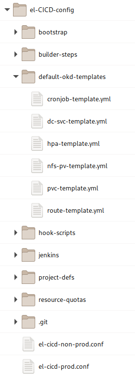

# el-CICD Developer Quick Start

The purpose of this document is to aid developers new to el-CICD in how to adapt their Git repositories to build and deploy with el-CICD.  This document is **not** meant to be a comprehensive tutorial, but rather a basic reference for software developers whose Projects are to be built and deployed by el-CICD.  _**For a deeper explanation of el-CICD as a whole and its functionality, read the full manual in the README file in this repository.**_

This document assumes that the reader has working knowledge of JSON, YAML, Kubernetes, OKD and/or OpenShift, OKD Templates, Git, and is a software developer.  For the remainder of the document wherever OKD is referenced, OpenShift may be safely inferred.

## Preamble

This document is part of the el-CICD Project, a CICD system for the OKD Container Platform

Copyright (C) 2021 Evan "Hippy" Slatis  
email: el.cicd.Project -at- gmail -dot- com

===================================

**NOTE: Red Hat® OpenShift® Platform is a trademark of Red Hat, Inc., and supported and owned by Red Hat, Inc.**

**el-CICD IS NEITHER SUPPORTED OR AFFILIATED IN ANY WAY WITH RED HAT, INC., OR ANY OF ITS PROJECTS.**

===================================

## License

el-CICD is free software; you can redistribute it and/or modify it under the terms of the GNU Lesser General Public License as published by the Free Software Foundation; either version 2.1 of the License, or (at your option) any later version.

This library is distributed in the hope that it will be useful, but **WITHOUT ANY WARRANTY; without even the implied warranty of MERCHANTABILITY or FITNESS FOR A PARTICULAR PURPOSE**.  See the GNU Lesser General Public License for more details.

You should have received a copy of the GNU Lesser General Public License along with this library; if not, write to

```text
    The Free Software Foundation, Inc.
    51 Franklin Street
    Fifth Floor
    Boston, MA
        02110-1301
```

This document is licensed under the Creative Commons Attribution 4.0 International License. To view a copy of this license, visit

http://creativecommons.org/licenses/by/4.0/

or send a letter to

```text
  Creative Commons
  PO Box 1866
  Mountain View, CA
      94042, USA
```

# Table of Contents

* [el-CICD Developer Quick Start](#el-cicd-developer-quick-start)
  * [Preamble](#preamble)
  * [License](#license)
* [Table of Contents](#table-of-contents)
* [Project](#project)
  * [One Git Repository Per Microservice or Component](#one-git-repository-per-microservice-or-component)
    * [A Quick Note About Builds](#a-quick-note-about-builds)
  * [Uniform Development Branch Name](#uniform-development-branch-name)
* [.openshift Directory](#openshift-directory)
  * [A Note on Build Secrets](#a-note-on-build-secrets)
  * [Dockerfile](#dockerfile)
  * [template-defs](#template-defs)
      * [appName](#appname)
      * [templateName](#templatename)
      * [templateFileName](#templatefilename)
      * [patchFile](#patchfile)
      * [params](#params)
      * [Environmental Overrides](#environmental-overrides)
    * [Managed OKD Templates](#managed-okd-templates)
    * [How to Know What the Template Parameters Are](#how-to-know-what-the-template-parameters-are)
    * [Custom OKD Templates](#custom-okd-templates)
  * [kustomize.patch](#kustomizepatch)
    * [Patches Are Applied BEFORE OKD Templates are Processed](#patches-are-applied-before-okd-templates-are-processed)
    * [Kustomize](#kustomize)
      * [Adding content](#adding-content)
      * [Notes On kustomize Paths](#notes-on-kustomize-paths)
    * [EXAMPLE: Adding Environment Variables to a DeploymentConfig OKD Template](#example-adding-environment-variables-to-a-deploymentconfig-okd-template)
    * [EXAMPLE: Adding a Custom Parameter to a DeploymentConfig OKD Template](#example-adding-a-custom-parameter-to-a-deploymentconfig-okd-template)
    * [EXAMPLE: Adding a volume and volumeMount to a CronJob OKD Template](#example-adding-a-volume-and-volumemount-to-a-cronjob-okd-template)
  * [Environment Directories](#environment-directories)
    * [SOKD Templates in Environment Directories](#sokd-templates-in-environment-directories)
    * [Sealed Secrets](#sealed-secrets)
  * [Further Examples](#further-examples)

# Project

A _Project_ in el-CICD is a collection of one or more Git repositories to be built and deployed as images in OKD.  Projects are released as a whole; thus, if even one image is different when the Project is deployed to production, the collection of images deployed to production are considered a separate, new release.

## One Git Repository Per Microservice or Component

Each microservice or component of a software Project must be broken out into a single Git repository.  Only one image will be built and pushed per Git repository.  The terms microservice and component are considered interchangeable in this context.

The name of your microservice in el-CICD will be generated from its Git repository name, replacing special characters with dashes and converting all alphabetic characters to lowercase; .e.g. `Foo_Bar_1` becomes `foo-bar-1`.

**NOTE**: el-CICD only manages the building and deployment of images into OKD.  It does not manage the Git repositories or artifacts of shared, library components.  If a Project as Git repositories These must be managed outside el-CICD.

### A Quick Note About Builds

Each microservice is defined by its Git repository and a _Code Base_.  The Code Base defines how the project is built.  To find what Code Base your Git repository is assigned, look the `el-CICD-config` repository your organization is using to configure el-CICD, and inside the `project-defs` folder you will find a YAML file with the name of you project.  Open this file, find your Git repository listing, and check the value of `codeBase` there.

Under the `builder-steps` directory in `el-CICD-config`, you'll find a directory with name matching your Code Base, the *.groovy files in there will define how your microservice is built, tested, scanned, and assembled.  After those steps complete, el-CICD will attempt to build an image for your microservice.  See the [Dockerfile](#dockerfile) section for more information.

## Uniform Development Branch Name

Each Project in el-CICD must have a uniform development branch name defined, representing the code for each microservice that will be used to build the next release of the Project.  For purposes of standardization, organizations typically define this, but it is not required that every Project have the same development branch.  In practice, this means that each Git repository that belongs to the Project must have a branch named after the development branch.  Webhooks are automatically generated for each Git repository that will trigger a build for the affected component in el-CICD on every commit to a microservice's development branch.

# .openshift Directory

Every component in a Project must have a `.openshift` directory in it's root directory.  This directory holds all files defining how the microservice's image will be deployed in OKD per Software Development Lifecycle (SDLC) environment.


**Figure 1**  
_Microservice Git repository directory illustrating the .openshift directory and contents._

The contents of the `.openshift` directory will be described in more detail below.

As your microservice is promoted from one SDLC environment to the next, new _Deployment Branches_ are created for each environment.  **The contents of this directory are the only files that should be modified on the Deployment Branches, which in turn allow you to modify the deployments of each environment each image build _without_ having to promote a new image or modify the code base in the development branch.**

## A Note on Build Secrets

Build secrets, such as those contained in a `settings.xml` for Maven or `pip.conf` for Python will be defined by the organization and injected during the build steps automatically.  The organization will communicate further information on how to reference them during Docker builds if this is necessary.

## Dockerfile

Each Git repository must have a Dockerfile, and place it in the root directory of the Git repository of the microservice.  If a Dockerfile is not found in the root directory of the microservice, the build will result in an error.  All builds in el-CICD must result in the creation of an image to push to the organization's designated image repository.

## template-defs

The `template-defs` file defines all OKD templates used by the microservice to define its deployment into an el-CICD SDLC environment, represented by an OKD namespace.  The file can define default parameter values to pass to each template during deployment, and/or override them per SDLC environment as necessary.

```json
{
	"templates": [
		{
			"appName": "microservice-a-instance",
			"templateName": "dc-svc-template",
			"patchFile": "kustomize.patch",
			"params": {
				"SVC_PORT": 8080,
				"MY_ENV_VAR": "someValue"
			},
			"dev": {
				"patchFile": "dev/kustomize-dev.patch",
				"params": {
					"SVC_PORT": 8081,
					"MY_ENV_VAR": "someDevValue"
				}
			},
			"qa": {
				"params": {
					"MY_ENV_VAR": "someQaValue"
				}
			}
		},
		{
			"appName": "microservice-a-instance-1",
			"templateName": "route-template",
			"params": {
				"SVC_PORT": 8080
			},
			"dev": {
				"params": {
					"SVC_PORT": 8081
				}
			}
		}
	]
}
```

**Figure 2**  
_Sample template-defs.json file._

At a minimum, either a `dc-svc-template` or `cronjob-template` will be used in this file to define an OKD DeploymentConfig or Cronjob, respectively.  `template-defs` may also be written in YAML.

#### appName

The `appName` on any template is injected as the `.metadata.name` value of the template by default.  It is optional for all templates, as it will default to the name of the microservice if not explicitly set.  This key is most often used when the same image is deployed multiple times in the same environment.

#### templateName

The `templateName` refers to the actual name of the OKD template.  This will either be an el-CICD [managed OKD template](#managed-okd-templates), or a [custom template](#custom-okd-templates) you include in your microservice directory.

#### templateFileName

Although not shown above, list the key `file` next to the `templateName` when using a custom OKD template.  See [custom template](#custom-okd-templates) for more information.

#### patchFile

The `patchFile` defines a path to a kustomize patch file to be used against the template.  Patch files are used to add environment variables, volumes, volumeMounts, readiness and liveliness checks, etc. to a DeploymentConfig or Cronjob.  Even extra, microservice template parameters can be added through patching; e.g. `MY_ENV_VAR` is not part of the `dc-svc-template`, so it would have to added as part of a patch in order to make use of the value when the microservice is deployed.

To reference the kustomize file, use a path relative to the `.openshift` directory if it's not in the root `'.openshift` directory.

#### params

The params section will define the default parameters and their values for each template to be used in every SDLC environment your microservice is deployed to.

#### Environmental Overrides

Sometimes SDLC environments need specific overrides for some template parameters, and these sections allow that.  One example is the microservice's logging level, which might be set to `INFO` during development and testing, but `WARNING` during staging and in production.

These sections are named after environment.  In the above figure, only two environments override the default parameters, `dev` and `qa`, and the `dev` environment also uses its own `patchFile`.  All of these sections are optional, and are only required if a specific value for that environment needs to be expressed during deployment.

Only `params` and `patchFile` may be overridden.

### Managed OKD Templates

el-CICD tries to make defining deployment configurations in OKD as simple and easy as possible.  To that end, most OKD resources that developers care about are expressed as OKD templates that the developer can reference without having to manage the file directly.  All of the el-CICD OKD Managed Templates are located in the `el-CICD-config/managed-okd-templates` directory.



**Figure 3**  
_managed-okd-templates directory in el-CICD-config repository._

To use a Managed OKD Template merely reference it through the `template-defs` json as referenced above.  As the above example show, you can reference as many as you need to use.

```yaml
apiVersion: v1
kind: Template
labels:
  template: dc-svc-template
message: Deploying using templated resources
metadata:
  name:  dc-svc-template
```

**Figure 4**  
_Snippet of the_ `dc-svc-template`.

To use a Managed OKD Template merely reference it in the `template-defs` file of your microservice as the example above demonstrates.  el-CICD will find and use the default template based on the name, obviating the need for the developer to manage the file directly.

### How to Know What the Template Parameters Are

Copy of any of the Managed OKD Templates to a local directory which also has the `oc` CLI binary installed, and run the following command:

```
oc process -f managed-okd-templates/<template-file>.yml --parameters
```

This will print out a table of all the parameters of the template and what they are.  For example:

```
oc process -f managed-okd-templates/dc-svc-template.yml --parameters
```

produces the following output in your terminal:

NAME|DESCRIPTION|GENERATOR|VALUE
|---|---|---|---|
|IMAGE_REPOSITORY|The image repository from where to fetch the image|||
|IMAGE_PULL_POLICY|The image pull policy||Always|
|PULL_SECRET|The image repository pull secret|||
|MICROSERVICE_NAME|The name for the microservice, derived by el-CICD from the name of the Git repository|||
|APP_NAME|The name for the app.  Set this value manually through the template-defs.json file for multiple deployments of the same image.|||
|PROJECT_ID |The Project ID|||
|ENV|The name of the environment the image is being deployed to.  Used to help define unique routes.|||
|IMAGE_TAG|Image Tag used to pull image from image repository|||
|CPU_REQ|CPU Resource Request; see OKD docs for more info||100m|
|CPU_LIMIT|Maximum CPU Resource Limit allowed; see OKD docs for more info||200m|
|MEM_REQ|Memory Resource Request; see OKD docs for more info||50Mi|
|MEM_LIMIT|Memory Resource Limit (Ceiling) in Mi or Gi; see OKD docs for more info||500Mi|
|REPLICAS|The number of replicas for this deployment; see OKD docs for more info|||                                                                              1
|SVC_PORT|Service port; see OKD docs for more info||8080|
|STRATEGY|Deployment strategy; see OKD docs for more info||Rolling|

### Custom OKD Templates

If for some reason the Managed OKD Templates aren't sufficient, el-CICD supports Custom OKD Templates, which are merely OKD templates kept in the Git repository of the microservice and managed by the developer rather than the user.  Merely name the file using `file` key in the `template-defs` file next to the `templateName` in the file; e.g. 

```yaml
        ...
        "appName": "microservice-a-instance",
        "templateName": "my-dc-svc-template",
        "file": "my-dc-svc-template.yaml",
        "patchFile": "kustomize.patch",
        ...
```

**Figure 5**  
_Snippet of a_ `template-defs` _file which references the Custom OKD Template,_ `my-dc-svc-template` _in the file_ `my-dc-svc-template.yaml` _located in the root of the microservice_ `.openshift` _directory._

The most common example where a Custom OKD Template might be used is for a ConfigMap that changes values from one environment to the next.  Without a template in this situation, a copy of the ConfigMap would need to be provided in each [Environment Directory](#environment-directories)

## kustomize.patch

The Managed OKD Templates are bare bones templates, only setting most basic values.  For many of the templates, e.g. `route-template` or `hpa-template` this is sufficient most of the time.  For the `dc-svc-template`, which defines a basic DeploymentConfig, and the `cronjob-template`, which defines a basic CronJob, these template are insufficient.  Environment variables, volumes, volumeMounts, readiness and liveliness checks, etc., all need to be defined, and that's what the kustomize.patch is for.

Note that the name of the file in el-CICD uses `kustomize.patch` as only an informal standard.  The file can use any name and extension, but it is strongly suggested that the `*.patch` extension continue to be used.  For one thing it makes the file and its purpose easily recognizable within your Git repository, and secondly it ensures that el-CICD's deployment mechanism won't try and process it as static OKD resource (OKD attempts to process all *.yml, *.json, and *.yaml files in the [Environment Directories](#environment-directories) as static OKD resources).

### Patches Are Applied BEFORE OKD Templates are Processed

This means that all templates, managed or custom, can add, inject, and use template parameters.  This is a very flexible and powerful tool for extending OKD templates.

### Kustomize

el-CICD makes use of [kustomize](https://kustomize.io/) to patch OKD templates, and combined with OKD templates makes a simple and powerful way to quickly and easily define deployments.  el-CICD uses the kustomize binary directly in its build agents, so this strategy works equally well in older versions of OKD which don't have kustomize built into the `oc` CLI binary.

The following sections will give a few examples of the most common uses of the kustomize.patch file.

#### Adding content

The examples below will only address the _add_ operation of kustomize, which inserts content into a YAML or JSON file.  This always has the following boilerplate:

```yaml
- op: add
  path: /path/of/where/to/append/content
  value:
    <content>
```

**Figure 6**  
_Basic boilerplate code for adding content using kustomize for use in a patch file._

The `<content>` in **Figure 6** above should be proper YAML or JSON would appear _EXACTLY_ in the document.

#### Notes On kustomize Paths

There are a few things to keep in mind about the `path` attribute of a kustomize operation.

1. References to a portion of a document in a list can only be done numerically; e.g. 
   ```yaml
   path: /objects/0/spec/template/spec/containers/0/env
   ```
   refers to the first element in the `objects` list, and the first elements of the containers list.  This path is used to add a list of environment variables in a DeploymentConfig.
1. Appending content to a list, rather replacing it, requires a `-` at the end of the path; e.g.
   ```yaml
   path: /parameters/-
   ```
   will append a single element to a list of parameters.  If multiple elements need to be added to a list, then multiple entries must created in the *.patch file.
1. When not appending, kustomize will replace any content with whatever your operation defines.  In the first `env` example above, if the original template defined any content in that section it would be replaced with whatever is in your patch file.

### EXAMPLE: Adding Environment Variables to a DeploymentConfig OKD Template

```yaml
- op: add
  path: /objects/0/spec/template/spec/containers/0/env
  value:
    - name: username
      valueFrom:
        configMapKeyRef:
          key: username
          name: ${APP_NAME}-configmap
    - name: password
      valueFrom:
        secretKeyRef:
          key: password
          name: my-microservice-sealed-secret
```

**Figure 7**  
_Injecting a username and password through a container's env in a DeploymentConfig OKD template._

Note the used of the `APP_NAME` template parameter in the name of the environment definition.  Template parameters can be added anywhere in the patch, including new template parameters that can be then referenced elsewhere.

### EXAMPLE: Adding a Custom Parameter to a DeploymentConfig OKD Template

```yaml
- op: add
  path: /parameters/-
  value:
    description: example param
    displayName: Example Param
    name: EXAMPLE_VAR
    required: true
    value: some value
```

**Figure 8**  
_Adding Example Param to an OKD Template.  The value of the param would be set in the microservice's_ `template-defs` _file._

### EXAMPLE: Adding a volume and volumeMount to a CronJob OKD Template

```yaml
- op: add
  path: /objects/0/spec/jobTemplate/spec/template/spec/containers/0/volumeMounts
  value:
    - mountPath: /mnt
      name: my-configmap-mount

- op: add
  path: /objects/0/spec/jobTemplate/spec/template/spec/volumes
  value:
    - configMap:
        name: ${APP_NAME}-config-map
      name: my-configmap-mount
```

**Figure 9**  
_Adding a volume and volumeMount referencing a ConfigMap in a container defined in a DeploymentConfig OKD Template._

## Environment Directories

In order to include static OKD resources, such as hardcoded (vs OKD templates) ConfigMaps or [Sealed Secrets](#sealed-secrets), they need to be placed in either a `default` directory or a directory specifically named after an SDLC environment if they are only meant to be deployed in that environment.  Any YAML or JSON files found in these directories will be deployed in the appropriate environment.

If file names between the `default` directory and Environment Directory conflict, the file in the Environment Directory will take precedence; e.g. if there are two `foo.yml` files, one in the `default` directory and the other in the `dev` Environment Directory, then the `foo.yml` in the `'dev` directory will be the only `foo.yml` file processed when deploying to `dev`, and all other environments will use the contents of the `default/foo.yml`. 

### SOKD Templates in Environment Directories

Do not place OKD templates in Environment Directories.  They will be deployed by el-CICD as OKD templates in your SDLC environments like any other OKD resource if they are found there.

### Sealed Secrets

Secrets cannot be stored in Git repositories, because they are only obfuscated as base64 values, and are not encrypted.  This has made fully automated deployments of projects into Kubernetes and OKD problematic over the years.  In order to get around this, [Sealed Secrets](https://github.com/bitnami-labs/sealed-secrets) are used as a solution to encrypt Secrets for use in el-CICD so deployments may be fully automated.

Sealed Secrets are fully dependent on the cluster the Sealed Secrets are meant to be deployed in, and also on the namespace.  This means that for every environment that in your SDLC a separate Sealed Secret must be created and placed in the appropriate Environment Directory.

## Further Examples

In the `el-CiCD-docs` repository, which is where this document lives, you will find a `.openshift-examples` directory with many other examples kustomize snippets among other things.
