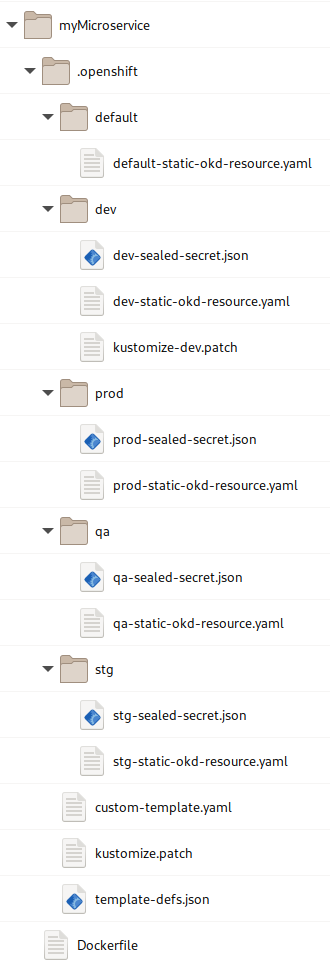
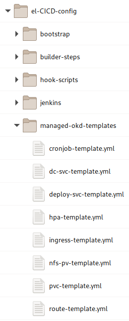

# el-CICD Developer Guide

**The purpose of this document is to aid developers new to el-CICD in how to adapt their Git repositories to build and deploy with el-CICD.**

## Preamble

This document is part of the el-CICD Project, a CICD system for the OKD Container Platform

Copyright (C) 2021 Evan "Hippy" Slatis  
email: el.cicd.Project -at* gmail -dot* com

===================================

**NOTE: Red Hat® OpenShift® Platform is a trademark of Red Hat, Inc., and supported and owned by Red Hat, Inc.**

**el-CICD IS NEITHER SUPPORTED OR AFFILIATED IN ANY WAY WITH RED HAT, INC., OR ANY OF ITS PROJECTS.**

===================================

## License

el-CICD is free software; you can redistribute it and/or modify it under the terms of the GNU Lesser General Public License as published by the Free Software Foundation; either version 2.1 of the License, or (at your option) any later version.

This library is distributed in the hope that it will be useful, but **WITHOUT ANY WARRANTY; without even the implied warranty of MERCHANTABILITY or FITNESS FOR A PARTICULAR PURPOSE**.  See the GNU Lesser General Public License for more details.

You should have received a copy of the GNU Lesser General Public License along with this library; if not, write to

```text
    The Free Software Foundation, Inc.
    51 Franklin Street
    Fifth Floor
    Boston, MA
        02110-1301
```

This document is licensed under the Creative Commons Attribution 4.0 International License. To view a copy of this license, visit

http://creativecommons.org/licenses/by/4.0/

or send a letter to

```text
  Creative Commons
  PO Box 1866
  Mountain View, CA
      94042, USA
```

# Table of Contents
* [el-CICD Developer Guide](#el-cicd-developer-guide)
  * [Preamble](#preamble)
  * [License](#license)
* [Table of Contents](#table-of-contents)
* [Overview](#overview)
* [Project](#project)
  * [One Git Repository Per Microservice or Component](#one-git-repository-per-microservice-or-component)
    * [A Quick Note About Builds](#a-quick-note-about-builds)
  * [Uniform Development Branch Name](#uniform-development-branch-name)
* [Dockerfile](#dockerfile)
* [.openshift Directory](#openshift-directory)
  * [A Note on Build Secrets](#a-note-on-build-secrets)
  * [template-defs](#template-defs)
    * [appName](#appname)
    * [templateName](#templatename)
    * [file](#file)
    * [patchFile](#patchfile)
    * [params](#params)
    * [Environmental Overrides](#environmental-overrides)
  * [Patching OKD Templates](#patching-okd-templates)
    * [Managed OKD Templates](#managed-okd-templates)
    * [Default Template Parameters](#default-template-parameters)
    * [How to Know What the Template Parameters Are](#how-to-know-what-the-template-parameters-are)
    * [Custom OKD Templates](#custom-okd-templates)
  * [kustomize.patch](#kustomizepatch)
    * [Patches Are Applied **BEFORE** OKD Templates are Processed](#patches-are-applied-before-okd-templates-are-processed)
    * [Kustomize](#kustomize)
      * [Adding content](#adding-content)
      * [Notes On kustomize Paths](#notes-on-kustomize-paths)
    * [EXAMPLE: Adding Environment Variables to a DeploymentConfig OKD Template](#example-adding-environment-variables-to-a-deploymentconfig-okd-template)
    * [EXAMPLE: Adding a Custom Parameter to a DeploymentConfig OKD Template](#example-adding-a-custom-parameter-to-a-deploymentconfig-okd-template)
    * [EXAMPLE: Adding a volume and volumeMount to a CronJob OKD Template](#example-adding-a-volume-and-volumemount-to-a-cronjob-okd-template)
  * [Environment Directories](#environment-directories)
    * [OKD Templates in Environment Directories](#okd-templates-in-environment-directories)
    * [Sealed Secrets](#sealed-secrets)
  * [Further Examples](#further-examples)

# Overview

This developer guide will help explain what is needed to adopt a software project to build and deploy to OKD with el-CICD. This document is **not** meant to be a comprehensive tutorial, but rather a basic reference for software developers whose projects are to be built and deployed by el-CICD.  _**For a deeper explanation of el-CICD as a whole and its functionality, read the full manual in the README file in this repository.**  There are also number of test projects in this repository that can be used as a basic, functional reference.

_A short overview of the steps developers need to undertake is as follows:

* Decompose each application's microservices/components into individual Git repositories
  * One Git repository per Docker image built
* Add a Dockerfile to the root of each microservice repository
* Add an `.openshift` directory to the root of each Git repository
* Create and define a `template-defs` file in the `.openshift` directory
  * This will reference all OKD templates and parameters they use per SDLC environment
* Create one or more kustomize *.patch files to customize the OKD template(s) for each microservice's deployment
* Convert all secrets into Sealed Secrets to commit into each Environment Directory in the `.openshift` directory
  * Static OKD resources are also added to the Environment Directories

The rest of this document will explain these steps and the `.openshift` directory and its contents in more detail.  This document assumes that the reader has working knowledge of JSON, YAML, Kubernetes, OKD and/or OpenShift, OKD Templates, Git, and is a software developer.  For the remainder of the document wherever OKD is referenced, OpenShift may be safely inferred.

# Project

A _Project_ in el-CICD is a collection of one or more Git repositories to be built into Docker images and deployed into OKD.  Projects are released as a whole; thus, if even one image is different when the Project is deployed to production, the collection of images deployed to production are considered a separate, new release.

## One Git Repository Per Microservice or Component

el-CICD only builds one Docker image per Git repository.  This means each microservice or component of a software project meant to run in its own pod must be broken out into its own Git repository.  The terms microservice and component are considered interchangeable in this context.

The name of your microservice in el-CICD will be generated from its Git repository name, replacing special characters with dashes and converting all alphabetic characters to lowercase; .e.g. `Foo_Bar_1` becomes `foo-bar-1`.

**NOTE**: el-CICD only manages the building and deployment of images into OKD.  It does not manage or build the Git repositories whose builds result in artifacts that aren't images.  These must be managed outside el-CICD.

### A Quick Note About Builds

Each microservice is defined by its Git repository and a _Code Base_.  The Code Base defines how the project is built.  To find what Code Base your Git repository is assigned, look in the `el-CICD-config` repository your organization is using to configure el-CICD, and inside the `project-defs` folder you will find a YAML or JSON file with the name of you project.  Open this file, find your Git repository listing, and check the value of `codeBase` there.

Under the `builder-steps` directory in `el-CICD-config`, you'll find a directory with name matching your Code Base, and the *.groovy files in there will define how your microservice is built, tested, scanned, and assembled.  After these steps complete, el-CICD will attempt to build an image for your microservice.  See the [Dockerfile](#dockerfile) section for more information.


**Figure 1**  
_The_ `builder-steps` _directory showing the specific Groovy files implementing each step for the_ `python` _Code Base._

## Uniform Development Branch Name

Each Project in el-CICD must have a uniform Development Branch name defined, representing the code for each microservice that will be used to build the next release of the Project.  For purposes of standardization, organizations typically define this, but it is not required that every Project have the same Development Branch.  In practice, this means that if the Development Branch name for a Project is "development", each Git repository that belongs to the Project must have a branch named "development".  Webhooks are automatically generated for each Git repository of a Project that will trigger a build in el-CICD on every commit to a microservice's Development Branch.

# Dockerfile

Since all builds in el-CICD are expected to result in an image, each Git repository of a Project must have a Dockerfile in its root directory.  If a Dockerfile is not found in the root directory of the microservice, the build will result in an error.

# .openshift Directory

Every microservice in a Project must have a `.openshift` directory in it's root directory.  This directory holds all files defining how the microservice's image will be deployed in OKD per Software Development Lifecycle (SDLC) environment.



**Figure 2**  
_Example of the_ `.openshift` _directory illustrating the structure and its contents._

As your microservice is promoted from one SDLC environment to the next, new _Deployment Branches_ are created for each environment based on the commit to the Development Branch that triggered the build.  **The contents of this directory are the only files that should be modified and committed on the Deployment Branches.  This is how deployments of particular builds are modified and versioned within a particular SDLC environment _without_ having to build and promote a new image.**

## A Note on Build Secrets

Build secrets, such as those contained in a `settings.xml` for Maven or `pip.conf` for Python, will be defined by the organization and injected during the build steps automatically.  The organization will communicate further information on how to reference them during Docker builds if this is necessary.  For most developers the use of build secrets should not be a concern.

## template-defs

The `template-defs` file defines all OKD templates used by the microservice to define its deployment into an el-CICD SDLC environment, represented by an OKD namespace.  The file can define default parameter values to pass to each template during deployment, and/or override them per SDLC environment as necessary.

```json
{
  "templates": [
    {
      "appName": "my-microservice-instance",
      "templateName": "dc-svc-template",
      "patchFile": "kustomize.patch",
      "params": {
        "SVC_PORT": 8080,
        "MY_ENV_VAR": "someValue"
      },
      "dev": {
        "patchFile": "dev/kustomize-dev.patch",
        "params": {
          "SVC_PORT": 8081,
          "MY_ENV_VAR": "someDevValue"
        }
      },
      "qa": {
        "params": {
          "MY_ENV_VAR": "someQaValue"
        }
      }
    },
    {
      "appName": "my-microservice-instance",
      "templateName": "route-template",
      "params": {
        "SVC_PORT": 8080
      },
      "dev": {
        "params": {
          "SVC_PORT": 8081
        }
      }
    }
  ]
}
```

**Figure 3**  
_Sample template-defs.json file._

Every microservice will need to define a DeploymentConfig or CronJob in order to deploy their image; thus, unless a static OKD resource is used, at least one `dc-svc-template` or `cronjob-template` will be referenced in this file.  `template-defs` may also be written in YAML.

**NOTES:**

1. In the example above, a Route template is paired with a template for a DeploymentConfig and Service.  In order to match them, the Route must have the same name as the Service, as shown above.

2. All paths referenced in the `template-defs` are relative to the `.openshift` directory; e.g. the `dev/kustomize-dev.patch`

### appName

The `appName` for the DeploymentConfig, Service, Route, and CronJob templates is injected as the `.metadata.name` value.  It is an optional entry in the `template-defs`, as it will default to the name of the microservice if not explicitly set.  The two main purposes of the this key is to match Services, Routes, DeploymentConfigs, and allow for multiple, simultaneous deployments of the same image to be defined within a microservice.

### templateName

The `templateName` refers to the actual name of the OKD template.  This will either be an el-CICD [managed OKD template](#managed-okd-templates), or a [custom template](#custom-okd-templates) you include in your microservice directory.

### file

Although not shown above, list the key `file` next to the `templateName` when using a custom OKD template.  See [custom template](#custom-okd-templates) for more information.

### patchFile

The `patchFile` defines a path to a kustomize patch file to be used against the template.  Patch files are used to add environment variables, volumes, volumeMounts, readiness and liveliness checks, etc. to a DeploymentConfig or Cronjob.  Even extra, microservice template parameters can be added through patching; e.g. `MY_ENV_VAR` is not part of the `dc-svc-template`, so it would have to added as part of a patch in order to make use of the value when the microservice is deployed.

To reference the kustomize file, use a path relative to the `.openshift` directory if it's not in the root `'.openshift` directory, as the `dev/kustomize-dev.patch` value demonstrates above.

### params

The params section will define the default parameters and their values for each template to be used in every SDLC environment your microservice is deployed to.   OKD Templates oftentimes have default values defined for their parameters, or the parameters are not required, so naming parameters and values is only necessary here or in the Environmental Overrides section described below if your microservice or the template specifically need a value.

### Environmental Overrides

Sometimes SDLC environments need specific overrides for some template parameters, and these sections allow that.  One example is the microservice's logging level, which might be set to `INFO` during development and testing, but `WARNING` during staging and in production.  Another example is when an SDLC environment use different databases than the others, in which case the URL of the database for that environment needs to be explicitly defined here.

These sections are named after the SDLC environment they are meant for.  In the above figure, only two environments override the default parameters, `dev` and `qa`, and the `dev` environment also uses its own `patchFile`.  All of these sections and values within them are optional, and are only required if a specific value for that environment needs to be expressed during deployment.

Only `params` and `patchFile` may be overridden.

## Patching OKD Templates

el-CICD makes extensive use of a unique strategy of patching [OKD templates](https://docs.okd.io/latest/openshift_images/using-templates.html) using [kustomize](https://kustomize.io/).

### Managed OKD Templates

el-CICD is built on the principle that developers should work on project requirements as much as possible, and worry about the technology they're using only when necessary.  To that end, most OKD resources that developers care about are expressed as OKD templates that the developer can reference without having to manage the file directly.  This frees developers up to work on and manage the microservice and/or Project specific details they need for their specific deployments.  All of the el-CICD Managed OKD Templates are located in the `el-CICD-config/managed-okd-templates` directory.



**Figure 4**  
_managed-okd-templates directory in el-CICD-config repository._

To use a Managed OKD Template reference it in the `template-defs` file with the `templateName` property, found in the `.metadata.name` field of the OKD template file.  el-CICD will automatically load the Managed OKD Template during deployments, process the patchFile and parameters (in that order), and then deploy the resources in the proper SDLC environment.

```yaml
"templateName": "dc-svc-template"
______________________

apiVersion: v1
kind: Template
labels:
  template: dc-svc-template
message: Deploying using templated resources
metadata:
  name:  dc-svc-template
```

**Figure 5**  
_Snippet of the_ `dc-svc-template`.


### Default Template Parameters

By default, el-CICD will pass the following parameters to every OKD template it processes:

|  NAME | DESCRIPTION |
|  ---* | ----------* |
|  PROJECT_ID | The Project name |
|  MICROSERVICE_NAME | The microservice name |
|  APP_NAME | The appName (defaults to microservice name if not explicitly set) |
|  IMAGE_REPOSITORY | The image repository backing the SDLC environment |
|  PULL_SECRET | The pull secret for the image repository |
|  ENV | The environment being deployed to |
|  IMAGE_TAG | The image tag of the microservice image |

Any of these parameters can be safely ignored if they are not needed or used.

### How to Know What the Template Parameters Are

Copy of any of the Managed OKD Templates to a local directory which also has the `oc` CLI binary installed, and run the following command:

```bash
oc process -f managed-okd-templates/<template-file>.yml --parameters
```

This will print out a table of all the parameters of the template, a description, what they are generated by (if defined), and the default value, if any.  For example:

```bash
oc process -f managed-okd-templates/dc-svc-template.yml --parameters
```

produces the following output in your terminal:

|  NAME | DESCRIPTION | GENERATOR | VALUE |
|  ---* | ----------* | --------* | ----* |
| IMAGE_REPOSITORY | The image repository from where to fetch the image | | |
| IMAGE_PULL_POLICY | The image pull policy | | Always  |
| PULL_SECRET | The image repository pull secret | | |
| MICROSERVICE_NAME | The name for the microservice, derived by el-CICD from the name of the Git repository | | |
| APP_NAME | The name for the app.  Set this value manually through the template-defs.json file for multiple deployments of the same image. | | |
| PROJECT_ID  | The Project ID | | |
| ENV | The name of the environment the image is being deployed to.  Used to help define unique routes. | | |
| IMAGE_TAG | Image Tag used to pull image from image repository | | |
| CPU_REQ | CPU Resource Request; see OKD docs for more info | | 100m  |
| CPU_LIMIT | Maximum CPU Resource Limit allowed; see OKD docs for more info | | 200m  |
| MEM_REQ | Memory Resource Request; see OKD docs for more info | | 50Mi  |
| MEM_LIMIT | Memory Resource Limit (Ceiling) in Mi or Gi; see OKD docs for more info | | 500Mi  |
| REPLICAS | The number of replicas for this deployment; see OKD docs for more info | | 1 |
| SVC_PORT | Service port; see OKD docs for more info | | 8080  |
| STRATEGY | Deployment strategy; see OKD docs for more info | | Rolling  |

### Custom OKD Templates

If for some reason the Managed OKD Templates aren't sufficient, el-CICD supports Custom OKD Templates, which are OKD templates kept in the Git repository of the microservice and managed by the developer rather than the user.  Name the file using `file` property in the `template-defs` next to the `templateName`; e.g. 

```yaml
        "templateName": "my-dc-svc-template",
        "file": "my-dc-svc-template.yaml"
```

**Figure 6**  
_Snippet of a_ `template-defs` _file which references the Custom OKD Template,_ `my-dc-svc-template` _in the file_ `my-dc-svc-template.yaml`.

One example where a Custom OKD Template might be used is for a ConfigMap that changes values from one environment to the next.  Without a template in this situation, a copy of the ConfigMap would need to be provided in each [Environment Directory](#environment-directories).

## kustomize.patch

The Managed OKD Templates are bare bones templates, only setting most basic values.  For many of the templates, e.g. `route-template` or `hpa-template` this is sufficient most of the time.  For the `dc-svc-template`, which defines a basic DeploymentConfig and Service pair, and the `cronjob-template`, which defines a basic CronJob, these bare bones templates are almost always insufficient.  Depending on the microservice's needs, one or more of environment variables, volumes, volumeMounts, readiness and liveliness checks, etc., might need to be defined, and that's what the kustomize.patch is for.

Note that the file name, `kustomize.patch`, is only an informal standard.  The file can use any name and extension, but it is strongly suggested that the `*.patch` extension continue to be used.  For one thing it makes the file and its purpose easily recognizable within a microservice's Git repository, and secondly it ensures that el-CICD's deployment mechanism won't try and accidentally process it as static OKD resource.  OKD attempts to apply all *.yml, *.json, and *.yaml files in the [Environment Directories](#environment-directories) as static OKD resources in whatever environmental namespace the microservice is currently being deployed to.

### Patches Are Applied **BEFORE** OKD Templates are Processed

This means that all templates, managed or custom, can add, inject, and use template parameters using *.patch files.  This is a very flexible and powerful tool for extending OKD templates.

### Kustomize

el-CICD makes use of [kustomize](https://kustomize.io/) to patch OKD templates, and combined with Managed OKD templates makes a simple and powerful way to quickly and easily define deployments using minimal code.  el-CICD uses the kustomize binary directly in its build agents, so this strategy works equally well in older versions of OKD which don't have kustomize built into the `oc` CLI binary.

The following sections will give a few examples of the most common uses of kustomize *.patch files.

#### Adding content

The examples below will only address the _add_ operation of kustomize, which inserts content into a YAML or JSON file.  This always has the following boilerplate:

```yaml
* op: add
  path: /path/of/where/to/append/or/replace/content
  value:
    <content>
```

**Figure 7**  
_Basic boilerplate code for adding content using kustomize for use in a patch file._

The `<content>` in Figure 7 above should be proper YAML or JSON as it is expected to appear _EXACTLY_ in the document.

#### Notes On kustomize Paths

There are a few things to keep in mind about the `path` attribute of a kustomize operation.

1. References to a portion of a document in a list can only be done numerically; e.g.

  ```yaml
  path: /objects/0/spec/template/spec/containers/0/env
    * name: key-1
      value: value-1
    * name: key-2
      value: value-2
  ```

   refers to the first element in the `objects` list, and the first element of the containers list.  The example path above is used to add a list of environment variables in a DeploymentConfig.

1. Appending content to a list, rather replacing it, requires a `-` at the end of the path; e.g.

   ```yaml
   path: /parameters/-
      description: My 1st parameter.
      displayName: My 1st Parameter
      name: MY_PARAM_1

   path: /parameters/-
      description: My 2nd parameter.
      displayName: My 1st Parameter
      name: MY_PARAM_2
   ```

   will append a single element to a list of parameters.  If multiple elements need to be added to a list, then multiple entries must created in the *.patch file, one per element that needs to be added.

1. When not explicitly appending, kustomize will replace any content with whatever your operation defines.  In the first `env` example above, if the original template defined any content in that section it would be replaced with whatever is in your patch file.

### EXAMPLE: Adding Environment Variables to a DeploymentConfig OKD Template

```yaml
* op: add
  path: /objects/0/spec/template/spec/containers/0/env
  value:
    * name: key-1
      value: value-1
    * name: username
      valueFrom:
        configMapKeyRef:
          key: username
          name: ${APP_NAME}-configmap
    * name: password
      valueFrom:
        secretKeyRef:
          key: password
          name: my-microservice-sealed-secret
```

**Figure 8**  
_Injecting a username and password through a container's env in a DeploymentConfig OKD template._

Note the used of the `APP_NAME` template parameter in the name of the environment definition.  Template parameters can be added anywhere in the patch, including new template parameters that can be then referenced elsewhere.

### EXAMPLE: Adding a Custom Parameter to a DeploymentConfig OKD Template

```yaml
* op: add
  path: /parameters/-
  value:
    description: Some name.
    displayName: Some Name
    name: SOME_NAME
    required: true
    value: some-name
```

**Figure 9**  
_Adding_ `SOME_NAME` _to an OKD Template.  The value of the param would be set in the microservice's_ `template-defs` _file, or use the default, 'some-name`, which could then be injected elsewhere into the OKD template for use._

### EXAMPLE: Adding a volume and volumeMount to a CronJob OKD Template

```yaml
* op: add
  path: /objects/0/spec/jobTemplate/spec/template/spec/containers/0/volumeMounts
  value:
    * mountPath: /mnt
      name: my-configmap-mount

* op: add
  path: /objects/0/spec/jobTemplate/spec/template/spec/volumes
  value:
    * configMap:
        name: ${SOME_NAME}-config-map
      name: my-configmap-mount
```

**Figure 10**  
_Adding a volume and volumeMount referencing a ConfigMap in a container defined in a CronJob OKD Template.  Note the use of the_ `SOME_NAME` _template parameter defined above to reference the ConfigMap._

## Environment Directories

In order to include static OKD resources, such as hardcoded (vs OKD templates) ConfigMaps or [Sealed Secrets](#sealed-secrets), they need to be placed in either a `default` directory or a directory specifically named after an SDLC environment if they are only meant to be deployed in that environment.  These directories must be located in the `.openshift` root directory, and any YAML or JSON files found in these directories will be deployed in the appropriate environment.

If file names between the `default` directory and Environment Directory conflict, the file in the Environment Directory will take precedence; e.g. if there are two `foo.yml` files, one in the `default` directory and the other in the `dev` Environment Directory, then `dev/foo.yml` in the `dev` will be processed when deploying to the `dev` SDLC environment, and all other SDLC environments will use the contents of the `default/foo.yml`.

### OKD Templates in Environment Directories

Do not place OKD templates in Environment Directories.  They will be deployed by el-CICD as OKD templates in your SDLC environments like any other OKD resource if they are found there.

### Sealed Secrets

Secrets cannot be stored in Git repositories, because they are only obfuscated as base64 values, and are not encrypted.  This has made fully automated deployments of projects into Kubernetes and OKD problematic over the years.  In order to get around this, [Sealed Secrets](https://github.com/bitnami-labs/sealed-secrets) are used as a solution to encrypt Secrets for use in el-CICD so deployments may be fully automated.

Sealed Secrets are fully dependent on the cluster the Sealed Secrets are meant to be deployed in, and also on the namespace.  This means that for every environment that in your SDLC a separate Sealed Secret must be created and placed in the appropriate Environment Directory.  Any Sealed Secrets your microservice needs will be created on the OKD bastion host and committed into your microservices Git repository in the appropriate Environment Directory.

## Further Examples

In the `el-CiCD-docs` repository, which is where this document lives, you will find a `.openshift-examples` directory with a `template-defs`, `kustomize.patch`, and other examples.  You may also copy this directory down and use it as a lightweight template from which to create the deployment configuration of your microservice.
