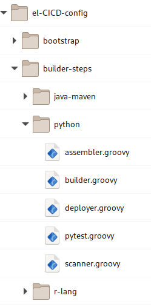
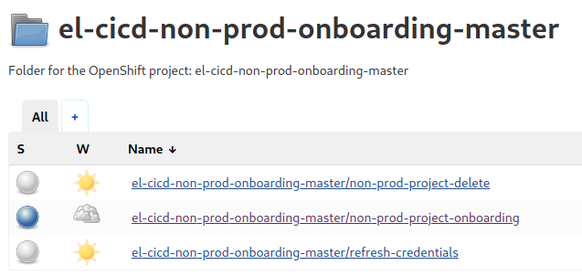

# el-CICD Operating Manual

## Preamble

This document is part of the el-CICD Project, a complete CICD system for the OKD Container Platform.

Copyright (C) 2021 Evan "Hippy" Slatis  
email: hippyod -at- yahoo -dot- com

**===================================**

**Red Hat® OpenShift® Platform is a trademark of Red Hat, Inc., and supported and owned by Red Hat, Inc.**

**el-CICD IS NEITHER SUPPORTED OR AFFILIATED IN ANY WAY WITH RED HAT, INC., OR ANY OF ITS PROJECTS.**

**===================================**

## License

el-CICD is free software; you can redistribute it and/or modify it under the terms of the GNU Lesser General Public License as published by the Free Software Foundation; either version 2.1 of the License, or (at your option) any later version.

This library is distributed in the hope that it will be useful, but **WITHOUT ANY WARRANTY; without even the implied warranty of MERCHANTABILITY or FITNESS FOR A PARTICULAR PURPOSE**.  See the GNU Lesser General Public License for more details.

You should have received a copy of the GNU Lesser General Public License along with this library; if not, write to

```text
    The Free Software Foundation, Inc.
    51 Franklin Street
    Fifth Floor
    Boston, MA
        02110-1301
```

This document is licensed under the [Creative Commons Attribution 4.0 International License](https://creativecommons.org/licenses/by/4.0/legalcode). To view a copy of this license, visit

http://creativecommons.org/licenses/by/4.0/

or send a letter to

```text
  Creative Commons
  PO Box 1866
  Mountain View, CA
      94042
```

# TABLE OF CONTENTS

* [el-CICD Operating Manual](#el-cicd-operating-manual)
  * [Preamble](#preamble)
  * [License](#license)
* [TABLE OF CONTENTS](#table-of-contents)
* [Overview](#overview)
  * [el-CICD SECURITY WARNING](#el-cicd-security-warning)
  * [Fundamentals](#fundamentals)
  * [Assumptions](#assumptions)
* [Bootstrap Directory Structure](#bootstrap-directory-structure)
  * [el-CICD Repository](#el-cicd-repository)
  * [el-CICD-config Repository](#el-cicd-config-repository)
  * [el-CICD-docs Repository](#el-cicd-docs-repository)
  * [cicd-secrets](#cicd-secrets)
    * [builder-secrets](#builder-secrets)
* [Configuration](#configuration)
  * [Gathering Credentials](#gathering-credentials)
    * [SSH Keys for el-CICD and el-CICD-config](#ssh-keys-for-el-cicd-and-el-cicd-config)
    * [GitHub Site Wide Access Token](#github-site-wide-access-token)
    * [Image Repository Pull Keys](#image-repository-pull-keys)
    * [Changing the Default Secret File Configuration](#changing-the-default-secret-file-configuration)
  * [System Configuration Files](#system-configuration-files)
    * [Root Configuration File](#root-configuration-file)
    * [Composing Configuration Files](#composing-configuration-files)
      * [Deploying to Different OKD Versions](#deploying-to-different-okd-versions)
      * [el-cicd-meta-info ConfigMap](#el-cicd-meta-info-configmap)
    * [Configuration Contents](#configuration-contents)
      * [Basic Information](#basic-information)
      * [Cluster Information](#cluster-information)
      * [Git Repository Information](#git-repository-information)
      * [Build Secrets](#build-secrets)
        * [Naming Convention Definitions](#naming-convention-definitions)
      * [SDLC Definition](#sdlc-definition)
        * [Lifecycle Definition](#lifecycle-definition)
        * [Image Repositories](#image-repositories)
    * [Jenkins Configuration](#jenkins-configuration)
      * [Jenkins and Agents Dockerfiles and Configuration Files](#jenkins-and-agents-dockerfiles-and-configuration-files)
        * [Default Jenkins Agent](#default-jenkins-agent)
        * [Skopeo and Kustomize](#skopeo-and-kustomize)
  * [Managed OKD Resources](#managed-okd-resources)
    * [ResourceQuota Definition Files](#resourcequota-definition-files)
    * [OKD Template Definition Files](#okd-template-definition-files)
  * [Project Definition File](#project-definition-file)
    * [OKD RBAC Groups](#okd-rbac-groups)
    * [Git Project information](#git-project-information)
    * [Microservices](#microservices)
    * [Libraries](#libraries)
    * [Enabled Test Environments](#enabled-test-environments)
    * [Sandbox Environments](#sandbox-environments)
    * [ResourceQuotas](#resourcequotas)
    * [NFS Shares](#nfs-shares)
  * [Code Base Framework](#code-base-framework)
    * [Code Base Name](#code-base-name)
    * [Jenkins Agents](#jenkins-agents)
      * [Jenkins Agent Dockerfiles](#jenkins-agent-dockerfiles)
      * [Manual Building of Jenkins Agents](#manual-building-of-jenkins-agents)
    * [Builder Steps](#builder-steps)
      * [Code Base Folders](#code-base-folders)
      * [Build Scripts](#build-scripts)
        * [Using Alternative Builder Steps](#using-alternative-builder-steps)
      * [Defining a Code Base](#defining-a-code-base)
* [Bootstrapping, Onboarding, and Operational Management](#bootstrapping-onboarding-and-operational-management)
  * [el-CICD Admin Utility](#el-cicd-admin-utility)
    * [Bootstrapping Onboarding Automation Servers](#bootstrapping-onboarding-automation-servers)
    * [Refreshing Credentials](#refreshing-credentials)
    * [Building Jenkins Images](#building-jenkins-images)
    * [Sealed Secrets Controller and Utility](#sealed-secrets-controller-and-utility)
      * [kubeseal Utility](#kubeseal-utility)
      * [Upgrading Sealed Secrets](#upgrading-sealed-secrets)
  * [Onboarding Automation Servers](#onboarding-automation-servers)
    * [WARNING: Onboarding Automation Server Access](#warning-onboarding-automation-server-access)
    * [Onboarding Automation Server Pipelines](#onboarding-automation-server-pipelines)
      * [non-prod-project-project-onboarding Pipeline](#non-prod-project-project-onboarding-pipeline)
      * [prod-project-project-onboarding Pipeline](#prod-project-project-onboarding-pipeline)
      * [refresh-credentials Pipeline](#refresh-credentials-pipeline)
      * [delete-project Pipeline](#delete-project-pipeline)
  * [Prod Automation Server Pipeline](#prod-automation-server-pipeline)
    * [Release Region](#release-region)
    * [Release Candidate Promotion](#release-candidate-promotion)
    * [Release Version Redeployment](#release-version-redeployment)
    * [The Hotfix Process](#the-hotfix-process)
  * [Extending el-CICD](#extending-el-cicd)
    * [Extending the el-CICD Admin Utility](#extending-the-el-cicd-admin-utility)
      * [Bootstrap Hook Scripts](#bootstrap-hook-scripts)
      * [Credential Hook Scripts](#credential-hook-scripts)
    * [Extending el-CICD Pipelines](#extending-el-cicd-pipelines)
      * [Extension Points and Scripts](#extension-points-and-scripts)
      * [Pipeline Hook Script Naming Conventions](#pipeline-hook-script-naming-conventions)
      * [Pipeline Hook Script Structure](#pipeline-hook-script-structure)

# Overview

el-CICD, pronounced like [El Cid](https://en.wikipedia.org/wiki/El_Cid), is a Configurable off the Shelf (COTS) Continuous Integration/Continuous Delivery (CICD) supporting multiple Projects of one or more microservices or components per group or team for building and deploying software onto OKD.  The system is expected to support all delivery and deployment aspects of the Software Development Lifecycle (SDLC) of projects running on OKD, from building the source and deploying into a development environment through deployment into production.

This document will cover the configuration, installation, and maintenance of el-CICD [Onboarding Automation Servers](#onboarding-automation-servers).  The target audience are operational personnel and OKD Cluster Admins that will install and maintain el-CICD, and those responsible for onboarding projects onto el-CICD.

## el-CICD SECURITY WARNING

> **el-CICD [ONBOARDING AUTOMATION SERVERS](#onboarding-automation-servers) REQUIRE BOTH CLUSTER ADMIN PRIVILEGES AND GIT SITE WIDE READ-WRITE PRIVILEGES.**
>
> **ACCESS TO el-CICD ONBOARDING AUTOMATION SERVERS SHOULD BE RESTRICTED TO CLUSTER ADMINS ONLY.**

## Fundamentals

Operational concerns with el-CICD will cover the following topics:

1. **Configuration**
1. **Installation**
1. **Onboarding**
1. **Maintenance**

## Assumptions

It is assumed the reader has a basic understanding of the SDLC, Source Control Management (SCM) solutions and Git in particular, the concepts of branching and tagging in an SCM, Docker images and containers, microservice architectures, and OKD and Kubernetes concepts.

# Bootstrap Directory Structure

el-CICD is designed as a COTS solution, meaning it was built as an incomplete piece of software that is meant to be adapted and configured by the end-user organization to their specific needs.  The el-CICD system consists of three repositories, including the documentation repository that this document resides in. 

**_Organizations should create their own `el-CICD` and `el-CICD-config` repositories in their SCM._**

Both repositories are pulled on every pipeline run.  This allows for easy and instant, organization-wide updates to functionality and configuration when needed.

  

**Figure** _bootstrap Directory Structure_

## el-CICD Repository

The el-CICD Repository is the functional heart of el-CICD, and is **NOT** meant to be modified by the end user.  It holds all bootstrap scripts, internal template files, BuildConfig definitions, and a [Jenkins shared library](https://www.jenkins.io/doc/book/pipeline/shared-libraries/) that forms the bulk of el-CICD's pipeline functionality.

The repository directory structure is as follows:

* **el-CICD**  
Holds the main el-CICD Admin Utility script, `el-cicd.sh`.
  * **resources**  
  Holds the BuildConfig definitions, and a number of script style templates used throughout the system for deploying el-CICD Automation Servers and end user microservices.
  * **scripts**  
  Holds a number of shell scripts that define functions and functionality used by el-CICD Admin Utility.
  * **vars**  
  Holds all `*.groovy` files that form the functionality of the pipelines in el-CICD as part of a [Jenkins Shared Library]([https://www.jenkins.io/doc/book/pipeline/shared-libraries/](https://www.jenkins.io/doc/book/pipeline/shared-libraries/)).

## el-CICD-config Repository

This repository holds all the files that end users will configure to install and run el-CICD.  Everything in this directory is meant to be configured by end users to meet their organizations needs.

The repository directory structure is as follows:

* **el-CICD-config**  
The root directory holds the main bootstrap configuration files defining an install of el-CICD.
  * **bootstrap**  
  Holds additional bootstrap configuration files and any user-defined bootstrap extension scripts.
  * **builder-steps**  
  Holds the [builder-steps](#builder-steps) implementations which define [the Build](foundations.md#the-build) for each [Code Base](foundations.md#code-base).
  * **hook-scripts**  
  Holds all user defined pipeline extension scripts.
  * **jenkins**  
  Holds Dockerfiles that define the el-CICD Jenkins images and Jenkins Agent images, and Jenkins configuration files for installing and/or configuration Jenkins plugins
  * **managed-okd-templates**  
  Holds definitions of Managed OKD Templates for the developers to reference.
  * **project-defs**  
  This directory represents the [Project Definition Repository](foundations.md#project-definition-repository) all [Project Definition Files](#project-definition-file).  In reality, this is meant to be an integration point for an actual project management database external to el-CICD, and a hook script that is run prior to onboarding a [Project](foundations.md#project) into el-CICD would gather the data necessary to create and commit a Project Definition File here.
  * **resource-quotas**  
  Holds the ResourceQuota definitions that can be assigned to Project namespaces.

## el-CICD-docs Repository

Holds the following documention for el-CICD:

* [Foundations](foundations.md)  
  Describes the fundamental concepts and basic architecture el-CICD was built from.
* Operating Manual
* [Developer Guide](developer-guide.md)  
  Guide for development teams on how to structure their projects for integration into el-CICD, and code for defining deployments among each environment.
* [el-CICD Tutorial](tutorial.md)  
  Tutorial for el-CICD taking users through a basic install and SDLC run.  It is strongly suggested that end users step through tutorial on a lab cluster to get a basic and much fuller understanding of how el-CICD works, both from an operational and developer viewpoint.

## cicd-secrets

End users should create another sibling folder to the el-CICD folders holding your forked repositories called `cicd-secrets`.  These will hold the [credentials you will gather](#gathering-credentials) to support el-CICD functionality.  This folder should **not** be committed to Git, since it will hold credentials that cannot be shared.  Once bootstrapping is complete, encrypt and store the directory somewhere appropiate and secure.

  

**Figure** `cicd-secrets` _and_ `builder-secrets` _Directory with Default Files_

### builder-secrets

Under the `cicd-secrets` folder user should create a `builder-secrets` folder.  Builder configuration files that contain secrets that need to be mounted in Jenkins Agents for builds; e.g. a `settings.xml` for Maven, or a `pip.conf` for Python.

# Configuration

After all the el-CICD and el-CICD-config repositories have been committed to your SCM, configuration of el-CICd for installation may begin.  This includes:

* [Gathering credentials](#gathering-credentials)
* [Defining the organization's SDLC](#sdlc-definition)
* Defining the [Code Bases](#code-base-framework)
* [Bootstrap hook scripts](#bootstrap-hook-scripts)
* Writing [Pipeline hook scripts](#pipeline-hook-scripts)

## Gathering Credentials

el-CICD requires credentials to be gathered for use in the [Automation Servers](foundation.md#automation-server), and for the pulling of images into the SDLC [namespaces](foundation.md#namespaces).  In particular, el-CICD needs

* Read only SSH keys for el-CICD and el-CICD-config
* A GitHub service account access token that has adminstrator rights within your organization.  It does not have to have full control over GitHub, but it does need complete access to all projects el-CICD is expected to build and deploy.
* Access tokens for each Image Repository el-CICD will support

el-CICD is configured by default to expect a sibling directory be created on your OKD bastion host to el-CICD and el-CICD-config called [**cicd-secrets**](#cicd-secrets).  You can configure el-CICD to look somewhere else, but it's easiest to follow convention.  All secrets required for bootstrapping (i.e. standing up an [Onboarding Automation Server](#onboarding-automation-servers)) should be put in this folder.

### SSH Keys for el-CICD and el-CICD-config

For creating the el-CICD and el-CICD SSH keys and using the default configuration, run the following commands in the `cicd-secrets` directory:

```bash
    ssh-keygen -b 2048 -t rsa -f 'el-cicd-deploy-key' -q -N '' -C 'Jenkins Deploy key for el-CICD'

    ssh-keygen -b 2048 -t rsa -f 'el-cicd-config-github-deploy-key' -q -N '' -C 'Jenkins Deploy key for el-CICD-config'
```

**The read-only keys are assumed to be shared among all installs of el-CICD**, regardless the type of install or number of clusters involved.  They are read-only keys accessing projects which are mostly comprised of either OSS code or non-critical configuration, and therefore represent a low security risk at worst.

### GitHub Site Wide Access Token

If you don't already have one, create a service account for your organization on GitHub that has organizational administrator access, and then [create an access token for it](https://docs.github.com/en/github/authenticating-to-github/creating-a-personal-access-token).  As an example, the `elcicd` GitHub user account,  which owns and manages the el-CICD repository of projects that make up el-CICD, serves this purpose.  Copy the access token to

`cicd-secrets/el-cicd-git-repo-access-token`

This token will allow el-CICD to create each microservice's Git repo's webhook for automated builds and a read-write deploy key for creating [Deployment Branches](foundations.md#deployment-branch) and Release Candidate Tags.

### Image Repository Pull Keys

Each Image Repository el-CICD uses needs a service account, and each service account should have an access token.  The default configuration for el-CICD assumes you have a Dev Image Registry, a Non-prod Image Registry which holds images deployed to Test and Pre-prod environments, and a Prod Image Registry.  They are expected to be in the following locations:

* `cicd-secrets/el-cicd-dev-pull-token`
* `cicd-secrets/el-cicd-non-prod-pull-token`
* `cicd-secrets/el-cicd-prod-pull-token`

### Changing the Default Secret File Configuration

In [System Configuration Files](#system-configuration-files) all the configuration used to bootstrap el-CICD is explained, how these files drive the [el-CICD Admin Utility](#el-cicd-administration-utility), and how to change them to meet your needs.

## System Configuration Files

All system configuration files for el-CICD end with `*.conf` by convention.  They will define the el-CICD installation during bootstrap, and the Onboarding and CICD Automation Servers during runtime.  They are simple _key=value_ files with standard shell comments and references allowed.  They will be _sourced_ like any other Linux source file.

### Root Configuration File

**_Root Configuration Files_** are defined as any configuration file directly referenced when using the [el-CICD Admin Utility](#el-cicd-admin-utility).  The el-CICD Admin Utility will look for these files in the root of the `el-CICD-config` directory, and the `el-CICD-config` directory is expected to be a sibling directory of the el-CICD directory.  Root Configuration Files are used to define a particular install, such as configuring el-CICD for installing Non-prod versus Prod Automation Servers, or for an OKD 3 versus OKD 4 install, and are expected to define values that are unique that install.


### Composing Configuration Files

el-CICD supports composing configuration files to make it easier to share values common among different installs.  Which set of configuration files define a particular install is defined in the Root Configuration File.

There are two, colon delimited lists of files that can be defined in the root configuration files:

* **`INCLUDE_BOOTSTRAP_FILES`**  
  `*.conf` files only used during installation of Onboarding Automation Servers; mostly these define values for managing Git deploy keys only defined at bootstrap, and local file paths to Git and Image Repository credentials
* **`INCLUDE_SYSTEM_FILES`**  
  `*.conf` files with values used during installation and/or during runtime by either the Onboarding or CICD Automation Servers

Both of these lists are assumed to reference files located in `el-CICD-config/bootstrap`.

If there are conflicts of key/value pairs between the files, the order of precedence is:

1. Root Configuration Files
1. `INCLUDE_SYSTEM_FILES`
1. `INCLUDE_BOOTSTRAP_FILES`

Within the lists of `INCLUDE_SYSTEM_FILES` and `INCLUDE_BOOTSTRAP_FILES`, the order of precedence is first listed; i.e. from left to right.

For example, given the the two configuration files foo-config.conf and bar-config.conf:

```ini
# foo-config.conf
SOME_KEY=foo
```

```ini
# bar-config.conf
SOME_KEY=bar
```

And given the following configuration:

```ini
# Your Root Configuration File
INCLUDE_BOOTSTRAP_FILES=foo-config.conf
INCLUDE_SYSTEM_FILES=bar-config.conf
```

-or-

```ini
# Your Root Configuration File
INCLUDE_BOOTSTRAP_FILES=foo-config.conf:bar-config.conf
```

The result in the first example is`SOME_KEY=bar`, and the second example with just `INCLUDE_BOOTSTRAP_FILES` defined will be `SOME_KEY=bar`.  In the first example `SOME_KEY` will be able to be referenced in both the bootstrap and the Automation Servers, and in the second only during bootstrapping by the el-CICD Admin Utility.

#### Deploying to Different OKD Versions

el-CICD runs equally well on OKD 3.11 or OKD 4.x, and Root Configuration Files for one install may be INCLUDE_* files for another.  This ability can be exploited when application migrations from OKD 3 to OKD 4 are going to be undertaken and both version need to be up for a period of time.  The following scenario envisions that OKD 3 is the OKD version, el-CICD is going to be used for future development, and the migration of applications from OKD 3 to OKD 4 will happen after the applications are adapted to el-CICD standards first.

Use the main Root Configuration File to define the longer lived install configuration on OKD 4.  Create a smaller Root Configuration File for the OKD 3 install that overrides only the OKD 4.x specific values (e.g. `OCP_VERSION`, `CLUSTER_WILDCARD_DOMAIN`, `OCP_IMAGE_REPO`, etc.) for OKD 3.11 values and then copy the `INCLUDE_BOOTSTRAP_FILES` and `INCLUDE_SYSTEM_FILES` values into the OKD Root Configuration File, but add the OKD 4 Root Configuration File to the beginning of the `INCLUDE_SYSTEM_FILES` list in the OKD 3 Root Configuration File.

```ini
# okd-4-root.conf; OKD 4 Root Configuration File
# OCP_VERSION and OCP_IMAGE_REPO are defined in INCLUDE_* files for OKD 4

CLUSTER_WILDCARD_DOMAIN=my.okd.3.wildcard.com

INCLUDE_BOOTSTRAP_FILES=el-cicd-default-bootstrap.conf
INCLUDE_SYSTEM_FILES=el-cicd-default-system.conf
```

```ini
# OKD 3 Root Configuration File
CLUSTER_WILDCARD_DOMAIN=my.okd.3.wildcard.com

# FOR 3.11 USE
OCP_VERSION=3

# FOR 3.11 USE
OCP_IMAGE_REPO=docker-registry.default.svc:5000/openshift

INCLUDE_BOOTSTRAP_FILES=el-cicd-default-bootstrap.conf
INCLUDE_SYSTEM_FILES=okd-4-root.conf:el-cicd-default-system.conf
```

The advantage to this migration strategy is that it allows development teams to work semi-independently adapting their projects to el-CICD standards in parallel with operations as they work on standing up and hardening the newer OKD 4 clusters.  It also allows training to be split into two smaller, more manageable initiatives: one for adapting projects to el-CICD, and a second, later training session for OKD 4 user interface and other differences from OKD 3.

#### el-cicd-meta-info ConfigMap

All Automation Server el-CICD namespaces that host will contain a ConfigMap named `el-cicd-meta-info` that holds all values defined in the Root Configuration File and `INCLUDE_SYSTEM_FILES`.  Values defined in `INCLUDE_BOOTSTRAP_FILES` will not be expressed in the ConfigMap, and are only meant to be used during bootstrap.

### Configuration Contents

This section will discuss the default breakdown of the Root Configuration Files, `INCLUDE_SYSTEM_FILES`, and `INCLUDE_BOOTSTRAP_FILES`.  Comments that are not part of the actual files are added inline in order describe the relevant key-value pairs.

In most cases it is best to leave the values if there is no need to change them.  As an example, the `ONBOARDING_MASTER_NAMESPACE` shouldn't need to be changed, unless more than one instance of a the same type of Onboarding Automation Server (Non-prod or Prod) need to be installed on the same cluster.  On the other hand, the `CLUSTER_WILDCARD_DOMAIN` must be defined to each specific cluster.

#### Basic Information

The following defines the basic information for el-CICD.

In `el-CICD-config/el-cicd-non-prod.conf`:

```ini
# The Onboarding Automation Server namespace and optional node selectors
ONBOARDING_MASTER_NAMESPACE=el-cicd-non-prod-onboarding-master
ONBOARDING_MASTER_NODE_SELECTORS=

# The CICD Automation Server namespace postfix and optional node selectors. 
# CICD namespaces will be <RBAC group>-<CICD_MASTER_NAMESPACE_POSTFIX>;
#     e.g. for RBAC 'foo' -> foo-el-cicd-non-prod-master
CICD_MASTER_NAMESPACE_POSTFIX=el-cicd-non-prod-master
CICD_MASTER_NODE_SELECTORS=
```

In `el-CICD-config/el-cicd-prod.conf`:

```ini
# The Onboarding Automation Server namespace and optional node selectors
ONBOARDING_MASTER_NAMESPACE=el-cicd-prod-onboarding-master
ONBOARDING_MASTER_NODE_SELECTORS=

# The CICD Automation Server namespace postfix and optional node selectors. 
# CICD namespaces will be <RBAC group>-<CICD_MASTER_NAMESPACE_POSTFIX>;
#     e.g. for RBAC 'foo' -> foo-el-cicd-prod-master
CICD_MASTER_NAMESPACE_POSTFIX=el-cicd-prod-master
CICD_MASTER_NODE_SELECTORS=
```

In `el-CICD-config/bootstrap/el-cicd-default-system.conf`:

```ini
# Name of the ConfigMap holding the system data defined in the el-CICD configuration files
EL_CICD_META_INFO_NAME=el-cicd-meta-info
```

In `el-CICD-config/bootstrap/el-cicd-default-bootstrap.conf`:

```ini
# Default location of all Secret files relative the el-CICD directory
SECRET_FILE_DIR=${BOOTSTRAP_DIR}/../cicd-secrets
SECRET_FILE_TEMP_DIR=${SECRET_FILE_DIR}/tmp

# Sealed secret version to install in each cluster
SEALED_SECRET_RELEASE_VERSION=v0.14.1
```

#### Cluster Information

In `el-CICD-config/el-cicd-non-prod.conf`:

```ini
# The cluster wildcard domain the server will be installed on.  Typically different for each
# Onboarding Automation Server, except in rare case where Non-prod and Prod Onboarding
# Automation Servers are installed in the same cluster.
CLUSTER_WILDCARD_DOMAIN=apps-crc.testing
```

In `el-CICD-config/el-cicd-prod.conf`:

```ini
# The cluster wildcard domain the server will be installed on.  Typically different for each
# Onboarding Automation Server, except in rare case where Non-prod and Prod Onboarding
# Automation Servers are installed in the same cluster.
CLUSTER_WILDCARD_DOMAIN=apps-crc.testing
```

In `el-CICD-config/bootstrap/el-cicd-default-system.conf`:

```ini
# Use this if installing on OKD 4.  This is the default setting.
OCP_IMAGE_REPO=image-registry.openshift-image-registry.svc:5000/openshift

# Uncomment this if installing on OKD 3.
# OCP_IMAGE_REPO=docker-registry.default.svc:5000/openshift
```

In `el-CICD-config/bootstrap/el-cicd-default-bootstrap.conf`:

```ini
# Use this if installing on OKD 4.  This is the default setting.
OCP_VERSION=4

# Uncomment this if installing on OKD 3.
# OCP_VERSION=3
```

Note that the differences between OKD 3 and 4 are minor, but there are a few places (such as the URL to the internal OKD registry, and some CLI options) where el-CICD needs to know them to function properly.

#### Git Repository Information

In `el-CICD-config/el-cicd-non-prod.conf`:

```ini
# Titles are human readable ids for GitHub deploy keys.  Each microservice's deploy key will be
# completed by the CLUSTER_WILDCARD_DOMAIN and Project ID to avoid collisions.
EL_CICD_DEPLOY_KEY_TITLE_PREFIX=el-cicd-non-prod-deploy-key
```

In `el-CICD-config/el-cicd-prod.conf`:

```ini
# Titles are human readable ids for GitHub deploy keys.  Each microservice's deploy key will be
# completed by the CLUSTER_WILDCARD_DOMAIN and Project ID to avoid collisions.
EL_CICD_DEPLOY_KEY_TITLE_PREFIX=el-cicd-prod-deploy-key
```

In `el-CICD-config/bootstrap/el-cicd-default-system.conf`:

```ini
# This values is appended to the ID for each microservice's GitHub private deploy key stored in
# Jenkins.
GIT_CREDS_POSTFIX=git-repo-private-key

# The el-CICD Git repository url, branch, and ID of the private key stored in Jenkins#
# credentials for read-only
EL_CICD_GIT_REPO=git@github.com:elcicd/el-CICD.git
EL_CICD_BRANCH_NAME=master
EL_CICD_READ_ONLY_GITHUB_PRIVATE_KEY_ID=el-cicd-read-only-git-repo-private-key

# The el-CICD-config Git repository url, branch, and ID of the private key stored in Jenkins
# credentials for read-only access
EL_CICD_CONFIG_REPOSITORY=git@github.com:elcicd/el-CICD-config.git
EL_CICD_CONFIG_REPOSITORY_BRANCH_NAME=master
EL_CICD_CONFIG_REPOSITORY_READ_ONLY_GITHUB_PRIVATE_KEY_ID=el-cicd-config-read-only-git-repo-private-key

# ID of the Git site wide, read-write access token needed by the el-CICD in order to manage
# deploy keys, webhooks, etc. for your Git server's organization
GIT_SITE_WIDE_ACCESS_TOKEN_ID=git-site-wide-access-token
```

In `el-CICD-config/bootstrap/el-cicd-default-bootstrap.conf`:

```ini
# API URL of the Git server.  Used to push SSH keys to Git during bootstrapping.
EL_CICD_GIT_API_URL=api.github.com

# The organization or user on Git where the el-CICD repository is stored.
EL_CICD_ORGANIZATION=elcicd

# The title used by GitHub to store the el-CICD read-only key, and path and name of the private key
# file for read only deploy key.  It is assumed the public key will reside next to it.
EL_CICD_SSH_READ_ONLY_PUBLIC_DEPLOY_KEY_TITLE=el-cicd-read-only-public-key
EL_CICD_SSH_READ_ONLY_DEPLOY_KEY_FILE=${SECRET_FILE_DIR}/el-cicd-deploy-key

# The title used by GitHub to store the el-CICD-config read-only key, and path and name of the private key
# file for read only deploy key.  It is assumed the public key will reside next to it.
EL_CICD_CONFIG_SSH_READ_ONLY_PUBLIC_DEPLOY_KEY_TITLE=el-cicd-config-read-only-public-key
EL_CICD_CONFIG_SSH_READ_ONLY_DEPLOY_KEY_FILE=${SECRET_FILE_DIR}/el-cicd-config-github-deploy-key

# File of the read-write access token for the GitHub service account that manages all your organization's projects with
# el-CICD is expected to manage.  This token will allow el-CICD to set deploy keys, webhooks, etc. for your projects
EL_CICD_GIT_REPO_ACCESS_TOKEN_FILE=${SECRET_FILE_DIR}/el-cicd-git-repo-access-token
```

#### Build Secrets

If any of your organizations builds make use of a settings files for builds that contain secrets (e.g.`settings.xml` for Maven builds, or a `pip.conf` for Python), then these files should be place in `cicd-secrets/build-config`.  These files will be loaded into a Secret in the CICD Automation Server namespaces, and mounted as a volume into each Jenkins Agent for use by the [Builder Steps](#builder-steps).

In `el-CICD-config/el-cicd-non-prod.conf`:

```ini
# Name of the secrets that holds all the files that were placed in the builder-secrets directory
EL_CICD_BUILD_SECRETS_NAME=el-cicd-build-secrets

# Path to directory where EL_CICD_BUILD_SECRETS_NAME should be mounted in the Jenkins Agents
BUILDER_SECRETS_DIR=/mnt
```

In `el-CICD-config/bootstrap/el-cicd-default-bootstrap.conf`:

```ini
# Name and path of the builder-secrets directory
BUILD_SECRET_FILE_DIR=${SECRET_FILE_DIR}/builder-secrets
```

##### Naming Convention Definitions

The following conventions are defined in the configuration scripts, and unless you really know what you're doing, **do not** modify them.  el-CICD uses these prefix and postfix conventions to easily find the appropriate values per environmental namespace.

In `el-CICD-config/bootstrap/el-cicd-default-system.conf`:

```ini
# Each postfix below is used to defined the Image Repository details per SDLC environment
#     e.g. For the DEV environment, the key to define the username for access is DEV_IMAGE_REPO_USERNAME
# This makes lookup of these values scriptable by environment, without having to know the environment in advance

# Username (account) that has privileged access to an Image Repository
IMAGE_REPO_USERNAME_POSTFIX=_IMAGE_REPO_USERNAME

# URL to domain of Image Repository
IMAGE_REPO_POSTFIX=_IMAGE_REPO

# Postfix for naming of the .dockercfg pull Secret that needs to be in every SDLC namespace
IMAGE_REPO_PULL_SECRET_POSTFIX=_IMAGE_REPO_PULL_SECRET

# ID of credentials stored in Jenkins for referencing in pipelines
IMAGE_REPO_ACCESS_TOKEN_ID_POSTFIX=_IMAGE_REPO_ACCESS_TOKEN_ID

# The postfix below is used to defined the node selectors per SDLC environment
NODE_SELECTORS_POSTFIX=_NODE_SELECTORS

# The prefix below is used when create a NFS Persistent Volume for easy identification by name
NFS_PV_PREFIX=nfs
```

In `el-CICD-config/bootstrap/el-cicd-default-bootstrap.conf`:

```ini
# Defines the pull token file location
PULL_TOKEN_FILE_POSTFIX=_PULL_TOKEN_FILE
```

#### SDLC Definition

Defining the organization's SDLC is conceptually the most important part of the configuration.  Whatever is defined in these files will determine how Projects are onboarded with el-CICD and into OKD.  Project Definition Files, namespaces, image tags, where images are pushed and promooted, and Git Deployment Branch names.

##### Lifecycle Definition

The following defines the supported environments and the possible environment promotion scheme used by the organization.  `DEV_ENV`, `PRE_PROD`, and `PROD` **must** be defined.  `TEST_ENVS` are list in order of promotion (e.g. QA is promoted to UAT in the example below) in a colon delimited list, and are optional.  The `HOTFIX_ENV` is an alternative build environment where emergency patches to applications already in production are built, and this environment must be specifically enabled in the [Project Definition File](#project-definition-file) to be realized.

In `el-CICD-config/bootstrap/el-cicd-default-system.conf`:

```ini
# Environment builds are initially deployed to
DEV_ENV=DEV

# Environment for building hotfixes to applications already in production before promotion to Pre-prod
HOTFIX_ENV=HOTFIX

# Optional test environments in a colon delimited list from first to last in order of promotion
TEST_ENVS=QA:UAT

# The Pre-prod is the penultimate environment the last test environment (or DEV, if none) will promote to
PRE_PROD_ENV=STG

# The production environment
PROD_ENV=PROD
```

##### Image Repositories

Each environment must be tied to an Image Repository in which images are built and deployed to (DEV) or promoted to (all the other environments), and from which each environment pulls from for deployments.  Compare the keys used below to the values defined in [Naming Convention Definitions](#naming-convention-definitions).

In `el-CICD-config/el-cicd-non-prod.conf`:

```ini
# The following demonstrates how to define the values needed by el-CICD to integrate with the Image Repository.
# Note the postfix of each value that was defined in Naming Convention Definitions above to understand what
# each value is for.  Also note the optional node selectors for DEV environment namespaces.
DEV_IMAGE_REPO_USERNAME=elcicddev
DEV_IMAGE_REPO=docker.io/elcicddev
DEV_IMAGE_REPO_PULL_SECRET=el-cicd-image-repo-dev-pull-secret
DEV_IMAGE_REPO_ACCESS_TOKEN_ID=image-repo-dev-access-token
DEV_NODE_SELECTORS=
```

**NOTE:** The above only shows the definition of values supporting the `DEV` Image Registry, but each `TEST_ENV` and the `HOTFIX_ENV` is also defined in this file.

In `el-CICD-config/el-cicd-prod.conf`:

```ini
# The values supporting the Prod Image Repository is defined here.  Also note the optional
# node selectors for PROD environment namespaces.
PROD_PULL_TOKEN_FILE=${SECRET_FILE_DIR}/el-cicd-prod-pull-token
PROD_IMAGE_REPO_USERNAME=elcicdprod
PROD_IMAGE_REPO=docker.io/elcicdprod
PROD_IMAGE_REPO_PULL_SECRET=el-cicd-image-repo-prod-pull-secret
PROD_IMAGE_REPO_ACCESS_TOKEN_ID=image-repo-prod-access-token
PROD_NODE_SELECTORS=
```

In `el-CICD-config/bootstrap/el-cicd-default-system.conf`:

```ini
# The values supporting the Pre-prod Image Repository is defined in the default system 
# configuration file, because Pre-prod is referenced from both the Non-prod and Prod CICD
# Automation Servers.  Also note the optional node selectors for STG environment namespaces.
STG_IMAGE_REPO_USERNAME=elcicdnonprod
STG_IMAGE_REPO=docker.io/elcicdnonprod
STG_IMAGE_REPO_PULL_SECRET=el-cicd-image-repo-non-prod-pull-secret
STG_IMAGE_REPO_ACCESS_TOKEN_ID=image-repo-non-prod-access-token
STG_NODE_SELECTORS=
```

In `el-CICD-config/bootstrap/el-cicd-default-bootstrap.conf`:

```ini
# This only show the DEV pull token file as an example, but a definition of a pull token file MUST be defined here.
DEV_PULL_TOKEN_FILE=${SECRET_FILE_DIR}/el-cicd-dev-pull-token
```

### Jenkins Configuration

A specific Jenkins image is created for each el-CICD install.  The bootstrapping image build framework allows a great deal of customization and configuration based
on the OKD base Jenkins image.  The default build will make sure the [Jenkins Configuration as Code](https://www.jenkins.io/projects/jcasc/) plugin is included in the image, and then loads a list of all known plugins, setting them to latest for a complete upgrade.

The `JENKINS_BUILD_AGENT_NAMES` colon delimited list below should match the file extension of the Dockerfiles that will build your Jenkins Agents; e.g. the file `Dockerfile.python` will be used to build the Python Jenkins Agent.  See the [Code Base Framework](#code-base-framework) for more information.

In `el-CICD-config/el-cicd-non-prod.conf`:

```ini
# Name of Jenkins image for Non-prod and CICD Onboarding Automation Servers
# used by el-CICD, added to the openshift namespace
JENKINS_IMAGE_STREAM=el-cicd-non-prod-jenkins

# Default names of Configuration as Code for Non-prod Jenkins and plugins, and 
#list of plugins and their versions to be included
JENKINS_CASC_FILE=non-prod-jenkins-casc.yml
JENKINS_PLUGINS_FILE=non-prod-plugins.txt

# these agent images are for builds only, so only defined for non-prod installs
JENKINS_BUILD_AGENT_NAMES=java-maven:python:r-lang

# Colon delimited list of directories with files which Jenkins Agent image builds
# might need
JENKINS_AGENTS_BUILD_DIRS=
```

In `el-CICD-config/el-cicd-prod.conf`:

```ini
# Name of Jenkins image for Prod and CICD Onboarding Automation Servers used by
# el-CICD, added to the openshift namespace
JENKINS_IMAGE_STREAM=el-cicd-prod-jenkins

# Default names of Configuration as Code for Prod Jenkins and plugins, and list
# of plugins and their versions to be included
JENKINS_CASC_FILE=prod-jenkins-casc.yml
JENKINS_PLUGINS_FILE=prod-plugins.txt
```

In `el-CICD-config/bootstrap/el-cicd-default-system.conf`:

```ini
# Path where JENKINS_CASC_FILE and JENKINS_PLUGINS_FILE will be copied and reference in
# the Jenkins images
JENKINS_CONTAINER_CONFIG_DIR=/usr/local/etc

# Directory from which to copy extra files needed during Jenkins image builds.
JENKINS_BUILD_DIRS=

# If organizations would rather handle their own Agent Image builds, set this to 'true'.
JENKINS_SKIP_AGENT_BUILDS=false

# All Jenkins Agents will be named with this prefix; e.g. el-cicd-jenkins-agent-base or
# el-cicd-jenkins-agent-java
JENKINS_AGENT_IMAGE_PREFIX=el-cicd-jenkins-agent

# Default agent Code Base name for all pipelines except Build-to-Dev pipelines
JENKINS_AGENT_DEFAULT=base

# Jenkins resource settings
JENKINS_MEMORY_LIMIT=4Gi
JENKINS_VOLUME_CAPACITY=4Gi
JENKINS_DISABLE_ADMINISTRATIVE_MONITORS=true

JENKINS_AGENT_MEMORY_REQUEST=512Mi
JENKINS_AGENT_MEMORY_LIMIT=4Gi

JENKINS_AGENT_CPU_REQUEST=100m
JENKINS_AGENT_CPU_LIMIT=2

# Makes all pipeline runs more efficient by leaving an Agent pod up and ready to run
# Set to 0 if you wish a new Agent pod for every pipeline run
JENKINS_AGENT_MEMORY_IDLE_MINUTES=30
```

#### Jenkins and Agents Dockerfiles and Configuration Files

All Jenkins configuration files should be placed in the `el-CICD-config/jenkins` directory, including Dockerfiles, yum repository definitions, and Jenkins specific configuration files.  It is expected that end users will customize the Dockerfiles to possibly add any necessary certs or change or remove the default CentOS yum repositories (defined and used by the Dockerfiles in the file `centos.repo`) used by the default el-CICD Agent image builds.

The el-CICD Jenkins image for each install is built using a template Dockerfile that will inject the proper values for the related base Jenkins image in the OKD image registry, as well as `JENKINS_PLUGINS_FILE` information and other values defined in the appropriate `*.conf` files.  Feel free to modify the files as needed.  To configure the Jenkins images that will support your installation of el-CICD, edit the `*-jenkins-casc.yml` and `*-plugins.txt`.

The Agent images are build using Dockerfiles with extensions matching the [Code Base](#code-base-framework) they'll support for builds.  Again, feel free to modify these as necessary, or to add new Dockerfiles for new build Agents not supported by default by el-CICD following the same Code Base standards.

##### Default Jenkins Agent

`JENKINS_AGENT_DEFAULT` defines the default agent all pipelines outside of the builder pipelines will use.

In `el-CICD-config/bootstrap/el-cicd-default-system.conf`

```ini
JENKINS_AGENT_DEFAULT=base
```

You will need a Dockerfile called `Dockerfile.base` (or `Dockerfile.<ext>` is you choose to change the extension) to build the base Jenkins Agent used for all Jenkins pipelines except build agent.  Also by default and for practical reasons, the agent image is used as the base image for all other Jenkins Agents.


**Figure**  
_jenkins Directory, Dockerfiles, and Supporting Configuration_

##### Skopeo and Kustomize

Almost all pipelines in el-CICD make use of [`skopeo`](foundations.md#skopeo) and [`kustomize`](foundations.md#kustomize).  In the latter case, el-CICD was built calling `kustomize` directly rather than the one built into the CLI in order to take advantage of the latest and greatest, and to allow 3.11 versions of OCP to take advantageo of the functionality.  Any custom Jenkins Agents defined by end users must include `skopeo` and `kustomize` for el-CICD to function.

## Managed OKD Resources

el-CICD manages a group of OKD Templates and ResourceQuotas to support automated Project deployments and setup, respectively.  All managed OKD Resources may be modified, removed, or new ones defined to meet an organization's standards and needs.

### ResourceQuota Definition Files

Classes of ResourceQuotas can be assigned to different SDLC namespaces, and configured per Project, since not all Projects are of equal size or resource needs.  Define these as YAML or JSON files, and refer to them in [Project Definition Files](#project-definition-file) to apply them to a particular SDLC environment.  el-CICD comes with definitions for small, medium, large, and sandbox sizes, and they define memory, cpu, and storage only.  All ResourceQuota definitions should be placed in the `el-CICD-config/resource-quotas` directory.


**Figure** _resource-quotas Directory_

### OKD Template Definition Files

A main focus of el-CICD is to remove complexity for the developers.  To that end, el-CICD manages a great deal of the boilerplate OKD resources developers would normally have to write themselves with when deploying microservices into and OKD SDLC namespace as [OKD Templates](https://docs.okd.io/latest/openshift_images/using-templates.html), and these are then patched using [Kustomize](https://kustomize.io/), which is described in more detail [here](developer-guide#patching-okd-templates).

All basic OKD resources a developer might concern themselves with are defined in the `el-CICD-config/managed-okd-templates` directory.  These include basic definitions of a DeploymentConfig and Service, a Route, a CronJob, Persistent Volume for referring to an NFS share, etc.

 The templates defined for developers to use are:

* `cronjob-template.yml`
* `dc-svc-template.yml`
* `deploy-svc-template.yml`
* `hpa-template.yml`
* `ingress-template.yml`
* `pvc-template.yml`
* `route-template.yml`

To get a list of the parameters to set per file, run the following from the command line:

```bash
oc process -f managed-okd-templates/<template-file-name> --parameters
```

The NFS Share template is for operations use only when onboarding a Project.  See [Project Definition File]

## Project Definition File

The Project Definition File is a file that defines each Project, and they are all found in the `el-CICD-config/project-defs` directory.  It can be written in either YAML or JSON, **must be named after the Project**, and has the following content:

```yml
rbacGroup: devops                    # The OKD RBAC group the Project belongs to
scmHost: github.com                  # The SCM hostname of the Project
scmRestApiHost: api.github.com       # RESTful API hostname for the Git provider (used for managing webhooks and deploy keys)
scmOrganization: elcicd              # The SCM organization of the Project
gitBranch: development               # The dev branch name of all microservices
microServices:                       # List of microservices in Project
- gitRepoName: Test-CICD1            # The Git repository name of the microservice
  codeBase: python                   # The Code Base to build the microservice
  tester: pytest                     # Overridden tester that will look for pytest.groovy in the python builder-steps Folder
  status: ACTIVE                     # Optional status of the microservice
- gitRepoName: test-cicd-stationdemo
  codeBase: java-maven
  status: ACTIVE
libraries:
- gitRepoName: test-cicd-stationdemo-lib
  codeBase: java-maven
  status: ACTIVE
- gitRepoName: Test-CICD1-lib
  codeBase: python
  tester: pytest
  status: ACTIVE
enabledTestEnvs:
- qa                                 # Unordered list of test environments the Project needs
sandboxEnvs: 2                       # Number of sandboxes needed
allowsHotfixes: true                 # Enables use of optional hotfix environment
releaseRegions:                      # arbitrary list of labels representing different, optional clusters configurations for Prod
  - east
  - west
resourceQuotas:                      # Define the ResourceQuota per SDLC environment
  default: small.yml                 # Default file defining the ResourceQuotas for an SDLC environment of the project
  qa: medium.yml                     # File defining the ResourceQuotas for a specific SDLC environment of the project
  stg: large.yml
  prod: large.yml
nfsShares:                           # List of NFS Persistent Volumes used by the Project
- envs:                              # List of SDLC environments that use the NFS Persistent Volume
  - qa
  - stg
  - prod
  capacity: 5Gi                      # Capacity of the Persistent Volume
  accessMode: ReadWriteMany          # Access Mode of the Persistent Volume
  exportPath: /mnt/nfs-test          # Path to the external NFS Share
  server: nfs-server.companydomain   # Server that hosts the NFS Share
  claimName: test-dir                # Claim name of the Persistent Volume for reference by Persistent Volume Claims
```

This file will be processed every time the Project is referenced or built in a pipeline, so any updates to this file will necessarily impact the functionality of the project immediately.

### OKD RBAC Groups

Regardless of how you configure OKD for user authentication with an identity provider, el-CICD Projects leverage OKD RBAC groups as owners of Projects.  Each Project must have a group defined to be an owner, and the group will be registered as an admin for all OKD namespaces in the Project, one per environment.  Pipelines for the Project will only run as long as the group exists.

### Git Project information

The Project must define the SCM (Git) host and organization of the Project.  All microservices are assumed to be on the same host and collected in the same organization.

In order to encourage good practices and standardization within a Project, the Project may only define one [Development Branch](#development-branch) name, and all microservices are expected to have a branch to match.  Committing to this branch will trigger builds.

### Microservices

All microservices (aka components for more traditional, monolithic applications) belonging to the Project will be listed here.  Specific information will be

* The Git repo, from which the microservice name in the system is derived)
* The Code Base of the microservice, which drives how the system will build the microservice
* By default The Build framework will look for build utility files with the following names
  * builder.groovy
  * tester.groovy
  * scanner.groovy
  * assembler.groovy
  * To override any of these, use a key value pair of default name (e.g. `builder` or `tester`) to the Groovy file for that [Code Base](#code-base-framework)
* An optional status of the microservice in the Project.  This is completely user-defined and has no functional purpose in el-CICD, but will be displayed in the Jenkins UI, where appropriate.

### Libraries

Libraries are defined under the `libraries` section, and are otherwise the same microservices _except_ they have a `deploy` builder-step instead of an assembler builder-step.

### Enabled Test Environments

Dev, Pre-prod, and Prod are required by every Project hosted by el-CICD, but Test environments are purely optional.  Projects are expected to declare the Test environments they require.  SDLC environments will be created for them when onboarding based on the required environments and optional Test environments.  Once declared, they cannot be skipped.  A [Hotfix](#hotfix), if enabled, is the one exception to this rule.

### Sandbox Environments

The number sandbox environments needed by the Project.  Sandbox environments are areas where developers can deploy builds for their own testing purposes.  Images cannot be promoted out of a Sandbox environment.

### ResourceQuotas

The values under this section are expected to map environments to the ResourceQuota definition files in the `el-CICD-config/resource-quotas` directory.  To define a ResourceQuota definition file as a default, use the `default` key.  To define the ResourceQuota definition file for sandboxes, use the `sandbox` key.

### NFS Shares

Persistent Volumes are usually created by the system whenever a Persistent Volume Claim is defined, but Persistent Volumes that refer to external NFS shares usually need to defined for OKD to recognize them by a cluster admin.  Defining them here allows el-CICD to automate this process across any and all SDLC environments of the Project.  The keys above mirror the parameters in the OKD template located at `el-CICD-config/managed-okd-templates/nfs-pv-template.yml`

## Code Base Framework

A [Code Base](foundations.md#code-base) is what defines how a microservice in a Project is built, tested, scanned, and assembled before being built into an image and pushed to the Image, or in the case of a library build, how they are deployed to an Artifact Repository.  It also defines which Jenkins Agent is used for the microservice's or library's Build.  The following will describe el-CICD's Code Base Framework, and how to configure and extend it as needed.

### Code Base Name

The Code Base name is how the Code Base Framework ties everything together, and it's all done by convention.  Dockerfile extensions, folder names for [Builder Steps](#builder-steps), and microservice definitions will all reflect the name of the Code Base.

### Jenkins Agents

Each Code Base will have a different Jenkins Agent, and each Agent is expected be an image held in the OKD's internal Image Repository in the `openshift` namespace. Each Agent will be names in the following fashion:

`<JENKINS_AGENT_IMAGE_PREFIX>-<Code Base Name>`

This means given a configuration value of [`JENKINS_AGENT_IMAGE_PREFIX=el-cicd-jenkins-agent`](#jenkins-configuration), the `base` and `java-maven`, Agents would be named `el-cicd-jenkins-agent-base` and `el-cicd-jenkins-agent-java-maven`, respectively.  This naming convention, relying on the Code Base name, is how the Code Base Framework is able to easily locate the appropriate Agent to conduct a Build.

#### Jenkins Agent Dockerfiles

el-CICD supports managing the Agent image builds by default via the [el-CICD Admin Utility](#el-cicd-admin-utility).  The Dockerfiles are located in `'el-CICD-config/jenkins`, and are named  

```text
Dockerfile.<Code Base Name>
```

where the extension is the name of Code Base.

#### Manual Building of Jenkins Agents

If you do not wish to have el-CICD manage your Jenkins Agents build, you will have to create ImageStreams in the `openshift` project which conform to the el-CICD Jenkins Agent naming standard as described in [Jenkins Agents](#jenkins-agents).  To disable el-CICD from building any Jenkins Agent Images, set the following value in your configuration file:

JENKINS_SKIP_AGENT_BUILDS=true

This value, by default, is found in `el-CICD-config/bootstrap/el-cicd-default-system.conf`.  The initial bootstrapping process for el-CICD will automatically try and build the Jenkins Agents if a base agent is not found.

### Builder Steps

The `el-CICD-config/builder-steps` directory holds the functional files that are loaded and executed for each build.



**Figure**  
_The builder-steps Directory_

#### Code Base Folders

Each Code Base **must have a matching folder named after it** created in the `builder-steps` directory which will hold all [Build Scripts](#build-scripts) for the Code Base.  The Code Base folders many also contain other folders or files to support builds; e.g. in the default `r-lang` Code Base folder in `el-CICD-config` you can find a `resources` folder which has a file defining R linting instructions.

#### Build Scripts

The builder framework for microservices is made up of four basic steps for each Build: building, testing, scanning, and assembling.  By default, the framework will look inside the Code Base folder and look for the following files for each step:

* **Building**: `builder.groovy`
* **Testing**: `tester.groovy`
* **Scanning**: `scanner.groovy`
* **Assembling**: `assembler.groovy`

For libraries, instead of assembling, the final step is:

* **deploying**: `deployer.groovy`

##### Using Alternative Builder Steps

el-CICD will look for the builder step scrips by default named above in the appropriate folder named after the Code Base, but sometimes a Code Base needs to support more than one method of building, testing, etc. code; e.g. Java projects might use Maven or Gradle.  If alternative steps need to be defined for a particular Code Base, name the file as you choose, and then define the builder steps directly in the microservice or library builds that use it; e.g. for a Python microservice that uses the `pytest.groovy` tester for running test with pytest:

```yml
- gitRepoName: Test-CICD1            # The Git repository name of the microservce
  codeBase: python                   # The Code Base to build the microservice
  tester: pytest                     # Overridden tester that will look for pytest.groovy in the python Builder Folder
```

The above snippet would be defined in a [Project Definition File](#project-definition-file).

#### Defining a Code Base

For a Code Base named `foo`:

1. Create a file `el-CICD-config/jenkins/Dockerfile.foo` defining a Jenkins Agent image that has the software installed necessary to build, test, scan, and assemble and/or deploy a `foo` piece of software.
1. Create the directory `el-CICD-config/builder-steps/foo`.  el-CICD will look in a directory in the `builder-steps` directory for the Code Base code to run for each builder step.
1. Append the name `foo` to the comma delimited list of values in `JENKINS_BUILD_AGENT_NAMES`:

   ```ini
   JENKINS_BUILD_AGENT_NAMES=python:java-maven:r-lang:foo
   ```

1. Create the following files, and place the code inside that understands how to execute each step of the [The Build](foundations.md#the-build):
   i. `builder.groovy`

    ```groovy
    def build(def projectInfo, def microService) {
        // Code to execute a build of foo
    }

    return this
    ```

   ii. `tester.groovy`

    ```groovy
    def test(def projectInfo, def microService) {
        // Code to run the tests of foo
    }

    return this
    ```

   iii. `scanner.groovy`

    ```groovy
    def scan(def projectInfo, def microService) {
        // Code to scan foo code
    }

    return this
    ```

   iv. `assembler.groovy` and/or `deploy.groovy`

    ```groovy
    def assemble(def projectInfo, def microService) {
        // Code to assemble foo for an image build
    }

    return this
    ```

    ```groovy
    def deploy(def projectInfo, def microService) {
        // Code to deploy foo to an Artifact Repository
    }

    return this
    ```

All of these files need to be defined, but they do not necessarily need to do anything. Python's builder, for example, only prints a message for the logs acknowledging that no build is necessary (Python is an interpreted language).

The files for each step can be named anything.  The above names (e.g. `builder` or `tester`) are merely the default names el-CICD will look for.  To overload or override the name, use a key of the same name in the microservice or library definition in the [Project Definition File](#project-definition-file).  See the Python example above, which uses a builder step script named `pytest.groovy` and declares its use for all Python related projects.

# Bootstrapping, Onboarding, and Operational Management


**Figure** _el-CICD Components_

## el-CICD Admin Utility

The el-CICD Admin Utility, located in root directory of the [el-CICD Repository](#el-cicd-repository) will drive the bootstrapping of el-CICD [Onboarding Automation Servers](#onboarding-automation-servers), refresh their credentials, and build Jenkins and Jenkins' Agent images.

```text
Usage: el-cicd.sh [OPTION] [root-config-file]

el-CICD Admin Utility

Options:
    -N,   --non-prod:        bootstraps Non-prod el-CICD Onboarding Automation Server
    -n,   --non-prod-creds:  refresh Non-prod el-CICD Onboarding Automation Server credentials
    -P,   --prod:            bootstraps Prod el-CICD Onboarding Automation Server
    -p,   --prod-creds:      refresh Prod el-CICD Onboarding Automation Server credentials
    -c,   --cicd-creds:      run the refresh-credentials pipeline
    -s,   --sealed-secrets:  reinstall/upgrade Sealed Secrets
    -j,   --jenkins:         only build el-CICD Jenkins image
    -a,   --agents:          only build el-CICD Jenkins agent images
    -A,   --jenkins-agents:  build el-CICD Jenkins and Jenkins agent images
          --help:            display this help text and exit

root-config-file:
    file name or path to a root configuration file relative the root of the el-CICD-config directory
```

To use the utility users must have cluster admin privileges on the OKD cluster, and sudo privileges on the OKD OKD bastion host to install Sealed Secrets.

### Bootstrapping Onboarding Automation Servers

The main purpose of the el-CICD Admin Utility is to bootstrap (i.e. install) the Onboarding Automation Servers.  The main points of bootstrapping are as follows:

* Gathers the installation details
* Summarizes the details and confirm with the user

If the user answers `Yes` to the summary confirmation:

* (Re)Installs the Sealed Secrets Controller if requested
* Updates the default Jenkins image and create the el-CICD Jenkins image, if requested
* Creates the Onboarding Automation Server
  * Deletes (if it exists) and recreates the Onboarding Automation Server namespace
  * Stands up a Jenkins container that will be the Onboarding Automation Server
  * Creates the Onboarding Automation Server piplines
* Create the `el-cicd-meta-info` [ConfigMap](#el-cicd-meta-info-configmap) holding runtime el-CICD data
* Pushes all credentials out the Onboarding Automation Server and namespace
  * Adds Git credentials and Image Repository access tokens to Jenkins
  * Pushes Credentials to GitHub
  * Creates initial copies of all SDLC pull secrets in the Onboarding Automation Server namespace
* Kicks off the builds for all Jenkins Agents if they can't be found in the `openshift` namespace
  * This behavior can be disabled by setting `JENKINS_SKIP_AGENT_BUILDS=false` in the configuration files

To execute the command, run the following (assuming the default configuration file structure):  

`./el-cicd.sh --non-prod el-cicd-non-prod.conf` to stand up a Non-prod Onboarding Automation Server, and

`./el-cicd.sh --prod el-cicd-prod.conf` to stand up a Non-prod Onboarding Automation Server.

Bootstrapping the Onboarding Automation Servers with the el-CICD Admin Utility is idempotent, and will not affect any existing CICD Automation Servers or SLDC environments.  If Sealed Secrets is installed, you must run this on a OKD bastion host so developers can use the utility to create Sealed Secrets for their repositories.

### Refreshing Credentials

The el-CICD Admin Utility can be used to refresh the credentials of any Onboarding Automation Server.  Running this command will do the following:

* Recreate the `el-cicd-meta-info` [ConfigMap](#el-cicd-meta-info-configmap)
* Push all credentials out to the Onboarding Automation Server and its namespace
  * Add Git credentials and Image Repository access tokens to Jenkins
  * Push Credentials to GitHub
  * Create initial copies of all SDLC pull secrets in the Onboarding Automation Server namespace

To execute the command, run the following (assuming the default configuration file structure):  

* `./el-cicd.sh --non-prod-creds el-cicd-non-prod.conf` to refresh the credentials of a Non-prod Onboarding Automation Server, and
* `./el-cicd.sh --prod-creds el-cicd-prod.conf` to refresh the credentials of a Prod Onboarding Automation Server.

### Building Jenkins Images

The el-CICD Admin Utility can be used to rebuild the el-CICD Jenkins Image and/or the el-CICD Jenkins Agent Images.  To execute the command, run the following (assuming the default configuration file structure):  

* `./el-cicd.sh --jenkins el-cicd-non-prod.conf` to rebuild the Non-prod Jenkins image, and
* `./el-cicd.sh --jenkins el-cicd-prod.conf` to rebuild the Prod Jenkins image.
* `./el-cicd.sh --agents el-cicd-non-prod.conf` to rebuild the Non-prod Jenkins Agent images, and
* `./el-cicd.sh --agents el-cicd-prod.conf` to rebuild the Prod Jenkins Agent image.
* `./el-cicd.sh --jenkins-agents el-cicd-non-prod.conf` to rebuild both for the Non-prod cluster, and
* `./el-cicd.sh --jenkins-agents el-cicd-prod.conf` to rebuild both for the Prod cluster.

### Sealed Secrets Controller and Utility

[OKD Secret resources](https://kubernetes.io/docs/concepts/configuration/secret/) are only obfuscated, and are not encrypted, and thus cannot be stored safely in an SCM without exposing them, which in turn makes a fully automated deployment impossible under normal circumstances.  For that reason,  [Sealed Secrets](https://github.com/bitnami-labs/sealed-secrets) was chosen as the tool of the choice for [Secret encryption](foundations.md#secret-encryption-tool).  Sealed Secrets uses a strategy of [asymmetric encryption](https://en.wikipedia.org/wiki/Public-key_cryptography) to encrypt the Secrets, and SealedSecret resources are decrypted when deployed in the proper namespace making them safe for storage in an SCM.

el-CICD gives the option during bootstrapping to install the Sealed Secrets controller on the OKD cluster, and the el-CICD Admin Tool can also be used to install a new version for upgrading as needed:


* `./el-cicd.sh --sealed-secrets el-cicd-non-prod.conf` to (re)install Sealed Secrets on the Non-prod cluster and bastion server, and
* `./el-cicd.sh --sealed-secrets el-cicd-prod.conf`  to (re)install Sealed Secrets on the Prod cluster and bastion server.

The version of Sealed Secrets to be installed is set in the configuration files:

```ini
SEALED_SECRET_RELEASE_VERSION=v0.14.1
```

It is strongly recommended that Sealed Secrets be installed and used for full automation of deployments; otherwise, any microservices that have need of Secrets will not be able to store their secret data with their code.  It is also strongly recommended that the Sealed Secrets documentation be reviewed for understanding topics such as key renewal and backup, and user secret rotation.

#### kubeseal Utility

Developers will need to create their SealedSecrets on the OKD bastion host, as that is where the [`kubeseal`](https://github.com/bitnami-labs/sealed-secrets#usage) will most likely be installed.  Follow the link for instructions on how to use it.

For `kubeseal` to work properly, a user must be signed into the appropriate cluster.  For each cluster a microservice is deployed to, it will need a SealedSecret per SDLC namespace.  [SealedSecrets can be created to decrypt cluster-wide](https://github.com/bitnami-labs/sealed-secrets#scopes), but for most development organizations this is unacceptable.

#### Upgrading Sealed Secrets

Upgrading Sealed Secrets is straightforward and easy, and generally transparent.  Although very rare. **make sure to read the release notes to make sure there were no breaking changes before upgrading.**

In `el-CICD-config/el-cicd-default-bootstrap`, set the version you want to install:

`SEALED_SECRET_RELEASE_VERSION=v0.14.1`

And execute the following:

`./el-cicd.sh --sealed-secrets el-cicd-prod.conf`

## Onboarding Automation Servers

Onboarding Automation Servers are responsible for the following:

* Standing up CICD Automation Servers for RBAC groups
* Onboarding Project onto CICD Automation Servers
* Creating SLDC namespaces for Projects
* Creating and managing ResourceQuotas for Project SDLC namespaces
* Creating and managing Persistent Volumes referencing external NFS shares
* Refreshing credentials to all managed CICD Automation Servers
* Refreshing credentials for GitHub repositories of microservices and libraries
* Removing Projects From CICD Automation Servers

There are two type of Onboarding Automation Servers, [Non-prod](#non-prod-onboarding-automation-server) and [Prod](#prod-onboarding-automation-server).  Each has the same set of pipelines for the most part, but the types of CICD Automation Servers they stand up are different.

### WARNING: Onboarding Automation Server Access

**ACCESS TO ALL ONBOARDING AUTOMATION SERVERS SHOULD BE RESTRICTED TO CLUSTER ADMINS ONLY.**  

By default, access to the Onboarding Automation Server namespaces are already restricted to cluster admins only.  All Onboarding Automation Servers require Git organization-wide access for managing credentials and branching among multiple Git repositories, and have service accounts with OKD cluster admin privileges.  Allowing unprivileged users direct access to an Onboarding Automation Server would constitute severe security risk.

### Onboarding Automation Server Pipelines



**Figure** _el-CICD Non-prod Automation Server pipelines.  Prod will have the_ `prod-project-onboarding` _pipeline instead,_

#### non-prod-project-project-onboarding Pipeline

This pipeline is responsible for onboarding the necessary resources to support a Project's Non-prod SDLC.

| Parameters             | Description                                                                     |
| ---------------------- | ------------------------------------------------------------------------------- |
| PROJECT_ID             | The Project ID                                                                  |
| REBUILD_NON_PROD       | If true, destroy and recreate all Project Non-prod SDLC namespaces environments |
| REBUILD_SANDBOXES_ONLY | If true, destroy and recreate all Project Sandbox namespace environments        |

* Reads the [Project Definition File](#project-definition-file)
* Creates a namespace for the CICD Automation Server if it doesn't exist
  * `<RBAC-group>-el-cicd-non-prod-master`
* Creates the CICD Automation Server with shared pipelines for the Project's RBAC Group, if necessary
  * [build-and-deploy-microservices](developer-guide.md#build-and-deploy-microservices-pipeline)
  * [microservice-promotion-removal](developer-guide.md#microservice-promotion-removal-pipeline)
  * [microservice-redeploy-removal](developer-guide.md#microservice-redeploy-removal-pipeline)
  * [create-release-candidate](developer-guide.md#create-release-candidate-pipeline)
  * [redeploy-release-candidate](developer-guide.md#redeploy-release-candidate-pipeline)
* Adds all necessary credentials to the CICD Automation Server for all Non-prod Image Repositories
* Creates Project specific pipelines
  * [build-to-dev](developer-guide.md#build-to-dev-pipelines) pipelines, one for each microservice
  * [build-library](developer-guide.md#build-library-pipelines) pipelines, one for each microservice
* (Re)Create the Project's SDLC namespaces, if necessary or requested
  * Creates any NFS shares for each namespace, if defined
  * Sets the assigned ResourceQuota on each namespace, if defined
  * Copies the SDLC specific Image Repository's pull secret into each namespace
* (Re)Creates the Sandbox Environments and removes any extras
* Creates the Hotfix Environment, if enabled (the Hotfix Environment must be manually destroyed)
* Pushes a new read/write deploy key for each microservice to its Git repository and the CICD Automation Server
* Creates a webhook for the development branch of each microservice on GitHub

 ```bash
 NAMESPACE='el-cicd-non-prod-onboarding-master'
 PIPELINE_NAME='non-prod-project-onboarding'
 CLUSTER_WILDCARD_DOMAIN='my.cluster.wildcard.domain'

 curl https://${NAMESPACE}.${CLUSTER_WILDCARD_DOMAIN}/job/${NAMESPACE}/job/${NAMESPACE}-non-prod-project-onboarding/buildWithParameters \
   --user jenkins:<SERV_ACCT_TOKEN> \
   --data PROJECT_ID=my-project-id
 ```

#### prod-project-project-onboarding Pipeline

This pipeline is responsible for onboarding the necessary resources to support a Project's promotion and deployment to Prod.

| Parameters    | Description                                                                 |
| ------------- | --------------------------------------------------------------------------- |
| PROJECT_ID    | The Project ID                                                              |
| RECREATE_PROD | If true, destroy and recreate the Project's Prod SDLC namespace environment |

* Reads the [Project Definition File](#project-definition-file)
* Creates a namespace for the CICD Automation Server if it doesn't exist
  * `<RBAC-group>-el-cicd-prod-master`
* Creates the CICD Automation Server with shared pipelines for the Project's RBAC Group, if necessary
  * [Deploy-to-Prod Pipeline](#deploy-to-prod)
* Adds the Pre-prod and Prod Image Repositories credentials to the CICD Automation Server
* (Re)Create the Project's Prod SDLC namespace, if necessary or requested
  * Creates any NFS shares for the namespace, if defined
  * Sets the assigned ResourceQuota, if defined
  * Copies the SDLC specific Image Repository's pull secret into the Prod namespace
* Pushes a new read/write deploy key for each microservice to its Git repository and the CICD Automation Server

Because this pipeline is executed on a Prod cluster, it is only meant to be triggered manually by a cluster admin.

#### refresh-credentials Pipeline

This pipeline will refresh all credentials on every CICD Automation Server referenced by all Projects defined in el-CICD-config.  This pipeline is installed on both the Non-prod and Prod Onboarding Automation Servers.  You must execute both pipelines on each type of server, since the Non-prod pipeline only interacts with Non-prod CICD Automation Servers, and Prod with Prod CICD Automation Servers.

| Parameters | Description |
| ---------- | ----------- |
| N/A        |             |

The `refresh-credentials` pipeline loops through every Project Definition File, and if the CICD Automation Server for the RBAC group exists:

* Copies the `el-cicd-meta-info` ConfigMap containing the latest el-CICD system information into the CICD Automation Server namespace
* Copies the pull Secrets for all Non-prod or Prod Image Repositories into the CICD Automation Server namespace
* Updates all deploy keys and pull secrets on the CICD Automation Server (Jenkins credentials) and on GitHub
  * Old deploy keys are deleted and new ones created on Jenkins and GitHub
* If the Project SDLC namespace(s) exists
  * Copies the pull Secrets into each appropriate namespace

After the pipeline is complete, all CICD Automation Servers and all Projects and their SDLC namespaces should have all necessary credentials refreshed and/or recreated.

#### delete-project Pipeline

The `delete-project` will offboard a Project from OKD.

| Parameters                | Description                                                             |
| ------------------------- | ----------------------------------------------------------------------- |
| PROJECT_ID                | The Project ID                                                          |
| DELETE_RBAC_GROUP_JENKINS | If true, delete CICD Automation Server and namespace for the RBAC group |

* Removes all SDLC namespaces
  * Also removes CICD Automation Server and namespace of Project, if requested
* Deletes all Deploy Keys on GitHub
* If the CICD Automation Server wasn't already deleted, deletes all Project specific pipelines
  * `build-to-dev`
  * `build-library`

## Prod Automation Server Pipeline

The Prod CICD Automation Server has only one pipeline, `deploy-to-production`.  The pipeline will

* Promote a [Release Candidate](foundations.md#release-candidate) into Production
* Roll back or forward from one Release Version to another
* Redeploy a [Release Version](foundations.md#release-version), usually as part of a [Deployment Patch](foundations.md#deployment-patching)

| Parameters                | Description                                                             |
| ------------------------- | ----------------------------------------------------------------------- |
| PROJECT_ID                | The Project ID                                                          |
| RELEASE_REGION            | The Region of for the Release                                           |
| RELEASE_CANDIDATE_TAG     | The [Release Candidate Tag](developer-guide.md#release-candidate-tags)  |
| DEPLOY_ALL                | On redeploy's, should all microservices be redeployed regardless        |

Note that pipeline will always and only ask for a **Release Candidate Tag**, and not the Release Version Tag.  In practical terms, this means to be careful not to prepend your tag with a **v** (the default) when entering it.

Even though the pipeline mostly does all the same work regardless of the purpose for the deployment, it's easier to understand if promotion is described separately.

### Release Region

[Release Regions](foundations.md#release-region) are not part of el-CICD configuration, or part of a Project's configuration, and they are completely optional.  They are development and deployment-time concept only.  Regions allow you to deploy the same application on multiple clusters, with each region allowing to configure each deployment slightly differently, and, more importantly, make sure you're deploying the cluster's specific SealedSecrets where appropriate.  You will need to coordinate with your development teams to define which Release Regions need to be defined, and when, and what defines a Release Region specific to the application and organization's infrastructure.

### Release Candidate Promotion

* Gathers the Project information
* Verifies the integrity of the Release Candidate
  * Checks each Git repository for a Release Candidate Tag
  * Verifies a matching microservice image exists with the Release Candidate Tag in the Pre-prod Image Repository
* Summarizes the release, and asks for confirmation before continuing
  * Declares this is a promotion of the application for Release Candidate Tag
  * The Region the application will be deployed to
  * Which microservices are part of the release
  * Which microservices are not part of the release, and a warning that they will be removed

If the user approves the promotion:

* Copies all images from the Pre-prod to Prod Image Repository, and tags them with the Release Version
* Creates a deployment branch **at the commit where the Release Candidate was tagged**
  * Subsequent Deployment Patches performed in Pre-prod will be ignored
* Deploys the Release Version into the prod namespace
* Updates the Project meta-info ConfigMap
* Removes all Project resources that were not part of the Release 

### Release Version Redeployment

* Gathers the Project information
* Verifies the integrity of the Release Version
  * Checks each Git repository of each microservice for a Deployment Branch for the Release Version
  * Verifies an images exists for each microservice in the Release Version in Prod Image Repository
* Determines which microservices need to be deployed
  * Only deploys the microservices in which its Deployment Branch's commit hash has changed
  * If `DEPLOY_ALL` is true, then all microservices in the Release Version are deployed
* Summarizes the release, and asks for confirmation before continuing
  * Declares this is a deployment of the application for Release Version Tag
  * The Region the application will be deployed to
  * Which microservices are part of the release
  * Which microservices will be deployed
  * Which microservices are not part of the release, and a warning that they will be removed

If the user approves the deployment:

* Deploys the Release Version into the prod namespace
* Updates the Project meta-info ConfigMap
* Removes all Project resources that were not part of the Release

### The Hotfix Process

el-CICD supports [hotfixing](foundations.md#hotfix) by creating a specialized build namespace when enabled in the [Project Definition File](#project-definition-file) through the Project level flag `allowsHotfixes`.  When that flag is true, the hotfix build environment will be created during the Non-prod Project Onboarding process, and promotion of images from that environment to Pre-prod will be enabled.  To apply a hotfix to a deployed Release Version:
Candidate Deployment Branches

* Create `hotfix` branches for the microservice(s) that need it
* Fix and deploy builds based on the `hotfix` branch to the Hotfix Environment and test the fixes
* Redeploy the Release Candidate into Pre-prod
  * If there has been any Deployment Patching in Prod, consider merging the appropriate Release Version Deployment Branches back into the Release
  * You can do this step any time earlier, and consider doing so if your application deployments are time consuming
* Promote to Pre-prod and test the application with the fixes
* Create a new, Hotfix Release Candidate
* Promote the Hotfix Release Candidate to Prod

This process is **only if the source code of a microservice needs to change**.  If the code is working as expected, and the problem can be solved through the application's deployment configuration, then consider using Deployment Patching to solve your problem.

This process was designed to be as quick as possible while still maintaining an orderly, versioned process and keeping the disruption of the development team while they are working on a future version of the application to a minimum.  In this case, only the Pre-prod environment will be unavailable for a short period while the Hotfix Release Candidate is being tested and prepared.

## Extending el-CICD

el-CICD will most likely need to be extended to fully meet the needs of your organization.  To that end, the following extension points and conventions have beed added for that purpose.

### Extending the el-CICD Admin Utility

The [el-CICD Admin Utility](#el-cicd-admin-utility) supports adding hook scripts by naming convention, and they will be automatically run when found in the `el-CICD-config/bootstrap` directory.  Only the bootstrap and credentials workflows support hook scripts.

#### Bootstrap Hook Scripts

To add your own bootstrap hook scripts, place the scripts in the `el-CICD-config/bootstrap` directory with the following naming conventions:

* `non-prod-*.sh`, for scripts that should be executed after bootstrapping a Non-prod Onboarding Automation Server.
* `prod-*.sh`. for scripts that should be executed after bootstrapping a Prod Onboarding Automation Server.

#### Credential Hook Scripts

To add your own credentials hook scripts, place the scripts in the `el-CICD-config/bootstrap` directory with the following naming conventions:

* `secrets-non-prod.sh`, for scripts that should be executed after refreshing Non-prod credentials.
* `secrets-prod.sh`, for scripts that should be executed after refreshing Prod credentials.

### Extending el-CICD Pipelines

All el-CICD pipelines in the Onboarding or CICD Automation Servers can be extended as the user finds necessary.  Each pipeline has the same set of extension points, and they are all developed, deployed, and executed by convention.

#### Extension Points and Scripts

Each pipeline has the same set of extension points, and they are in the following order:


1. **`pre`**: Run before a Project has been loaded
1. **`init`**: Run after Project information has been gathered, but before main pipeline run
1. **`on-fail`**: and **`on-success`**: Run as the pipeline has either failed or succeeded, respectfully
1. **`post`**: Run after the pipeline has completed regardless of success or failure

#### Pipeline Hook Script Naming Conventions

To add a hook script, use the following naming convention:

`<extension-point>-<pipeline-name>.groovy`

[**NOTE:** Use `build-to-dev` and `build-library` for all `build-to-dev` and `build-library` pipeline runs.  You cannot target a specific microservice ]

Place the scripts in `el-CICD-config/hook-scripts` and commit it back to the Git repository.  el-CICD will look in this directory and load the appropriate script during every pipeline run automatically if it's there.

#### Pipeline Hook Script Structure

Pipeline scripts should all be code with the following structure:

```groovy
def call(ap args) {
    // code to run here
}

return this
```

The `on-fail` hook script will have an added parameter for the exception that caused the failure.

```groovy
def call(def exception, Map args) {
    // code to run here
}

return this
```

The `args` map will contain all the pipeline build parameters (in camel case) and, if the Project Definition File has been loaded, a `projectInfo` key containing the information in a map.