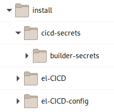
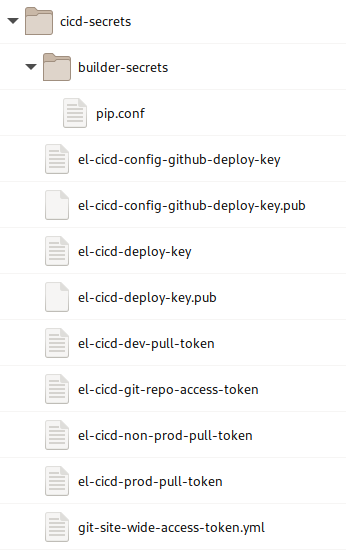
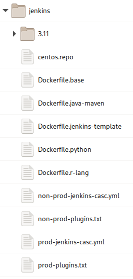
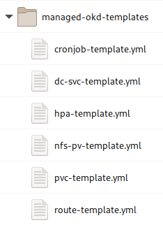
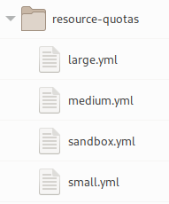
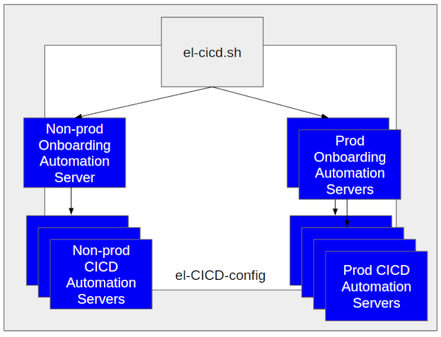
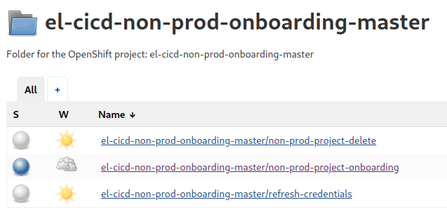

# el-CICD Operating Manual

## Preamble

This document is part of the el-CICD Project, a complete CICD system for the OKD Container Platform.

Copyright (C) 2020 Evan "Hippy" Slatis  
email: hippyod -at- yahoo -dot- com

**===================================**

**Red Hat® OpenShift® Platform is a trademark of Red Hat, Inc., and supported and owned by Red Hat, Inc.**

**el-CICD IS NEITHER SUPPORTED OR AFFILIATED IN ANY WAY WITH RED HAT, INC., OR ANY OF ITS PROJECTS.**

**===================================**

## License

el-CICD is free software; you can redistribute it and/or modify it under the terms of the GNU Lesser General Public License as published by the Free Software Foundation; either version 2.1 of the License, or (at your option) any later version.

This library is distributed in the hope that it will be useful, but **WITHOUT ANY WARRANTY; without even the implied warranty of MERCHANTABILITY or FITNESS FOR A PARTICULAR PURPOSE**.  See the GNU Lesser General Public License for more details.

You should have received a copy of the GNU Lesser General Public License along with this library; if not, write to

```text
    The Free Software Foundation, Inc.
    51 Franklin Street
    Fifth Floor
    Boston, MA
        02110-1301
```

This document is licensed under the [Creative Commons Attribution 4.0 International License](https://creativecommons.org/licenses/by/4.0/legalcode). To view a copy of this license, visit

http://creativecommons.org/licenses/by/4.0/

or send a letter to

```text
  Creative Commons
  PO Box 1866
  Mountain View, CA
      94042
```

# TABLE OF CONTENTS

* [el-CICD Operating Manual](#el-cicd-operating-manual)
  * [Preamble](#preamble)
  * [License](#license)
* [TABLE OF CONTENTS](#table-of-contents)
* [Overview](#overview)
  * [el-CICD SECURITY WARNING](#el-cicd-security-warning)
  * [Fundamentals](#fundamentals)
  * [Assumptions](#assumptions)
* [Bootstrap Directory Structure](#bootstrap-directory-structure)
  * [el-CICD Repository](#el-cicd-repository)
  * [el-CICD-config Repository](#el-cicd-config-repository)
  * [el-CICD-docs Repository](#el-cicd-docs-repository)
  * [cicd-secrets](#cicd-secrets)
    * [builder-secrets](#builder-secrets)
* [Configuration](#configuration)
  * [Gathering Credentials](#gathering-credentials)
    * [SSH Keys for el-CICD and el-CICD-config](#ssh-keys-for-el-cicd-and-el-cicd-config)
    * [GitHub Site Wide Access Token](#github-site-wide-access-token)
    * [Image Repository Pull Keys](#image-repository-pull-keys)
    * [Changing the Default Secret File Configuration](#changing-the-default-secret-file-configuration)
  * [System Configuration Files](#system-configuration-files)
    * [Root Configuration File](#root-configuration-file)
    * [Composing Configuration Files](#composing-configuration-files)
      * [Deploying to Different OKD Versions](#deploying-to-different-okd-versions)
      * [el-cicd-meta-info ConfigMap](#el-cicd-meta-info-configmap)
    * [Configuration Contents](#configuration-contents)
      * [Basic Information](#basic-information)
      * [Cluster Information](#cluster-information)
      * [Git Repository Information](#git-repository-information)
      * [Build Secrets](#build-secrets)
        * [Naming Convention Definitions](#naming-convention-definitions)
      * [SDLC Definition](#sdlc-definition)
        * [Lifecycle Definition](#lifecycle-definition)
        * [Image Repositories](#image-repositories)
    * [Jenkins Configuration](#jenkins-configuration)
      * [Dockerfiles](#dockerfiles)
  * [Managed OKD Resources](#managed-okd-resources)
    * [OKD Template Definition Files](#okd-template-definition-files)
    * [ResourceQuota Definition Files](#resourcequota-definition-files)
  * [Project Definition File](#project-definition-file)
    * [OKD RBAC Groups](#okd-rbac-groups)
    * [Git Project information](#git-project-information)
    * [Microservices](#microservices)
    * [Enabled Test Environments](#enabled-test-environments)
    * [Sandbox Environments](#sandbox-environments)
    * [ResourceQuotas](#resourcequotas)
    * [NFS Shares](#nfs-shares)
  * [Code Base Framework](#code-base-framework)
    * [Code Base Name](#code-base-name)
    * [Jenkins Agents](#jenkins-agents)
    * [Jenkins Agents Dockerfiles](#jenkins-agents-dockerfiles)
    * [Builder Steps](#builder-steps)
      * [Code Base Folders](#code-base-folders)
      * [Build Scripts](#build-scripts)
* [el-CICD Components](#el-cicd-components)
  * [el-cicd Admin Utility](#el-cicd-admin-utility)
    * [Bootstrapping Onboarding Automation Servers](#bootstrapping-onboarding-automation-servers)
    * [Refreshing Credentials](#refreshing-credentials)
    * [Building Jenkins Images](#building-jenkins-images)
    * [Updating Sealed Secrets](#updating-sealed-secrets)
    * [Extending el-cicd](#extending-el-cicd)
      * [Bootstrap Hook Scripts](#bootstrap-hook-scripts)
      * [Credential Hook Scripts](#credential-hook-scripts)
    * [Bootstrap](#bootstrap)
    * [Pipeline](#pipeline)
  * [Onboarding Automation Servers](#onboarding-automation-servers)
    * [Non-prod Onboarding Automation Server](#non-prod-onboarding-automation-server)
      * [Non-prod Onboarding Automation Server Pipelines](#non-prod-onboarding-automation-server-pipelines)
      * [non-prod-project-project-onboarding Pipeline](#non-prod-project-project-onboarding-pipeline)
      * [refresh-credentials Pipeline](#refresh-credentials-pipeline)
      * [non-prod-project-delete Pipeline](#non-prod-project-delete-pipeline)
    * [Prod Onboarding Automation Server](#prod-onboarding-automation-server)
    * [Access Considerations](#access-considerations)

# Overview

el-CICD, pronounced like [El Cid](https://en.wikipedia.org/wiki/El_Cid), is a Configurable off the Shelf (COTS) Continuous Integration/Continuous Delivery (CICD) supporting multiple Projects of one or more microservices or components per group or team for building and deploying software onto OKD.  The system is expected to support all delivery and deployment aspects of the Software Development Lifecycle (SDLC) of projects running on OKD, from building the source and deploying into a development environment through deployment into production.

This document will cover the configuration, installation, and maintenance of el-CICD Onboarding Automation Servers.  The target audience are operational personnel that will install and maintain el-CICD, and those responsible for onboarding projects onto el-CICD.

## el-CICD SECURITY WARNING

> **el-CICD [ONBOARDING AUTOMATION SERVERS](#onboarding-automation-servers) REQUIRE BOTH CLUSTER ADMIN PRIVILEGES AND GIT SITE WIDE READ-WRITE PRIVILEGES.**
>
> **ACCESS TO el-CICD ONBOARDING AUTOMATION SERVERS SHOULD BE RESTRICTED TO CLUSTER ADMINS ONLY.**

## Fundamentals

Operational concerns with el-CICD cover the following topics:

1. **Configuring**  
   This includes all the setting files, gathering secrets, fine tuning the OKD deployment templates developers will use, and defining the builder steps for each [Code Base}(#code-base) the organization will support.

1. **Installing**  
   Running el-CICD Administration Utility to bootstrap the Onboarding Automation Servers for Non-Prod and Prod.

1. **Onboarding**
   Running the [Onboarding Automation Server's](#onboarding-automation-servers) onboarding pipeline to stand up a CICD Automation Server for an OKD RBAC group, if necessary, and create and configure all necessary SDLC namespaces for a [Project](foundation.md#Project).

1. **Maintenance**
   Refreshing credentials, updating [Sealed Secrets](#sealed-secrets) updating Jenkin's and Jenkins' Agent images.

## Assumptions

It is assumed the reader has a basic understanding of the SDLC, Source Control Management (SCM) solutions and Git in particular, the concepts of branching and tagging in an SCM, Docker images and containers, microservice architectures, and OKD and Kubernetes concepts.

# Bootstrap Directory Structure

el-CICD is designed as a COTS solution, meaning it was built as an incomplete piece of software that is meant to be adapted and configured by the end-user organization to their specific needs.  The el-CICD system consists of three repositories, including the documentation repository that this document resides in. 

**_Organizations must fork both the [el-CICD](https://github.com/elcicd/el-CICD) and the [el-CICD-config](https://github.com/elcicd/el-CICD-config) repositories._**

The [el-CICD-config](#el-cicd-config-repository) repository needs to be modified by the end user to adapt el-CICD to their organizational needs, and the [el-CICD](#el-cicd-config-repository) repository holds all the functional code.  These repositories are part of an OSS project that resides on a publicly hosted service, and **_no guarantee that they will continue to host el-CICD in the future is given, made, or implied_**.

Both of these repositories should be pulled to a local install directory on the bastion host where boostrap can be configured and run.  Both are pulled on every pipeline run, which has the added advantage of instant updates of functionality and configuration for Automation Servers.

  

**Bootstrap Directory Structure**

## el-CICD Repository

The el-CICD Repository is the functional heart of el-CICD, and is **NOT** meant to be modified by the end user.  It holds all bootstrap scripts, internal template files, BuildConfig definitions, and the [Jenkins shared library](https://www.jenkins.io/doc/book/pipeline/shared-libraries/) that forms the bulk of el-CICD's pipeline functionality.

The repository directory structure is as follows:

* **el-CICD**  
The root directory holds the main bootstrap and management utility for el-CICD, `el-cicd.sh`.
  * **resources**  
  Holds the BuildConfig YAML files, and a number of script style templates used throughout the system for deploying el-CICD Automation Servers and end user microservices.
  * **scripts**  
  Holds a number of shell scripts that define functions and functionality used by `el-cicd.sh`.
  * **vars**  
  Holds all *.groovy files that form the functionality of the pipelines in el-CICD as part of a [Jenkins Shared Library]([https://www.jenkins.io/doc/book/pipeline/shared-libraries/](https://www.jenkins.io/doc/book/pipeline/shared-libraries/)).

## el-CICD-config Repository

This repository holds all the files that end users will configure to install and run el-CICD.  Everything in this file can be modified by end users to define their install of el-CICD.

The repository directory structure is as follows:

* **el-CICD-config**
The root directory typically holds the main bootstrap configuration files defining an install of el-CICD.
  * **bootstrap**  
  Holds additional bootstrap configuration files and any user-defined bootstrap extension scripts.
  * **builder-steps**  
  Holds the [builder-steps](#builder-steps) implementations which define the Build for each Code Base.
  * **hook-scripts**  
  Holds the user-defined pipeline extensions scripts.
  * **jenkins**  
  Holds Dockerfiles that define the el-CICD Jenkins image and Jenkins Agent images.
  * **managed-okd-templates**  
  Holds definitions of Managed OKD Templates for the developers to reference.
  * **project-defs**  
  Holds every [Project Definition File](#project-definition-file).
  * **resource-quotas**  
  Holds the different ResourceQuotas that can be assigned to Project namespaces.

## el-CICD-docs Repository

Holds all the documentation for el-CICD, including this document, a developer guide, and an el-CICD tutorial.

## cicd-secrets

End user should create another sibling folder to the el-CICD folders holding your forked repositories called `cicd-secrets`.  These will hold the [credentials you will gather](#gathering-credentials) to support el-CICD functionality.  This folder should **not** be committed to Git, since it will hold credentials that cannot be shared.

  

**Figure: `cicd-secrets` and `builder-secrets` Directory with Default Files**

### builder-secrets

Another folder to create under the `cicd-secrets` folder is the `builder-secrets` folder.  Builder configuration files that contain secrets that need to be mounted in Jenkins Agents for builds (e.g. a `settings.xml` for Maven, or a `pip.conf` for Python) are placed here.

# Configuration

After all the el-CICD repositories are forked configuration of el-CICd for installation may begin.  This includes gathering credentials, defining the organization's SDLC, and defining the [Code Bases](#code-base-framework) supported.

## Gathering Credentials

el-CICD requires come credentials to be gathered for use in the [Automation Servers](foundation.md#automation-server), and for the pulling of images into the SDLC [namespaces](foundation.md#namespaces).  In particular, el-CICD needs

* Read only SSH keys for el-CICD and el-CICD-config
* A site wide, GitHub, read-write access token
* Access tokens for each Image Repository the installing organization will use

el-CICD is configured by default to expect a sibling directory be created on your bastion host to el-CICD and el-CICD-config called **cicd-secrets**.  All secrets for bootstrapping (i.e. standing up an [Onboarding Automation Server](#onboarding-automation-servers)) should be put in this folder.

### SSH Keys for el-CICD and el-CICD-config

For creating the el-CICD and el-CICD SSH keys and using the default configuration, run the following commands in the `cicd-secrets` directory:

```bash
    ssh-keygen -b 2048 -t rsa -f 'el-cicd-deploy-key' -q -N '' -C 'Jenkins Deploy key for el-CICD'

    ssh-keygen -b 2048 -t rsa -f 'el-cicd-config-github-deploy-key' -q -N '' -C 'Jenkins Deploy key for el-CICD-config'
```

**The read-only keys are assumed to be shared among all installs of el-CICD**, regardless the type of install or number of clusters involved.  They are read-only keys accessing projects which are mostly comprised of either OSS code or non-critical configuration, and therefore represent a low security risk at worst.

### GitHub Site Wide Access Token

Create a service account for your organization on GitHub that has site wide administrator access, and then [create an access token for it](https://docs.github.com/en/github/authenticating-to-github/creating-a-personal-access-token).  Copy the access token to

`cicd-secrets/el-cicd-git-repo-access-token`

This token will allow el-CICD to create each microservice's Git repo's webhook for automated builds and it's read-write deploy key for creating [Deployment Branches](foundations.md#deployment-branch).

### Image Repository Pull Keys

Each Image Repository el-CICD uses needs a service account, and each service account should have an access token.  The default configuration for el-CICD assumes you have a Dev Image Registry, a Non-prod Image Registry which holds images deployed to any environment not part of Dev or Prod, and a Prod Image Registry.  They are expected to save in the following locations:

* `cicd-secrets/el-cicd-dev-pull-token`
* `cicd-secrets/el-cicd-non-prod-pull-token`
* `cicd-secrets/el-cicd-prod-pull-token`

### Changing the Default Secret File Configuration

In the [System Configuration Files](#system-configuration-files), all the configuration used to boostrap el-CICD is explained, and it includes how these files are referenced by the [el-CICD Admin Utility](#el-cicd-administration-utility).  Follow the instructions to change which files need to be created and how they are referenced with regards o 

## System Configuration Files

All system configuration files for el-CICD end with *.conf by convention.  They will define the el-CICD installation at bootstrap, for the Onboarding Automation Servers, and the CICD Automation Servers.  They are simple _key=value_ files with standard shell comments allowed.  They will be _sourced_ like any other Linux source file.

### Root Configuration File

**_Root configuration files_** are defined as any configuration file directly referenced when using the [el-CICD Admin Utility](#el-cicd-admin-utility).  The el-CICD Admin Utility will look for these files in the root of the el-CICD-configuration directory, and the el-CICD-config directory is expected to be a sibling directory of the el-CICD directory.  Root configuration files are used to define a particular install, such as configuring el-CICD for installing Non-prod versus Prod Automation Servers, or for an OKD 3 versus OKD 4 install, and are expected to define values that are unique that install.


### Composing Configuration Files

el-CICD supports composing configuration files to make it easier to share values common among different installs, and follow a simple set of rules.  Which set of configuration files define a particular install is defined in the Root Configuration File.

There are two, colon delimited lists of files that can be defined in the root configuration files:

* **INCLUDE_BOOTSTRAP_FILES**  
  *.conf files only used during installation of Onboarding Automation Servers; mostly these define values for managing Git deploy keys only defined at bootstrap, and paths to files that hold Git and Image Repository credentials
* **INCLUDE_SYSTEM_FILES**  
  *.conf files with values used during installation and/or by either the Onboarding or CICD Automation Servers

Both of these lists are assumed to reference files relative to the _bootstrap_ directory in el-CICD-config.

The order of precedence of keys defined in each file are

1. Root configuration files
2. INCLUDE_SYSTEM_FILES
3. INCLUDE_BOOTSTRAP_FILES

Within the lists of INCLUDE_SYSTEM_FILES and INCLUDE_BOOTSTRAP_FILES, the order of precedence is first listed; i.e. from left to right.

For example, given the the two configuration files foo-config.conf and bar-config.conf:

```bash
# foo-config.conf
SOME_KEY=foo
```
```bash
# bar-config.conf
SOME_KEY=bar
```
And given the following confguration:

```bash
# Your Root Configuration File
INCLUDE_BOOTSTRAP_FILES=foo-config.conf
INCLUDE_SYSTEM_FILES=bar-config.conf
```
-or-

```bash
# Your Root Configuration File
INCLUDE_BOOTSTRAP_FILES=foo-config.conf:bar-config.conf
```

The result in the first example is`SOME_KEY=bar`, and the second example with just `INCLUDE_BOOTSTRAP_FILES` defined will be `SOME_KEY=bar`.  In the first example `SOME_KEY` will be able to be referenced in both the bootstrap and the Automation Servers, and in the second only by the el-CICD Admin Utility.

#### Deploying to Different OKD Versions

el-CICD runs equally well on OKD 3 or OKD 4, and Root Configuration Files for one install may be INCLUDE_* files for another.  This ability can be exploited when application migrations from OKD 3 to OKD 4 are going to be undertaken and both version need to be up for a period of time.  The following scenario envisions that OKD 3 is the OKD version, el-CICD is going to be used for future development, and the migration of applications from OKD 3 to OKD 4 will happen after the applications are adapted to el-CICD standards first.

Use the main Root Configuration File to define the longer lasting install on OKD 4.  Create a smaller Root Configuration File for the OKD 3 install that overrides only the OKD specific values (e.g. `OCP_VERSION`, `CLUSTER_WILDCARD_DOMAIN`, `OCP_IMAGE_REPO`, etc.) and then copy the INCLUDE_BOOTSTRAP_FILES and INCLUDE_SYSTEM_FILES values into the OKD Root Configuration File, but add the OKD 4 Root Configuration File to the beginning of the INCLUDE_SYSTEM_FILES list in the OKD 3 Root Configuration File.

```bash
# okd-4-root.conf; OKD 4 Root Configuration File
# OCP_VERSION and OCP_IMAGE_REPO are defined in INCLUDE_* files for OKD 4

CLUSTER_WILDCARD_DOMAIN=my.okd.3.wildcard.com

INCLUDE_BOOTSTRAP_FILES=el-cicd-default-bootstrap.conf
INCLUDE_SYSTEM_FILES=el-cicd-default-system.conf
```

```bash
# OKD 3 Root Configuration File
CLUSTER_WILDCARD_DOMAIN=my.okd.3.wildcard.com

# FOR 3.11 USE
OCP_VERSION=3

# FOR 3.11 USE
OCP_IMAGE_REPO=docker-registry.default.svc:5000/openshift

INCLUDE_BOOTSTRAP_FILES=el-cicd-default-bootstrap.conf
INCLUDE_SYSTEM_FILES=okd-4-root.conf:el-cicd-default-system.conf
```

The advantage to this migration strategy is that it allows development teams to work semi-independently adapting their projects to el-CICD standards in parallel with operations as they work on standing up the newer OKD 4 clusters.  It also allows training to be split into two smaller, more manageable initiatives; one for adapting projects to el-CICD, and a second, later training session for OKD 4 user interface and other differences from OKD 3.

#### el-cicd-meta-info ConfigMap

All el-CICD namespaces that host Automation Servers will contain a ConfigMap named `el-cicd-meta-info` that holds all values defined in the Root Configuration File and INCLUDE_SYSTEM_FILES.  Values defined in INCLUDE_BOOTSTRAP_FILES will not be expressed in the ConfigMap, and are only meant to be used during bootstrap.

### Configuration Contents

This section will discuss the default breakdown of the Root Configuration Files, INCLUDE_SYSTEM_FILES, and INCLUDE_BOOTSTRAP_FILES.  Comments that are not part of the actual files are added inline in order describe the relevant key-value pairs.

In most cases it is best to leave the values if there is no need to change them.  As an example, the ONBOARDING_MASTER_NAMESPACE shouldn't need to be changed, unless more than one instance of a the same type of Onboarding Automation Server (Non-prod or Prod) need to be installed on the same cluster.  On the other hand, the CLUSTER_WILDCARD_DOMAIN must be defined to each specific cluster.

#### Basic Information

The following defines the basic information for el-CICD.

In `el-cicd-non-prod.conf`:

```properties
# The Onboarding Automation Server namespace and optional node selectors
ONBOARDING_MASTER_NAMESPACE=el-cicd-non-prod-onboarding-master
ONBOARDING_MASTER_NODE_SELECTORS=

# The CICD Automation Server namespace postfix and optional node selectors. 
# CICD namespaces will be <RBAC group>-<CICD_MASTER_NAMESPACE_POSTFIX>;
#     e.g. for RBAC 'foo' -> foo-el-cicd-non-prod-master
CICD_MASTER_NAMESPACE_POSTFIX=el-cicd-non-prod-master
CICD_MASTER_NODE_SELECTORS=
```

In `el-cicd-prod.conf`:

```properties
# The Onboarding Automation Server namespace and optional node selectors
ONBOARDING_MASTER_NAMESPACE=el-cicd-prod-onboarding-master
ONBOARDING_MASTER_NODE_SELECTORS=

# The CICD Automation Server namespace postfix and optional node selectors. 
# CICD namespaces will be <RBAC group>-<CICD_MASTER_NAMESPACE_POSTFIX>;
#     e.g. for RBAC 'foo' -> foo-el-cicd-prod-master
CICD_MASTER_NAMESPACE_POSTFIX=el-cicd-prod-master
CICD_MASTER_NODE_SELECTORS=
```

In `el-cicd-default-system.conf`:

```properties
# Name of the ConfigMap holding the system data defined in the el-CICD configuration files
EL_CICD_META_INFO_NAME=el-cicd-meta-info
```

In `el-cicd-default-bootstrap.conf`:

```properties
# Default location of all Secret files relative the el-CICD directory
SECRET_FILE_DIR=${BOOTSTRAP_DIR}/../cicd-secrets
SECRET_FILE_TEMP_DIR=${SECRET_FILE_DIR}/tmp

# Sealed secret version to install in each cluster
SEALED_SECRET_RELEASE_VERSION=v0.14.1
```

#### Cluster Information

In `el-cicd-non-prod.conf`:

```properties
# The cluster wildcard domain the server will be installed on.  Typically different for each
# Onboarding Automation Server, except in rare case where Non-prod and Prod Onboarding
# Automation Servers are installed in the same cluster.
CLUSTER_WILDCARD_DOMAIN=apps-crc.testing
```

In `el-cicd-prod.conf`:

```properties
# The cluster wildcard domain the server will be installed on.  Typically different for each
# Onboarding Automation Server, except in rare case where Non-prod and Prod Onboarding
# Automation Servers are installed in the same cluster.
CLUSTER_WILDCARD_DOMAIN=apps-crc.testing
```

In `el-cicd-default-system.conf`:

```properties
# Use this if installing on OKD 4.  This is the default setting.
OCP_IMAGE_REPO=image-registry.openshift-image-registry.svc:5000/openshift

# Uncomment this if installing on OKD 3.
# OCP_IMAGE_REPO=docker-registry.default.svc:5000/openshift
```

In `el-cicd-default-bootstrap.conf`:

```properties
# Use this if installing on OKD 4.  This is the default setting.
OCP_VERSION=4

# Uncomment this if installing on OKD 3.
# OCP_VERSION=3
```

Note that the differences between OKD 3 and 4 are minor, but there are a few places (such as the URL to the internal OKD registry) where el-CICD needs to know them to  function properly.

#### Git Repository Information

In `el-cicd-non-prod.conf`:

```properties
# Titles are human readable ids for GitHub deploy keys.  Each microservice's deploy key will be
# completed by the CLUSTER_WILDCARD_DOMAIN and Project ID to avoid collisions.
EL_CICD_DEPLOY_KEY_TITLE_PREFIX=el-cicd-non-prod-deploy-key
```

In `el-cicd-prod.conf`:

```properties
# Titles are human readable ids for GitHub deploy keys.  Each microservice's deploy key will be
# completed by the CLUSTER_WILDCARD_DOMAIN and Project ID to avoid collisions.
EL_CICD_DEPLOY_KEY_TITLE_PREFIX=el-cicd-prod-deploy-key
```

In `el-cicd-default-system.conf`:

```properties
# This values is appended to the ID for each microservice's GitHub private deploy key stored in
# Jenkins.
GIT_CREDS_POSTFIX=git-repo-private-key

# The el-CICD Git repository url, branch, and ID of the private key stored in Jenkins#
# credentials for read-only
EL_CICD_GIT_REPO=git@github.com:elcicd/el-CICD.git
EL_CICD_BRANCH_NAME=development
EL_CICD_READ_ONLY_GITHUB_PRIVATE_KEY_ID=el-cicd-read-only-git-repo-private-key

# The el-CICD-config Git repository url, branch, and ID of the private key stored in Jenkins
# credentials for read-only access
EL_CICD_CONFIG_REPOSITORY=git@github.com:elcicd/el-CICD-config.git
EL_CICD_CONFIG_REPOSITORY_BRANCH_NAME=development
EL_CICD_CONFIG_REPOSITORY_READ_ONLY_GITHUB_PRIVATE_KEY_ID=el-cicd-config-read-only-git-repo-private-key

# ID of the Git site wide, read-write access token needed by the el-CICD in order to manage
# deploy keys, webhooks, etc. for your Git server's organization
GIT_SITE_WIDE_ACCESS_TOKEN_ID=git-site-wide-access-token
```

In `el-cicd-default-bootstrap.conf`:

```properties
# API URL of the Git server.  Used to push SSH keys to Git during bootstrapping.
EL_CICD_GIT_API_URL=api.github.com

# The organization or user on Git where the el-CICD repository is stored.
EL_CICD_ORGANIZATION=elcicd

# The title used by GitHub to store the el-CICD read-only key, and path and name of the private key
# file for read only deploy key.  It is assumed the public key will reside next to it.
EL_CICD_SSH_READ_ONLY_PUBLIC_DEPLOY_KEY_TITLE=el-cicd-read-only-public-key
EL_CICD_SSH_READ_ONLY_DEPLOY_KEY_FILE=${SECRET_FILE_DIR}/el-cicd-deploy-key

# The title used by GitHub to store the el-CICD-config read-only key, and path and name of the private key
# file for read only deploy key.  It is assumed the public key will reside next to it.
EL_CICD_CONFIG_SSH_READ_ONLY_PUBLIC_DEPLOY_KEY_TITLE=el-cicd-config-read-only-public-key
EL_CICD_CONFIG_SSH_READ_ONLY_DEPLOY_KEY_FILE=${SECRET_FILE_DIR}/el-cicd-config-github-deploy-key

# File of the Git site wide, read-write access token needed by the el-CICD in order to manage
# deploy keys, webhooks, etc. for your Git server's organization
EL_CICD_GIT_REPO_ACCESS_TOKEN_FILE=${SECRET_FILE_DIR}/el-cicd-git-repo-access-token
```

#### Build Secrets

If any of your organizations builds make use of a settings files for builds that contain secrets (e.g.`settings.xml` for Maven builds, or a `pip.conf` for Python), then these files should be place here.

In `el-cicd-non-prod.conf`:

```properties
# Name of the secrets that holds all the files that were placed in the builder-secrets directory
EL_CICD_BUILD_SECRETS_NAME=el-cicd-build-secrets

# Path to directory where EL_CICD_BUILD_SECRETS_NAME should be mounted in the Jenkins Agents
BUILDER_SECRETS_DIR=/mnt
```

In `el-cicd-default-bootstrap.conf`:

```properties
# Name and path of the builder-secrets directory
BUILD_SECRET_FILE_DIR=${SECRET_FILE_DIR}/builder-secrets
```

##### Naming Convention Definitions

There are a number of naming conventions used by el-CICD in order to easily allow configuration fo the SDLC by end users, and one prefix is for NFS Persistent Volumes in order to easily identify them.

In `el-cicd-default-system.conf`:

```properties
# Each postfix below is used to defined the Image Repository details per SDLC environment
#     e.g. For the DEV environment, the key to define the username for access is DEV_IMAGE_REPO_USERNAME
# This makes lookup of these values scriptable by environment, without having to know the environment in advance

# Defines the pull token file location
PULL_TOKEN_FILE_POSTFIX=_PULL_TOKEN_FILE

# Username (account) that has privileged access to an Image Repository
IMAGE_REPO_USERNAME_POSTFIX=_IMAGE_REPO_USERNAME

# URL to domain of Image Repository
IMAGE_REPO_POSTFIX=_IMAGE_REPO

# Postfix for naming of the .dockercfg pull Secret that needs to be in every SDLC namespace
IMAGE_REPO_PULL_SECRET_POSTFIX=_IMAGE_REPO_PULL_SECRET

# ID of credentials stored in Jenkins for referencing in pipelines
IMAGE_REPO_ACCESS_TOKEN_ID_POSTFIX=_IMAGE_REPO_ACCESS_TOKEN_ID

# The postfix below is used to defined the node selectors per SDLC environment
NODE_SELECTORS_POSTFIX=_NODE_SELECTORS

# The prefix below is used when create a NFS Persistent Volume for easy identification by name
NFS_PV_PREFIX=nfs
```

#### SDLC Definition

Defining the organization's SDLC is conceptually the most important part of the configuration.  Whatever is defined in these files will determine how Projects are onboarded with el-CICD and into OKD.  Project Definition Files, namespaces, Image tags, where images are pushed and proomoted, and Git Deployment Branch names.

##### Lifecycle Definition

Defines the supported environments and the possible environment promotion scheme used by the organization.  DEV_ENV, PRE_PROD, and PROD **must** be defined.  TEST_ENVS are list in order of promotion (e.g. QA is promoted to UAT in the example below) in a colon delimited list, and are optional.

In `el-cicd-default-system.conf`:

```properties
# Environment builds are initially deployed to
DEV_ENV=DEV

# Optional test environments in a colon delimited list from first to last in order of promotion
TEST_ENVS=QA:UAT

# The Pre-prod is the penultimate environment the last test environment (or DEV, if none) will promote to
PRE_PROD_ENV=STG

# The production environment
PROD_ENV=PROD
```

##### Image Repositories

Each environment must be tied to an Image Repository in which images are built and deployed to (DEV) or promoted to (all the other environments), and from which each environment pulls from for deployments.  Compare the keys used below to the values defined in [Naming Convention Definitions](#naming-convention-definitions).

In `el-cicd-non-prod.conf`:

```properties
# The following demonstrates how to define the values needed by el-CICD to integrate with the Image Repository.
# Note the postfix of each value that was defined in Naming Convention Definitions above to understand what
# each value is for.  Also note the optional node selectors for DEV environment namespaces.
DEV_IMAGE_REPO_USERNAME=elcicddev
DEV_IMAGE_REPO=docker.io/elcicddev
DEV_IMAGE_REPO_PULL_SECRET=el-cicd-image-repo-dev-pull-secret
DEV_IMAGE_REPO_ACCESS_TOKEN_ID=image-repo-dev-access-token
DEV_NODE_SELECTORS=
```

**NOTE:** The above only shows the defintion of values supporting the DEV Image Registry, but each TEST_ENV is also defined in this file.

In `el-cicd-prod.conf`:

```properties
# The values supporting the Prod Image Repository is defined here.  Also note the optional node selectors for PROD environment namespaces.
PROD_PULL_TOKEN_FILE=${SECRET_FILE_DIR}/el-cicd-prod-pull-token
PROD_IMAGE_REPO_USERNAME=elcicdprod
PROD_IMAGE_REPO=docker.io/elcicdprod
PROD_IMAGE_REPO_PULL_SECRET=el-cicd-image-repo-prod-pull-secret
PROD_IMAGE_REPO_ACCESS_TOKEN_ID=image-repo-prod-access-token
PROD_NODE_SELECTORS=
```

In `el-cicd-default-system.conf`:

```properties
# The values supporting the Pre-prod Image Repository is defined in the default system configuration file, because Pre-prod is referenced
# from both the Non-prod and Prod CICD Automation Servers.  Also note the optional node selectors for STG environment namespaces.
STG_IMAGE_REPO_USERNAME=elcicdnonprod
STG_IMAGE_REPO=docker.io/elcicdnonprod
STG_IMAGE_REPO_PULL_SECRET=el-cicd-image-repo-non-prod-pull-secret
STG_IMAGE_REPO_ACCESS_TOKEN_ID=image-repo-non-prod-access-token
STG_NODE_SELECTORS=
```

In `el-cicd-default-bootstrap.conf`:

```properties
# This only show the DEV pull token file as an example, but a definition of a pull token file MUST be defined here.
DEV_PULL_TOKEN_FILE=${SECRET_FILE_DIR}/el-cicd-dev-pull-token
```

### Jenkins Configuration

A specific Jenkins image is created for el-CICD installs.  The bootstrapping image build framework allows a great deal of customization and configuration based
on the OKD base Jenkins image.  The default build will make sure the [Jenkins Configuration as Code](https://www.jenkins.io/projects/jcasc/) plugin is included in the image, and then loads a list of all known plugins, setting them to latest for a complete upgrade.

To configure the Jenkins images that will support your installation of el-CICD, edit the `*-jenkins-casc.yml` and `*-plugins.txt` in the `el-CICD=config/jenkins` directory.

The JENKINS_BUILD_AGENT_NAMES colon delimited list below should match the name of the Jenkins Agents your building.  See the [Code Base Framework](#code-base-framework) for more information.

In `el-cicd-non-prod.conf`:

```properties
# Name of Jenkins image for Non-prod and CICD Onboarding Automation Servers used by el-CICD, added to the openshift namespace
JENKINS_IMAGE_STREAM=el-cicd-non-prod-jenkins

# Default names of Configuration as Code for Non-prod Jenkins and plugins, and list of plugins and their versions to be included
JENKINS_CASC_FILE=non-prod-jenkins-casc.yml
JENKINS_PLUGINS_FILE=non-prod-plugins.txt

# these agent images are for builds only, so only defined for non-prod installs
JENKINS_BUILD_AGENT_NAMES=java-maven:python:r-lang

# Colon delimited list of directories with files which Jenkins Agent image builds might need
JENKINS_AGENTS_BUILD_DIRS=
```

In `el-cicd-prod.conf`:

```properties
# Name of Jenkins image for Prod and CICD Onboarding Automation Servers used by el-CICD, added to the openshift namespace
JENKINS_IMAGE_STREAM=el-cicd-prod-jenkins

# Default names of Configuration as Code for Prod Jenkins and plugins, and list of plugins and their versions to be included
JENKINS_CASC_FILE=prod-jenkins-casc.yml
JENKINS_PLUGINS_FILE=prod-plugins.txt
```

In `el-cicd-default-system.conf`:

```properties
# Path where JENKINS_CASC_FILE and JENKINS_PLUGINS_FILE will be copied and reference in the Jenkins images
JENKINS_CONTAINER_CONFIG_DIR=/usr/local/etc

# Directory from which to copy extra files needed during Jenkins image builds.
JENKINS_BUILD_DIRS=

# If organizations would rather handle their own Agent Image builds, set this to 'true'.
JENKINS_SKIP_AGENT_BUILDS=false

# All Jenkins Agents will be named with this prefix; e.g. el-cicd-jenkins-agent-base or el-cicd-jenkins-agent-java
JENKINS_AGENT_IMAGE_PREFIX=el-cicd-jenkins-agent

# Default agent Code Base name for all pipelines except Build-to-Dev pipelines
JENKINS_AGENT_DEFAULT=base

# Jenkins resource settings
JENKINS_MEMORY_LIMIT=4Gi
JENKINS_VOLUME_CAPACITY=4Gi
JENKINS_DISABLE_ADMINISTRATIVE_MONITORS=true

JENKINS_AGENT_MEMORY_REQUEST=512Mi
JENKINS_AGENT_MEMORY_LIMIT=4Gi

JENKINS_AGENT_CPU_REQUEST=100m
JENKINS_AGENT_CPU_LIMIT=2

# Makes all pipeline runs more efficient by leaving an Agent pod up and ready to run
# Set to 0 if you wish a new Agent pod for every pipeline run
JENKINS_AGENT_MEMORY_IDLE_MINUTES=30
```

#### Dockerfiles

The `el-CICD-config/jenkins` directory holds a number of Dockerfiles for building the Jenkins and Jenkins Agents images used by el-CICD.  It is expected that end users will customize these to possibly add the appropriate certs or change or remove the default CentOS yum repositories used by the default el-CICD Agent image builds.

Jenkins is built using a template Dockerfile that will inject the proper values for the related base Jenkins image in the OKD image regisry, as well as JENKINS_PLUGINS_FILE information.  Feel free to modify the file as needed.

The Agent images are build using Dockerfiles with extensions matching the [Code Base](#code-base-framework) they'll support for builds.  Again feel free to modify these as necessary, or to add new Dockerfiles for new build Agents not supported by default by el-CICD following the same Code Base standards.



**Figure:** _jenkins Directory, Dockerfiles, and Supporting Configuration_

## Managed OKD Resources

el-CICD manages a group of OKD Templates and ResourceQuotas to support automated Project deployments and setup, respectively.  All managed OKD Resources may be modified, removed, or new ones defined to meet an organization's standards and needs.

### OKD Template Definition Files

A main focus of el-CICD is to remove complexity for the developers.  To that end, el-CICD manages a great deal of the boilerplate OKD resources developers would normally have to write themselves with when deploying microservices into and OKD SDLC namespace as [OKD Templates](https://docs.okd.io/latest/openshift_images/using-templates.html), and these are then patched using [Kustomize](https://kustomize.io/), which is described in more detail [here](developer-quide#patching-okd-templates).

All basic OKD resources a developer might concern themselves with are defined in the `el-CICD-config/managed-okd-templates` directory.  These include basic definitions of a DeploymentConfig and Service, a Route, a CronJob, Persistent Volume for referring to an NFS share, etc.



**Figure:** _managed-okd-templates Directory_

### ResourceQuota Definition Files

Classes of ResourceQuotas can be assigned to different SDLC namespaces, and configured per Project, since not all Projects are of equals size or resource needs.  Define these as YAML or JSON files, and refer to them in [Project Definition Files](#project-definition-file) to apply them to a particular SDLC environment.  el-CICD comes with definitions for small, medium, large, and sandbox sizes.  Al ResourceQuota definitions should be placed in the `el-CICD-config/resource-quotas` directory.



**Figure:** _resource-quotas Directory_

## Project Definition File

The Project Definition File is a file that defines each Project.  It can be written in either YAML or JSON, **must be named the same as the Project**, and has the following content:

```yaml
  rbacGroup: devops                    # The OKD RBAC group the Project belongs to
  scmHost: github.com                  # The SCM hostname of the Project
  scmRestApiHost: api.github.com       # RESTful API hostname for the Git provider (used for managing webhooks and deploy keys)
  scmOrganization: elcicd              # The SCM organization of the Project
  gitBranch: development               # The dev branch name of all microservices
  microServices:                       # List of microservices in Project
  - gitRepoName: Test-CICD1            # The Git repository name of the microservice
    codeBase: python                   # The codebase to build the microservice
    tester: pytest                     # Overridden tester to use during builds
    status: ACTIVE                     # Optional status of the microservice
  - gitRepoName: test-cicd-stationdemo
    codeBase: java-maven
    status: ACTIVE
  enabledTestEnvs:
  - qa                                 # Unordered list of test environments the Project needs
  sandboxEnvs: 2                       # Number of sandboxes needed
  resourceQuotas:                      # Define the ResourceQuota per SDLC environment
    default: small.yml                 # Default file defining the ResourceQuotas for an SDLC environment of the project
    qa: medium.yml                     # File defining the ResourceQuotas for a specific SDLC environment of the project
    stg: large.yml
    prod: large.yml
  nfsShares:                           # List of NFS Persistent Volumes used by the Project
  - envs:                              # List of SDLC environments that use the NFS Persistent Volume
    - qa
    - stg
    - prod
    capacity: 5Gi                      # Capacity of the Persistent Volume
    accessMode: ReadWriteMany          # Access Mode of the Persistent Volume
    exportPath: /mnt/nfs-test          # Path to the external NFS Share
    server: nfs-server.companydomain   # Server that hosts the NFS Share
    claimName: test-dir                # Claim name of the Persistent Volume for reference by Persistent Volume Claims
```

This file will be processed every time the Project is referenced or built in a pipeline.

### OKD RBAC Groups

Regardless of how you configure OKD for user authentication with an identity provider, el-CICD Projects leverage groups as owners of Projects.  Each Project must have a group defined to be an owner, and the group will be registered as an admin for all OKD namespaces in the Project, one per environment.  The group must exist for the Project to be onboarded with el-CICD.

### Git Project information

The Project must define the SCM (Git) host and organization of the Project.  All microservices are assumed to be on the same host and collected in the same organization.

In order to encourage good practices and standardization within a Project, the Project may only define one [Development Branch](#development-branch) name, and all microservices are expected to have a branch to match.  Committing to this branch will trigger builds, and the [Deployment Branch](#deployment-branch) for each microservice when first promoted out of Dev will be created from this branch.

### Microservices

All microservices (aka Components for more traditional, monolithic applications) belonging to the Project will be listed here.  Specific information will be

* the Git repo, from which the microservice name in the system is derived)
* the codebase of the microservice, which drives how the system will build the microservice
* By default The Build framework will look for build utility files with the following names
  * builder.groovy
  * tester.groovy
  * scanner.groovy
  * assembler.groovy
  * To override any of these, use a key value pair of default name (e.g. tester) to the Groovy file for that [Code Base](#code-base-framework)
* An optional status of the microservice in the Project.  This is completely user-defined and has no functional purpose in el-CICD, but will be displayed in the Jenkins UI, where appropriate.

### Enabled Test Environments

Dev, Pre-prod, and Prod are required by every Project hosted by el-CICD, but Test environments are purely optional.  Projects are expected to declare the Test environments they require.  SDLC environments will be created for them when onboarding based on the required environments and optional Test environments.

### Sandbox Environments

The number sandbox environments needed by the Project.

### ResourceQuotas

The values under this section are expected to map environments to the ResourceQuota definition files in the `el-CICD-config/resource-quotas` directory.  To define a _default_ ResourceQuota definition file, use the `default` key.  To define the ResourceQuota definition file for sandboxes, use the `sandbox` key.

### NFS Shares

Persistent Volumes are usually created by the system by default whenever a Persistent Volume Claim is defined, but Persisten Volumes that refer to external NFS shares usually need to defined for OKD to recognize them by a cluster admin.  Defining them here allows el-CICD to automate this process across any and all SDLC environments of the Project.

## Code Base Framework

A [Code Base](foundations.md#code-base) is what defines how a microservice in a Project is built, tested, scanned, and assembled before being built into an image and pushed to the Image.  It also defines which Jenkins Agent is used for the microservice's Build.  The following will describe el-CICD's Code Base Framework, and how to configure and extend it as needed.

### Code Base Name

The Code Base name is how everything is tied together.  Dockerfile extensions, folder names for [Builder Steps](#builder-steps), and microservice definitions  will both reflect it.

### Jenkins Agents

Each Code Base will have a different Jenkins Agent, and each Agent is expected be an image held in the OKD's internal Image Repository in the `openshift` namepsace. Each Agent will be names in the following fashion:

\<Code Base Name>-\<JENKINS_AGENT_IMAGE_PREFIX>  

This means given a configuration value of `JENKINS_AGENT_IMAGE_PREFIX=el-cicd-jenkins-agent`, the `base` and `java` Agents would be named `el-cicd-jenkins-agent-base` and `el-cicd-jenkins-agent-java`, respectively.  This naming convention is how the Code Base Framework is able to easily locate the appropriate Agent to conduct a Build.

### Jenkins Agents Dockerfiles

  Dockerfile foudn 


### Builder Steps

The **_builder-steps_** directory holds the functional files that are loaded and executed for each build.


**Figure:**  _The builder-steps Directory_

#### Code Base Folders

Each codebase must have a folder of the same name.created in the _builder-steps_ directory, and it must contain at least one builder, tester, and scanner script for the codebase to execute when building.  Even if the codebase doesn't execute the step, an empty script must be defined for the component.  The folders many also contain other folders or files to support builds; e.g. in Figure 7 above, the `r-lang` codebase has a `resources` folder for holding files defining linting instructions.

#### Build Scripts

The builder framework is made up of three basic steps for each Build: building, testing, and scanning.  By default, the framework will look inside the codebase folder and look for the following files for each step:

* **Building**: `builder.groovy`
* **Testing**: `tester.groovy`
* **Scanning**: `scanner.groovy`
* **Assembling**: `assembler.groovy`

For microservices defined in a [Project Definition File](#Project-definition-file), there is no need to specifically name any of the defaults.  If a step is to be overridden by a file that does not follow the above naming conventions, then it does have to be named:

```yaml
* gitRepoName: Test-CICD1            # The Git repository name of the microservce
  codeBase: python                   # The codebase to build the microservice
  tester: pytest                     # Overridden tester to use during builds
  active: true                       # If the microservice is active or not
```

The above snippet from the [Project Definition File](#Project-definition-file) example above specifies that the `pytest.groovy` script (found in the `python` codebase folder) should be executed during the testing step of The Build.

Developers need to follow certain conventions for their microservice Projects to integrate into el-CICD.  In particular:

* **A standard of one image produced per Git repository**  
  It will be assumed that only one microservice will be defined per Git repository per Project.  This is not the same as one image deployed per Git repository; i.e. deployment configurations for supporting images, such as databases, or multiple configurations of the same image built, are perfectly reasonable deployment strategies.
* **A Dockerfile must exist in the root directory of the microservice or component to be built**  
  Every OKD BuildConfig will use the binary docker strategy to create and push an image to the Dev environment Image Repository.  el-CICD does not currently manage builds strictly for building artifacts consumed for builds by other microservices.
* **All OKD deployment resources will be placed in a**_.openshift_**directory under the root directory of the microservice.**

OKD Template reuse and patching via `kustomize` is relied on heavily for ease of use, but not necessary.

# el-CICD Components



**Figure 2**  
_The relationship between the basic components that comprise el-CICD_

## el-cicd Admin Utility

The el-cicd Admin Utility, located in root directory of the [el-CICD Repository](#el-cicd-repository) will drive the bootstrapping of el-CICD [Onboarding Automation Servers](#Onboarding Automation Server), refresh their credentials, and build Jenkins and Jenkins' Agent images.

```text
Usage: el-cicd.sh [OPTION] [root-config-file]

el-CICD Install Utility

Options:
    -N,   --non-prod:        bootstraps Non-prod el-CICD Onboarding Automation Server
    -n,   --non-prod-creds:  refresh Non-prod el-CICD Onboarding Automation Server credentials
    -P,   --prod:            bootstraps Prod el-CICD Onboarding Automation Server
    -p,   --prod-creds:      refresh Prod el-CICD Onboarding Automation Server credentials
    -c,   --cicd-creds:      run the refresh-credentials pipeline
    -s,   --sealed-secrets:  reinstall/upgrade Sealed Secrets
    -j,   --jenkins:         only build el-CICD Jenkins image
    -a,   --agents:          only build el-CICD Jenkins agent images
    -A,   --jenkins-agents:  build el-CICD Jenkins and Jenkins agent images
          --help:            display this help text and exit

root-config-file:
    file name or path to a root configuration file relative the root of the el-CICD-config directory
```

### Bootstrapping Onboarding Automation Servers

### Refreshing Credentials

### Building Jenkins Images

### Updating Sealed Secrets

### Extending el-cicd

#### Bootstrap Hook Scripts

#### Credential Hook Scripts

### Bootstrap

### Pipeline

## Onboarding Automation Servers

### Non-prod Onboarding Automation Server

Non-prod Onboarding Automation Servers are responsible for deploying, configuring, and setting the credentials of Non-prod CICD Automation Servers, and onboard and remove Projects.

**ACCESS TO A NON-PROD ONBOARDING AUTOMATION SERVER SHOULD BE RESTRICTED TO CLUSTER ADMINS ONLY.**  

All Onboarding Automation Servers require Git site-wide access, and have service accounts with OKD cluster admin privileges.  Allowing unprivileged users direct access to an Onboarding Automation Server would constitute security risk.


#### Non-prod Onboarding Automation Server Pipelines



**Figure 9**
_el-CICD Non-prod Automation Server pipelines_

#### non-prod-project-project-onboarding Pipeline

This pipeline is responsible for onboarding the necessary resources to support a Project's Non-prod SDLC.

| Parameters             | Description                                                                     |
| ---------------------- | ------------------------------------------------------------------------------- |
| PROJECT_ID             | The Project ID                                                                  |
| REBUILD_NON_PROD       | If true, destroy and recreate all Project Non-prod SDLC namespaces environments |
| REBUILD_SANDBOXES_ONLY | If true, destroy and recreate all Project Sandbox namespace environments        |

* Read the [Project Definition File](#project-definition-file)
* Create a namespace for the CICD Automation Server if it doesn't exist
  * `<RBAC-group>-el-cicd-non-prod-master`
* Deploy the CICD Automation Server for the Project's RBAC Group, if necessary
* Create all Non-prod Pipelines
  * [Build and Deploy Microservices](#build-and-deploy-microservices)
  * [Create Release Candidate](#create-release-candidate)
  * [Promotion/Removal](#promotionremoval)
  * [Redeploy/Removal](#redeployremoval)
  * [Redeploy Release Candidate](#redeploy-release-candidate)
* Add all necessary credentials to the CICD Automation Server for all Non-prod Image Repositories
* Create [Build-to-Dev](#build-and-deploy-microservices) Pipelines, one for each microservice
* (Re)Create the Project's SDLC namespaces, if necessary or requested
  * Create any NFS shares for each namespace, if defined
  * Set the assigned ResourceQuota on each namespace, if defined
* Create Sandbox Environments, if any
* Push a new read/write deploy key for each microservice to its Git repository and the CICD Automation Server

 ```bash
 curl https://<RBAC-group>-el-cicd-non-prod-master/job/el-cicd-non-prod-onboarding-master/job/el-cicd-non-prod-onboarding-master-non-prod-project-onboarding/buildWithParameters --user <OKD_SERV_ACCT>:<SERV_ACCT_TOKEN> --data PROJECT_ID=my-project-id
 ```

#### refresh-credentials Pipeline

This pipeline will refresh all credentials on every CICD Automation Server referenced by all Projects defined in el-CICD-config.

| Parameters | Description |
| ---------- | ----------- |
| N/A        |             |

* Loops through every Project, and if the CICD Automation Server for the RBAC group exists
  * Copies the ConfigMap containing the latest el-CICD system information into the CICD Automation Server namespace
  * Copies the pull Secrets for all Non-prod Image Repositories into the CICD Automation Server namespace
  * Updates all deploy keys and pull secrets on the CICD Automation Server (Jenkins credentials)
  * If the Project's Non-prod SDLC namespace exists
    * Copies the pull Secrets into each appropriate namespace
      * e.g. the Dev Image Repository's pull Secret into the Dev namespace environment
    * 
 
#### non-prod-project-delete Pipeline

### Prod Onboarding Automation Server

Prod Onboarding Automation Servers are responsible for deploying, configuring, and setting the credentials of Prod CICD Automation Servers, and onboard Projects.

### Access Considerations

**ACCESS TO ONBOARDING AUTOMATION SERVERS SHOULD BE RESTRICTED TO CLUSTER ADMINS ONLY.**  
All Onboarding Automation Servers need Git site-wide access, as well act as OKD cluster admins.  Allowing unprivileged users direct access to an Onboarding Automation Server would constitute security risk.
