# el-CICD Tutorial

It is strongly suggested that new users to el-CICD work through this tutorial.  This will demonstrate most of the requirements and features of the el-CICD system.  Hands on learning is the best type of education.

#### Preamble

This document is part of the el-CICD project, a CICD system for the OKD Container Platform  

Copyright (C) 2020 Evan "Hippy" Slatis  
email: hippyod -at- yahoo -dot- com  

===================================

**NOTE: Red Hat® OpenShift® Platform is a trademark of Red Hat, Inc., and supported and owned by Red Hat, Inc.**

**el-CICD IS NEITHER SUPPORTED OR AFFILIATED IN ANY WAY WITH RED HAT, INC., OR ANY OF ITS PROJECTS.**

===================================

## License

el-CICD is free software; you can redistribute it and/or modify it under the terms of the GNU Lesser General Public License as published by the Free Software Foundation; either version 2.1 of the License, or (at your option) any later version.

This library is distributed in the hope that it will be useful, but **WITHOUT ANY WARRANTY; without even the implied warranty of MERCHANTABILITY or FITNESS FOR A PARTICULAR PURPOSE**.  See the GNU Lesser General Public License for more details.

You should have received a copy of the GNU Lesser General Public License along with this library; if not, write to

```
    The Free Software Foundation, Inc.
    51 Franklin Street
    Fifth Floor
    Boston, MA
        02110-1301
```

This document is licensed under the Creative Commons Attribution 4.0 International License. To view a copy of this license, visit

http://creativecommons.org/licenses/by/4.0/ 

or send a letter to

```
  Creative Commons
  PO Box 1866
  Mountain View, CA
      94042, USA
```

## Minimum Requirements

If you install Red Hat CodeReady Containers, you will need to be able to allocate the following for the CodeReady Containers virtual machine:

* CRC Version 4.5.14
* 6 vCPUs
* 36GB RAM
* 100GB Free Disk Space

This was tested using the above minimum specs, but note that more is always better.  el-CICD was developed with 12vCPUs and 96GB RAM on a refurbished Dell R610 rack server homelab from the early 2010's.  It was tested running under Fedora, and the instructions will need to be adapted if you're running under a different OS.

This tutorial does not setup a scanner component, and the default code executes a non-functional code scan during all builds.  This will need to be implemented by the user when put into production if scanning code is a requirement.
 
You need sudo privileges on the machine running this tutorial, and cluster admin rights on an OKD cluster if CRC is not used.

This tutorial assumes you have some familiarity with Git, CICD concepts, and Kubernetes concepts.

## Install and Setup CodeReady Containers (CRC)

Optional.  If you have a working OKD or OpenShift cluster you can use as a lab, then you may skip this step.  Do not try run this tutorial on a production cluster; i.e. a cluster being actively used by developers or used to run applications in production.

### Download CRC and Deploy Key

Download CRC from [here](https://developers.redhat.com/products/codeready-containers/overview).  Registration will be required, but it's free.

Copy the tar.xz file and the pull secret you downloaded into the directory where you wish to install CRC and extract the tar file.

```
    tar -xf crc-linux-amd64.tar.xz

    mv crc-linux-X.XX.X-amd64 crc-linux-amd64
```

We move the CRC directory containing the decompressed files to a generic directory so we don't have to continually update our path whenever we upgrade versions.

**You also need to copy or download your CRC pull secret to a file called `pull-secret` in the same directory as the CRC binary, `crc`.  The scripts below you'll add to your `.bashrc` or `.zshrc` depend on it to function correctly.**

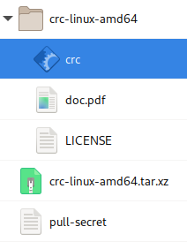

**Figure 1**  
_CRC install directory structure with pull-secrets file and original *.tar.xz CRC download included_

### Add the following to your .bashrc or .zshrc

You may remove this after the demo, but these helpers make things easier so you don't have to deal directly with the pull secret during multiple logins.  If you wish to allocate more vCPUs or memory, adjust the values at the top appropriately.

```
    CRC_V_CPU=6
    CRC_MEMORY=36864
    CRC_SHELL=bash  # or zsh

    export PATH=$PATH:${HOME}/path/to/crc/crc-linux-amd64:

    # Automatically sets up oc CLI command completion if CRC installed
    if [[ -f ~/.crc/machines/crc/crc.qcow2 ]]
    then
        eval $(crc oc-env)
        source <(oc completion ${CRC_SHELL})
    fi

    # Starts CRC with proper sizing for vCPUs and memory
    function crc-start() {
        echo "Starting CRC with ${CRC_V_CPU} vCPUs, and ${CRC_MEMORY}M in memory."
        echo "If you want to change the above values, run 'crc delete' and recreate the VM from scratch."
        echo ''
        crc start -p ${HOME}/path/to/crc/pull-secret -c ${CRC_V_CPU} -m ${CRC_MEMORY}
    }

    # Copy the kube:admin pull secret to the clipboard
    function crc-pwd-admin {
        echo "copy kubeadmin to system clipboard"
        CRC_TEMP_PWD=$(crc console --credentials | sed -n 2p | sed -e "s/.*'\(.*\)'/\1/" | awk '{print $6}' )
        echo ${CRC_TEMP_PWD} | xclipc
        echo "${CRC_TEMP_PWD} copied to clipboard for use"
        CRC_TEMP_PWD=
    }

    # Login to CRC as kube:admin and copy the pull secret to the clipboard
    function crc-admin-login {
        echo "crc login as kubeadmin"
        CRC_LOGIN=$(crc console --credentials | sed -n 2p | sed -e "s/.*'\(.*\)'/\1/")
        eval ${CRC_LOGIN}
        crc-pwd-admin
        LOGIN=
    }
```

### Initial CRC Setup and Install

Run

```
    crc setup
    crc-start  # PAY ATTENTION TO THE DASH!!
    crc stop
```

This will complete initial setup and create the virtual machine image for CRC with the requested vCPUs and memory.  Note that the vCPUs and memory cannot be adjusted after this step have been run, and you will need to delete and recreate the CRC VM if a mistake was made.

### Adjust the virtual disk space of the CRC VM

The following will need to be run in order resize the virtual disk, or you will not be able to complete the tutorial from running out of disk space.

```
    # whatever size you want, but 100G is more than enough for the tutorial
    qemu-img resize ${HOME}/.crc/machines/crc/crc.qcow2 +100G

    # for verification that the change took
    qemu-img info ${HOME}/.crc/machines/crc/crc.qcow2 | grep 'virtual size'

    # Restart CRC
    crc-start # REMEMBER THE DASH!!!

    # Need to ssh into the CRC VM, and resize the filesystem
    ssh -i ${HOME}/.crc/machines/crc/id_rsa core@192.168.130.11
    sudo xfs_growfs /sysroot
    exit
```

CRC is now setup and ready to use for the purposes of the el-CICD tutorial.

## Setup, Configure, and Bootstrap el-CICD

This section will cover the minimum necessary steps to install el-CICD.  It will cover basic configuration, repositories needed, and secrets that will need to be gathered.  At the end of this section the Non-prod Onboarding Automation Server will have been configured and created in your cluster.

### Fork and Clone el-CICD Repositories

This tutorial assumes you will be using [GitHub](github.com) as your Git repository.  Other Git repositories such as GitLab and Bitbucket are not currently supported, but are targeted for a future release.

The following el-CICD repositories should be forked, and the **master** branch is what you should default to using:

* [el-CICD](https://github.com/hippyod/el-CICD)
* [el-CICD-utils](https://github.com/hippyod/el-CICD-utils)
* [el-CICD-project-repository](https://github.com/hippyod/el-CICD-project-repository)

The following demonstration repositories should be forked, and the **development** branch is what you should default to using: 

* [Test-CICD1](https://github.com/hippyod/Test-CICD1)
* [test_CICD2](https://github.com/hippyod/test_CICD2)
* [TeSt-CiCd3](https://github.com/hippyod/TeSt-CiCd3)
* [Test_CICD4](https://github.com/hippyod/Test_CICD4)
* [test-cicd-R](https://github.com/hippyod/test-cicd-R)
* [test-cicd-stationdemo](https://github.com/hippyod/test-cicd-stationdemo)

The odd spelling of the Git repositories was purposefully used for testing purposes 

Clone the following repositories to your local machine:

* `el-CICD [master]`
* `el-CICD-docs [master]`
* `Test-CICD1 [development]`

You will need to modify the contents of this repositories and/or run scripts contained in them during the course of this tutorial.

You should also create a sibling directory to the `el-CICD`, `cicd-secrets`, that will contain a collection of secrets you will need to gather to run this tutorial.  Your final local el-CICD directory should look like the following:

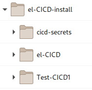

**Figure 2**  
_Cloned Git repositories and `cicd-secrets` directory_


### Create Image Repositories

For the purposes of this demo, we will use [Docker Hub](https:hub.docker.com/) to host our repositories, but any Docker compatible host will do.  You only need a single repository, but in order to more closely mirror what you might do in a production environment, we'll create three:

* `<unique-demo-name>dev`
* `<unique-demo-name>nonprod`
* `<unique-demo-name>prod`

This will better demonstrate what is most likely needed for a production setup.

**Tip**: If you have a GMail account, it's easy to use the same email address to create separate repositories without needing multiple email accounts.  When creating the repository on Docker Hub, register with your email in the following fashion

```
    <gmail-id>+<unique-demo-name>dev@gmail.com
```

For example, for the _dev_ image repository:

```
    myemailid+elcicddev@gmail.com
```

### Create the el-CICD Compatible Jenkins Agents

In order to run the builds, a number of Jenkins Agents must be available for use.  Some simple, default Agents have been defined for use by all the demo projects.  The default Agents that OKD comes with will not be useful, since el-CICD relies heavily on the `skopeo` tool for image verification, promotion, and tagging, and on installing `kustomize` rather than relying the `oc` CLI in order to support older versions of OKD.

From the el-CICD directory run the following shell script

```
    crc-admin-login
    ./agents/create-all-agents.sh`
```

This script will create a base agent, and agents for building python, R, and Java programs.  All hold the extra tools needed, such as `skopeo` and `kustomize` needed to integrate with el-CICD.  Depending on your network speed, it can take up to 30 minutes for all images to be created.

To see how these Agents are tied into the el-CICD Build Framework, take a look at the file `vars/elCicdNode.groovy` in the `el-CICD-utils` repository.  This utility defines the Agent using the Jenkins Kubernetes plugin, and at the top is a map from the Project Definitions File's _codebase_ to the Jenkins Agent images required for the build.  Should you wish to add new build definitions to your installation, you will create a new Agent image as above, and map the _codebase_ key to the to your agent image.


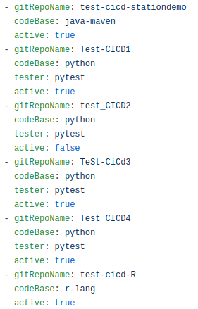

**Figure 3**  
_codebases defined in the microservices section of the Project Definition File_

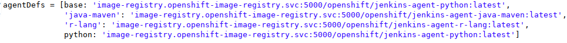

**Figure 4**  
_codebases mapped to their Jenkins Agent images in elCicdNode.groovy_

### el-CICD Secrets

The following will cover how to create the deploy keys for all necessary Git repositories.  The following will assume you have created the directory that `el-CICD-secrets.config` expects, `cicd-secrets`.  Doing this and creating the appropriate files as directed below will make it easy for el-CICD bootstrap scripts to run without effort for purposes of this demo.  We suggest reviewing the configuration file, too.  More information can be found in the el-CICD documentation, README.md located in the same Git repository as this tutorial.

#### The Easy Route

The bootstrap script looks for the files that contain the secrets in the `cicd-secrets` directory that should be located where el-CICD was cloned locatlly.  The following will assume you've done this, and will give instructions on creating the files el-CICD bootstrap scripts expect.  Obviously, outside this demo you will need to ensure this directory is either protected, or the files stored securely somewhere else when not running the setup scripts.

#### Create el-CICD Repo Read Only Private Keys

In the `cicd-secrets` directory, run the following commands:

```
    ssh-keygen -b 2048 -t rsa -f 'el-CICD-deploy-key' -q -N '' -C 'Jenkins Deploy key for el-CICD'

    ssh-keygen -b 2048 -t rsa -f 'el-CICD-utils-deploy-key' -q -N '' -C 'Jenkins Deploy key for el-CICD-utils'

    ssh-keygen -b 2048 -t rsa -f 'el-cicd-project-info-repository-github-private-key' -q -N '' -C 'Jenkins Deploy key for el-CICD-project-repository'
```

Each of these in turn will create the proper read only ssh keys for el-CICD ic the `cicd-secrets` directory to pull updated code for running the system for each pipeline:

* `el-CICD-deploy-key`
* `el-CICD-deploy-key.pub`
* `el-CICD-utils-deploy-key`
* `el-CICD-utils-deploy-key.pub`
* `el-cicd-project-info-repository-github-deploy-key`
* `el-cicd-project-info-repository-github-deploy-key.pub`

#### Gather el-CICD Access Token

Create a read/write personal access token for the Git account that forked all of the above repositories.  You can do this when signed into the GitHub account that hosts your forked el-CICD repositories.  GitHub personal access token instructions are found [here](https://docs.github.com/en/github/authenticating-to-github/creating-a-personal-access-token).  This account will mimic a service account you would create for production use of el-CICD.  Copy and paste your token into the following file in the `cicd-secrets` directory:

* ` el-cicd-git-repo-access-token`

This token will only be used by the Onboarding Automation Servers, and not the actual Non-prod and Prod Automation Servers that conduct the actual builds and deployments.  **Onboarding Automation Servers should be protected and have elevated security with cluster-admin level only access.**

#### Gather Image Repo Access Tokens

For each of the three image repositories you creates above, create a read/write access token.  Assuming you used Docker Hub as your image repository host, sign into each account you created for each repository, and head to [here](https://hub.docker.com/settings/security) to create the access token.  Copy and paste into the files into the `cicd-secrets` directory:

* `el-cicd-dev-pull-token`
* `el-cicd-non-prod-pull-token`
* `el-cicd-prod-pull-token`

### el-cicd-bootstrap.config

In `el-cicd-bootstrap.config`, you need adjust the values to reference your accounts and image repositories.

Replace all instances of `hippyod` with the name of the account where you cloned your fork the of the el-CICD repositories.

* `EL_CICD_GIT_REPO=git@github.com:<your-github-account>/el-CICD.git`
* `EL_CICD_UTILS_GIT_REPO=git@github.com:<your-github-account>/el-CICD-utils.git`
* `EL_CICD_PROJECT_INFO_REPOSITORY=git@github.com:<your-github-account>/el-CICD-project-repository.git`

Replace the following values for the image repositories for each environment.  You will find more concrete examples of what this should look like with the default values in the file.

* `<ENV>_IMAGE_REPO_USERNAME=<unique-demo-name><env>`
* `<ENV>_IMAGE_REPO=docker.io/<unique-demo-name><env>`

el-CICD is now fully configured and ready to be installed and run on your CRC cluster.

### Bootstrapping the Non-prod Onboarding Automation Server

Login to the CRC cluster, and then execute the execute the bootstrap script for the Non-prod Onboarding Automation Server.

```
    crc-admin-login
    ./el-cicd-non-prod-bootstrap.sh
```

This script will ask a number of questions as it executes:

* Confirm the wildcard domain for the cluster
  Should be `apps-crc.testing`
* Delete the Non-prod Automation Server namespace, `el-cicd-non-prod-master`  
  If the script has been run before, this must be done for the script to complete
* If you have previously installed Sealed Secrets, it will ask whether you wish to do so again
  * There is no need to do so if you have already done it once
  * You will be asked for your `sudo` password when installing

**NOTE**: Although it is pretty rare, Sealed Secret upgrades can result in breaking changes, so check the release notes on the Sealed Secrets site for the version in question before agreeing to upgrade.  Upgrades will not break your current encryption/decryption keys.

When the script completes, you can check each forked el-CICD Git repository to confirm that a read-only deploy key was added. Check that the master namespace, `el-cicd-non-prod-master`, was created and that a running instance of Jenkins was created. The script was designed to be idempotent, and this is one reason why a specific deploy key was stored for the Git repositories.

#### Setting Your Cluster's Sealed Secrets Decryption Key

Each microservice repository you cloned for the purpose of this tutorial has an example of a Sealed Secret.  You will not be able to deploy any of the microservices in this tutorial without being able to decrypt them.  This part of the tutorial is actually important to pay attention to, because if you deploy your projects more than once across multiple clusters, you'll need to make sure that each cluster has the correct decryption key for each, and you will need to keep a copy of the `master.key` somewhere in case of disaster recovery.  This process is documented in more detail on the [Sealed Secrets](https://github.com/bitnami-labs/sealed-secrets#how-can-i-do-a-backup-of-my-sealedsecrets) site, but instead of backup and restoring, this is a backup and copy operation.

In the same repository as this tutorial, `el-CICD-docs`, run the following script:

```
    ./restore-master-key.sh
```

This script will restore the encryption/decryption keys of the Sealed Secrets plugin that are needed by the tutorial's microservices, and restart the Sealed Secrets controller to pick up the changed keys.  Outside of this tutorial, you can create a Sealed Sealed key for use among multiple clusters using the following command:

```
    oc get secret -n kube-system -l sealedsecrets.bitnami.com/sealed-secrets-key -o yaml > master.key
```

el-CICD can now begin to manage projects.

## Onboarding a Project Into the Engineering Cluster

This demo makes the assumption that the Project Information Repository already has projects defined in it, and defining projects in Project Definition Files are not part of this demo.  In a real installation, it is preferable to create a project database and utility for users to create Project Definition Files; otherwise, they will have to be created manually.  This is far from tedious for a single project with relatively few microservices, but can become tedious with a larger number of projects and microservices among each.  It is also best practice to restrict access to the Project Information Iepository if it is shared among a number of different groups.

The rest of the tutorial will take you through a typical set of steps that will eventually create two Release Candidates.  In the real world, the second release would be developed, built, and tested separately, but here we are just demonstrating general system functionality, so as with most demos, it is a bit contrived.

### Access the Non-prod Onboarding Automation Server

Open your terminal and login to CRC as admin.  If you followed previous instructions, the following command will also copy the pull secret to your clipboard.

```
    crc-admin-login
```

Open your browser, and go to

[https://jenkins-el-cicd-non-prod-master.apps-crc.testing/](https://jenkins-el-cicd-non-prod-master.apps-crc.testing)

If the browser warns you that your connection is not private, you can safely ignore it and click  _Advanced_, and then the button _Proceed to jenkins-el-cicd-non-prod-master.apps-crc.testing (unsafe)_ .  Login to Jenkins using the CRC admin credentials, clicking initially on the `kube:admin` button.  You can simply paste the password (the CRC pull secret) from your clipboard thanks to the script above.

```
    Username: kubeadmin
    Password: <CRC pull secret>
```

After successfully logging in, CRC will ask you _Authorize Access_.  This will happen the first time you log into each Jenkins instance.  You may safely click _Allow selected permissions_.

From the main page on the left, click `Credentials` to take you to the Jenkins credentials screen.  If you configured everything correctly, it should look like the following.


**Figure 5**  
_Non-prod Onboarding Automation Server Credentials_

If something is missing, then check your configuration, fix any issues, and run the bootstrap script again.

### Onboarding the Test-CICD Project

Click on the Jenkins logo in the upper left corner of the browser window, and the click on the `el-cicd-non-prod-master` folder in the center of the screen, and again on the `el-cicd-non-prod-master/dev-project-onboarding` to get to the dev-project-onboarding pipeline screen.

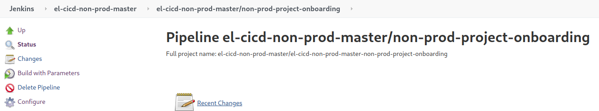

**Figure 6**  
_non-prod-project-onboarding Pipeline_

Click `Build with Parameters` on the left, enter `test-cicd` as the PROJECT_ID, and then click the `Build` button.  This will begin the `non-prod-project-onboarding` Pipeline.

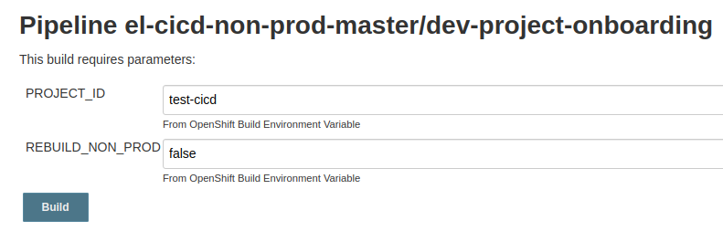

**Figure 7**  
_Entering `test-cicd` for the PROJECT_ID when kicking off the Onboarding Pipeline_

It is strongly suggested that you follow the logs of the build to see what is happening.  You can do this by clicking the build number when it appears, and then clicking `Console Output` on the left hand side fo the screen to follow the build logs in real time.

In summary, the pipeline will do the following:

* Download the Project Information Repository, and find and parse the `test-cicd` project definition
* Confirms the `devops` group's Non-prod Automation Server, a persistent Jenkins instance, does not exist, so it
    * Creates the `devops-cicd-non-prod` namespace
    * Creates the persistent Jenkins instance from a stock OpenShift template
    * Creates all the Non-prod Automation Server's pipeline (defined by BuildConfigs)
    * Copies all read-only el-CICD credentials into the new Jenkins pod instance
* Confirms the `test-cicd` enviroments do not exist
    * Creates each namespace per the `test-cicd` definition for _dev_, _qa_, and _stg_
* Creates a Build-To-Dev Pipeline for each microservice in the project (6 in total, defined by BuildConfigs))
* Configures each microservice's Git repository
    * Creates and pushes a deploy key
    * Pushes a webhook (non-functional for this demo, since CRC isn't accessible)
* Adds the correct pull secret to each namespace created

As you can see, the `non-prod-project-onboarding` Pipeline creates and configures a great deal in order to get a project moving.  If you enter the following commands in a terminal, you can see an example of the namespaces and secrets created:

```
oc project test-cicd-dev
oc get sealedsecrets,secrets
```
You should see a `el-cicd-image-repo-dev-pull-secret` Sealed Secret and Secret in the namespace.  Checking the _qa_ and _stg_ namespaces will have a similar result.

#### Confirm the Configuration of the `test-cicd` Project in Jenkins

Open your browser to the new [Non-prod Automation Server](https://jenkins-devops-cicd-non-prod.apps-crc.testing/).  As before, click through the privacy warning, and login as the `kubeadmin` again (enter `crc-admin-login` on the command line to copy the pull secret to the clipboard for simplicity's sake).  Once in, click on the `Credentials` link on the left hand side of the window, confirming general el-CICD read-only credentials, image repository pull keys, and specific microservice deploy keys have been properly added.

[**NOTE**: In the real world, the project would belong to an actual group, whether in OKD directly or as part of your organization's authentication mechanism, and you would log in as an authenticated OKD user and **not** admin.  el-CICD makes every member of the project's group an OKD namespace admin for the Non-prod Automation Server of the group.]

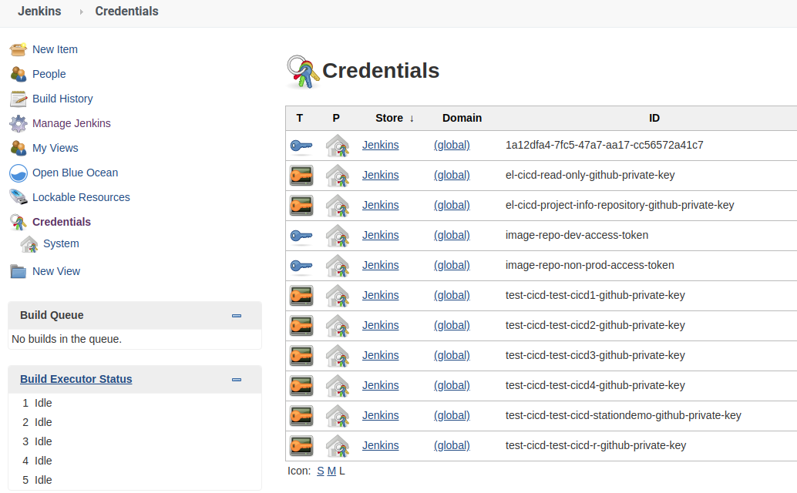

**Figure 8**  
_Non-prod Jenkins Credentials_

Then click on the Jenkins logo in the upper right, and click through the folder link in the center of the window `devops-cicd-non-prod` until you see all the pipelines created.

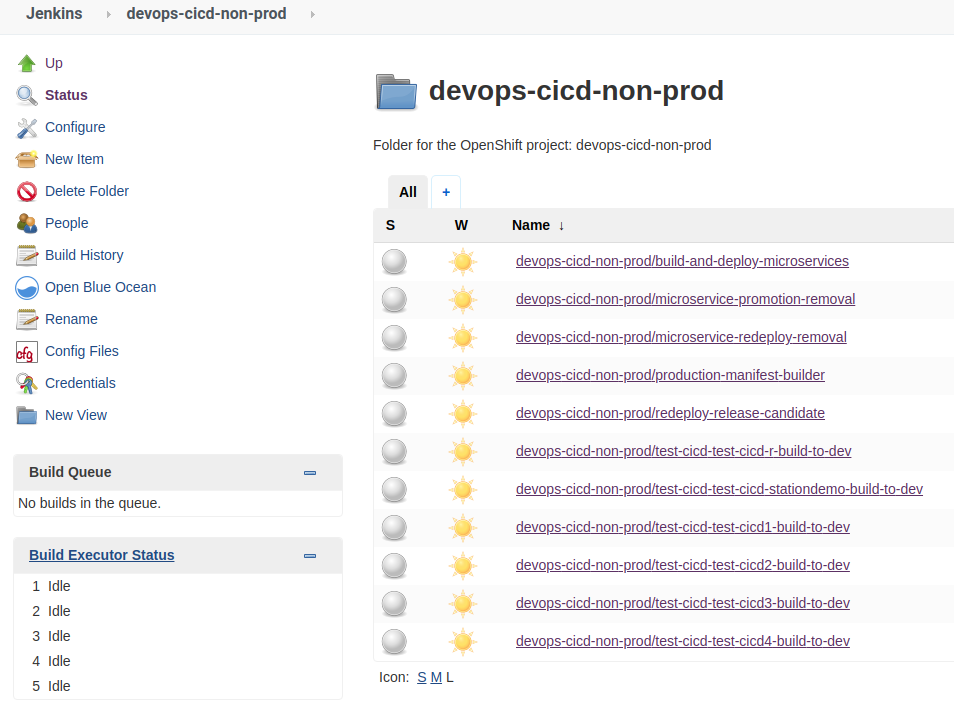

**Figure 9**  
_Non-prod Jenkins Pipelines_

#### Confirm the Configuration of the `test-cicd` Project in GitHub

Go to GitHub, and click on any of the demo repositories you cloned, go to settings, and if you check the webhooks and deploy keys, you should now see both having been just added.  Assuming you are using CRC for the demo, the webhook will not work, since the link is not accessible from GitHub.

## Non-prod SDLC Support

The following steps will demonstrate the engineering SLDC support of el-CICD.
* All microservices will be built and deployed
* All microservices will be promoted from the _dev_ environment (OKD project) through to _stg_
* Images will be rolled back and forward in test environments
* Release Candidates will be created

### Building the Project

In the real world, each microservice will have a common and similarly named development branch in its Git repository.  Each merge or push to that branch will trigger a build per the webhooks el-CICD has placed in each repository.  el-CICD also supports manual builds of the project's microservices, either by running each individual microservice's `*-build-to-dev` Pipeline, or in bulk using the `build-and-deploy-microservices` Pipeline.  To build the `test-cicd` project, we will use the latter.

1. Click on the `build-and-deploy-microservices` Pipeline from the `devops-cicd-non-prod` screen in the Non-prod Jenkins you just created
1. Click on `Build with Parameters` on the left-hand side of the window
1. Enter the `test-cicd` for the `PROJECT_ID`, and click the `Build` button
1. When the build number appears, click on it, and then click on `Console Output` on the left-hand side of the screen
1. Observe the build's log output.  When it gets to a point where it says `Input requested` and the wait spinning GIF appears, click on `Input requested`
1. Click on the `buildAll` checkbox
1. Press the `Proceed` button

This will kick off a build of all microservices in the `test-cicd` project.  This pipeline will run each individual build pipeline in parallel, three at a time, until done.

1. Click on `devops-cicd-non-prod` at the top of the window, which will return you to the list of pipelines on Jenkins
1. Note that three microservice pipelines are now running.  Choose one, and click on the link ot the pipeline.
1. Click on the build number, and then click on `Console Output` to follow the build to completion
1. If you want to watch the pods come up when they are deployed, enter the following command in your terminal:
```
watch oc get pods -n test-cicd-dev
```
1. When the build `build-and-deploy-microservices` completes, go to your command line, and enter the following:

```
oc project test-cicd-dev
oc get all
oc get cm,sealedsecrets,secrets
```

This will list all resources and running pods of the `test-cicd` project.  Confirm they are all running and in a ready state.  If you wait for four minutes, you will also see the `test-cicd3` CronJob run.

Now enter the following:

```
oc edit test-cicd-test-cicd1-meta-info
```

Every microservice deployed to an environment namespace has one of these created.  Because the _dev_ environment has no deployment branch and isn't a that value will be empty.  The `deployment-commit-hash`, project ID, and microservice name are labeled across all microservice resources deployed by el-CICD, and are used as selectors to ensure that only that latest deployment exists in the namespace after a successful deployment.  Quit the editor, and run the following:

```
oc edit cm test-cicd1-configmap
```

Notice the labels for the ConfigMap match the data in the meta-information CongigMap.

This pipeline can also used to deploy one more microservices into the Sandox environments.

You have now confirmed the successful deployment of the `test-cicd` project builds into _dev_.

If you wish, you may open up your _dev_ image repository in your browser, and see the image for each microservice was successfully pushed there.  The last image deployed to any environment is tagged with the environment name.

Quit the vi editor in the terminal and move onto the next step.

### Promoting Microservices

If you haven't already done so, click on the link `devops-cicd-non-prod` in the upper left of the Jenkins window under the Jenkins logo.  This will return you to the main pipelines window.  

1. Click on the pipeline `microservice-promotion-removal`
1. Click on 'Build with Parameters` on the left-hand side
1. Enter `test-cicd` as the PROJECT_ID
1. Click on the `Build` button
1. When the new build number appears, click on it
1. Click on `Console` on the left-hand side
1. When the logs pause and the `Input Requested` link appears, click on it
1. Select `PROMOTE` from the `defaultAction` drop down  
[**NOTE**: If `PROMOTE` or `REMOVE` is selected in this drop down, it will override any individual choices below]
1. Click the `Proceed` button

The pipeline will continue to from this point to promote images created in the _dev to the _non-prod_ image repository, and these images will be tagged as _qa_ since that's where you are promoting to.  If you read through the logs, you will notice the pipeline confirms that an image for the microservice has been created for _dev_ before attempting to deploy.  You will also see a deployment branch has been created.  When the pipeline completes, all microservices in the test-cicd project will have been promotoed and deployed.  Run the following commands:  

```
oc project test-cicd-qa
oc get all
oc get cm,sealedsecrets,secrets
```

If you compare this with what is in `test-cicd-dev`, you'll notice there is no postgresql pod anymore.  This database pod is part of the _dev_ deployment configurtation for test-cicd4 microservice.  Look in the `.openshift` directory of the Test_CICD4 repository and read the el-CICD documentation on **The .openshift Directory** for more information on how this was configured.

Now run the following:

```
oc edit test-cicd-test-cicd1-meta-info
```

Note that the `deployment-branch` value is now set to `deployment-qa-<srcCommitHash>`.  Compare the `<srcCommitHash>` value to the `src-commit-hash` value, and notice they are the same.  Go the Git repository of `Test_CICD1` in GitHub, and check the branches up there.  Note the deployment branch has been created in the remote repository.

Now open your browser to and go to your non-prod image repository, and check the test-cicd1 image that was pushed.  You'll notice two tags for it:

* qa
* qa-<srcCommitHash>

All branches, tags, and images created by builds or promotions have the original hash of the source that built image embedded into it.  This follows the reality that while images are immutable, their deployment configurations are not, so el-CICD creates deployment branches for downstream environments in the CICD process to support this.

Quit the vi editor in the terminal and move onto the next step.

### Redeploying Microservices

As noted previously, images are immutable, but deployment configurations are not.  This next step demonstrates a deployment patch by changing the deployment configuration for a particular microservice environment without having to build and promote.

First, checkout the deployment branch from the meta-information ConfigMap for `test-cidc1`

```
    oc project test-cicd-qa
    oc get test-cicd-test-cicd1-meta-info -o yaml # copy the deployment branch
    cd <path-to-Test_CICD1>/Test_CICD1
    git checkout deployment-qa-<srcCommitHash>
```

In your favorite source code editor, open the file `Test_CICD1/.openshift/template-defs.json`.  Go to the bottom of the file, and find the section with `"appName": "test-cicd-configmap"` in it.  In the `"qa" -> "params"` section, change the param `TOPIC_NAME` from `"qa topic"` to `"qa topic changed for redeploy test"`

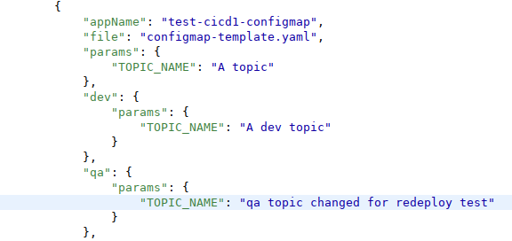

**Figure 10**  
_**qa** section of template-defs.json changed for redeployment demonstration_

Save the file, commit and push it.

Now run the pipeline `microservice-redeploy-removal`

1. Click on the pipeline `microservice-redeploy-removal`
1. Enter `test-cicd` for the PROJECT_ID
1. Click the `Build` button
1. When the new build number appears, click on it
1. Click on `Console` on the left-hand side
1. When the logs pause and the `Input Requested` link appears, click on it
1. Click the `Proceed` button, since the `redeployEnv` is already on _qa_
1. When the logs pause and the `Input Requested` link appears again, click on it
1. Choose `PROMOTE` from the `test-cicd` drop down
1. Click the `Proceed` button

To verify your change was deployed, check the logs of the newly deploy `test-cicd` image.
```
oc project test-cicd-qa
oc get pods
oc logs test-cicd1-3-<someHash>
```

You should see your changes reflected in the logs:
```
topicname value : qa topic changed for redeploy test
```

You are ready to move onto the next step.

### Image Roll Back and Roll Forward

#### Build

First, check out the `test-cicd1` development branch.
```
cd <path-to-Test_CICD1>/Test_CICD1
git checkout development
```


To be able to see how a rollback works, a new build needs to be created.  As before, in your favorite source code editor, open the file `Test_CICD1/.openshift/template-defs.json`.  Go to the bottom of the file and find the section with `"appName": "test-cicd-configmap"` in it.  In the `"qa" -> "params"` section, change the param `TOPIC_NAME` from `"qa topic"` to `"qa topic changed"`

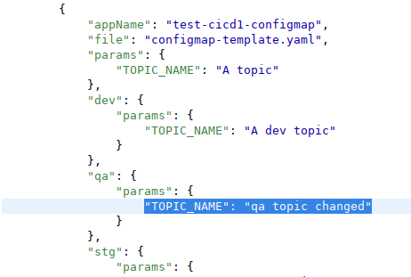

**Figure 11**  
_**qa** section of template-defs.json changed_

Save the file, commit and push it.

Click on the link `devops-cicd-non-prod` in the upper left of the Jenkins window under the Jenkins logo.

1. Click on the pipeline `test-cicd-test-cicd1-build-to-dev`
1. Click the `Build` button

You are ready to move onto the next step.

#### Promote

Click on the link `devops-cicd-non-prod` in the upper left of the Jenkins window under the Jenkins logo.

1. Click on the pipeline `microservice-promotion-removal`
1. Click on 'Build with Parameters` on the left-hand side
1. Enter `test-cicd` as the PROJECT_ID
1. Click on the `Build` button
1. When the new build number appears, click on it
1. Click on `Console` on the left-hand side
1. When the logs pause and the `Input Requested` link appears, click on it
1. Select `PROMOTE` from the `test-cicd1` drop down  
1. Click the `Proceed` button

To verify your change was promoted, check the logs of the newly deploy `test-cicd` image.
```
oc project test-cicd-qa
oc get pods
oc logs test-cicd1-2-<someHash>
```

You should see your changes reflected in the logs:
```
topicname value : qa topic changed
```

You are ready to move onto the next step.

#### Rollback

Click on `devops-cicd-non-prod` in the upper left corner.

1. Click on the pipeline `microservice-redeploy-removal`
1. Click on 'Build with Parameters` on the left-hand side
1. Enter `test-cicd` as the PROJECT_ID
1. Click on the `Build` button
1. When the new build number appears, click on it
1. Click on `Console` on the left-hand side
1. When the logs pause and the `Input Requested` link appears, click on it
1. Click on `Proceed`, since _qa_ is already chosen in the `redeployEnv` drop down
1. When the logs pause and the `Input Requested` link appears, click on it
1. Select the `test-cicd1` drop down, and pick the image that does **NOT** look like the following `>>> qa-<someHash> <<<` (this is the currently deployed image), but rather `qa-<someHash>`
1. Click the `Proceed` button
To verify your change was promoted, check the logs of the newly deploy `test-cicd` image.
```
oc project test-cicd-qa
oc get pods
oc logs test-cicd1-2-<someHash>
```

You should see your changes reflected in the logs:
```
topicname value : qa topic changed for redeploy test
```

You are ready to move onto the next step.

### Create the Release Candidates

Repeat the [Promoting Microservices](#promoting-microservices) step of the tutorial and promote all the images to _stg_.  In the instructions above when choosing `PROMOTE` also select `qa to stg` from the `promotionEnvs` drop down.

To create a Release Candidate, click the `create-release-candidate` pipeline.

1. Click on the pipeline `create-production-manifest`
1. Click on 'Build with Parameters` on the left-hand side
1. Enter `test-cicd` as the PROJECT_ID
1. Enter `1.0.0` as the RELEASE_CANDIDATE_TAG	
1. Click on the `Build` button
1. When the new build number appears, click on it
1. Click on `Console` on the left-hand side
1. When the logs pause and the `Input Requested` link appears, click on it
1. Select the following checkboxes:
	* test-cicd-stationdemo
	* test-cicd1
	* test-cicd3
1. Click on the `Proceed` button
1. When the logs pause and the links `Proceed` and `Abort` appear, read the summary to confirm your Release Candidate is properly defined as described above, and click `Proceed`

To confirm your Release Candidate was properly created, go to GitHub, and check each Git the `test-cicd-stationdemo`, `test-cicd1`, and `test-cicd3` repositories to make sure a tag in the form of `1.0.0-<srcCommitHash>` has been created.

Now repeat the above process, but use a RELEASE_CANDIDATE_TAG of `1.1.0` and select the checkboxes of `test-cicd-r, `test-cicd1`, `test-cicd2`, and `test-cicd4`.  While not a strictly "real world" test, this will give you two Release Candidates to promote, and also allow you to see how rollback and rollforward works in production.

You are ready to move onto the production workflow.

## Bootstrapping the Prod Onboarding Automation Server

From your terminal, login to the CRC cluster, and then execute the execute the bootstrap script for the Prod Onboarding Automation Server in your local el-CICD directory.

```
crc-admin-login
el-cicd-prod-bootstrap.sh
```

This script will ask a number of questions as it executes.  
* First, it will ask you to confirm the wildcard domain for the cluster.
* If the script has been run before, it will ask that you confirm the deletion of the prod master namespace.
* If you have previously installed Sealed Secrets, it will ask whether you wish to do so again.  Since CRC constitutes a single cluster install, just type 'n' or ignore for a few seconds and the input request will timeout and continue.

When the script completes, you can check each forked el-CICD repository to confirm that a read-only deploy key was **not** added this time.  The Prod Onboarding Automation Server reuses the same deploy keys as the Non-prod servers unless configured otherwise. Check that the production master namespace, el-cicd-prod-master was created and that a running instance of Jenkins was created. The script is idempotent.  Note that in the real world, for high availability and/or region specific deployments, application may have more than one cluster to deploy to.

## Onboarding a Project Into the Production Cluster

This follows the same basic procudure you went through before with the engineering cluster.

### Access the Prod Onboarding Automation Server

Open your terminal and login to CRC as admin.

```
crc-admin-login
```
Open your browser, and go to

[https://jenkins-el-cicd-prod-master.apps-crc.testing/](https://jenkins-el-cicd-prod-master.apps-crc.testing)

If the browser warns you that your connection is not private, you can safely ignore it and click  _Advanced_, and then the button _Proceed to jenkins-el-cicd-non-prod-master.apps-crc.testing (unsafe)_ .  Login to Jenkins using the CRC admin credentials, clicking initially on the `kube:admin` button.  You can simply paste the password (the CRC pull secret) from your clipboard thanks to the script above.

```
Username: kubeadmin
Password: <CRC pull secret>
```

After successfully logging in, CRC will ask you _Authorize Access_.  This will happen the first time you log into each Jenkins instance.  You may safely click _Allow selected permissions_.

From the main page on the left, click `credentials` to take you to the Jenkins credentials screen.  If you configured everything correctly, it should look exactly like the Non-prod Onboarding Automation Server credentials.


**Figure 12**  
_Non-prod Onboarding Automation Server Credentials_

If something is missing, then check your configuration, fix any issues, and run the bootstrap script again.

### Onboarding the Test-CICD Project

Click on the Jenkins logo in the upper left corner of the browser window, and the click on the `el-cicd-prod-master` folder in the center of the screen, and again on the `el-cicd-prod-master/dev-project-onboarding` to get to the prod-project-onboarding pipeline screen.

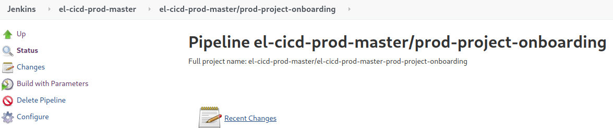

**Figure 13**  
_prod-project-onboarding Pipeline_

Click `Build with Parameters` on the left, enter `test-cicd` as the PROJECT_ID and `devops` for the RBAC_GROUP, and then click the `Build` button.  This will begin the `prod-project-onboarding` Pipeline.

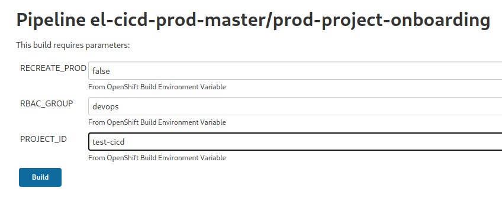

**Figure 14**  
_Entering `test-cicd` for the PROJECT_ID when kicking off the Onboarding Pipeline_

It is strongly suggested that you follow the logs of the build to see what is happening.  You can do this by clicking the build number when it appears, and then clicking `Console Output` on the left hand side fo the screen to follow the build logs in real time.

In summary, the pipeline will do the following:

* Download the Project Information Repository, and find and parse the `test-cicd` project definition
* Confirms the `devops` group's Prod Automation Server, a persistent Jenkins instance, does not exist, so it
    * Creates the `devops-cicd-prod` namespace
    * Creates the persistent Jenkins instance from a stock OpenShift template
    * Creates all the Non-prod Automation Server's pipeline (defined by BuildConfigs)
    * Copies all read-only el-CICD credentials into the new Jenkins pod instance
* Confirms the `test-cicd` prod environment does not exist
    * Creates the _prod_ namespace for `test-cicd`
* Creates a Deploy-to-Production Pipeline for the project
* Configures each microservice's Git repository
    * Creates and pushes a deploy key
* Adds the correct pull secret for the Prod Image Repository

Like in engineering, the `prod-project-onboarding` Pipeline creates and configures a great deal.  If you enter the following commands in a terminal, you can see what has been created in the `test-cicd-prod` namespace:

```
oc project test-cicd-prod
oc get sealedsecrets,secrets
```
You should see a `el-cicd-image-repo-prod-pull-secret` Sealed Secret and Secret in the namespace.

#### Confirm the Configuration of the `test-cicd` Project in Jenkins

Open your browser to the new [Prod Automation Server](https://jenkins-devops-cicd-prod.apps-crc.testing/).  As before, click through the privacy warning, and login as the `kubeadmin` again (enter `crc-admin-login` on the command line to copy the pull secret to the clipboard for simplicity's sake).  Once in, click on the `Credentials` link on the left hand side of the window, confirming general el-CICD read-only credentials, image repository pull keys, and specific microservice deploy keys have been properly added.


**Figure 15**  
_Non-prod Jenkins Credentials_

Then click on the Jenkins logo in the upper right, and click through the folder link in the center of the window `devops-cicd-non-prod` until you see the single deployment pipeline created.

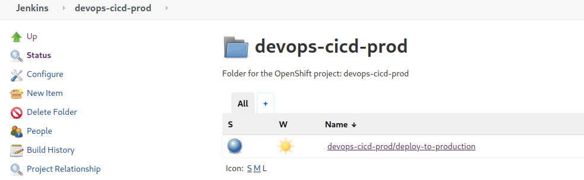

**Figure 16**  
_Prod Jenkins Pipelines_

#### Confirm the Configuration of the `test-cicd` Project in GitHub

Go to GitHub, and click on any of the demo repositories you cloned, go to settings, and if you check the deploy keys, you should now see the deploy key for production having been added.

## Prod SDLC Support

The following steps will demonstrate the production SLDC support of el-CICD.
* Promote and deploy a Release Candidate into production
* Rollback/forward a Release Version into Production

Deploying to production is one of the most important steps in the SDLC, but this portion of the demo is also the shortest.  It consists of deploying the two previous Release Candidates you created earlier, and then rolling back to the first one.  Not that rollback and rollforward is accomplished by simply choosing to deploy a version that has already been deployed once.  el-CICD has no concepts of a timeline when it comes to releases; therefore, it is advised that a good versioning scheme be agreed upon so operators can more easily understand what they are doing.

If you want to monitor the deployments of pods as it's happening, you can run the following commands in a terminal before running any of the steps below:

```
oc project test-cicd-prod
watch oc get pods
```

#### Deploy Version 1.0

Click on `devops-cicd-non-prod` in the upper left corner.

1. Click on the pipeline `deploy-to-production`
1. Click on 'Build with Parameters` on the left-hand side
1. Enter `test-cicd` as the PROJECT_ID
1. Enter `1.0.0` as the RELEASE_CANDIDATE_TAG	
1. Click on the `Build` button
1. When the new build number appears, click on it
1. Click on `Console` on the left-hand side
1. When the logs pause and the links `Proceed` and `Abort` appear, read the summary to confirm your Release Candidate is properly defined as described above, and click `Proceed`

After the pipeline completes, you should see only test-cicd-stationdemo_, _test-cicd1_, and _test-cicd3_ deployed to `test-cicd-prod`.  Verison 1.0.0 of your application is now deployed.

Run the following command:

```
oc project test-cicd-prod
oc get cm test-cicd-meta-info -o yaml
```

This map is only created in production deployments, and will hold the following data confirming your deployment:

```
microservices: test-cicd-stationdemo,test-cicd1,test-cicd3
projectid: test-cicd
release-version: v1.0.0
```

Check on GitHub in each demo project repository to see the deployment branch, `v1.0.0-<srcCommitHash>` was created.  Deployment branches in production work just like they do for the test environments, the only difference being they are named after the release.

You are now ready to move onto the next step.

#### Deploy Version 1.1

This step will demo upgrading to a new version of you application.  Click on `devops-cicd-non-prod` in the upper left corner.

1. Click on the pipeline `deploy-to-production`
1. Click on 'Build with Parameters` on the left-hand side
1. Enter `test-cicd` as the PROJECT_ID
1. Enter `1.1.0` as the RELEASE_CANDIDATE_TAG	
1. Click on the `Build` button
1. When the new build number appears, click on it
1. Click on `Console` on the left-hand side
1. When the logs pause and the links `Proceed` and `Abort` appear, read the summary to confirm your Release Candidate is properly defined as described above, and click `Proceed`

After the pipeline completes, you should see only _test-cicd1_, _test-cicd2_, _test-cicd4_, and _test-cicd-r_ deployed to `test-cicd-prod`.

Run the following command:

```
oc project test-cicd-prod
oc get cm test-cicd-meta-info -o yaml
```

This map will hold the following data confirming your deployment:

```
microservices: _test-cicd1,test-cicd2,test-cicd4,test-cicd-r
projectid: test-cicd
release-version: v1.1.0
```

Check on GitHub in each demo project repository to see the deployment branch, `v1.1.0-<srcCommitHash>` was created.

#### Rollback to Version 1.0

To roll back to version 1.0.0, simply repeat the step [Deploy Version 1.0](#deploy-version-10).  Compare the logs between the two runs for version 1.0.0 when promoting versus its redeployment to see the difference in what the pipeline does in each case.
