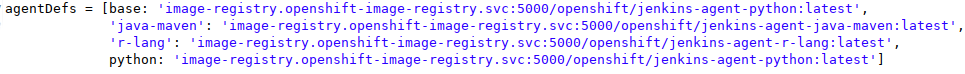
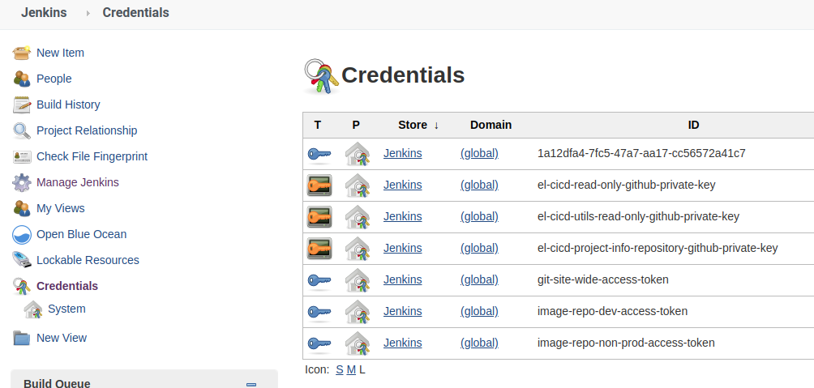
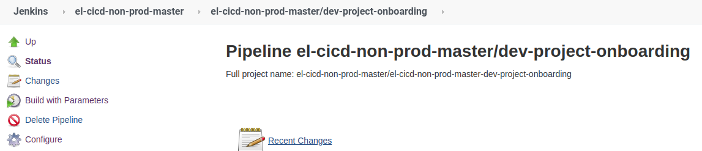
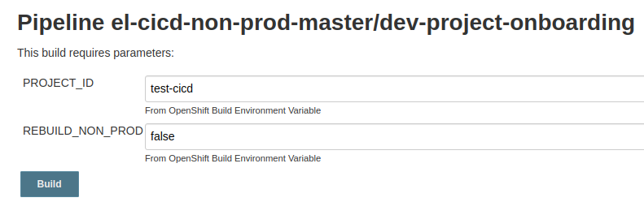
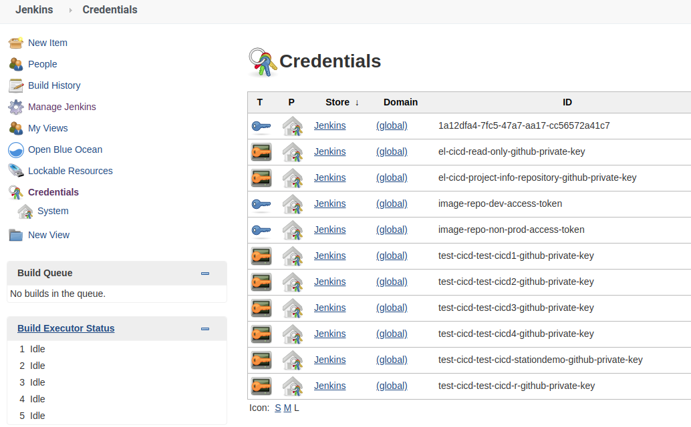

# el-CICD Tutorial
It is strongly suggested that new users to el-CICD follow work through this tutorial.  This will demonstrate most of the requirements and features of the el-CICD system.  Hands on learning is the best type of education.

#### Preamble
This document is part of the el-CICD project, a CICD system for the OKD Container Platform  

Copyright (C) 2020 Evan "Hippy" Slatis  
email: hippyod -at- yahoo -dot- com  

===================================

**NOTE: Red Hat® OpenShift® Platform is a trademark of Red Hat, Inc., and supported and owned by Red Hat, Inc.**

**el-CICD IS NEITHER SUPPORTED OR AFFILIATED IN ANY WAY WITH RED HAT, INC., OR ANY OF ITS PROJECTS.**

===================================

el-CICD is free software; you can redistribute it and/or modify it under the terms of the GNU General Public License as published by the Free Software Foundation; either version 2 of the License, or (at your option) any later version.

el-CICD is distributed in the hope that it will be useful, but **WITHOUT ANY WARRANTY; without even the implied warranty of MERCHANTABILITY or FITNESS FOR A PARTICULAR PURPOSE**.  See the GNU General Public License for more details.

You should have received a copy of the GNU General Public License along with this program; if not, write to the Free Software Foundation, Inc., 51 Franklin Street, Fifth Floor, Boston, MA  02110-1301, USA.

This document is licensed under the Creative Commons Attribution 4.0 International License. To view a copy of this license, visit http://creativecommons.org/licenses/by/4.0/ or send a letter to Creative Commons, PO Box 1866, Mountain View, CA 94042, USA.

## Minimum Requirements
If you install Red Hat CodeReady Containers, you will need to be able to allocate the following for the CodeReady Containers virtual machine:

* 8 vCPUs
* 64GB RAM
* 150GB Free Disk Space

This was tested using the above minimum specs, but note that more is always better.  el-CICD was developed with 16vCPUs and 96GB RAM in a small homelab.

This tutorial does not setup a scanner component, and the default code executes a non-functional code scan during all builds.  This will need to be implemented by the user when put into production.
 
The user will also need sudo privileges to the machine running this tutorial.

## Install and Setup CodeReady Containers (CRC)
Optional.  If you have a working OKD or OpenShift cluster you can use as a lab, then you may skip this step.  Do not try run this tutorial on a production cluster; i.e. a cluster being actively used by developers or used to run applications in production.

### Download CRC and Deploy Key
Download CRC from [here](https://developers.redhat.com/products/codeready-containers/overview).  Registration will be required, but it's free.

Copy the downloads a tar.xz file and the pull secret into the directory where you wish to install CRC and extract the tar file.

```
tar -xf crc-linux-amd64.tar.xz

mv crc-linux-X.XX.X-amd64 crc-linux-amd64
```

We move the CRC directory containing the decompressed files to a generic directory so we don't have to continually update our path whenever we upgrade versions.

### Add the following to your .bashrc or .zshrc
You may remove this after the demo, but these helpers make things easier so you don't have to deal directly with the pull secret during multiple logins.  If you wish to allocate more vCPUs or memory, adjust the values at the top appropriately.

```
CRC_V_CPU=8
CRC_MEMORY=65536
CRC_SHELL=bash  # or zsh

export PATH=$PATH:${HOME}/path/to/crc/crc-linux-amd64:

# Automatically sets up oc CLI command completion if CRC installed
if [[ -f ~/.crc/machines/crc/crc ]]
then
    eval $(crc oc-env)
    source <(oc completion ${CRC_SHELL})
fi

# Starts CRC with proper sizing for vCPUs and memory
function crc-start() {
    crc start -p ${HOME}/path/to/crc/pull-secret -c ${CRC_V_CPU} -m ${CRC_MEMORY}
}

# Copy the kube:admin pull secret to the clipboard
function crc-pwd-admin {
    echo "copy kubeadmin to system clipboard"
    CRC_TEMP_PWD=$(crc console --credentials | sed -n 2p | sed -e "s/.*'\(.*\)'/\1/" | awk '{print $6}' )
    echo ${CRC_TEMP_PWD} | xclipc
    echo "${CRC_TEMP_PWD} copied to clipboard for use"
    CRC_TEMP_PWD=
}

# Login to CRC as kube:admin and copy the pull secret to the clipboard
function crc-admin-login {
    echo "crc login as kubeadmin"
    CRC_LOGIN=$(crc console --credentials | sed -n 2p | sed -e "s/.*'\(.*\)'/\1/")
    eval ${CRC_LOGIN}
    crc-pwd-admin
    LOGIN=
}
```

### Initial CRC Setup and Install
Run

```
crc setup
crc-start  # PAY ATTENTION TO THE DASH!!
crc stop
```

This will complete initial setup and create the virtual machine image for CRC with the requested vCPUs and memory.

### Adjust the virtual disk space of the CRC VM
The following will need to be run in order resize the virtual disk, or you will not be able to complete the tutorial from running out of disk space.

```
 # whatever size you want, but 100G is easily reasonable
qemu-img resize ${HOME}/.crc/machines/crc/crc +100G

  # for verification that the change took
qemu-img info ${HOME}/.crc/machines/crc/crc | grep 'virtual size'

# Restart CRC
crc-start

# Need to ssh into the CRC VM, and resize the filesystem
ssh -i ${HOME}/.crc/machines/crc/id_rsa core@192.168.130.11
sudo xfs_growfs /sysroot
exit
```
CRC is now setup and ready to use for the purposes of the el-CICD tutorial.

## Setup, Configure, and Bootstrap el-CICD
This section will cover the minimum necessary steps to install el-CICD.  It will cover basic configuration, repositories needed, and secrets that will need to be gathered.  At the end of this section the Non-prod Onboarding Automation Server have been configured and created in your cluster.

### Fork and Clone el-CICD Repositories
This tutorial assumes you will be using [GitHub](github.com) as your Git repository.

The **master** branches of the following repositories should always be forked when installing el-CICD:
* [el-CICD](https://github.com/hippyod/el-CICD)
* [el-CICD-utils](https://github.com/hippyod/el-CICD-utils)

Clone the **el-CICD** repository locally, since you will need to modify the contents of this repository to hold the configuration for your installation.

The **development** branches of the following repositories are forked this demo **only**:
* [Test-CICD1](https://github.com/hippyod/Test-CICD1)
* [test_CICD2](https://github.com/hippyod/test_CICD2)
* [TeSt-CiCd3](https://github.com/hippyod/TeSt-CiCd3)
[Test_CICD4](https://github.com/hippyod/Test_CICD4)
* [test-cicd-R](https://github.com/hippyod/test-cicd-R)
* [test-cicd-stationdemo](https://github.com/hippyod/test-cicd-stationdemo)

The **development** branch of the project information repository should also be forked, and you may continue to use it if you wish in production, or create your own:
* [el-CICD-project-repository](https://github.com/hippyod/el-CICD-project-repository)

**TIP**: You may also fork the [el-CICD-docs](https://github.com/hippyod/el-CICD-docs) repository, and modify or annotate the README.md to track your changes and configuration.  It is suggested that the original repository be set as an upstream in this case, in order for easy syncing if necessary.  How to do this is outside the scope of this tutorial.

### Create Image Repositories
For the purposes of this demo, we will use [Docker Hub](https:hub.docker.com/) to host our repositories.  You only need a single repository, but in order to more closely mirror what you might do in a production environment, we'll create three:

* \<unique-demo-name>dev
* \<unique-demo-name>nonprod
* \<unique-demo-name>prod

This will better demonstrate what is most likely needed for a production setup.  It will also require three separate accounts, so if you don't feel like registering three separate times, just use a single repository.

**Tip**: If you have a GMail account, it's easy to use the same email address to create each repository.  When creating the repository on Docker Hub, register with your email in the following fashion

```
<gmail-id>+<unique-demo-name>dev@gmail.com
```
This way the same email can be used to create each separate repository.

### Create the Jenkins Agents
In order to run the builds, a number of Jenkins Agents must be available for use.  Some simple, default Agents have been defined for use by all the demo projects.  The default Agents that OKD comes with will not be useful, since the el-CICD relies heavily on the `skopeo` tool for image verification, promotion, and tagging.

1. Log into the CRC cluster.  
`$crc-admin-login
`
1. Change to the openshift namespace.
``oc project openshift`

1. From the el-CICD directory, create a new builds for the following Jenkins Agents by running the following commands.

```
cat agents/Dockerfile.python | oc new-build -D - --name jenkins-agent-python -n openshift

cat agents/Dockerfile.java-maven | oc new-build -D - --name jenkins-agent-java-maven -n openshift

cat agents/Dockerfile.R | oc new-build -D - --name jenkins-agent-r-lang -n openshift
```
You can follow the logs of any of these three builds if you wish, but it's not germane to the tutorial.

To see how these Agents are tied into the el-CICD Build Framework, take a look at the file `vars/elCicdNode.groovy` in the `el-CICD-utils` repository.  This utility defines the Agent using the Jenkins Kubernetes plugin, and at the top is a map that defines the types of Jenkins Pipeline Nodes for el-CICD per codebase, and the Agent images that are used for each codebase.  Should you wish to add new build definitions to your installation, you will create a new Agent image as above, andmap the codebase to the image.



**Figure 1**  
_code bases mapped to their Jenkins Agents_

### el-CICD Secrets
The following will cover how to create the deploy keys for all necessary Git repositories.  The following will assume you have created a specific directory `el-CICD-secrets.config` expects.  Doing this and creating the appropiate files as directed below will make it easy for el-CICD bootstrap scripts to run without effort for purposes of this demo.  We suggest taking a look through the file, too, and read up on it in the el-CICD documentation.

#### The Easy Route
In the same directory where you cloned the el-CICD repository, create a sibling directory.

```
mkdir cicd-secrets
```

The bootstrap script looks for the files that contain the secrets in this directory by default.  The following will assume you've done this, and will give instructions on creating the files el-CICD bootstrap scripts expect.  Obviously, outside this demo you will need to ensure this directory is either protected, or the files stored securely somewhere else when not doing setup.

#### Create el-CICD Repo Read Only Private Keys
In the `cicd-secrets` directory, run the following commands:
```
ssh-keygen -b 2048 -t rsa -f 'el-CICD-deploy-key' -q -N '' -C 'Jenkins Deploy key for el-CICD'

ssh-keygen -b 2048 -t rsa -f 'el-CICD-utils-deploy-key' -q -N '' -C 'Jenkins Deploy key for el-CICD-utils'

ssh-keygen -b 2048 -t rsa -f 'el-cicd-project-info-repository-github-private-key' -q -N '' -C 'Jenkins Deploy key for el-CICD-utils'
```

Each of these in turn will create the proper read only ssh keys for el-CICD to pull updated code for running the system for each pipeline.

#### Gather el-CICD Access Token

Create a read/write personal access token for the account that forked all of the above repositories.  You can do this when signed into the account at []().  This account will mimic a service account you would create for production us of el-CICD.  Copy and paste that token into the file

```
cicd-secrets/el-cicd-git-repo-access-token
```

#### Gather Image Repo Access Tokens

For each of the three image repositories you creates above, create a read/write access token.  Sign into each account you created for each repository, and head to [here](https://hub.docker.com/settings/security) to create the access token.  Copy and paste into the files

* Dev Repository
```
cicd-secrets/el-cicd-dev-pull-token
```
* Non-prod Repository  
In this demo there are three non-prod environments, so you will have to copy the same access token into three separate files.

```
cicd-secrets/el-cicd-non-prod-pull-token
cicd-secrets/el-cicd-non-prod-pull-token
cicd-secrets/el-cicd-non-prod-pull-token
```
* Prod Repository
```
cicd-secrets/el-cicd-prod-pull-token
```

### el-cicd-bootstrap.config
In `el-cicd-bootstrap.config`, you need to enter the following values:

Replace `hippyod` with the organization where you cloned your fork the of the el-CICD repositories.

```
EL_CICD_GIT_REPO=git@github.com:hippyod/el-CICD.git
EL_CICD_UTILS_GIT_REPO=git@github.com:hippyod/el-CICD-utils.git
EL_CICD_PROJECT_INFO_REPOSITORY=git@github.com:hippyod/el-CICD-project-repository.git
```

Replace the following values for the image repositories for each environment.  You will find more concrete examples of what this should look like with the default values in the file.

```
*_IMAGE_REPO_USERNAME=<unique-demo-name><env>
*_IMAGE_REPO=docker.io/<unique-demo-name><env>
```

el-CICD is now ready to be installed and run.

### Bootstrapping the Non-prod Onboarding Automation Server
Login to the CRC cluster, and then execute the execute the bootstrap script for the Non-prod Non-prod Onboarding Automation Server.

```
crc-admin-login
el-cicd-non-prod-bootstrap.sh
```

This script will ask a number of questions as it executes.  
* First, it will ask you to confirm the wildcard domain for the cluster.
* If the script has been run before, it will ask that you confirm the deletion of the non-prod master namespace.
* If you have previously installed Sealed Secrets, it will ask whether you wish to do so again.

When the script completes, you can check each forked el-CICD repository to confirm that a read-only deploy key was added. Check that the master namespace, `el-cicd-non-prod-master` was created and that a running instance of Jenkins was created. The script is idempotent.

#### Setting Your Cluster's Sealed Secrets Decryption Key
Each microservice repository you cloned for the purpose of this tutorial has an example of a Sealed Secret.  You will not be able to deploy any of the microservices in this tutorial without being able to decrypt them.  This part of the tutorial is actually important to pay attention to, because if you deploy your projects more than once across multiple clusters, you'll need to make sure that each cluster has the correct decryption key for them.  This process is documented in more detail on the [Sealed Secrets](https://github.com/bitnami-labs/sealed-secrets#how-can-i-do-a-backup-of-my-sealedsecrets) site, but instead of backup and restoring, this a backup and copy operation.

In the same repository as this tutorial there is a file call `master.key.tar`.  Download this file and run the following commands.

```
tar -xf master.key.tar
oc apply -f master.key
oc delete pod -n kube-system -l name=sealed-secrets-controller
```

This will restore the encryption/decryption keys of the Sealed Secrets need in the tutorial's microservices, and restart the Sealed Secrets controller to pick up the changed keys.  To create the key for use among multiple clusters, use the following command:

```
oc get secret -n kube-system -l sealedsecrets.bitnami.com/sealed-secrets-key -o yaml >master.key
```

### Bootstrapping the Prod Onboarding Automation Server
Login to the CRC cluster, and then execute the execute the bootstrap script for the Prod Onboarding Automation Server.

```
crc-admin-login
el-cicd-prod-bootstrap.sh
```

This script will ask a number of questions as it executes.  
* First, it will ask you to confirm the wildcard domain for the cluster.
* If the script has been run before, it will ask that you confirm the deletion of the prod master namespace.
* If you have previously installed Sealed Secrets, it will ask whether you wish to do so again.  Since CRC constitutes a single cluster install, just type 'n'.

When the script completes, you can check each forked el-CICD repository to confirm that a read-only deploy key was added. Check that the master namespace, el-cicd-prod-master was created and that a running instance of Jenkins was created. The script is idempotent.  Note that in the real world, for high availability and/or region specific deployments, application may have more than one cluster to deploy to.

## Onboarding a Project Into the Engineering Cluster
With el-CICD configuration and bootstrapping complete, el-CICD can begin managing projects.  This demo makes the assumption that the Project Information Repository already has projects defined in it, and defining projects in project information files are not part of this demo.  In a real installation, it is preferable some sort of automation from an organization's project database will most likely be generating the project information files.

The following will take you through a typical set of steps that see two separate sets of releases deployed.  In the real world, the second release would be developed and built, but here we are just demonstrating general system functionality, so as with most demos, it is a bit contrived.

### Access the Non-prod Onboarding Automation Server
Open your terminal and login to CRC as admin.  If you followed previous instructions, this will also copy the pull secret to your clipboard.

```
crc-admin-login
```
Open your browser, and go to  

[https://jenkins-el-cicd-non-prod-master.apps-crc.testing/](https://jenkins-el-cicd-non-prod-master.apps-crc.testing)

If the browser warns you that your connection is not private, you can safely ignore it and click  _Advanced_ , and then the link _Proceed to jenkins-el-cicd-non-prod-master.apps-crc.testing (unsafe)_ .  Login to Jenkins using the CRC admin credentials, clicking initially on the `kube:admin` button.  You can simply paste the password (the pull secret) from your clipboard thanks to the script above.

```
Username: kubeadmin
Password: <CRC pull secret>
```

After successfully logging in, CRC will ask you _Authorize Access_.  This will happen the first time you log into each Jenkins instance.  You may safely click _Allow selected permissions_.

From the main page on the left, click `credentials` to take you to the Jenkins credentials screen.  If you configured everything correctly, it should look like the following.



**Figure 2**  
_Non-prod Onboarding Automation Server Credentials_

### Onboarding the Test-CICD Project
Click on the Jenkins logo in the upper left corner of the browser window, and the click on the `el-cicd-non-prod-master` folder in the center of the screen, and again on the `el-cicd-non-prod-master/dev-project-onboarding` to get to the dev-project-onboarding pipeline screen.



**Figure 3**  
_dev-project-onboarding Pipeline_

Click `Build with Parameters` on the left, enter `test-cicd` as the PROJECT_ID, and then click the `Build` button.  This will begin the dev-project-onboarding Pipeline.



**Figure 4**  
_Entering `test-cicd` for the PROJECT_ID when kicking off the Onboarding Pipeline_

It is strongly suggested that you follow the logs of the build to see what is happening.  You can do this by clicking the build number when it appears, and then clicking `Console Output` on the left hand side fo the screen to follow the build logs in real time.

In summary, the pipeline will do the following:

* Download the Project Information Repository, and find and parse the `test-cicd` project definition
* Confirms the `devops` group's Non-prod Automation Server, a peristent Jenkins instance, does not exist, so it  
    * Creates the `devops-cicd-non-prod` namespace
    * Creates all Non-prod Automation Server's shared pipelines
    * Copies all read-only el-CICD credentials into the new Jenkins pod instance
* Confirms the `test-cicd` enviroments do not exist
    * Creates each a namespace per the `test-cicd` definition for _dev_, _qa_, and _stg_
* Creates a Build-To-Dev Pipeline for each microservice in the project
* Configures each microservice's Git repository
    * Creates and pushes a deploy key
    * Pushes a webhook
* Adds the correct pull secret to each namespace created

As you can see, the dev-project-onboarding Pipeline creates and configures a great deal in order to get a project moving.  If you enter the following commands in a terminal, you can see an example of the namespaces and secrets created;

```
oc project test-cicd-dev
oc get sealedsecrets
oc get secrets
```
In each case, you should see a `el-cicd-image-repo-dev-pull-secret` Sealed Secret and Secret in the namespace.  Checking the _qa_ and _stg_ namespaces will have a similar result.

#### Confirm the Configuration of the `test-cicd` Project in Jenkins
Open your browser to the new [Non-prod Automation Server](https://jenkins-devops-cicd-non-prod.apps-crc.testing/).  As before, click through the privacy warning, and login as the `kubeadmin` again (enter `crc-admin-login` on the command line to copy the pull secret to the clipboard for simplicity's sake).  One in, click on the `Credentials` link on the left hand side of the window, confirming general el-CICD read-only credentials, image repository pull keys, and specific microservice deploy keys have been properly added.

[**NOTE**: In the real world, the project would belong to an actual group, whether in OKD directly or as part of your organization's authentication mechanism, and you would log in as an authenticated OKD user and **not** admin.  el-CICD makes every member of the project's group an OKD namespace admin for the Non-prod Automation Server of the group.]



**Figure 5**  
_Non-prod Jenkins Credentials_

Then click on the Jenkins logo in the upper right, and click through the folder link in the center of the window `	devops-cicd-non-prod` until you see all the pipelines created.


**Figure 6**  
_Non-prod Jenkins Pipelines_

#### Confirm the Configuration of the `test-cicd` Project in GitHub
Go to your GitHub demo project repositories, and check the settings.  If you click on any of the demo repositories you cloned, go to settings, and click on the webhooks or deploy keys, you should now see both having been just added.  Assuming you are using CRC for the demo, this key will not work, since the link is probably not accessible from GitHub.

## Basic SDLC Functionality
The following steps will demonstrate the basic SLDC support that el-CICD.
* All microservices will be built and deployed
* All microservices will be promoted from _dev_ through to _stg_
* Images will be rolled back and forward in test environments
* A Release Candidate will be created
* The Release Candidate will be promoted and deployed as a Release.

### Software Development
In the real world, many development teams will have a common development branch in Git per microservice, and will create a feature branch from that to work on particular features.  In order to build and test, el-CICD supports the concept of Sandboxes.  These are namespaces shared among the users of the project (i.e. members of the RBAC group that own the project) in OKD that are part of a project and can be arbitrarily deployed to for development testing purposes.  Note that Sandboxes are merely places to test things like feature builds and deployments in OKD, and these builds are not avaiable for promotion.

The `build-and-deploy-microservices` Pipeline supports this functionality.  To test this

1. Click on this pipeline from the `devops-cicd-non-prod` screen in the Non-prod Jenkins you just created
1. Click on `Build with Parameters` on the lefthand side of the window
1. Enter the `test-cicd` for the `PROJECT_ID`, and click the `Build` button
1. When the build number appears, click on it, and then click on `Console Output` on the left hand side of the screen
1. Observer the output.  When it gets to a point where it says `Input requested` and the wait spinning GIF appears, click on it
1. Select `test-cicd-sandbox-1' from the drop down, click on the `test-cicd1` checkbox, and click `Proceed`

This will kick off a build of the `test-cicd1` microservice from this pipeline.  Note that you can also `recreateAll`, which will remove any prior deployments to the sandbox, and `buildAll` which will ignore any individual microservice checkboxes and deploy all microservices in the project to the selected environment.  `recreateAll` can also be used by itself without actually building any microservices in order to clean out _dev_ or any of the Sandboxes_.

1. Click on `devops-cicd-non-prod` at the top of the window, which will return you to the list of pipelines on Jenkins
1. Notice that the `devops-cicd-non-prod/test-cicd-test-cicd1-build-to-dev` pipeline is running, and click on the link
1. Click on the build number, and then click on `Console Output` to follow the build to completion
1. When the build successfully completes, go to your command line, and enter the following:

```
oc project test-cicd-sandbox-1
oc get all
oc get cm,sealedsecrets,secrets
```

This will list all resources and running pods of the `test-cicd1` microservice.  Confirm you have one pod ready and running in the Sandbox.

Now enter the following:

```
oc edit test-cicd-test-cicd1-meta-info
```

Compare the values in the ConfigMap to the values in the Console Output of Jenkins.  

The Sandbox allows developers to test their code as deployed in isolation or in conjunction with supporting microservices.  Multiple deployments may be necessary if all microservices to be deployed into the sandbox do not share the same branch name.  Deployments into Sandboxes will use the same deployment configuration as used for the _dev_ environment.

You have now confirmed the successful deployment of `test-cicd1` into a Sandbox.  Quit the vi editor in the terminal and move onto the next step.

### Building the Project
Normally builds into Dev will happen automatically 

### Promoting Microservices
### Redeloying Microservices
### Image Roll Back and Roll Forward
### Creating a Release Candidate
### Deploying to Production

## The Second Release

### Creating a Second Release Candidate
### Deploying Second Release to Production
### Release Roll Back and Roll Forward in Production

## A Hotfix
#### Create the Hotfix Branches
#### Onboard the Test-CICD Hotfix Project
#### Redeploy the Release Candidate
#### Build and Promote the Hotfix
#### Create Hotfix Release Candidate
#### Deploy Hotfix to Production