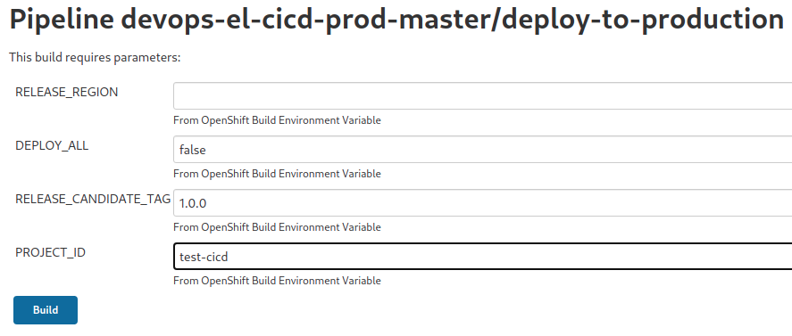

# el-CICD Administration Tutorial

It is strongly suggested that new users to el-CICD work through this tutorial.  This will demonstrate most of the requirements and features of the el-CICD system from setup through the different usage scenarios you'll use as part of your software development lifecycle (SDLC).  Hands on learning is always the best type of education.

## Preamble

This document is part of the el-CICD project, a CICD system for the OKD Container Platform  

Copyright (C) 2021 Evan "Hippy" Slatis  
email: hippyod -at- yahoo -dot- com  

===================================

**NOTE: Red Hat® OpenShift® Platform is a trademark of Red Hat, Inc., and supported and owned by Red Hat, Inc.**

**el-CICD IS NEITHER SUPPORTED OR AFFILIATED IN ANY WAY WITH RED HAT, INC., OR ANY OF ITS PROJECTS.**

===================================

## License

el-CICD is free software; you can redistribute it and/or modify it under the terms of the GNU Lesser General Public License as published by the Free Software Foundation; either version 2.1 of the License, or (at your option) any later version.

This library is distributed in the hope that it will be useful, but **WITHOUT ANY WARRANTY; without even the implied warranty of MERCHANTABILITY or FITNESS FOR A PARTICULAR PURPOSE**.  See the GNU Lesser General Public License for more details.

You should have received a copy of the GNU Lesser General Public License along with this library; if not, write to

```text
The Free Software Foundation, Inc.
51 Franklin Street
Fifth Floor
Boston, MA
    02110-1301
```

This document is licensed under the Creative Commons Attribution 4.0 International License. To view a copy of this license, visit

http://creativecommons.org/licenses/by/4.0/ 

or send a letter to

```text
Creative Commons
PO Box 1866
Mountain View, CA
   94042, USA
```

# Table of Contents

* [el-CICD Administration Tutorial](#el-cicd-administration-tutorial)
  * [Preamble](#preamble)
  * [License](#license)
* [Table of Contents](#table-of-contents)
  * [Minimum Requirements](#minimum-requirements)
  * [Overview](#overview)
  * [Install and Setup Red Hat CodeReady Containers (CRC)](#install-and-setup-red-hat-codeready-containers-crc)
    * [Download CRC and the Deploy Key](#download-crc-and-the-deploy-key)
    * [Download the el-CICD Release](#download-the-el-cicd-release)
    * [crc-helper.sh](#crc-helpersh)
    * [CRC Setup and Install](#crc-setup-and-install)
  * [Setup, Configure, and Bootstrap el-CICD](#setup-configure-and-bootstrap-el-cicd)
    * [Download the Release el-CICD Repositories](#download-the-release-el-cicd-repositories)
    * [Create Image Repositories](#create-image-repositories)
    * [el-CICD Secrets](#el-cicd-secrets)
      * [Create el-CICD Repo Read Only Private Keys](#create-el-cicd-repo-read-only-private-keys)
      * [Gather el-CICD GitHub Repository Access Token](#gather-el-cicd-github-repository-access-token)
      * [Gather Image Repo Access Tokens](#gather-image-repo-access-tokens)
    * [Configure el-cicd-non-prod.conf](#configure-el-cicd-non-prodconf)
      * [el-cicd.non-prod.conf](#el-cicdnon-prodconf)
      * [el-cicd-default-system.conf](#el-cicd-default-systemconf)
      * [el-cicd-prod.conf](#el-cicd-prodconf)
    * [Bootstrapping the Non-prod Onboarding Automation Server](#bootstrapping-the-non-prod-onboarding-automation-server)
      * [Verify the Install](#verify-the-install)
      * [Run Setup Again [optional]](#run-setup-again-optional)
      * [Bootstrap the Prod Onboarding Automation Server](#bootstrap-the-prod-onboarding-automation-server)
      * [Final Tutorial Setup](#final-tutorial-setup)
        * [Restart CRC](#restart-crc)
    * [Further Considerations](#further-considerations)
  * [Onboarding a Project Into the Engineering Cluster](#onboarding-a-project-into-the-engineering-cluster)
    * [Access the Non-prod Onboarding Automation Server](#access-the-non-prod-onboarding-automation-server)
    * [Onboarding the `test-cicd` Project to a Non-prod Automation Server](#onboarding-the-test-cicd-project-to-a-non-prod-automation-server)
      * [Confirm the Configuration of the `test-cicd` Project in the Non-prod Automation Server](#confirm-the-configuration-of-the-test-cicd-project-in-the-non-prod-automation-server)
      * [Confirm Non-prod Configuration of the `test-cicd` Project in GitHub](#confirm-non-prod-configuration-of-the-test-cicd-project-in-github)
  * [Non-prod SDLC Support](#non-prod-sdlc-support)
    * [Building the Project](#building-the-project)
      * [Reading the Build Logs](#reading-the-build-logs)
    * [Promoting Microservices](#promoting-microservices)
      * [Promote to Stg](#promote-to-stg)
    * [Redeploying Microservices](#redeploying-microservices)
      * [Use Test-CICD1](#use-test-cicd1)
      * [Understanding Test-CICD1's Deployment Configuration](#understanding-test-cicd1s-deployment-configuration)
      * [Create and Promote a New Image](#create-and-promote-a-new-image)
      * [Apply a Deployment Patch](#apply-a-deployment-patch)
      * [Roll Back test-cicd1 in QA to the Original Image](#roll-back-test-cicd1-in-qa-to-the-original-image)
      * [[Optional] Roll Forward to Deployment Patched Image, and Promote](#optional-roll-forward-to-deployment-patched-image-and-promote)
    * [Create the Release Candidates](#create-the-release-candidates)
  * [Onboarding a Project Into the Production Cluster](#onboarding-a-project-into-the-production-cluster)
    * [Access the Prod Onboarding Automation Server](#access-the-prod-onboarding-automation-server)
    * [Onboarding the Test-CICD Project to a Prod Automation Server](#onboarding-the-test-cicd-project-to-a-prod-automation-server)
      * [Confirm the Configuration of the `test-cicd` Project in the Prod Automation Server](#confirm-the-configuration-of-the-test-cicd-project-in-the-prod-automation-server)
      * [Confirm Prod Configuration of the `test-cicd` Project in GitHub](#confirm-prod-configuration-of-the-test-cicd-project-in-github)
  * [Deploying to Production](#deploying-to-production)
  * [Optional Production Tasks](#optional-production-tasks)
    * [Upgrading a Release Version, Release Regions, Rolling Forward, and Rolling Back](#upgrading-a-release-version-release-regions-rolling-forward-and-rolling-back)
    * [Application Deployment Patching](#application-deployment-patching)
    * [Hotfixing an Application](#hotfixing-an-application)

## Minimum Requirements

If you install Red Hat CodeReady Containers, you will need to be able to allocate the following for the CodeReady Containers virtual machine:

* CRC Version 1.25, corresponding to OpenShift version 4.7.5
* 6 vCPUs
* 48GB RAM
* 100GB Free Disk Space

This was tested using the above minimum specs, but note that more is always better.  el-CICD was developed with 12 vCPUs and 64GB RAM on a refurbished Dell R610 (circa 2011?) rack server homelab.  It was tested running under Fedora 32 and 33, and the instructions will need to be adapted if you're running on RHEL, CentOS, or Fedora.

This tutorial does not setup a scanner component, and the default code executes a non-functional code scan during all builds.  This will need to be implemented by the user when put into production if scanning code is a requirement.

You need sudo privileges on the machine running this tutorial, and cluster admin rights on an OKD cluster if CRC is not used.  **DO NOT** try running this tutorial on a production cluster (i.e. a cluster being actively used for engineering purposes by developers or used to run applications in production), unless installing the Sealed Secrets controller on your cluster is acceptable.  The tutorial requires Sealed Secrets to function.

This tutorial assumes you have some familiarity with Git, CICD, and Kubernetes concepts.

## Overview

**Time: 2-3 hrs**

This tutorial will take you through the minimal steps to setup and install el-CICD.  Most of the work will be downloading and setting up the required Git and Docker repositories for the tutorial to work.  Actually using el-CICD will take some time mainly waiting for build and deployments to complete, and at the end you will have a good overview of el-CICD's features and how easily it can support, manage, and streamline your organizations software development process.

## Install and Setup Red Hat CodeReady Containers (CRC)

Optional.  If you have a working OKD or OpenShift cluster with cluster admin privileges that you can use as a lab, then you may skip this step.  **DO NOT** try running this tutorial on a production cluster (i.e. a cluster being actively used for engineering purposes by developers or used to run applications in production), unless installing the Sealed Secrets controller on your cluster is acceptable.  The tutorial requires Sealed Secrets to function.

### Download CRC and the Deploy Key

**CURRENT TESTED VERSION OF CRC:* **1.25**

Download CRC from [here](https://developers.redhat.com/products/codeready-containers/overview).  Registration will be required, but it's free.

Copy the tar.xz file and the pull secret you downloaded into the directory where you wish to install CRC and extract the tar file.

```bash
tar -xf crc-linux-amd64.tar.xz

mv crc-linux-X.XX.X-amd64 crc-linux-amd64
```

We move the CRC directory containing the decompressed files to a generic directory so we don't have to continually update our path whenever we upgrade versions, and then added the path to the `crc` binary to our `$PATH`.  We keep the original, now empty folder next to the files as an extra reference to what version we are using.

**You also need to copy or download your CRC pull secret to a file called `pull-secret` in the same directory where CRC has been installed (see figure below).  CRC will not work without it.**


**Figure 1**  
_CRC install directory structure with pull-secrets file and original *.tar.xz CRC download included_

### Download the el-CICD Release

The latest el-CICD release can be found [here](https://github.com/elcicd/el-CICD-RELEASES).  Each release is tagged with its version, and it contains the el-CICD code configuration, test projects, and a copy of the the `el-CICD-docs` repository this tutorial resides in is contained within.

### crc-helper.sh

In the `el-CICD-docs/tutorial-scripts` directory, the file `crc-helper.sh` exists.  This file contains a few helper functions and settings for functions making use of CRC easier.  Open this file, set the `$PATH` to where the `crc` binary is located, and adjust the following settings to your homelab's available resources.

```bash
#!/bin/bash

export PATH=$PATH:${HOME}/path/to/crc-linux-amd64:

CRC_INSTALL_DIR=$(dirname $(which crc))/..

# PREFERRED CRC OPTIONS
# MINIMUM VALUES ARE 6 vCPUs and 49152M MEMORY
# PREFERRED VALUES ARE 12 CORES AND 65536M MEMORY
# 100G DISK IS SUFFICIENT, BUT 250G DOESN'T HURT

CRC_V_CPU=12
# CRC_V_CPU=6
CRC_MEMORY=65536
# CRC_MEMORY=49152
CRC_DISK=250
# CRC_DISK=100

CRC_SHELL=bash
#CRC_SHELL=zsh

function eval-oc-env() {
    eval $(crc oc-env)
    source <(oc completion ${CRC_SHELL})
}

if [[ -f ~/.crc/machines/crc/crc.qcow2 ]]
then
    eval-oc-env
fi

function crc-start() {
    echo "Starting CRC with ${CRC_V_CPU} vCPUs, ${CRC_MEMORY}M memory, and ${CRC_DISK}G disk"
    echo "If you want to change the above values, run 'crc delete' and recreate the VM from scratch."
    echo ''

    crc config set cpus ${CRC_V_CPU}
    crc config set memory ${CRC_MEMORY}
    crc config set disk-size ${CRC_DISK}
    # crc config set enable-cluster-monitoring true
    crc config set pull-secret-file ${CRC_INSTALL_DIR}/pull-secret
    crc start

    crc-admin-login
}


function crc-pwd-admin {
    echo "copy kubeadmin secret to system clipboard"
    CRC_TEMP_PWD=$(crc console --credentials | sed -n 2p | sed -e "s/.*'\(.*\)'/\1/" | awk '{print $6}' )
    echo ${CRC_TEMP_PWD} | xclipc
    echo "${CRC_TEMP_PWD} copied to clipboard for use"
    CRC_TEMP_PWD=
}

function crc-admin-login {
    crc-pwd-admin
    echo
    echo "crc login as kubeadmin"
    CRC_LOGIN=$(crc console --credentials | sed -n 2p | sed -e "s/.*'\(.*\)'/\1/")
    eval ${CRC_LOGIN}
    CRC_LOGIN=
}
```

### CRC Setup and Install

```bash
source ${HOME}/path/to/el-CICD-docs/tutorial-scripts/crc-helper.sh

crc setup

# PAY ATTENTION TO THE DASH IN THE COMMAND!!
# Uses the pull secret automatically
# Copies it to the clipboard for easy login through apps or console in browser
crc-start
```

If you accidentally start CRC without the dash, you will need to run `crc delete` and run `crc-start`, or the resource settings will not take.  CRC VM resource settings cannot be changed once started without deleting the CRC VM and beginning again.

## Setup, Configure, and Bootstrap el-CICD

This section will cover the minimum necessary steps to install el-CICD.  It will cover basic configuration, setting up the repositories needed for images and code, and the credentials for secrets that will need to be gathered.  At the end of this section the Non-prod Onboarding Automation Server will have been configured and created in your cluster.

[**NOTE**: This part of setting up tutorial is understandably tedious, but in order to fully understand what el-CICD has to offer, and what you'll be required to do if you choose to make it a central part of your SDLC process it is necessary.]

### Download the Release el-CICD Repositories

This tutorial assumes you will be using [GitHub](github.com) as your Git repository.  Other Git repositories such as GitLab and Bitbucket are not currently supported, but are targeted for a future release.

The following el-CICD repositories should be created and the downloaded release code pushed into the respective repositories you created:

* el-CICD
* el-CICD-config

Do not fork the repositories directly from the `elcicd` GitHub site, since development is ongoing and will not necessarily match this tutorial.

The following demonstration repositories should be forked, and the **development** branch is what you should default to using: 

* [Test-CICD1](https://github.com/elcicd/Test-CICD1)
* [Test-CICD1-lib](https://github.com/elcicd/Test-CICD1-lib)
* [test_CICD2](https://github.com/elcicd/test_CICD2)
* [TeSt-CiCd3](https://github.com/elcicd/TeSt-CiCd3)
* [Test_CICD4](https://github.com/elcicd/Test_CICD4)
* [test-cicd-R](https://github.com/elcicd/test-cicd-R)
* [test-cicd-stationdemo](https://github.com/elcicd/test-cicd-stationdemo)
* [test-cicd-stationdemo-lib](https://github.com/elcicd/test-cicd-stationdemo-lib)

The odd spelling of the Git repositories was purposefully used for testing purposes.

These test repositories contain a basic demonstration of the full gamut of el-CICD functionality with regards to builds and deployments across the SDLC.  You will need to modify the contents of these repositories and/or run scripts contained in them during the course of this tutorial.  [**Note:** You may optionally omit some of these if you choose, but you will have to modify the default [Project Definition File](operating-manual.md#project-definition-file), `test-cicd.yml`, in `el-CICD-config/project-defs` and remove the microservices and/or libraries you will not be including.]

You should also create a sibling directory to the `el-CICD`, `cicd-secrets`, that will contain a collection of secrets, six in total, that will be gathered to run this tutorial.  Your final local el-CICD directory should look like the following:


**Figure 2**  
_Local el-CICD repositories and_ `cicd-secrets` _directory (other test project repositories omitted for brevity)_


### Create Image Repositories

For the purposes of this tutorial, we will use [Docker Hub](https:hub.docker.com/) to host our repositories, but any Docker compatible host will do.  You only need a single repository, but in order to more closely mirror what you might do in a production environment, we'll create three:

* `<your-unique-tutorial-name>dev`
* `<your-unique-tutorial-name>nonprod`
* `<your-unique-tutorial-name>prod`

This will better demonstrate what is most likely needed for a production setup. For example, the el-CICD project uses the following repositories:

* [`elccicddev`](https://hub.docker.com/u/elcicddev)
* [`elcicdnonprod`](https://hub.docker.com/u/elcicdnonprod)
* [`elcicdprod`](https://hub.docker.com/u/elcicdprod)

**Tip**: If you have a GMail account, it's easy to use the same email address to create multiple repositories on Docker Hub without needing multiple email accounts.  When creating the repository, register with your email in the following fashion:

```text
youremailid+<your-unique-tutorial-name>dev@gmail.com

youremailid+<your-unique-tutorial-name>nonprod@gmail.com

youremailid+<your-unique-tutorial-name>prod@gmail.com
```

### el-CICD Secrets

The following section will cover how to gather the basic secrets needed by el-CICD during bootstrap.  For convenience, el-CICD auto-generates all other secrets during its normal operation.  It is assumed you have created the `cicd-secrets` directory. 


**Figure 3**  
_cicd-secrets directory and secret files expected for bootstrapping el-CICD_

Note the `builder-secrets` directory iin the figure above.  If your builds require secrets that you'd normally provide thorugh a `pip.conf` or `settings.xml`. for example, place them inside this directory.  All files in this directory will be mounted as a Secret in el-CICD during the bootstrapping process, and then mounted as a directory in the Jenkins build agents for use during builds.

The Operating Manual has a [complete breakdown](operating-manual.md#cicd-secrets) of the `cicd-secrets` directory and its contents.

#### Create el-CICD Repo Read Only Private Keys

In the `cicd-secrets` directory, run the following commands:

```bash
ssh-keygen -b 2048 -t rsa -f 'el-cicd-deploy-key' -q -N '' -C 'Jenkins Deploy key for el-CICD'

ssh-keygen -b 2048 -t rsa -f 'el-cicd-config-github-deploy-key' -q -N '' -C 'Jenkins Deploy key for el-CICD-config'
```

Each of these in turn will create the proper read only ssh keys for el-CICD in the `cicd-secrets` directory to pull the latest el-CICD code for each pipeline run:

* `el-cicd-deploy-key`
* `el-cicd-deploy-key.pub`
* `el-cicd-config-github-deploy-key`
* `el-cicd-config-github-deploy-key.pub`

#### Gather el-CICD GitHub Repository Access Token

Create a read/write personal access token for your GitHub account.  GitHub personal access token instructions are found [here](https://docs.github.com/en/github/authenticating-to-github/creating-a-personal-access-token).  Copy and paste your token into the following file in the `cicd-secrets` directory:

`el-cicd-git-repo-access-token`

This token will only be used by the Onboarding Automation Servers, and not the actual Non-prod and Prod Automation Servers that conduct the actual builds and deployments.  This token allows for the auto-generation of read/write shh keys for access to each project's Git repository, and helps with cloning the repository for builds, and managing the repository for promotions and deployments.

**WARNING: Because this access token allows unfettered access to your organization's Git repositories, access to the Onboarding Automation Servers' namespace and Jenkins instance should strictly controlled to OKD cluster-admins only.**

#### Gather Image Repo Access Tokens

For each of the three image repositories you created above, create a read/write access token.  Assuming you used Docker Hub as your image repository host, sign into each account you created for each repository, and head to your [security settings](https://hub.docker.com/settings/security) to create the access token.  Create the following files in the `cicd-secrets` directory, and copy and paste the appropriate access tokens into their respective files:

* `el-cicd-dev-pull-token`
* `el-cicd-non-prod-pull-token`
* `el-cicd-prod-pull-token`

### Configure el-cicd-non-prod.conf

el-CICD has a number of files available for configuring your system.  Any number of other configuration files can be added for organizational purposes at your convenience, and the Operation Manual has complete details of each of the [System Configuration Files](operating-manual.md#system-configuration-files) and how they are composed.  el-CICD uses a [convention-over-configuration](https://en.wikipedia.org/wiki/Convention_over_configuration) strategy throughout the code and with its settings to make undertanding and extending its functionality easy for end users.

All files for configuring el-CICD are found in the `el-CICD-config` repository.  To make upgrading to future versions of el-CICD as painless as possible, refrain from editing files in the functional el-CICD repository, `el-CICD`.

#### el-cicd.non-prod.conf

Find the file `el-CICD-config/el-cicd-non-prod.conf`, and modify the `*_IMAGE_REPO_USERNAME` and `*_IMAGE_REPO` values with your Docker Hub user name for each appropriate image repositories you created earlier:

```ini
DEV_IMAGE_REPO_USERNAME=<your-unique-tutorial-name>dev
DEV_IMAGE_REPO=docker.io/<your-unique-tutorial-name>dev

QA_IMAGE_REPO_USERNAME=<your-unique-tutorial-name>nonprod
QA_IMAGE_REPO=docker.io/<your-unique-tutorial-name>nonprod

UAT_IMAGE_REPO_USERNAME=<your-unique-tutorial-name>nonprod
UAT_IMAGE_REPO=docker.io/<your-unique-tutorial-name>nonprod
```

#### el-cicd-default-system.conf

Find the file `el-CICD-config/bootstrap/el-cicd-default-system.conf`, and modify the `*_IMAGE_REPO_USERNAME` with your Docker Hub user name for each appropriate image repository you created earlier, and similarly each `*_IMAGE_REPO`:

```ini
STG_IMAGE_REPO_USERNAME=<your-unique-tutorial-name>nonprod
STG_IMAGE_REPO=docker.io/<your-unique-tutorial-name>nonprod
```

Change the location of the functional and configuration Git repositories:

```ini
EL_CICD_GIT_REPO=git@github.com:<your-github-id>/el-CICD.git

EL_CICD_CONFIG_REPOSITORY=git@github.com:<your-github-id>/el-CICD-config.git
```

#### el-cicd-prod.conf

Find the file `el-CICD-config/el-cicd-prod.conf`, and modify the `*_IMAGE_REPO_USERNAME` with your Docker Hub user name for each appropriate image repository you created earlier, and similarly each `*_IMAGE_REPO`:

```yml
PROD_IMAGE_REPO_USERNAME=<your-unique-tutorial-name>prod
PROD_IMAGE_REPO=docker.io/<your-unique-tutorial-name>prod
```

### Bootstrapping the Non-prod Onboarding Automation Server

Using the CRC helper functions you should have sourced [earlier](#crc-helpersh), login to the CRC cluster and run the [el-CICD Admin Utility](operating-manual.md#el-cicd-admin-utility) to bootstrap a Non-prod Onboarding Automation Server.  If you are running CRC, normally this would be executed on your cluster's bastion host.

```bash
crc-admin-login

./el-cicd.sh -N el-cicd-non-prod.conf
```

Since this is the first time el-CICD will be bootstrapped, the command will ask the following questions:

* Do you wish to install sealed-secrets, kubeseal and controller, version v0.14.1?
* Update cluster default Jenkins image? 

Answer `Y` to each of them.  [**NOTE**: Updating the default Jenkins image is not necessary, so enter 'n' if you wish to skip this step.] You will be provided with a summary of what the el-CICD Admin Utility will do, and requested to provide final confirmation by typing `Yes`.  Do so.  This will begin the bootstrapping process, which includes the following:

* Install Sealed Secrets version v0.14.1
* Update cluster default Jenkins image
* Build the el-CICD Non-prod Jenkins image
* Create the Non-prod Onboarding Automation Server namespace `el-cicd-non-prod-onboarding-master`
* Stand up the Non-prod Onboarding Automation Server
* Create the Non-prod Onboarding Automation Server pipelines
* Create all Image pull Secrets in the Non-prod Onboarding Automation Server namespace
* Push all necessary secrets to either GitHub and/or the Non-prod Onboarding Automation Server
* Build the Jenkins Agents

Get a cup of coffee if you need to, as this process can take from 15 to 30 minutes.

#### Verify the Install

Run the following command to confirm all el-CICD server and agent images were created:

```
oc get is -n openshift | grep el-cicd
```

You should see the el-CICD Jenkins ImageStream, and four Jenkins agents: base, java-maven, python, and r-lang.  Next run

```
oc get cm,secrets,bc,pods -n el-cicd-non-prod-onboarding-master
```

You should see a Jenkins pod running, three el-cicd Secrets (one for build secrets, and two for pull), three BuildConfigs (one for each pipeline created), and one ConfigMap.  Next run

```
oc edit cm el-cicd-meta-info -n el-cicd-non-prod-onboarding-master
```

Configuration values from `el-cicd-non-prod.conf` and `el-cicd-default-system.conf` are used to create this ConfigMap.  Browse all the values that were imported from the *.conf files, and confirm that the values you changed earlier are in there.

#### Run Setup Again [optional]

Running the bootstrapping command is meant to be idempotent, and considering the build of the Jenkins server and agents will scroll too much information to properly observe what takes place the first time, run the script a second time.  This time answer 'N' to each question, and observe the output of the script.  This should take only a couple minutes to complete, because the agents and Jenkins image won't be built, but it will give you a better idea of what bootstrapping does.

#### Bootstrap the Prod Onboarding Automation Server

Using the CRC helper functions you should have sourced [earlier](#crc-helpersh), login to the CRC cluster and run the [el-cicd Admin Utility](operating-manual.md#el-cicd-admin-utility) to install for a Prod Onboarding Automation Server.

```bash
crc-admin-login

./el-cicd.sh -P el-cicd-prod.conf
```

This time answer `n` to both questions (no need to reinstall Sealed Secrets or update the default Jenkins image again), and answer `Yes` to begin the bootstrapping script.  You'll notice an el-CICD Jenkins instance is built again, this time for Prod, but otherwise the process is almost identical and much quicker, because the Jenkins agent image Prod uses has already been built.

#### Final Tutorial Setup

Each microservice repository you cloned for the purpose of this tutorial has an example of a Sealed Secret, and you will not be able to deploy any of the microservices in this tutorial without the cluster being able to decrypt them.  The tutorial also assumes an OKD RBAC Group named `devops` exists.  If `dwvops` does not exist, none of the CICD Automation Server pipelines for the Project `test-cicd` will run.

Run the script `tutorial-setup.sh` in the `el-CICD-docs/tutorial-scripts` directory.  This will create an RBAC group called `devops` and set the Sealed Secrets controller you just installed to use the tutorial's master key so it can decrypt each test project's Sealed Secrets.

##### Restart CRC

We suggest bringing your CRC cluster down and back up again:

```bash
crc stop
crc-start
```

This helps free up memory, if needed, before getting into the running of the rest of the tutorial.

### Further Considerations

Most of work done up to this point was setting up the different test project repositories for the purposes of this tutorial, and gathering secrets.  Actually getting el-CICD bootstrapped and running was trivial.  Think that was too easy?  That was the point.  Why should any of this be hard?

In the real world, some extra, day two configuration and external concerns will need to be addressed.  This list will give you an idea of things you'll need to consider:

* Confirm expected SDLC and environments with development
* External code scanner
  * Setup
  * Gathering secrets
  * Writing the scanner [build script](operating-manual.md#build-scripts)
* Build Secrets
  * For example, `pip.conf` and `settings.xml`
* Writing Library Deployment Build Steps
  * You'll need to write deployer build scripts to properly integrate with [Artifact Repository](foundations.md#artifact-repository) to store the library artifacts
* Integration with Project Information Data Stores
  * Further automates the onboarding process by automatically generating [Project Definition Files](operating-manual.md#project-definition-file)
* Supporting different and/or more languages/platforms
  * Requires editing and/or writing Jenkins Agent Dockerfiles
  * Writing the build scripts for them

Once operations and development resources have defined the ecosystem required to support development, we estimate that it shouldn't take more than two to four weeks to configure el-CICD and put it into production.  This estimate includes time for testing the complete SLDC process end-to-end with your newly installed system with a few internal projects to make all works as expected.

## Onboarding a Project Into the Engineering Cluster

For your convenience, a [Project Definition File](operating-manual.md#project-definition-file) has already been defined in `el-CICD-config/project-defs`, `test-cicd.yml`.  You will need to make one minor modification to the file, commit it, and push it to the remote repository:

```yml
scmOrganization: <your-github-id>
```

el-CICD pulls the el-CICD and el-CICD-config repositories on every pipeline run.

The rest of the tutorial will take you through a typical set of steps that will eventually create two Release Candidates.  In the real world, the second release would be developed, built, and tested separately, but here we are just demonstrating general system functionality, so as with most demos, it is a bit contrived.

### Access the Non-prod Onboarding Automation Server

Open your terminal and login to CRC as admin.  If you followed previous instructions, the following command will also copy the CRC pull secret to your clipboard.

```bash
crc-admin-login
```

Open your browser, and go to

[https://jenkins-el-cicd-non-prod-onboarding-master.apps-crc.testing](https://jenkins-el-cicd-non-prod-onboarding-master.apps-crc.testing)

The browser will warn you that your connection is not private, and you can safely ignore it and click  _Advanced_, and then the button _Proceed to jenkins-el-cicd-non-prod-onboarding-master.apps-crc.testing (unsafe)_ .  Login to Jenkins using the CRC admin credentials (the password is already in your systems clipboard):

```text
Username: kubeadmin
Password: <paste the CRC pull secret here>
```

After successfully logging in, the browser will ask you to _Authorize Access_.  This will happen the first time you log into each Jenkins instance you'll create during this tutorial.  You may safely click _Allow selected permissions_.

From the main page on the left-hand menu, click `Manage Jenkins`, and then in the middle of the screen look for `Manage Credentials` and click on it to take you to the Jenkins Credentials screen.  If you configured everything correctly, it should look like the following:


**Figure 4**  
_Non-prod Onboarding Automation Server credentials_

If something is missing or doesn't look right, then check your configuration, fix any issues, and you can safely run the bootstrap command again.

### Onboarding the `test-cicd` Project to a Non-prod Automation Server

Click on the Jenkins logo in the upper left corner of the browser window, and then click on the `el-cicd-non-prod-onboarding-master` folder in the center of the Jenkins browser screen, and again on the `el-cicd-non-prod-master/non-prod-project-onboarding` to get to the `non-prod-project-onboarding` pipeline screen.

Click `Build with Parameters` on the left-hand menu, enter `test-cicd` as the `PROJECT_ID`, and then click the `Build` button to start the`non-prod-project-onboarding` pipeline.


**Figure 5**  
_Entering `test-cicd` for the `PROJECT_ID` when kicking off the Non-prod onboarding pipeline_

It is strongly suggested that you follow the logs of the build to see what is happening.  You can do this by clicking the build number when it appears, and then clicking `Console Output` on the left-hand menu to follow the build logs in real time.

A summary of what the pipeline is doing is found [here](operating-manual.md#non-prod-project-project-onboarding-pipeline).

As you will see, the `non-prod-project-onboarding` pipeline creates and configures a great deal in order to get a project onboard.  Enter the following command to see what was created:

```bash
oc get pods,cm,secrets -n devops-el-cicd-non-prod-master
```

The above commands will show you the `devops` RBAC group's Jenkins instance, and the copy of `el-cicd-meta-info` ConfigMap and pull Secrets that were copied into the `devops` Non-prod namespace.

```bash
oc projects | grep test-cicd

oc get secret -n test-cicd-dev | grep el-cicd
```

The above commands will show you all the `test-cicd` SDLC, Hotfix, and Sandbox environments created by the Non-prod onboarding process, and in `test-cicd-dev` the particular pull secret needed to pull Dev environment images.  All SDLC environments will have the appropriate, configured pull secret automatically distributed to them during onboarding.

#### Confirm the Configuration of the `test-cicd` Project in the Non-prod Automation Server

Open your browser to the new [Non-prod Automation Server](https://jenkins-devops-el-cicd-non-prod-master.apps-crc.testing/).  As before, click through the privacy warning, and login as the `kubeadmin` again (enter `crc-admin-login` on the command line to copy the pull secret to the clipboard for simplicity's sake.

From the main page on the left-hand menu, click `Manage Jenkins`, and then in the middle of the screen look for `Manage Credentials` and click on it to take you to the Jenkins Credentials screen.  If you configured everything correctly, it should look like the following:


**Figure 6**  
_Non-prod CICD Jenkins credentials_

[**Note:** In the real world, the project would belong to an actual group, whether in OKD directly or as part of your organization's authentication mechanism, and you would log in as an authenticated OKD user and **not** admin.  el-CICD makes every member of the project's RBAC group an OKD namespace admin for the Non-prod Automation Server of the group.]

Click on the Jenkins logo in the upper left, and click through the folder link in the center of the window, `devops-el-cicd-non-prod-master`, until you see all the pipelines the Non-prod onboarding process created for the `test-cicd` project:


**Figure 7**  
_Non-prod CICD Jenkins pipelines for the_

#### Confirm Non-prod Configuration of the `test-cicd` Project in GitHub

Go to GitHub(https://github.com), login, and head over to the Settings section of any of your tutorial projects; e.g. Test-CICD1.  Click on `Deploy Keys` on the left-hand menu.  You should see a deploy key named `el-cicd-non-prod-deploy-key|apps-crc.testing|test-cicd` listed, which represents the engineering server deploy key identifier, cluster wild card, and project (delimited by pipes), and informs the owner(s) who is managing that key.

Click on Webhooks on the left-hand menu.  You should find a push Webhook back to your engineering cluster and referencing the Build-to-Dev pipeline for that microservice.

## Non-prod SDLC Support

The following activities will demonstrate the engineering SDLC support of el-CICD.

1. All microservices will be built and deployed
1. All microservices will be promoted from the Dev environment (OKD project/namespace) through to _stg_ (Pre-prod)
1. New builds will be created and promoted
1. [Deployment Patches](foundations.md#deployment-patching) will be applied
1. Images will be rolled back and forward in test environments
1. [Release Candidates](foundations.md#release-candidate) will be created

### Building the Project

**Time: 10m**

el-CICD helps enforce standards, because creating and adhering to standards, where practical, generally represent a best practice; thus, el-CICD [Project Definition Files](operating-manual.md#project-definition-file) force projects to define a common [Development Branch](developer-guide.md#development-branch) in each of its component's Git repositories if they wish to take advantage of the automation el-CICD provides.  Each merge or push to that branch will trigger a build per the webhooks el-CICD has placed in each microservice's or library's Git repository.  el-CICD also supports manual builds of the project's microservices, either by running each individual microservice's [`*-build-to-dev` pipeline](developer-guide.md#build-to-dev-pipelines), or in bulk using the [`build-and-deploy-microservices` pipeline](developer-guide.md#build-and-deploy-microservices-pipeline) .  To build every microservice in the `test-cicd` project, we will use the latter.

1. Click on the `build-and-deploy-microservices` pipeline from the list of pipelines in [`devops-el-cicd-non-prod-master`](https://jenkins-devops-el-cicd-non-prod-master.apps-crc.testing/job/devops-el-cicd-non-prod-master/)
1. Click on `Build with Parameters` on the left-hand menu
1. Enter `test-cicd` for the `PROJECT_ID`, and click the `Build` button
1. When the build number appears, click on it, and then click on `Console Output` on the left-hand menu
1. Observe the build's log output.  When it gets to a point where the `Input requested` link appears, click on it
1. Click the `buildAll` checkbox
1. Press the `Proceed` button

This will kick off a build of all microservices in the `test-cicd` project.  This pipeline will run each individual build pipeline in parallel, three at a time, until done.

1. Click on `devops-el-cicd-non-prod-master` link in the bar at the top of the screen, which will return you to the list of pipelines on Jenkins
1. Note that three microservice pipelines are now running.  Choose one, and click on the link to the pipeline
1. Click on the build number, and then click on `Console Output` on the left-hand menu to follow the build to completion, and
1. Enter the following command in your terminal to watch the microservices as el-CICD deploys them, and wait until the last pod is in a Ready state:

   ```bash
   watch oc get dc,deploy,cj,pods,secrets,cm,services,routes,ingress,hpa \
       -l projectid=test-cicd -n test-cicd-dev
   ```

The `watch` command will eventually show everything that is deployed for the `test-cicd` project in the `dev` namespace.  If you deployed all the full set of tutorial projects, you'll notice a wide and varied set of deployments.  Most deployments use a DeploymentConfig, but the `test-cicd-stationdemo` microservice uses a Kubernetes Deployment and Ingress.  You'll notice a pod of Postgresql running, and when you promote the microservices you'll see it gone.  You'll see multiple, different pods for `test-cicd-test-cicd4`.  If you wait for a few minutes, you will also see the `test-cicd3` CronJob run.

[**Note:** you'll need to refresh the pipelines screen in your browser occasionally to see which pipelines have completed.  Jenkins does not update this screen automatically.  Also, very rarely builds fail because of networking errors pulling or pushing images, especially in homelab environments.  Rerun that particular microservice build again to make sure all microservices build and deploy successfully.]

Exit `watch`, and enter the following:

```bash
oc get sealedsecrets,secrets -n test-cicd-dev
```

This will show you which Sealed Secrets were deployed, and the matching Secrets that were decrypted in the namespace for them.  Next run:

```bash
oc edit test-cicd-test-cicd1-meta-info -n test-cicd-dev
```

Every microservice deployed to an environment namespace has a ConfigMap created that describes the deployed microservice's meta-information.  Because the Dev environment has no [Deployment Branch](foundations.md#deployment-branch) because the images deployed are direct artifacts from builds, that value will be `undefined`.  The `deployment-commit-hash`, Project ID, and microservice name are labeled across all microservice resources deployed by el-CICD, and are used as selectors to ensure that only that latest deployment exists in the namespace after a successful deployment.  Quit the editor, and run the following:

```bash
oc edit cm test-cicd1-configmap -n test-cicd-dev
```

Notice the labels for the ConfigMap match the data in the meta-info ConfigMap.

The `build-and-deploy-microservices` pipeline can also be used to deploy one or more microservices into any of the Sandbox environments, or the Hotfix environment.  Sandbox environments are an optional add on to any project for developers to use to test deployments before merging a feature branch into the Development Branch.

If you wish, you may open up your Dev image repository in your browser, and see the image for each microservice was successfully pushed there.  The latest image deployed to any environment is tagged with the environment name; e.g. `test-cicd-test-cicd1:dev`.

You have now confirmed the successful build and deployment of the `test-cicd` project builds into Dev.

#### Reading the Build Logs

It is strongly suggested that you browse the of at least one of the pipeline builds in each activity fo the tutorial.  You will find them relatively easy to read (they were designed to be that way, unlike standard Jenkins logs), and contain a lot of information on exactly how and what was built and/or went into the deployment of a microservice.

### Promoting Microservices

Click on the link `devops-el-cicd-non-prod-master` in the breadcrumbs section in the upper left of the Jenkins window under the Jenkins logo.  This will return you to the list pipelines.

1. Click on the pipeline [`microservice-promotion-removal`](developer-guide.md#microservice-promotion-removal-pipeline)
1. Click on `Build with Parameters` on the left-hand menu
1. Enter `test-cicd` as the PROJECT_ID
1. Click on the `Build` button
1. When the new build number appears, click on it
1. Click on `Console Output` on the left-hand menu
1. When the logs pause and the `Input requested` link appears, click on it
1. Select `PROMOTE` from the `defaultAction` drop down
1. Click the `Proceed` button
1. Enter the following command in your terminal to watch the microservices as el-CICD promotes and deploys the project, and wait until the last pod is in a Ready state:

   ```bash
   watch oc get dc,deploy,cj,pods,secrets,cm,services,routes,ingress,hpa \
       -l projectid=test-cicd -n test-cicd-qa
   ```

The pipeline will proceed in promoting images created in the Dev image repository to the Non-prod image repository, and these images will be tagged as `qa` since that's the environment being promoted to.  The images are copied using the [skopeo](https://github.com/containers/skopeo) utility built into Jenkins `base` agent, which was used to create all the other Jenkins agents.  If you read through the logs, you will notice the pipeline confirms that an image for the microservice has been created for Dev before attempting to deploy.  The logs will also inform you that a [Deployment Branch](developer-guide.md#deployment-branches) for `qa` was created for each microservice; e.g.:

```logs
        DEPLOYMENT COMPLETE.  CURRENT DEPLOYMENT BRANCHES FOR PATCHING IN test-cicd-qa:

        **********
        DEPLOYMENT BRANCH FOR test-cicd-stationdemo: deployment-qa-edb00f2
        git checkout deployment-qa-edb00f2
        **********
        ...
```

When the pipeline completes, all microservices in the `test-cicd` project will have been promoted and deployed.

As the pods come up, and you compare this with what is in `test-cicd-dev`, you'll notice there is not a Postgresql pod anymore.  This database pod is part of the Dev deployment configuration for test-cicd4 microservice and defined in the `Test_CICD4/.openshift/dev` directory, but not subsequent environments.  This scenario mirrors many real world examples where the developers don't use a dedicated database for their testing, but downstream deployments do.  Look in the `.openshift/dev` and `.openshift/qa` directory of the Test_CICD4 repository to see the difference, and read the el-CICD documentation on the [.openshift Directory](developer-guide.md#openshift-directory) for more information on how this was configured.

Exit the `watch` command and run the following:

```bash
oc edit cm test-cicd-test-cicd1-meta-info -n test-cicd-qa
```

Note that the `deployment-branch` value is now set to `deployment-qa-<srcCommitHash>`.  Compare the `<srcCommitHash>` value to the `src-commit-hash` value in Git, and notice they are the same.  Go the Git repository of `Test_CICD4` in GitHub, and check the branches there.  Note the Deployment Branch has been created in the remote repository.

Now open your browser to and go to your Non-prod image repository, and check the `test-cicd-test-cicd4` image that was pushed.  You'll notice two tags for it:

* qa
* qa-`<srcCommitHash>`

**All branches, tags, and images created by builds or promotions have the original commit hash of the source that built the image.**  It is even embedded in the image itself as a label, if you care to check.  This mirrors the reality that while images are immutable, their deployment configurations are not, so el-CICD creates Deployment Branches for downstream environments in the CICD process to support versioning of changes to the deployment of an image in particular environment.  This is also how el-CICD directly supports the ideal of [Build Once, Deploy Many](foundations.md#build-once-deploy-many), without having to necessarily pollute the Development Branch code with deployment configurations for older versions of the code base.

#### Promote to Stg

Repeat the [previous step](#promoting-microservices), but change the `promotionEnvs` dropdown in the `Input Requested` step from `dev to qa` to `qa to stg`.

Run the following command and wait for the pipeline to complete before proceeding:

```bash
watch oc get dc,deploy,cj,pods,secrets,cm,services,routes,ingress,hpa \
    -l projectid=test-cicd -n test-cicd-stg
```

Exit the command when the pipeline completes.

### Redeploying Microservices

In this section, [Deployment Patching](foundations.md#deployment-patching) and roll back/forward will be demonstrated, and a simple demonstration of how easy it is to configure applications across environments.

#### Use Test-CICD1

The rest of this section's tutorial will assume you are using the `Test-CICD1` example application, and working in that folder checked out on the `development` branch.  Note that all deployment configurations for el-CICD applications are expected to be found in the `.openshift` folder in the application's root directory.  Follow the link to the [.openshift Directory](developer-quide.md#openshift-directory) for more information.

[**NOTE:** `Test-CICD1` is a simple Python application built for demonstration purposes only, and all does is log environment values every few seconds.  You will not need any Python knowledge or experience to work through this tutorial.]

#### Understanding Test-CICD1's Deployment Configuration

Open `Test-CICD1/.openshift/template-defs.yml`.  You'll see at the top of the file that this application uses an el-CICD managed [OKD Template](https://docs.okd.io/latest/openshift_images/using-templates.html) which has a `kustomize` patch file:

```yml
templateName: dc-svc-template
patchFile: kustomize.patch
```

**Figure 8**
_Snippet from Test-CICD1 template-defs.yml configuring the deployment of the pod to use an managed OKD Template and the `kustomize` patch file to apply to it_

Test-CICD1 also defines a custom (i.e. not managed) OKD Template, `.openshift/configmap-template.yml`, which is used to encapsulate the environment variables to be injected into the running `test-cicd1` pod.  managed OKD Templates have no environment defined, so a `kustomize.patch` injects the ConfigMap with the following snippet:

```yml
# envFrom sections will put all data in a ConfigMap or Secret into a pods environment
- op: add
  path: /objects/0/spec/template/spec/containers/0/envFrom
  value:
  - configMapRef:
    name: ${APP_NAME}-configmap
```

Note the clever use of the `APP_NAME` parameter to be injected into the managed OKD Template.  This particular parameter is injected into all managed OKD Templates.  This keeps the ConfigMap to be easily identifiablea and associated with its microservice, and it allows the developer to change the name of the ConfigMap on the fly from the `template-defs.yml` file, which will propagate across all environments on their next deployment.  See [Default Template Parameters](developer-quide.md#default-template-parameters) to see which parameters el-CICD will provide you if you want or need them.

With this small bit of configuration, maniplating the values in the pod's environment per SDLC environmental namespace is trivially and centrally done in the `template-defs.yml` file:

```yml
- appName: test-cicd1-env
  file: configmap-template.yml
  params:
    TOPIC_NAME: A topic
    TUTORIAL_CHANGE: Tutorial change value
  dev:
    params:
      TOPIC_NAME: A dev topic
  qa:
    params:
      TOPIC_NAME: qa topic
```

Default values defined in the ConfigMap template flesh out the other values, but can easily be overridden here as needed, as the TOPIC_NAME above demonstrates.  The following sections will take you through a short, typical development cycle showing you how el-CICD supports common development tasks quickly, simply, and easily.

#### Create and Promote a New Image

In order to be able to roll back/forward, you will need more than one image.

1. Run the following command:

    ```bash
    oc logs -l app=test-cicd1 -n test-cicd-dev
    ```

    [**NOTE:** The `app` label reflect the `appName` setting in the `template-defs` configuration.]

    You should see output similar to the following:

    ```bash
    cgroup value : cgroup
    topicname value : A dev topic
    hostname : test-cicd1-1-9blfw
    cgroup value : cgroup
    topicname value : A dev topic
    ```

1. Go to the `Test-CICD1` directory, and open `app.py` and add the following line:

    ```python
    print("tutorial env change: %s" % os.environ.get('tutorialChange'))
    ```

    so the code now looks like this:

    ```python
    print("hostname : %s" % os.uname()[1])
    print("cgroup value : %s" % os.environ.get('cgroup'))
    print("topicname value : %s" % os.environ.get('topicname'))
    print("tutorial env change: %s" % os.environ.get('tutorialChange'))
    time.sleep(10)
    ```

    Save the file.

1. Open up `.openshift/configmap-template.yml` and add the following line to the `data` section:

   ```yml
   tutorialChange: ${TUTORIAL_CHANGE}
   ```

   so the code now looks like this:

   ```yml
   data:
     cgroup: cgroup
     topicname: ${TOPIC_NAME}
     patchOverride: ${PATCH_OVERRIDE}
     tutorialChange: ${TUTORIAL_CHANGE}
   ```

   and the following parameter section at the bottom of the file in the `parameters` section so it looks like the following:

   ```yml
   parameters:
   - description: The name for the microservice
     displayName: Microservice Name
     name: APP_NAME
     required: true

   - description: A topic name
     name: TOPIC_NAME
     required: true

   - description: A patch override test
     name: PATCH_OVERRIDE
     required: false
     value: "THE TEST WORKED!!!"

   - description: A tutorial change
     name: TUTORIAL_CHANGE
     required: false
     value: "THIS IS NOT THE CORRECT TUTORIAL VALUE!!!"
   ```

    Save the file.

1. Open up the `.openshift/template-defs.yml` file, and add the following line to the params section:

   ```yml
   TUTORIAL_CHANGE: Tutorial change value
   ```

   so the code now looks like this:

   ```yml
   - file: configmap-template.yml
     params:
       TOPIC_NAME: A topic
       TUTORIAL_CHANGE: Tutorial change value
   ```

1. Commit the code, and push to GutHub.
1. Go to the [test-cicd-test-cicd1-build-to-dev pipeline](https://jenkins-devops-el-cicd-non-prod-master.apps-crc.testing/job/devops-el-cicd-non-prod-master/job/devops-el-cicd-non-prod-master-test-cicd-test-cicd1-build-to-dev/). [**NOTE**: If you're using CRC, these links are the same on all systems, so it will work.]
   1. Click `Build with Parameters`
   1. Click the `Build` buttom, and wait for the build to complete
1. Run the following command again:

   ```bash
   oc logs -l app=test-cicd1 -n test-cicd-dev
   ```

   You should see output similar to the following:

   ```bash
   tutorial env change: Tutorial change value
   hostname : test-cicd1-2-pxthf
   cgroup value : cgroup
   topicname value : A dev topic
   tutorial env change: Tutorial change value
   ```

1. Check the first build image's logs in the `qa` environment:

   ```bash
   oc logs -l app=test-cicd1 -n test-cicd-qa
   ```

   You should see output similar to the following:

   ```bash
   cgroup value : cgroup
   topicname value : qa topic
   hostname : test-cicd1-1-sfktk
   cgroup value : cgroup
   topicname value : qa topic
   ```

1. Go to the [microservice-promotion-removal](https://jenkins-devops-el-cicd-non-prod-master.apps-crc.testing/job/devops-el-cicd-non-prod-master/job/devops-el-cicd-non-prod-master-microservice-promotion-removal/) pipeline
   1. Click `Build with Parameters` and enter `test-cicd` as the Project ID
   1. Click the `Build` buttom, and when the new build starts click on its build number
   1. Click on `Console Output`
   1. When `Input requested` appears in the logs output, click on it
   1. Select `PROMOTE` from the `test-cicd1` dropdown
   1. Click the `Proceed` button

1. When the promotion pipeline completes successfully, check the logs again:

    ```bash
    oc logs -l app=test-cicd1 -n test-cicd-qa
    ```

    You should see output similar to the following:

    ```bash
    tutorial env change: Tutorial change value
    hostname : test-cicd1-2-7h7cx
    cgroup value : cgroup
    topicname value : qa topic
    tutorial env change: Tutorial change value
    ```

#### Apply a Deployment Patch

[Deployment Patching](foundations.md#deployment-patching) is when you modify the deployment of an image after its been promoted; i.e. you are not doing a build, but committing a versioned change to an images deployment configuration in a downstream SDLC environment.

1. Get the [Deployment Branch](foundations.md#deployment-branch) for the `test-cicd1` microservice, and checkout that branch out:

    ```bash
    git pull # to get the deployment branches
    git checkout $(oc get cm test-cicd-test-cicd1-meta-info --no-headers -o custom-columns=:.data.deployment-branch -n test-cicd-qa)
    ```

1. In `template-defs.yml` change the following line from:

   ```yml
   TUTORIAL_CHANGE: Tutorial change value
   ```

   to:

   ```yml
   TUTORIAL_CHANGE: Tutorial change value only in qa and only for this image
   ```

1.  Commit and push the changes to GitHub
1. Go to the [microservice-redeploy-removal](https://jenkins-devops-el-cicd-non-prod-master.apps-crc.testing/job/devops-el-cicd-non-prod-master/job/devops-el-cicd-non-prod-master-microservice-redeploy-removal/) pipeline
   1. Click `Build with Parameters` and enter `test-cicd` as the Project ID
   1. Click the `Build` buttom, and when the new build starts click on its build number
   1. Click on `Console Output`
   1. When `Input requested` appears in the logs output, click on it
   1. Click the `Proceed` button
   1. When `Input requested` appears in the logs output, click on it
   1. In the `test-cicd1` drop down, choose the version with `<DEPLOYED>` next to it
   1. Click the `Proceed` button
  
1. When the redeploy pipeline completes successfully, check the logs again:

   ```bash
   oc logs -l app=test-cicd1 -n test-cicd-qa
   ```

   You should see output similar to the following:

   ```bash
   tutorial env change: Tutorial change value only in qa and only for this image
   hostname : test-cicd1-3-25cbm
   cgroup value : cgroup
   topicname value : qa topic
   tutorial env change: Tutorial change value only in qa and only for this image
   ```

#### Roll Back test-cicd1 in QA to the Original Image

Sometimes issues crop up that aren't caught until they've been promoted downstream, and you need to roll back to an earlier build so as not to block unrelated testing.  Sometimes you're looking for the build that introduced the issue.  Whatever the reason, being able to quickly roll back an image is a necessary tool to have in today's CICD toolbox.

1. Go to the [microservice-redeploy-removal](https://jenkins-devops-el-cicd-non-prod-master.apps-crc.testing/job/devops-el-cicd-non-prod-master/job/devops-el-cicd-non-prod-master-microservice-redeploy-removal/) pipeline
1. Click `Build with Parameters` and enter `test-cicd` as the Project ID
1. Click the `Build` buttom, and when the new build starts click on its build number
1. Click on `Console Output`
1. When `Input requested` appears in the logs output, click on it
1. Click the `Proceed` button
1. When `Input requested` appears in the logs output, click on it
1. In the `test-cicd1` drop down, choose the one **without** `<DEPLOYED>` (i.e. the first version) next to it
1. When the redeploy pipeline completes successfully, check the logs again:

   ```bash
   oc logs -l app=test-cicd1 -n test-cicd-qa
   ```

   You should see output similar to the following:

   ```bash
   cgroup value : cgroup
   topicname value : qa topic
   hostname : test-cicd1-4-vnzw2
   cgroup value : cgroup
   topicname value : qa topic
   ```

#### [Optional] Roll Forward to Deployment Patched Image, and Promote

Follow the above [instructions for roll back](#roll-back-test-cicd1-in-qa-to-the-original-image) in QA, and then the instructions or [promoting an image](#promoting-microservices) to promote your patched image to Stg.  Go to GitHub, and look at the hash of both Deployment Branches, QA and Stg.  You'll notice the Stg deployment branch was created at the same commit **where the QA Deployment Branch was patched**.

### Create the Release Candidates

[Release Candidates](foundations.md#release-candidate) are for declaring that a collection of microservices currently deployed in the [Pre-prod](#pre-prod) environment (Stg, in this tutorial) are thought to be ready to deploy to production.

1. Go to the [create-release-candidate pipeline](https://jenkins-devops-el-cicd-non-prod-master.apps-crc.testing/job/devops-el-cicd-non-prod-master/job/devops-el-cicd-non-prod-master-create-release-candidate/)
1. Click on `Build with Parameters` on the left-hand menu
1. Enter `test-cicd` as the PROJECT_ID
1. Enter `1.0.0` as the `RELEASE_CANDIDATE_TAG`	
1. Click on the `Build` button
1. When the new build number appears, click on it
1. Click on `Console Output` on the left-hand menu
1. When `Input requested` appears in the logs output, click on it
1. Select the following checkboxes:
    * `test-cicd-stationdemo`
    * `test-cicd1`
    * `test-cicd2`
    * `test-cicd3`
1. Click on the `Proceed` button
1. When the logs pause and the links `Proceed` and `Abort` appear, **read the summary** to confirm your Release Candidate is properly defined as described above, and click `Proceed`

    ```text
    ===========================================

    CONFIRM CREATION OF PRODUCTION MANIFEST FOR RELEASE CANDIDATE VERSION 1.0.0

    ===========================================

    Creating this Release Candidate will result in the following actions:

    -> Release Candidate Tag: 1.0.0
    test-cicd-stationdemo test-cicd1 test-cicd2 test-cicd3

    -> THE FOLLOWING MICROSERVICES WILL BE MARKED FOR REMOVAL FROM PROD:
    test-cicd4 test-cicd-r

    ===========================================

    PLEASE REREAD THE ABOVE RELEASE MANIFEST CAREFULLY AND PROCEED WITH CAUTION

    Should the Release Candidate 1.0.0 be created?

    ===========================================
    ```

To confirm your Release Candidate was properly created, go to GitHub, and check the `test-cicd-stationdemo`, `test-cicd1`, and `test-cicd3` Git repositories to make sure a **tag** (not a branch) in the form of `1.0.0-<srcCommitHash>` has been created.  You can also verify the tags created in the Non-prod Image Repository you created.

Now repeat the above process, but use a RELEASE_CANDIDATE_TAG of `1.1.1` and select the checkboxes of `test-cicd-r`, `test-cicd2`, and `test-cicd4`.  While not a "real world" test, this allow you to see how roll back and forward works in production.

## Onboarding a Project Into the Production Cluster

Before deploying the Release Candidates into production, we first have to onboard the project and create `devops` Prod CICD Automation Server.

### Access the Prod Onboarding Automation Server

Open your terminal and login to CRC as admin.  If you followed previous instructions, the following command will also copy the CRC pull secret to your clipboard.

```bash
crc-admin-login
```

Open your browser, and go to

[https://jenkins-el-cicd-prod-onboarding-master.apps-crc.testing](https://jenkins-el-cicd-prod-onboarding-master.apps-crc.testing)

The browser will warn you that your connection is not private, and you can safely ignore it and click  _Advanced_, and then the button _Proceed to jenkins-el-cicd-prod-onboarding-master.apps-crc.testing (unsafe)_ .  Login to Jenkins using the CRC admin credentials (the password is already in your systems clipboard):

```text
Username: kubeadmin
Password: <paste the CRC pull secret here>
```

After successfully logging in, the browser will ask you to _Authorize Access_.  This will happen the first time you log into each Jenkins instance you'll create during this tutorial.  You may safely click _Allow selected permissions_.

From the main page on the left-hand menu, click `Manage Jenkins`, and then in the middle of the screen look for `Manage Credentials` and click on it to take you to the Jenkins Credentials screen.  If you configured everything correctly, it should look like the following:


**Figure 9**  
_Prod Onboarding Automation Server credentials_

If something is missing, then check your configuration, fix any issues, and you can safely [run the bootstrapscript again](#bootstrap-the-prod-onboarding-automation-server).

### Onboarding the Test-CICD Project to a Prod Automation Server

Click on the Jenkins logo in the upper left corner of the browser window, and then click on the `el-cicd-prod-onboarding-master` folder in the center of the Jenkins browser screen, and again on the `el-cicd-non-prod-master/prod-project-onboarding` to get to the `prod-project-onboarding` pipeline screen.

Click `Build with Parameters` on the left, enter `test-cicd` as the PROJECT_ID, and then click the `Build` button.  This will begin the `prod-project-onboarding` pipeline.


**Figure 10**  
_Entering `test-cicd` for the PROJECT_ID when kicking off the Prod onboarding pipeline_

It is strongly suggested that you follow the logs of the build to see what is happening.  You can do this by clicking the build number when it appears, and then clicking `Console Output` on the left-hand menu to follow the build logs in real time.

A summary of what the pipeline is doing is found [here](operating-manual.md#prod-project-project-onboarding-pipeline).

As you will see, the `prod-project-onboarding` pipeline creates and configures a great deal in order to get a project onboard.  Enter the following command to see what was created:

```bash
oc get pods,cm,secrets -n devops-el-cicd-prod-master
```

The above commands will show you the `devops` RBAC group's Jenkins instance, and the copy of `el-cicd-meta-info` ConfigMap and pull Secrets that were copied into the `devops` Prod namespace.

```bash
oc projects | grep test-cicd

oc get secret -n test-cicd-prod | grep el-cicd
```

The above commands will show you the `test-cicd-prod` SDLC environment created by the Prod onboarding process, and the pull secret needed to pull Prod environment images.  All SDLC environments will have the appropriate, configured pull secret automatically distributed to them during onboarding.

#### Confirm the Configuration of the `test-cicd` Project in the Prod Automation Server

Open your browser to the new [Prod Automation Server](https://jenkins-devops-el-cicd-prod-master.apps-crc.testing/).  As before, click through the privacy warning, and login as the `kubeadmin` again (enter `crc-admin-login` on the command line to copy the pull secret to the clipboard for simplicity's sake.

From the main page on the left-hand menu, click `Manage Jenkins`, and then in the middle of the screen look for `Manage Credentials` and click on it to take you to the Jenkins Credentials screen.  If you configured everything correctly, it should look like the following:


**Figure 11**  
_Non-prod Jenkins credentials_

Click on the Jenkins logo in the upper left, and click through the folder link in the center of the window, `devops-el-cicd-prod-master`, until you see all the pipelines the Prod onboarding process created for the `test-cicd` project:


**Figure 12**  
_Prod Jenkins pipelines_

#### Confirm Prod Configuration of the `test-cicd` Project in GitHub

Got to GitHub, and head over to the Settings section of any of your tutorial projects; e.g. Test-CICD1.  Click on `Deploy Keys` on the left-hand menu.  You should a deploy key named `el-cicd-prod-deploy-key|apps-crc.testing|test-cicd` listed, which represents the which engineering server, cluster wild card, and project (delimited by pipes) is managing that key.

Unlike in Non-prod, there should not be a Webhook present, since there's nothing to build in production.

## Deploying to Production

The rest of the tutorial will take you through promoting tp Prod, which creates a [Release Version](foundations.md#release-version) from a Release Candidate, as well as rolling back and forward Release Versions in Production.



**Figure 13**  
_Deploy to Prod build parameters_

1. Go to the [deploy-to-production](https://jenkins-devops-el-cicd-prod-master.apps-crc.testing/job/devops-el-cicd-prod-master/job/devops-el-cicd-prod-master-deploy-to-production/) pipeline
1. Click on `Build with Parameters` on the left-hand menu
1. Enter `test-cicd` for the `PROJECT_ID` and `1.0.0` for the RELEASE_CANDIDATE_TAG, and click the `Build` button
1. When the build number appears, click on it, and then click on `Console Output` on the left-hand menu
1. When the logs pause and the links `Proceed` and `Abort` appear, **read the summary** before confirming the promotion of your Release Candidate into Prod

    ```text
    ===========================================

    CONFIRM PROMOTION AND DEPLOYMENT OF RELEASE CANDIDATE 1.0.0 TO PRODUCTION
    REGION: undefined

    ===========================================

    -> Microservices included in this release:
    test-cicd-stationdemo, test-cicd1, test-cicd2, test-cicd3

    -> Microservices to be deployed:
    test-cicd-stationdemo, test-cicd1, test-cicd2, test-cicd3

    -> All other microservices and their associated resources NOT in this release WILL BE REMOVED!
    test-cicd4, test-cicd-r

    ===========================================

    PLEASE REREAD THE ABOVE RELEASE MANIFEST CAREFULLY AND PROCEED WITH CAUTION

    ARE YOU SURE YOU WISH TO PROCEED?

    ===========================================
    ```

1. Enter the following command in your terminal to watch the microservices as el-CICD deploys them, and wait until the last pod is in a Ready state:

   ```
   watch oc get dc,deploy,cj,pods,secrets,cm,services,routes,ingress,hpa \
       -l projectid=test-cicd -n test-cicd-prod
   ```

## Optional Production Tasks

While not necessary to understanding the basic mechanics of el-CICD, these tasks will offer a deeper understanding of how to use it.

### Upgrading a Release Version, Release Regions, Rolling Forward, and Rolling Back

Upgrading Release Versions, rolling forward, and rolling back in production is exactly the same as deploying a particular Release Version.  To demonstrate, repeat [Deploying to Production](#deploying-to-production) twice, first promoting `1.1.1`, and then to roll back to version `1.0.0`.  You can optionally try out [Release Regions](developer-guide.md#release-regions) at the same time by redeploying either Release Version with an `east` or `west` Region.  While only `Test-CICD1` has defined a different configuration for each Region (see how it's `.openshift` directory is organized), the logs and the microservice's environmental ConfigMap will demonstrate the functionality, and overall it will demonstrate that defining and/or deploying with a Region for any microservice is optional.

### Application Deployment Patching

Deployment patching in production works much like it did for individual microservices, except now you're redeploying the whole application regardless of how many microservices' deployment configurations were modified.  el-CICD is smart enough on a redeployment of an application to only deploy the microservices that were patched, unless otherwise requested.  This will be reflected in the promotion summary before final deployment.  Before testing a Deployment Patch for a release, try redeploying the same Release Version into production to see it fail fast with nothing to do.

### Hotfixing an Application

To perform a hotfix, [create a new version of the image for `Test-CICD1`](#create-and-promote-a-new-image), but this time build the microservice to the `test-cicd-hotfix` namespace, and [promote the image](#promoting-microservices) directly to Stg (i.e. skipping the Test environments) by selecting `hotfix to stg` from the `promotionEnvs` dropdown, and then [recreate the `1.0.0` Release Candidate](#create-the-release-candidates) as version `1.0.1`.  Promote the Release Candidate to Prod to confirm your hotfix was deployed.
