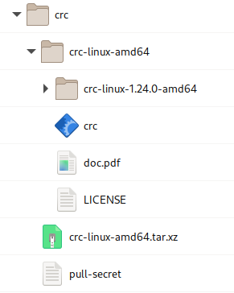
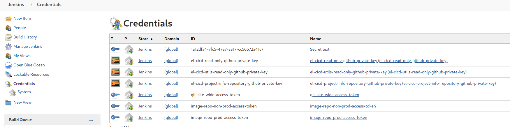
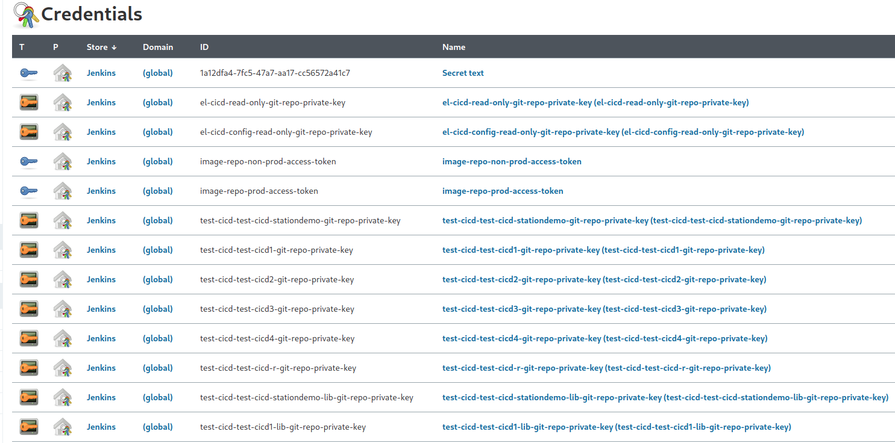

# el-CICD Administration Tutorial

It is strongly suggested that new users to el-CICD work through this tutorial.  This will demonstrate most of the requirements and features of the el-CICD system from setup through the different usage scenarios you'll use as part of your software development lifecycle (SDLC).  Hands on learning is always the best type of education.

## Preamble

This document is part of the el-CICD project, a CICD system for the OKD Container Platform  

Copyright (C) 2021 Evan "Hippy" Slatis  
email: hippyod -at- yahoo -dot- com  

===================================

**NOTE: Red Hat® OpenShift® Platform is a trademark of Red Hat, Inc., and supported and owned by Red Hat, Inc.**

**el-CICD IS NEITHER SUPPORTED OR AFFILIATED IN ANY WAY WITH RED HAT, INC., OR ANY OF ITS PROJECTS.**

===================================

## License

el-CICD is free software; you can redistribute it and/or modify it under the terms of the GNU Lesser General Public License as published by the Free Software Foundation; either version 2.1 of the License, or (at your option) any later version.

This library is distributed in the hope that it will be useful, but **WITHOUT ANY WARRANTY; without even the implied warranty of MERCHANTABILITY or FITNESS FOR A PARTICULAR PURPOSE**.  See the GNU Lesser General Public License for more details.

You should have received a copy of the GNU Lesser General Public License along with this library; if not, write to

```text
    The Free Software Foundation, Inc.
    51 Franklin Street
    Fifth Floor
    Boston, MA
        02110-1301
```

This document is licensed under the Creative Commons Attribution 4.0 International License. To view a copy of this license, visit

http://creativecommons.org/licenses/by/4.0/ 

or send a letter to

```text
  Creative Commons
  PO Box 1866
  Mountain View, CA
      94042, USA
```

# Table of Contents

* [el-CICD Administration Tutorial](#el-cicd-administration-tutorial)
  * [Preamble](#preamble)
  * [License](#license)
* [Table of Contents](#table-of-contents)
  * [Minimum Requirements](#minimum-requirements)
  * [Overview](#overview)
  * [Install and Setup CodeReady Containers (CRC)](#install-and-setup-codeready-containers-crc)
    * [Download CRC and Deploy Key](#download-crc-and-deploy-key)
    * [Download the el-CICD Release](#download-the-el-cicd-release)
    * [crc-helper.sh](#crc-helpersh)
    * [CRC Setup and Install](#crc-setup-and-install)
  * [Setup, Configure, and Bootstrap el-CICD](#setup-configure-and-bootstrap-el-cicd)
    * [Download the Release el-CICD Repositories](#download-the-release-el-cicd-repositories)
    * [Create Image Repositories](#create-image-repositories)
    * [el-CICD Secrets](#el-cicd-secrets)
      * [Create el-CICD Repo Read Only Private Keys](#create-el-cicd-repo-read-only-private-keys)
      * [Gather el-CICD GitHub Repository Access Token](#gather-el-cicd-github-repository-access-token)
      * [Gather Image Repo Access Tokens](#gather-image-repo-access-tokens)
    * [Configure el-cicd-non-prod.conf](#configure-el-cicd-non-prodconf)
      * [el-cicd.non-prod.conf](#el-cicdnon-prodconf)
      * [el-cicd-default-system.conf](#el-cicd-default-systemconf)
      * [el-cicd-prod.conf](#el-cicd-prodconf)
    * [Bootstrapping the Non-prod Onboarding Automation Server](#bootstrapping-the-non-prod-onboarding-automation-server)
      * [Verify the Install](#verify-the-install)
      * [Run Setup Again [optional]](#run-setup-again-optional)
      * [Final Tutorial Setup](#final-tutorial-setup)
    * [Further Considerations](#further-considerations)
  * [Onboarding a Project Into the Engineering Cluster](#onboarding-a-project-into-the-engineering-cluster)
    * [Access the Non-prod Onboarding Automation Server](#access-the-non-prod-onboarding-automation-server)
    * [Onboarding the Test-CICD Project](#onboarding-the-test-cicd-project)
      * [Confirm the Configuration of the `test-cicd` Project in Jenkins](#confirm-the-configuration-of-the-test-cicd-project-in-jenkins)
      * [Confirm the Configuration of the `test-cicd` Project in GitHub](#confirm-the-configuration-of-the-test-cicd-project-in-github)
  * [Non-prod SDLC Support](#non-prod-sdlc-support)
    * [Building the Project](#building-the-project)
    * [Promoting Microservices](#promoting-microservices)
      * [Promote to Stg](#promote-to-stg)
    * [Redeploying Microservices](#redeploying-microservices)
    * [Image Roll Back and Roll Forward](#image-roll-back-and-roll-forward)
      * [Build](#build)
      * [Promote](#promote)
      * [Rollback](#rollback)
    * [Create the Release Candidates](#create-the-release-candidates)
  * [Bootstrapping the Prod Onboarding Automation Server](#bootstrapping-the-prod-onboarding-automation-server)
  * [Onboarding a Project Into the Production Cluster](#onboarding-a-project-into-the-production-cluster)
    * [Access the Prod Onboarding Automation Server](#access-the-prod-onboarding-automation-server)
    * [Onboarding the Test-CICD Project](#onboarding-the-test-cicd-project-1)
      * [Confirm the Configuration of the `test-cicd` Project in Jenkins](#confirm-the-configuration-of-the-test-cicd-project-in-jenkins-1)
      * [Confirm the Configuration of the `test-cicd` Project in GitHub](#confirm-the-configuration-of-the-test-cicd-project-in-github-1)
  * [Prod SDLC Support](#prod-sdlc-support)
    * [Deploy Version 1.0](#deploy-version-10)
    * [Deploy Version 1.1](#deploy-version-11)
    * [Rollback to Version 1.0](#rollback-to-version-10)

## Minimum Requirements

If you install Red Hat CodeReady Containers, you will need to be able to allocate the following for the CodeReady Containers virtual machine:

* CRC Version 1.18, corresponding to OpenShift version 4.6.1
* 6 vCPUs
* 48GB RAM
* 100GB Free Disk Space

This was tested using the above minimum specs, but note that more is always better.  el-CICD was developed with 12 vCPUs and 64GB RAM on a refurbished Dell R610 (circa 2011?) rack server homelab.  It was tested running under Fedora 32 and 33, and the instructions will need to be adapted if you're running under a non-Red Hat based OS.

This tutorial does not setup a scanner component, and the default code executes a non-functional code scan during all builds.  This will need to be implemented by the user when put into production if scanning code is a requirement.

You need sudo privileges on the machine running this tutorial, and cluster admin rights on an OKD cluster if CRC is not used.  **DO NOT** try run this tutorial on a production cluster; i.e. a cluster being actively used for engineering purposes by developers or used to run applications in production.

This tutorial assumes you have some familiarity with Git, CICD, and Kubernetes concepts.

## Overview

**Time: 2-3 hrs**

This tutorial will take you through the minimal steps to setup and install el-CICD.  Most of the work will be downloading and setting up the required Git and Docker repositories for the tutorial to work.  Actually using el-CICD will take some time mainly waiting for build and deployments to complete, and at the end you will have a good overview of el-CICD's features and how easily it can support and streamline your organizations software development process.

## Install and Setup CodeReady Containers (CRC)

Optional.  If you have a working OKD or OpenShift cluster you can use as a lab, then you may skip this step.  **DO NOT** try run this tutorial on a production cluster; i.e. a cluster being actively used for engineering purposes by developers or used to run applications in production.

### Download CRC and Deploy Key

*CURRENT TESTED VERSION OF CRC:* **1.24**

Download CRC from [here](https://developers.redhat.com/products/codeready-containers/overview).  Registration will be required, but it's free.

Copy the tar.xz file and the pull secret you downloaded into the directory where you wish to install CRC and extract the tar file.

```bash
tar -xf crc-linux-amd64.tar.xz

mv crc-linux-X.XX.X-amd64 crc-linux-amd64
```

We move the CRC directory containing the decompressed files to a generic directory so we don't have to continually update our path whenever we upgrade versions.  We keep the original, now empty folder next to the files as an extra reference to what version we are using.

**You also need to copy or download your CRC pull secret to a file called `pull-secret` in the same directory where CRC has been installed (see figure below).  CRC will not work without it.**



**Figure**  
_CRC install directory structure with pull-secrets file and original *.tar.xz CRC download included_

### Download the el-CICD Release

The latest el-CIDC release can be found [here](https://github.com/elcicd/el-CICD-RELEASES).  Each release is tagged with its version, and along with the el-CICD code and configuration, a copy of the the `el-CICD-docs` repository this tutorial resides in is contained within.

### crc-helper.sh

In the `el-CICD-docs/tutorial-scripts` directory, the file `crc-helper.sh` exists.  This file contains a few helper functions and settings for functions making use of CRC easier.  Open this file and adjust the following settings to your homelabs available resources, and adjust the install location of your `CRC_INSTALL_DIR` where you installed CRC.

```bash
#!/bin/bash

CRC_INSTALL_DIR=${HOME}/dev/crc

# PREFERRED CRC OPTIONS
# MINUMUM VALUES ARE 6 vCPUs and 49152M MEMORY
# PREFERRED VALUES ARE 12 CORES AND 65536M MEMORY
# 100G DISK IS SUFFICIENT, BUT 250G DOESN'T HURT

CRC_V_CPU=12
# CRC_V_CPU=6
CRC_MEMORY=65536
# CRC_MEMORY=49152
CRC_DISK=250
# CRC_DISK=100

CRC_SHELL=bash # zsh

function eval-oc-env() {
    eval $(crc oc-env)
    source <(oc completion ${CRC_SHELL})
}

if [[ -f ~/.crc/machines/crc/crc.qcow2 ]]
then
    eval-oc-env
fi

function crc-start() {
    echo "Starting CRC with ${CRC_V_CPU} vCPUs, ${CRC_MEMORY}M memory, and ${CRC_DISK}G disk"
    echo "If you want to change the above values, run 'crc delete' and recreate the VM from scratch."
    echo ''

    crc config set cpus ${CRC_V_CPU}
    crc config set memory ${CRC_MEMORY}
    crc config set disk-size ${CRC_DISK}
    crc config set enable-cluster-monitoring true
    crc config set pull-secret-file ${CRC_INSTALL_DIR}/pull-secret
    crc start

    crc-admin-login
}


function crc-pwd-admin {
    echo "copy kubeadmin to system clipboard"
    CRC_TEMP_PWD=$(crc console --credentials | sed -n 2p | sed -e "s/.*'\(.*\)'/\1/" | awk '{print $6}' )
    echo ${CRC_TEMP_PWD} | xclipc
    echo "${CRC_TEMP_PWD} copied to clipboard for use"
    CRC_TEMP_PWD=
}

function crc-admin-login {
    echo "crc login as kubeadmin"
    CRC_LOGIN=$(crc console --credentials | sed -n 2p | sed -e "s/.*'\(.*\)'/\1/")
    eval ${CRC_LOGIN}
    crc-pwd-admin
    CRC_LOGIN=
}
```

### CRC Setup and Install

```bash
source ${HOME}/path/to/el-CICD-docs/tutorial-scripts/crc-helper.sh

crc setup

# PAY ATTENTION TO THE DASH IN THE COMMAND!!
# Uses the pull secret automatically
# Copies it to the clipboard for easy login through apps or console in browser
crc-start
```

If you accidentally start CRC without the dash, you will need to run `crc delete` and run `crc-start`, or the resource settings will not take.  CRC VM resource settings cannot be changed once started without deleting the CRC VM and beginning again.

## Setup, Configure, and Bootstrap el-CICD

This section will cover the minimum necessary steps to install el-CICD.  It will cover basic configuration, setting up the repositories needed for images and code, and the credentials for secrets that will need to be gathered.  At the end of this section the Non-prod Onboarding Automation Server will have been configured and created in your cluster.

### Download the Release el-CICD Repositories

This tutorial assumes you will be using [GitHub](github.com) as your Git repository.  Other Git repositories such as GitLab and Bitbucket are not currently supported, but are targeted for a future release.

The following el-CICD repositories should be created and the downloaded release pushed into the respective repositories you created:

* el-CICD
* el-CICD-config

Do not fork the repositories directly from the `elcicd` GitHub site, since development is ongoing and will not necessarily match this tutorial.

The following demonstration repositories should be forked, and the **development** branch is what you should default to using: 

* [Test-CICD1](https://github.com/elcicd/Test-CICD1)
* [Test-CICD1-lib](https://github.com/elcicd/Test-CICD1-lib)
* [test_CICD2](https://github.com/elcicd/test_CICD2)
* [TeSt-CiCd3](https://github.com/elcicd/TeSt-CiCd3)
* [Test_CICD4](https://github.com/elcicd/Test_CICD4)
* [test-cicd-R](https://github.com/elcicd/test-cicd-R)
* [test-cicd-stationdemo](https://github.com/elcicd/test-cicd-stationdemo)
* [test-cicd-stationdemo-lib](https://github.com/elcicd/test-cicd-stationdemo-lib)

The odd spelling of the Git repositories was purposefully used for testing purposes. 

These test repositories contain a basic demonstration of the full gamut of el-CICD functionality with regards to builds and deployments across the SDLC.  You will need to modify the contents of these repositories and/or run scripts contained in them during the course of this tutorial.  [NOTE: You may optionally omit some of these if you choose, but you will have to modify the default [Project Definition File](operating-manual.md#project-definition-file), `test-cicd.yml`, in `el-CICD-config` and remove the microservices or libraries you remove.]

You should also create a sibling directory to the `el-CICD`, `cicd-secrets`, that will contain a collection of secrets, six in total,  you will need to gather to run this tutorial.  Your final local el-CICD directory should look like the following:


**Figure**  
_Local el-CICD repositories and_ `cicd-secrets` _directory (other test project repositories omitted for brevity)_


### Create Image Repositories

For the purposes of this demo, we will use [Docker Hub](https:hub.docker.com/) to host our repositories, but any Docker compatible host will do.  You only need a single repository, but in order to more closely mirror what you might do in a production environment, we'll create three:

* `<your-unique-demo-name>dev`
* `<your-unique-demo-name>nonprod`
* `<your-unique-demo-name>prod`

If `<your-unique-demo-name>` is `foo`, the you will create three Docker Hub repositories `foodev`, `foononprod`, and `fooprod`.  This will better demonstrate what is most likely needed for a production setup.

**Tip**: If you have a GMail account, it's easy to use the same email address to create multiple repositories without needing multiple email accounts.  When creating the repository on Docker Hub, register with your email in the following fashion:

```text
youremailid+foodev@gmail.com

youremailid+foononprod@gmail.com

youremailid+fooprod@gmail.com
```

### el-CICD Secrets

The following section will cover how to gather the basic secrets needed by el-CICD during bootstrap.  For convenience, el-CICD auto-generates all other secrets during its normal operation.  It is assumed you have created the `cicd-secrets` directory. 


**Figure**  
_cicd-secrets directory and secret files expected for bootstrapping el-CICD_

Note the `builder-secrets` directory.  If your builds require secrets that you'd normally provide thorugh a `pip.conf` or `settings.xml`. for example, place them inside this directory.  The files in this directory will be mounted as a Secret in el-CICD, and then mounted as a directory in the Jenkins build agents for use during builds.

#### Create el-CICD Repo Read Only Private Keys

In the `cicd-secrets` directory, run the following commands:

```bash
ssh-keygen -b 2048 -t rsa -f 'el-CICD-deploy-key' -q -N '' -C 'Jenkins Deploy key for el-CICD'

ssh-keygen -b 2048 -t rsa -f 'el-cicd-config-github-deploy-key' -q -N '' -C 'Jenkins Deploy key for el-CICD-config'
```

Each of these in turn will create the proper read only ssh keys for el-CICD in the `cicd-secrets` directory to pull the latest el-CICD code for each pipeline run:

* `el-CICD-deploy-key`
* `el-CICD-deploy-key.pub`
* `el-cicd-config-github-deploy-key`
* `el-cicd-config-github-deploy-key.pub`

#### Gather el-CICD GitHub Repository Access Token

Create a read/write personal access token for your GitHub account.  GitHub personal access token instructions are found [here](https://docs.github.com/en/github/authenticating-to-github/creating-a-personal-access-token).  Copy and paste your token into the following file in the `cicd-secrets` directory:

`el-cicd-git-repo-access-token`

This token will only be used by the Onboarding Automation Servers, and not the actual Non-prod and Prod Automation Servers that conduct the actual builds and deployments.  This token allows for the auto-generation of read/write shh keys for access to each project's Git repository, and helps with cloning the repository for builds, and managing the repository for promotions and deployments.

**WARNING: Because this access token allows unfettered access to your organization's Git repositories, access to the Onboarding Automation Servers' namespace and Jenkins instance should strictly controlled to OKD cluster-admins only.**

#### Gather Image Repo Access Tokens

For each of the three image repositories you creates above, create a read/write access token.  Assuming you used Docker Hub as your image repository host, sign into each account you created for each repository, and head to your [security settings](https://hub.docker.com/settings/security) to create the access token.  Create the following files in the `cicd-secrets` directory, and copy and paste the appropriate access tokens into their respective files:

* `el-cicd-dev-pull-token`
* `el-cicd-non-prod-pull-token`
* `el-cicd-prod-pull-token`

### Configure el-cicd-non-prod.conf

el-CICD has a number of files available for configuring your system.  To complete configuring el-CICD for this tutorial, you'll have to touch all four of the default configuration files.  Any number of other configuration files can be added for organizational purposes at your convenience, and complete information  on the [System Configuration Files](#system-configuration-files) can be found here.

The following five settings cover each SDLC stage defined in `el-CICD-config/bootstrap/el-cicd-default-system.conf`.  el-CICD uses a [convention-over-configuration](https://en.wikipedia.org/wiki/Convention_over_configuration) strategy throughout the code and with its settings to make undertanding and extending its functionality easy for end users.

#### el-cicd.non-prod.conf

Find the file `el-CICD-config/el-cicd-non-prod.conf`, and modify the `*_IMAGE_REPO_USERNAME` and `*_IMAGE_REPO` values with your Docker Hub user name for each appropriate image repositories you created earlier:

```yaml
DEV_IMAGE_REPO_USERNAME=<your-unique-demo-name>dev
DEV_IMAGE_REPO=docker.io/<your-unique-demo-name>dev

QA_IMAGE_REPO_USERNAME=<your-unique-demo-name>nonprod
QA_IMAGE_REPO=docker.io/<your-unique-demo-name>nonprod

UAT_IMAGE_REPO_USERNAME=<your-unique-demo-name>nonprod
UAT_IMAGE_REPO=docker.io/<your-unique-demo-name>nonprod
```

#### el-cicd-default-system.conf

Find the file `el-CICD-config/bootstrap/el-cicd-default-system.conf`, and modify the `*_IMAGE_REPO_USERNAME` with your Docker Hub user name for each appropriate image repository you created earlier, and similarly each `*_IMAGE_REPO`:

```yaml
STG_IMAGE_REPO_USERNAME=<your-unique-demo-name>nonprod
STG_IMAGE_REPO=docker.io/<your-unique-demo-name>nonprod
```

Also, change the location of the functional and configuration Git repositories:

```yaml
EL_CICD_GIT_REPO=git@github.com:<your-github-id>/el-CICD.git

EL_CICD_CONFIG_REPOSITORY=git@github.com:<your-github-id>/el-CICD-config.git
```

#### el-cicd-prod.conf

Find the file `el-CICD-config/el-cicd-prod.conf`, and modify the `*_IMAGE_REPO_USERNAME` with your Docker Hub user name for each appropriate image repository you created earlier, and similarly each `*_IMAGE_REPO`:

```yaml
PROD_IMAGE_REPO_USERNAME=<your-unique-demo-name>prod
PROD_IMAGE_REPO=docker.io/<your-unique-demo-name>prod
```

### Bootstrapping the Non-prod Onboarding Automation Server

Using the CRC helper functions you should have sourced [earlier](#crc-helpersh), login to the CRC cluster and run the [el-cicd Admin Utility](operating-manual.md#el-cicd-admin-utility) to install for a Non-prod Onboarding Automation Server.

```bash
    crc-admin-login

    ./el-cicd.sh -N el-cicd-non-prod.conf
```

Since this is the first time el-CICD is installed, the command will ask the following questions:

* Do you wish to install sealed-secrets, kubeseal and controller, version v0.14.1?
* Update cluster default Jenkins image? 

Answer `Y` to each of them.  You will be provided with a summary of what the el-CICD Admin Utility will do, and requested to provide final confirmation by typing `Yes`.  Do so.  This will begin the installation process, which includes the following:

* Install Sealed Secrets version v0.14.1
* Update cluster default Jenkins image
* Build the el-CICD Jenkins image
* Create the Non-prod Onboarding Automation Server namespace `el-cicd-non-prod-onboarding-master`
* Stand up the Non-prod Onboarding Automation Server
* Create the Non-prod Onboarding Automation Server pipelines
* Create all Image pull Secrets in the Non-prod Onboarding Automation Server namespace
* Push all necessary secrets to either GitHub and/or the Non-prod Onboarding Automation Server
* Build the Jenkins Agents

This process can take up to 30 minutes.


#### Verify the Install

Run the following command to confirm all el-CICD server and agent images were created:

```
    oc get is -n openshift | grep el-cicd
```

You should see the el-CICD Jenkins ImageStream, and four Jenkins agents: base, java-maven, python, and r-lang.  Next run

```
    oc get cm,secrets,bc,pods -n el-cicd-non-prod-onboarding-master
```

You should see a Jenkins pod running, three el-cicd Secrets (one for build secrets, and two for pull), three BuildConfigs (one for each pipeline created), and one ConfigMap.  Next run

```
    oc edit cm el-cicd-meta-info -n el-cicd-non-prod-onboarding-master
```

Configuration values from `el-cicd-non-prod.conf` and `el-cicd-default-system.conf` are used to create this ConfigMap.  Browse all the values that were imported from the *.conf files, and confirm that the values you changed earlier are in there.

#### Run Setup Again [optional]

Running the bootstrapping command is meant to be idempotent, and considering the build of the Jenkins server and agents will scroll too much information to properly observe what takes place the first time, run the script a second time.  This time answer 'N' to each question, and observe the output of the script.  This should take only a couple minutes to complete, but give you a better idea of what actually takes place.

#### Final Tutorial Setup

Each microservice repository you cloned for the purpose of this tutorial has an example of a Sealed Secret, and you will not be able to deploy any of the microservices in this tutorial without the cluster being able to decrypt them.  The tutorial also assumes an OKD RBAC Group named `devops` exists.

Run the script `tutorial-setup.sh` in the `el-CICD-docs/tutorial-scripts` directory.  This will create an RBAC group called `devops` and set the Sealed Secrets controller you just installed to use the tutorial's master key so it can decrypt each test project's Sealed Secrets.

### Further Considerations

Most of work done up to this point was setting up the different test project repositories for the purposes of this tutorial.  Think that was too easy?  That was the point.  Why should any of this be hard?

In the real world, some extra configuration and external concerns will need to be addressed.  This list will give you an idea of things you'll need to consider:

* Confirm expected SDLC and environments
* External code scanner
  * Setup
  * Gathering secrets
  * Writing scripts for el-CICD
* Build Secrets
  * For example, pip.conf and settings.xml
* Writing Library Deployment Build Steps
  * If your projects have library builds you want el-CICD to support, you'll need to write builder steps to properly integrate
* Integration with Project Information Data Stores
  * Further automates the onboarding process by automatically generating Project Definition Files
* Supporting different and/or more languages/platforms
  * Requires editing and/or writing Jenkins Agent Dockerfiles

Once operations and development resources have defined the ecosystem required to support development, we estimate that it shouldn't take more than two to four weeks to configure el-CICD and put it into production.  This, of course, includes testing the complete SLDC process end-to-end with your newly installed system with a few internal projects to make all works as expected.

## Onboarding a Project Into the Engineering Cluster

For your convenience, a [Project Definition File](operating-manual.md#project-definition-file) has already been defined in `el-CICD-config/project-defs`, `test-cicd.yml`.  You will need to make one minor modification to the file, commit it, and push it to the remote repository:

```yaml
    scmOrganization: <your-github-id>
```

el-CICD reads the el-CICD and el-CICD-config repositories on every pipeline run, so all changes run on any el-CICD server inside OKD must be pushed back to GitHub.

The rest of the tutorial will take you through a typical set of steps that will eventually create two Release Candidates.  In the real world, the second release would be developed, built, and tested separately, but here we are just demonstrating general system functionality, so as with most demos, it is a bit contrived.

### Access the Non-prod Onboarding Automation Server

Open your terminal and login to CRC as admin.  If you followed previous instructions, the following command will also copy the CRC pull secret to your clipboard.

```bash
    crc-admin-login
```

Open your browser, and go to

[https://jenkins-el-cicd-non-prod-onboarding-master.apps-crc.testing](https://jenkins-el-cicd-non-prod-onboarding-master.apps-crc.testing)

The browser will warn you that your connection is not private, and you can safely ignore it and click  _Advanced_, and then the button _Proceed to jenkins-el-cicd-non-prod-onboarding-master.apps-crc.testing (unsafe)_ .  Login to Jenkins using the CRC admin credentials, clicking initially on the `kube:admin` button.  You can simply paste the password (the CRC pull secret) from your clipboard thanks to the custom command you entered above.

```text
    Username: kubeadmin
    Password: <paste the CRC pull secret here>
```

After successfully logging in, the browser will ask you to _Authorize Access_.  This will happen the first time you log into each Jenkins instance you'll create during this demo.  You may safely click _Allow selected permissions_.

From the main page on the left-hand menu, click `Manage Jenkins`, and then in the middle of the screen look for `Manage Credentials` and click on it to take you to the Jenkins Credentials screen.  If you configured everything correctly, it should look like the following:


**Figure**  
_Non-prod Onboarding Automation Server Credentials_

If something is missing, then check your configuration, fix any issues, and you can safely run the bootstrap script again.

### Onboarding the Test-CICD Project

Click on the Jenkins logo in the upper left corner of the browser window, and then click on the `el-cicd-non-prod-onboarding-master` folder in the center of the Jenkins browser screen, and again on the `el-cicd-non-prod-master/non-prod-project-onboarding` to get to the `non-prod-project-onboarding` pipeline screen.

Click `Build with Parameters` on the left, enter `test-cicd` as the PROJECT_ID, and then click the `Build` button.  This will begin the `non-prod-project-onboarding` Pipeline.


**Figure**  
_Entering `test-cicd` for the PROJECT_ID when kicking off the Onboarding Pipeline_

It is strongly suggested that you follow the logs of the build to see what is happening.  You can do this by clicking the build number when it appears, and then clicking `Console Output` on the left-hand menu to follow the build logs in real time.

A summary of what the pipeline is doing is found [here](operating-manual.md#non-prod-project-project-onboarding-pipeline).

As you will see, the `non-prod-project-onboarding` Pipeline creates and configures a great deal in order to get a project onboard.  Enter the following command to see what was created:

```bash
    oc project devops-el-cicd-non-prod-master
    oc get pods,cm,secrets
```

The above commands will show you the `devops` RBAC group's Jenkins instance, the copy of `el-cicd-meta-info` ConfigMap that copied into the `devops` namespace, and the pull secrets that were copied into the `devops` namespace.

```bash
    oc projects | grep test-cicd

    oc project test-cicd-dev
    oc get secret | grep el-cicd
```

The above commands will show you all the `test-cicd` SDLC and Sandbox environments created by the onboarding process, and in `test-cicd-dev` the particular pull secret needed to pull Dev environment images.  All SDLC environments will have the appropriate, configured pull secret automatically distributed to them during onboarding.

#### Confirm the Configuration of the `test-cicd` Project in Jenkins

Open your browser to the new [Non-prod Automation Server](https://jenkins-devops-el-cicd-non-prod-master.apps-crc.testing/).  As before, click through the privacy warning, and login as the `kubeadmin` again (enter `crc-admin-login` on the command line to copy the pull secret to the clipboard for simplicity's sake.

From the main page on the left-hand menu, click `Manage Jenkins`, and then in the middle of the screen look for `Manage Credentials` and click on it to take you to the Jenkins Credentials screen.  If you configured everything correctly, it should look like the following:


**Figure**  
_Non-prod Jenkins Credentials_

[**NOTE**: In the real world, the project would belong to an actual group, whether in OKD directly or as part of your organization's authentication mechanism, and you would log in as an authenticated OKD user and **not** admin.  el-CICD makes every member of the project's RBAC group an OKD namespace admin for the Non-prod Automation Server of the group.]

Click on the Jenkins logo in the upper right, and click through the folder link in the center of the window, `devops-el-cicd-non-prod-master`, until you see all the pipelines the onboarding process created for the `test-cicd` project:


**Figure**  
_Non-prod Jenkins Pipelines_

#### Confirm the Configuration of the `test-cicd` Project in GitHub

Go to GitHub, and click on any of the demo repositories you cloned, go to repository's settings, and if you check both the webhooks and deploy keys, you should now see both having been just added.  Assuming you are using CRC for the demo, the webhook will not work, since the link is not accessible from GitHub.

## Non-prod SDLC Support

The following steps will demonstrate the engineering SDLC support of el-CICD.

1. All microservices will be built and deployed
1. All microservices will be promoted from the _dev_ environment (OKD project/namespace) through to _stg_ (Pre-prod)
1. New builds will be created and promoted
1. [Deployment Patches](foundations.md#deployment-patching) will be applied
1. Images will be rolled back and forward in test environments
1. [Release Candidates](foundations.md#release-candidate) will be created

### Building the Project

**Time: 10m**

el-CICD helps enforce standards, because creating and adhering to standards, where practical, generally represent a best practice; thus, el-CICD Project Definition Files force projects to define a common and similarly named development branch in each of its component's Git repositories if they wish to take advantage of the automation el-CICD provides.  Each merge or push to that branch will trigger a build per the webhooks el-CICD has placed in each repository.  el-CICD also supports manual builds of the project's microservices, either by running each individual microservice's `*-build-to-dev` Pipeline, or in bulk using the `build-and-deploy-microservices` Pipeline.  To build every microservice in the `test-cicd` project, we will use the latter.

1. Click on the `build-and-deploy-microservices` Pipeline from the list of pipelines in `devops-el-cicd-non-prod-master`
1. Click on `Build with Parameters` on the left-hand menu
1. Enter `test-cicd` for the `PROJECT_ID`, and click the `Build` button
1. When the build number appears, click on it, and then click on `Console Output` on the left-hand menu
1. Observe the build's log output.  When it gets to a point where it says `Input requested` and the wait spinning GIF appears, click on `Input requested`
1. Click on the `buildAll` checkbox
1. Press the `Proceed` button

This will kick off a build of all microservices in the `test-cicd` project.  This pipeline will run each individual build pipeline in parallel, three at a time, until done.

1. Click on `devops-el-cicd-non-prod-master` link in the bar at the top of the screen, which will return you to the list of pipelines on Jenkins
1. Note that three microservice pipelines are now running.  Choose one, and click on the link to the pipeline
1. Click on the build number, and then click on `Console Output` on the left-hand menu to follow the build to completion, and
1. Enter the following command in your terminal to watch the microservices as el-CICD deploys them, and wait until the last pod is in a Ready state:

    ```bash
        watch oc get pods,cm,sealedsecrets,secrets -n test-cicd-dev
    ```

This will show all pods, ConfigMaps, Sealed Secrets, and Secrets (created and decrypted by the Sealed Secrets controller you installed earlier) of the `test-cicd` project.  If you wait for a few minutes, you will also see the `test-cicd3` CronJob run.  [NOTE: you'll need to refresh the pipelines screen in your browser occasionally to see which pipelines have completed.  Jenkins does not update this screen automatically.]

[**NOTE**: very rarely builds fail because of networking errors pulling or pushing images, especially in homelab environments.  Rerun that particular microservice build again to make sure all microservices are built.]

Exit `watch`, and enter the following:

```bash
    oc edit test-cicd-test-cicd1-meta-info
```

Every microservice deployed to an environment namespace has a ConfigMap created that describes the deployed microservice's meta-information.  Because the _dev_ environment has no [Deployment Branch and hasn't been promoted from another environment, that value will be `undefined`.  The `deployment-commit-hash`, project ID, and microservice name are labeled across all microservice resources deployed by el-CICD, and are used as selectors to ensure that only that latest deployment exists in the namespace after a successful deployment.  Quit the editor, and run the following:

```bash
    oc edit cm test-cicd1-configmap
```

Notice the labels for the ConfigMap match the data in the meta-information ConfigMap.

The `build-and-deploy-microservices` Pipeline can also be used to deploy one more microservices into any of the Sandbox environments.  Sandbox environments are an optional add on to any project for developers to use to test deployments before merging their code into the development branch.

If you wish, you may open up your _dev_ image repository in your browser, and see the image for each microservice was successfully pushed there.  The last image deployed to any environment is tagged with the environment name; e.g. `test-cicd-test-cicd1:dev`.

You have now confirmed the successful deployment of the `test-cicd` project builds into _dev_.

### Promoting Microservices

Click on the link `devops-el-cicd-non-prod-master` in the upper left of the Jenkins window under the Jenkins logo.  This will return you to the list pipelines.

1. Click on the pipeline `microservice-promotion-removal`
1. Click on `Build with Parameters` on the left-hand menu
1. Enter `test-cicd` as the PROJECT_ID
1. Click on the `Build` button
1. When the new build number appears, click on it
1. Click on `Console Output` on the left-hand menu
1. When the logs pause and the `Input requested` link appears, click on it
1. Select `PROMOTE` from the `defaultAction` drop down
1. Click the `Proceed` button

To watch the pods in _qa_ come up as they are promoted and deployed, go to your terminal and enter:

```bash
    watch oc get pods,cm,sealedsecrets,secrets -n test-cicd-qa
```

The pipeline will continue to from this point to promote images created in the _dev_ image repository to the _non-prod_ image repository, and these images will be tagged as _qa_ since that's where you are promoting to.  The images are copied using the [skopeo](https://github.com/containers/skopeo) utility built into each Jenkins agent.  If you read through the logs, you will notice the pipeline confirms that an image for the microservice has been created for _dev_ before attempting to deploy.  You will also see a Deployment Branch for _qa_ being created.  When the pipeline completes, all microservices in the `test-cicd` project will have been promoted and deployed.

As the pods come up, and you compare this with what is in `test-cicd-dev`, you'll notice there is not a postgresql pod anymore.  This database pod is part of the _dev_ deployment configuration for test-cicd4 microservice and defined in the `Test_CICD4/.openshift/dev` directory, but not subsequent environments (similar to many real world examples where the developers don't need a dedicated database for their testing).  Look in the `.openshift/dev` and `.openshift/qa` directory of the Test_CICD4 repository to see the difference, and read the el-CICD documentation on the [.openshift Directory](#openshift-directory) for more information on how this was configured.

Exit `watch` command by entering `crtl-c` in your terminal.

Now run the following:

```bash
    oc edit test-cicd-test-cicd1-meta-info
```

Note that the `deployment-branch` value is now set to `deployment-qa-<srcCommitHash>`.  Compare the `<srcCommitHash>` value to the `src-commit-hash` value in Git, and notice they are the same.  Go the Git repository of `Test_CICD4` in GitHub, and check the branches there.  Note the Deployment Branch has been created in the remote repository.

Now open your browser to and go to your Non-prod image repository, and check the `test-cicd-test-cicd4` image that was pushed.  You'll notice two tags for it:

* qa
* qa-`<srcCommitHash>`

**All branches, tags, and images created by builds or promotions have the original commit hash of the source that built the image.**  It is even embedded in the image itself as a label, if you care to check.  This mirrors the reality that while images are immutable, their deployment configurations are not, so el-CICD creates Deployment Branches for downstream environments in the CICD process to support versioning of changes to the deployment of an image in particular environment.  More fundamentally, this is how el-CICD directly supports the ideal of [Build Once, Deploy Many](foundations.md#build-once-deploy-many).

#### Promote to Stg

Repeat the previous [step](#promoting-microservices), but change the dropdown in the `Input Requested` step from `dev -> qa` to `qa -> stg`.

### Redeploying Microservices

In this section, how to do [Deployment Patching](foundations.md#deployment-patching) and roll back/forward will be demonstrated.

As noted previously, images are immutable, but deployment configurations are not.  This next step demonstrates a deployment patch by changing the deployment configuration for a particular microservice in a particular environment without having to build and promote.

First check the logs of the deployed `test-cicd1` pod:

```bash
    oc project test-cicd-qa
    oc get pods
    oc logs test-cicd1-1-<someHash>
```

The `<hash>` is a random hash assigned to each pod in OKD.  Not the value of output for `qa topic:`.

Next, checkout the Deployment Branch from the meta-information ConfigMap for `test-cidc1`.  You can the name of the Deployment Branch or value of source commit hash from the meta-information ConfigMap:

```bash
    oc project test-cicd-qa
    # copy the Deployment Branch or source commit hash from the meta-information ConfigMap
    oc get test-cicd-test-cicd1-meta-info -o yaml
    cd <path-to-Test_CICD1>/Test_CICD1
    git checkout deployment-qa-<srcCommitHash>
```

In your favorite source code editor, open the file `Test_CICD1/.openshift/template-defs.json`.  Go to the bottom of the file, and find the section with `"appName": "test-cicd-configmap"` in it.  In the `"qa" -> "params"` section, change the param `TOPIC_NAME` from `"qa topic"` to `"qa topic changed for el-CICD tutorial"`:


**Figure**  
_**qa** section of template-defs.json changed for redeployment demonstration_

Save the file, commit and push it:

```bash
    git commit -am 'changing the qa topic'
    git push
```

Now run the pipeline `microservice-redeploy-removal`

1. Click on the pipeline `microservice-redeploy-removal`
1. Enter `test-cicd` for the PROJECT_ID
1. Click the `Build` button
1. When the new build number appears, click on it
1. Click on `Console Output` on the left-hand menu
1. When the logs pause and the `Input requested` link appears, click on it
1. Click the `Proceed` button, since the `redeployEnv` is already on _qa_
1. When the logs pause and the `Input requested` link appears again, click on it
1. Choose `PROMOTE` (i.e. redeploy) from the `test-cicd` drop down
1. Click the `Proceed` button

To verify your change was deployed, check the logs of the newly deploy `test-cicd` image:

```bash
    oc get pods
    oc logs test-cicd1-2-<someHash>
```

You should see your changes reflected in the logs:

```text
    topicname value : qa topic changed for el-CICD tutorial
```

You are ready to move onto the next step.

### Image Roll Back and Roll Forward

#### Build

First, check out the `test-cicd1` development branch:

```bash
    cd <path-to-Test_CICD1>/Test_CICD1
    git checkout development
```

To be able to see how a rollback works, a new build needs to be created.  As before, in your favorite source code editor, open the file `Test_CICD1/.openshift/template-defs.json`.  Go to the bottom of the file and find the section with `"appName": "test-cicd-configmap"` in it.  In the `"qa" -> "params"` section, change the param `TOPIC_NAME` from `"qa topic"` to `"qa topic changed"`


**Figure**  
_**qa** section of template-defs.json changed_

Save the file, commit and push it.

Click on the link `devops-el-cicd-non-prod-master` in the upper left of the Jenkins window under the Jenkins logo.

1. Click on the pipeline `test-cicd-test-cicd1-build-to-dev`
1. Click the `Build` button

Watch the pipeline is complete, you are ready to move onto the next step.

#### Promote

Click on the link `devops-el-cicd-non-prod-master` in the upper left of the Jenkins window under the Jenkins logo.

1. Click on the pipeline `microservice-promotion-removal`
1. Click on `Build with Parameters` on the left-hand menu
1. Enter `test-cicd` as the PROJECT_ID
1. Click on the `Build` button
1. When the new build number appears, click on it
1. Click on `Console Output` on the left-hand menu
1. When the logs pause and the `Input requested` link appears, click on it
1. Select `PROMOTE` from the `test-cicd1` drop down  
1. Click the `Proceed` button

To verify your change was promoted, check the logs of the newly deploy `test-cicd` image:

```bash
    oc get pods
    oc logs test-cicd1-3-<someHash>
```

You should see your changes reflected in the logs:

```
    topicname value : qa topic changed
```

You are ready to move onto the next step.

#### Rollback

Click on `devops-el-cicd-non-prod-master` in the upper left corner.

1. Click on the pipeline `microservice-redeploy-removal`
1. Click on `Build with Parameters` on the left-hand menu
1. Enter `test-cicd` as the PROJECT_ID
1. Click on the `Build` button
1. When the new build number appears, click on it
1. Click on `Console Output` on the left-hand menu
1. When the logs pause and the `Input requested` link appears, click on it
1. Click on `Proceed`, since _qa_ is already chosen in the `redeployEnv` drop down
1. When the logs pause and the `Input requested` link appears, click on it
1. Select the `test-cicd1` drop down, and pick the image that does **NOT** look like the following `>>> qa-<someHash> <<<` (this is the currently deployed image), but rather `qa-<someHash>`
1. Click the `Proceed` button
   
When the pipeline completes successfully, to verify your change was rolled back, check the logs of the current `test-cicd1` pod:

```bash
    oc get pods
    oc logs test-cicd1-4-<someHash>
```

You should see your changes reflected in the logs:

```bash
    topicname value : qa topic
```

You are ready to move onto the next step.

### Create the Release Candidates

Repeat the [Promoting Microservices](#promoting-microservices) step of the tutorial and promote all the images to _stg_.  In the instructions above when choosing `PROMOTE` also select `qa to stg` from the `promotionEnvs` drop down.

To create a Release Candidate, click the `create-release-candidate` pipeline.

1. Click on the pipeline `create-production-manifest`
1. Click on `Build with Parameters` on the left-hand menu
1. Enter `test-cicd` as the PROJECT_ID
1. Enter `1.0.0` as the RELEASE_CANDIDATE_TAG	
1. Click on the `Build` button
1. When the new build number appears, click on it
1. Click on `Console Output` on the left-hand menu
1. When the logs pause and the `Input requested` link appears, click on it
1. Select the following checkboxes:
	* `test-cicd-stationdemo`
	* `test-cicd1`
	* `test-cicd3`
1. Click on the `Proceed` button
1. When the logs pause and the links `Proceed` and `Abort` appear, read the summary to confirm your Release Candidate is properly defined as described above, and click `Proceed`

To confirm your Release Candidate was properly created, go to GitHub, and check the `test-cicd-stationdemo`, `test-cicd1`, and `test-cicd3` Git repositories to make sure a tag in the form of `1.0.0-<srcCommitHash>` has been created.

Now repeat the above process, but use a RELEASE_CANDIDATE_TAG of `1.1.0` and select the checkboxes of `test-cicd-r`, `test-cicd1`, `test-cicd2`, and `test-cicd4`.  While not strictly a "real world" test, this will give you two Release Candidates to promote, and also allow you to see how rollback and roll-forward works in production.

You are ready to move onto the production workflow.

## Bootstrapping the Prod Onboarding Automation Server

From your terminal, login to the CRC cluster, and then execute the execute the bootstrap script for the Prod Onboarding Automation Server in your local el-CICD directory.

```bash
    crc-admin-login
    el-cicd-prod-bootstrap.sh
```

This script will ask a number of questions as it executes.

* First, it will ask you to confirm the wildcard domain for the cluster.
* If the script has been run before, it will ask that you confirm the deletion of the prod master namespace.
* If you have previously installed Sealed Secrets, it will ask whether you wish to do so again.  Since CRC constitutes a single cluster install, just type 'n' or ignore for a few seconds and the input request will timeout and continue.

When the script completes, you can check each forked el-CICD repository to confirm that a read-only deploy key was **not** added this time.  The Prod Onboarding Automation Server reuses the same deploy keys as the Non-prod servers unless configured otherwise. Check that the production master namespace, `el-cicd-prod-master` was created and that a running instance of Jenkins was created. The script is idempotent.  Note that in the real world, for high availability and/or region specific deployments, application may have more than one cluster to deploy to.

## Onboarding a Project Into the Production Cluster

This follows the same basic procedure you went through before with the Non-prod Onboarding Automation Server.

### Access the Prod Onboarding Automation Server

Open your terminal and login to CRC as admin.

```bash
    crc-admin-login
```

Open your browser, and go to

[https://jenkins-el-cicd-prod-master.apps-crc.testing/](https://jenkins-el-cicd-prod-master.apps-crc.testing)

If the browser warns you that your connection is not private, you can safely ignore it and click  _Advanced_, and then the button _Proceed to jenkins-el-cicd-non-prod-master.apps-crc.testing (unsafe)_ .  Login to Jenkins using the CRC admin credentials, clicking initially on the `kube:admin` button.  You can simply paste the password (the CRC pull secret) from your clipboard thanks to the script above.

```text
    Username: kubeadmin
    Password: <CRC pull secret>
```

After successfully logging in, CRC will ask you _Authorize Access_.  This will happen the first time you log into each Jenkins instance.  You may safely click _Allow selected permissions_.

From the main page on the left, click `credentials` to take you to the Jenkins credentials screen.  If you configured everything correctly, it should look exactly like the Non-prod Onboarding Automation Server credentials, except the image repository credentials should refer to the Prod image repository instead of the Dev image repository.



**Figure**  
_Non-prod Onboarding Automation Server Credentials_

If something is missing, then check your configuration, fix any issues, and run the bootstrap script again.

### Onboarding the Test-CICD Project

Click on the Jenkins logo in the upper left corner of the browser window, and the click on the `el-cicd-prod-master` folder in the center of the screen, and again on the `el-cicd-prod-master/dev-project-onboarding` to get to the prod-project-onboarding pipeline screen.


**Figure**  
_prod-project-onboarding Pipeline_

Click `Build with Parameters` on the left, enter `test-cicd` as the PROJECT_ID and `devops` for the RBAC_GROUP, and then click the `Build` button.  This will begin the `prod-project-onboarding` Pipeline.


**Figure**  
_Entering `test-cicd` for the PROJECT_ID when kicking off the Onboarding Pipeline_

It is strongly suggested that you follow the logs of the build to see what is happening.  You can do this by clicking the build number when it appears, and then clicking `Console Output` on the left-hand menu to follow the build logs in real time.

In summary, the pipeline will do the following:

* Download the Project Information Repository, and find and parse the `test-cicd` project definition
* Confirms the `devops` group's Prod Automation Server, a persistent Jenkins instance, does not exist, so it
    * Creates the `devops-cicd-prod` namespace
    * Creates the persistent Jenkins instance from a stock OpenShift template
    * Copies all read-only el-CICD credentials into the new Jenkins pod instance
* Confirms the `test-cicd` prod environment does not exist
    * Creates the _prod_ namespace for `test-cicd`
* Creates a Deploy-to-Production Pipeline for the project
* Configures each microservice's Git repository
    * Creates and pushes a deploy key
* Adds the correct pull secret for the Prod Image Repository

Like in Non-prod Onboarding Automation Server, the `prod-project-onboarding` Pipeline creates and configures a great deal.  If you enter the following commands in a terminal, you can see what has been created in the `test-cicd-prod` namespace:

```bash
    oc project test-cicd-prod
    oc get sealedsecrets,secrets
```

You should see a `el-cicd-image-repo-prod-pull-secret` Sealed Secret and Secret in the namespace.

#### Confirm the Configuration of the `test-cicd` Project in Jenkins

Open your browser to the new [devops Prod Automation Server](https://jenkins-devops-cicd-prod.apps-crc.testing/).  As before, click through the privacy warning, and login as the `kubeadmin` again (enter `crc-admin-login` on the command line to copy the pull secret to the clipboard for simplicity's sake).  Once in, click on the `Credentials` link on the left-hand menu of the window, confirming general el-CICD read-only credentials, image repository pull keys, and specific microservice deploy keys have been properly added.



**Figure**  
_Non-prod Jenkins Credentials_

Then click on the Jenkins logo in the upper right, and click through the folder link in the center of the window `devops-cicd-prod` until you see the single deployment pipeline created.


**Figure**  
_Prod Jenkins Pipelines_

#### Confirm the Configuration of the `test-cicd` Project in GitHub

Go to GitHub, and click on any of the demo repositories you cloned, go to settings, and if you check the deploy keys, you should now see the deploy key for production having been added.

## Prod SDLC Support

The following steps will demonstrate the production SDLC support of el-CICD.

* Promote and deploy a Release Candidate into production
* Rollback/forward a Release Version into Production

Deploying to production is one of the most important steps in the SDLC, but this portion of the demo is also the shortest.  It consists of deploying the two previous Release Candidates you created earlier, and then rolling back to the first one.  Not that rollback and roll-forward is accomplished by simply choosing to deploy a version that has already been deployed once.  el-CICD has no concepts of a timeline when it comes to releases; therefore, it is advised that a good versioning scheme be agreed upon so operators can more easily understand what they are deploying.

### Deploy Version 1.0

Click on `devops-cicd-prod` in the upper left corner.

1. Click on the pipeline `deploy-to-production`
1. Click on `Build with Parameters` on the left-hand menu
1. Enter `test-cicd` as the PROJECT_ID
1. Enter `1.0.0` as the RELEASE_CANDIDATE_TAG	
1. Click on the `Build` button
1. When the new build number appears, click on it
1. Click on `Console Output` on the left-hand menu
1. When the logs pause and the links `Proceed` and `Abort` appear, read the summary to confirm your Release Candidate is properly defined as described above, and click `Proceed`

Run the following commands in a terminal to watch the Release Version pods as they are deployed:

```bash
    oc project test-cicd-prod
    watch oc get pods
```

After the pipeline completes, you should see only `test-cicd-stationdemo`, `test-cicd1`, and `test-cicd3` (wait a few minutes to see it, because it's a CronJob, or run the command `oc get cj` to confirm) deployed to `test-cicd-prod`.  Version 1.0.0 of your application is now deployed.

Exit `watch` by entering `crtl-c` in your terminal, and run the following command:

```bash
    oc get cm test-cicd-meta-info -o yaml
```

This ConfigMap is only created in production deployments, and will hold the following data confirming your deployment:

```text
    microservices: test-cicd-stationdemo,test-cicd1,test-cicd3
    projectid: test-cicd
    release-version: v1.0.0
```

Note the 'v' on the Release Version.  This is prepended to every Release Candidate tag when deployed to production.

Check on GitHub in each demo project repository to see the Deployment Branch, `v1.0.0-<srcCommitHash>` was created.  Deployment branches in production work just like they do for the test environments, the only difference being they are named after the Release Version directly rather than the environment.

You are now ready to move onto the next step.

### Deploy Version 1.1

This step will demo upgrading to a new version of you application.  Click on `devops-cicd-prod` in the upper left corner.

1. Click on the pipeline `deploy-to-production`
1. Click on `Build with Parameters` on the left-hand menu
1. Enter `test-cicd` as the PROJECT_ID
1. Enter `1.1.0` as the RELEASE_CANDIDATE_TAG	
1. Click on the `Build` button
1. When the new build number appears, click on it
1. Click on `Console Output` on the left-hand menu
1. When the logs pause and the links `Proceed` and `Abort` appear, read the summary to confirm your Release Candidate is properly defined as described above, and click `Proceed`

Run the following commands in a terminal to watch the Release Version pods as they are deployed:

```bash
    oc project test-cicd-prod
    watch oc get pods
```

After the pipeline completes, you should see only _test-cicd1_, _test-cicd2_, _test-cicd4_, and _test-cicd-r_ deployed to `test-cicd-prod`.


Exit `watch` by entering `crtl-c` in your terminal, and run the following command:

```bash
    oc get cm test-cicd-meta-info -o yaml
```

This map will hold the following data confirming your deployment:

```text
    microservices: _test-cicd1,test-cicd2,test-cicd4,test-cicd-r
    projectid: test-cicd
    release-version: v1.1.0
```

Check on GitHub in each demo project repository to see the Deployment Branch, `v1.1.0-<srcCommitHash>` was created.

### Rollback to Version 1.0

To roll back to version 1.0.0, simply repeat the step [Deploy Version 1.0](#deploy-version-10).  Compare the logs between the two runs for version 1.0.0 when promoting versus its redeployment to see the difference in what the pipeline does in each case.

You have now completed the tutorial.
